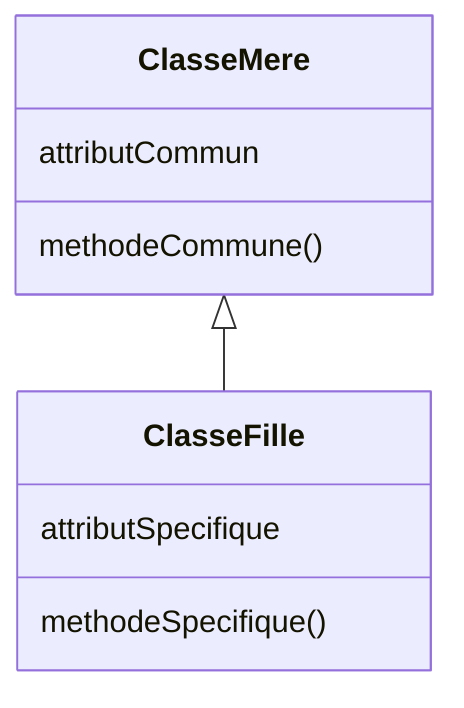
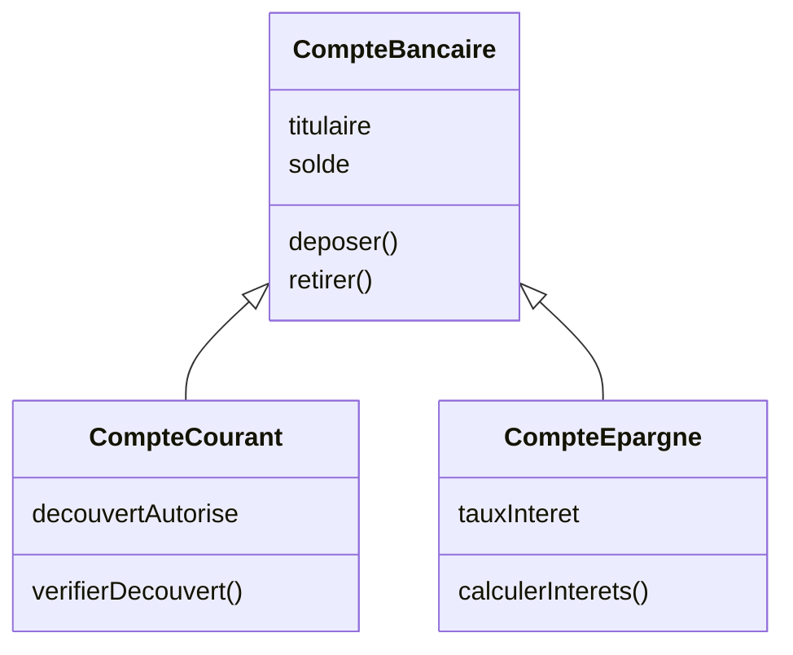
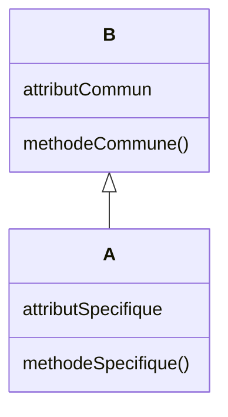
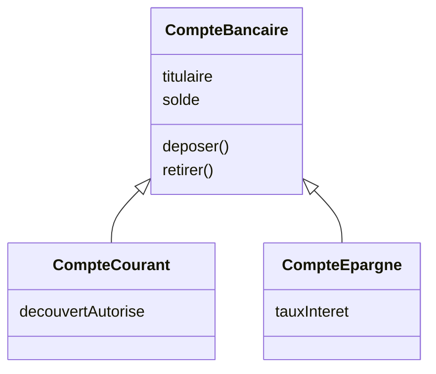
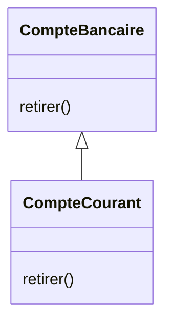

# Les concepts fondamentaux de la POO

<div class="mt-4 text-lg">
La programmation orientée objet repose sur <b>quatre concepts fondamentaux</b>.
</div>

<div class="grid grid-cols-2 gap-6 mt-8">

<div class="border border-gray-200 rounded-lg p-6 text-center">

<div class="text-3xl">🎯</div>

### Abstraction

<div class="text-sm text-gray-500">
Représenter l'essentiel d'un objet.
</div>

</div>

<div class="border border-gray-200 rounded-lg p-6 text-center">

<div class="text-3xl">🔒</div>

### Encapsulation

<div class="text-sm text-gray-500">
Contrôler l'accès à l'état d'un objet.
</div>

</div>

<div class="border border-gray-200 rounded-lg p-6 text-center">

<div class="text-3xl">🌳</div>

### Héritage

<div class="text-sm text-gray-500">
Créer des objets spécialisés.
</div>

</div>

<div class="border border-gray-200 rounded-lg p-6 text-center">

<div class="text-3xl">🔄</div>

### Polymorphisme

<div class="text-sm text-gray-500">
Adapter le comportement des objets.
</div>

</div>

</div>
---
layout: default
---

# L'abstraction

<div class="mt-3 text-lg">
L'<b>abstraction</b> consiste à identifier et regrouper les
<b>caractéristiques et comportements communs et essentiels</b>
à des entités, selon le <b>point de vue de l'observateur</b>.
</div>

<div class="grid grid-cols-3 gap-6 mt-7 text-center">

<div>

<div class="text-3xl font-bold text-gray-300">01</div>

### Observer

Considérer les entités selon les
<b>besoins du problème</b>.

<div class="text-sm text-gray-500 mt-2">
Le point de vue détermine ce qui est pertinent.
</div>

</div>

<div>

<div class="text-3xl font-bold text-gray-300">02</div>

### Identifier

Repérer les <b>caractéristiques</b> et
<b>comportements essentiels</b>.

<div class="text-sm text-gray-500 mt-2">
On ne conserve que ce qui est utile.
</div>

</div>

<div>

<div class="text-3xl font-bold text-gray-300">03</div>

### Regrouper

Réunir les éléments communs dans
un <b>même modèle</b>.

<div class="text-sm text-gray-500 mt-2">
Les entités deviennent plus simples à manipuler.
</div>

</div>

</div>

<div class="border-t border-gray-200 mt-7 pt-4 text-center font-medium">

<b>Observer</b>
<span class="text-gray-300 mx-3">→</span>
<b>Identifier l'essentiel</b>
<span class="text-gray-300 mx-3">→</span>
<b>Construire une abstraction</b>

</div>

---
layout: default
---

# Exemple : abstraire une voiture

<div class="mt-3 text-lg">
Une même entité peut être représentée différemment selon
<b>le point de vue et les besoins du système</b>.
</div>

<div class="grid grid-cols-3 gap-5 mt-6">

<div class="border border-gray-200 rounded-lg p-4 text-center">

### 🚗 Location de voitures

<b>Caractéristiques</b>

`immatriculation`  
`modèle`  
`disponible`

<div class="border-t border-gray-200 my-3"></div>

<b>Comportements</b>

`louer()` · `restituer()`

</div>

<div class="border border-gray-200 rounded-lg p-4 text-center">

### 🔧 Garage automobile

<b>Caractéristiques</b>

`kilométrage`  
`étatMoteur`  
`prochaineRévision`

<div class="border-t border-gray-200 my-3"></div>

<b>Comportements</b>

`diagnostiquer()` · `réparer()`

</div>

<div class="border border-gray-200 rounded-lg p-4 text-center">

### 🏎️ Simulation de conduite

<b>Caractéristiques</b>

`vitesse`  
`accélération`  
`direction`

<div class="border-t border-gray-200 my-3"></div>

<b>Comportements</b>

`accélérer()` · `freiner()`

</div>

</div>

---
layout: default
---

# L'encapsulation

<div class="mt-3 text-lg">
L'<b>encapsulation</b> consiste à regrouper <b>données et comportements</b>
dans une même classe et à <b>contrôler l'accès à l'état de l'objet</b>.
</div>

<div class="grid grid-cols-2 gap-10 mt-6 items-center">

<div>

### 🔒 Protéger l'état

Les données internes d'un objet ne sont pas
manipulées directement depuis l'extérieur.

<div class="mt-4">

<b>Pourquoi ?</b>

<div class="text-sm text-gray-500 mt-2">
• préserver la cohérence de l'objet<br>
• contrôler les modifications<br>
• masquer les détails d'implémentation
</div>

</div>

</div>

<div class="border-l border-gray-200 pl-10">

### 💬 Interagir par les méthodes

Les autres objets interagissent avec lui
à travers les <b>méthodes qu'il expose</b>.

<div class="mt-5 flex items-center justify-center gap-4">

<div class="border border-gray-300 rounded-lg px-4 py-3">
Objet extérieur
</div>

<div class="text-center">
<div class="text-2xl text-gray-300">→</div>
<div class="text-xs text-gray-500">méthode</div>
</div>

<div class="border-2 border-gray-300 rounded-lg px-5 py-3">
<b>Objet</b><br>
<span class="text-sm">🔒 état interne</span>
</div>

</div>

<div class="text-sm text-gray-500 mt-4 text-center">
L'appel d'une méthode peut être vu comme
l'<b>envoi d'un message</b> à l'objet.
</div>

</div>

</div>

<div class="border-t border-gray-200 mt-6 pt-4 text-center font-medium">

<b>État protégé</b>
<span class="text-gray-300 mx-3">+</span>
<b>Accès contrôlé par les méthodes</b>
<span class="text-gray-300 mx-3">=</span>
<b>Encapsulation</b>

</div>

---
layout: default
---

# Encapsulation : interface et implémentation

<div class="mt-3 text-lg">
Vu de l'extérieur, un objet est utilisé à travers son <b>interface</b> :
l'ensemble des opérations qu'il rend accessibles.
</div>

<div class="grid grid-cols-2 gap-10 mt-6 items-center">

<div>

### Ce que l'extérieur voit

<div class="border border-gray-300 rounded-lg p-5 text-center mt-3">

<div class="font-bold">Interface de l'objet</div>

<div class="border-t border-gray-200 my-3"></div>

`operation1()`  
`operation2()`  
`operation3()`

</div>

<div class="text-sm text-gray-500 text-center mt-3">
Les autres objets utilisent ces opérations
sans connaître leur fonctionnement interne.
</div>

</div>

<div class="border-l border-gray-200 pl-10">

### Ce que l'objet protège

<div class="border border-gray-300 rounded-lg p-5 text-center mt-3">

<div class="font-bold">🔒 Implémentation interne</div>

<div class="border-t border-gray-200 my-3"></div>

`données`  
`structure interne`  
`détails des méthodes`

</div>

<div class="text-sm text-gray-500 text-center mt-3">
Ces éléments peuvent évoluer sans modifier
la manière dont l'objet est utilisé.
</div>

</div>

</div>

<div class="border-t border-gray-200 mt-5 pt-4 text-center">

<b>Interface stable</b>
<span class="text-gray-300 mx-3">→</span>
<b>Implémentation modifiable</b>

<div class="mt-2 text-sm text-gray-500">
L'encapsulation rend le logiciel <b>plus sûr, plus lisible et plus facile à maintenir</b>.
</div>

</div>
---
layout: default
---

# Exemple : sans encapsulation

<div class="mt-3 text-lg">
Un compte possède un solde de <b>1 000 €</b>.
Les retraits ne doivent pas dépasser le solde disponible.
</div>

<div class="grid grid-cols-[1fr_auto_1fr] gap-8 mt-8 items-center">

<div class="text-center">

### Objet extérieur

<div class="border border-gray-300 rounded-lg p-5 mt-3">

Souhaite retirer

<div class="text-2xl font-bold mt-2">
1 500 €
</div>

</div>

</div>

<div class="text-center">

<div class="text-4xl text-gray-300">→</div>

<div class="text-sm text-gray-500 mt-2">
accès direct
</div>

</div>

<div class="text-center">

### Compte

<div class="border border-gray-300 rounded-lg p-5 mt-3">

<div class="text-sm text-gray-500">
État
</div>

`solde = 1 000 €`

<div class="border-t border-gray-200 my-3"></div>

Modification directe :

`solde ← -500 €`

</div>

</div>

</div>

<div class="border-t border-gray-200 mt-8 pt-5 text-center">

### Le problème

L'objet extérieur peut <b>modifier directement le solde</b>
et contourner les règles du compte.

<div class="mt-2 text-sm text-gray-500">
Le compte ne contrôle pas les modifications de son propre état.
</div>

</div>
---
layout: default
---

# Exemple : avec encapsulation

<div class="mt-2 text-lg">
L'état du compte est <b>protégé</b> : toute modification passe par les opérations qu'il expose.
</div>

<div class="grid grid-cols-[1fr_auto_1.5fr] gap-6 mt-5 items-center">

<div class="text-center">

### Objet extérieur

<div class="border border-gray-300 rounded-lg p-4 mt-2">

Demande un retrait :

<div class="font-bold mt-2">
`retirer(1 500 €)`
</div>

</div>

</div>

<div class="text-center">

<div class="text-4xl text-gray-300">→</div>

<div class="text-xs text-gray-500 mt-1">
appel de méthode
</div>

</div>

<div>

### Compte

<div class="border-2 border-gray-300 rounded-lg overflow-hidden mt-2 text-center">

<div class="p-3">
<div class="text-xs text-gray-400">INTERFACE</div>

`retirer(1 500 €)`
</div>

<div class="border-t border-gray-300 p-3">
<div class="text-xs text-gray-400">CONTRÔLE</div>

`1 500 € ≤ 1 000 € ?`

<b>Non → retrait refusé</b>
</div>

<div class="border-t border-gray-300 p-3">
<div class="text-xs text-gray-400">ÉTAT PROTÉGÉ</div>

🔒 `solde = 1 000 €`
</div>

</div>

</div>

</div>

---
layout: default
---

# L'héritage

<div class="mt-2 text-lg">
L'<b>héritage</b> permet de définir une nouvelle classe à partir d'une classe existante,
afin de <b>réutiliser et spécialiser</b> ce qui existe déjà.
</div>

<div class="grid grid-cols-[1.2fr_1fr] gap-8 mt-4 items-center">

<div class="flex justify-center">



</div>

<div class="border-l border-gray-200 pl-8">

<div class="mb-4">

### Classe mère

Définit les <b>caractéristiques et comportements communs</b>.

<div class="text-sm text-gray-500 mt-1">
Classe de base · Super-classe
</div>

</div>

<div class="border-t border-gray-200 pt-4">

### Classe fille

<b>Hérite</b> de la classe mère et peut ajouter ses propres éléments.

<div class="text-sm text-gray-500 mt-1">
Classe dérivée · Sous-classe
</div>

</div>

</div>

</div>

<div class="border-t border-gray-200 mt-4 pt-3 text-center font-medium">


<b>Objectif = Réutilisation + Spécialisation</b>

</div>
---
layout: default
---

# Exemple : héritage entre comptes bancaires

<div class="mt-2 text-lg">
Les différents types de comptes partagent des caractéristiques communes,
mais possèdent aussi leurs <b>propres spécificités</b>.
</div>

<div class="mt-4 flex justify-center">



</div>

<div class="grid grid-cols-3 gap-5 mt-3 text-center">

<div>
<b>CompteBancaire</b>
<div class="text-sm text-gray-500 mt-1">
Regroupe les éléments communs.
</div>
</div>

<div>
<b>CompteCourant</b>
<div class="text-sm text-gray-500 mt-1">
Hérite et ajoute la gestion du découvert.
</div>
</div>

<div>
<b>CompteEpargne</b>
<div class="text-sm text-gray-500 mt-1">
Hérite et ajoute la gestion des intérêts.
</div>
</div>

</div>

<div class="border-t border-gray-200 mt-4 pt-3 text-center font-medium">
Les classes filles <b>réutilisent</b> les éléments communs
et ajoutent leurs <b>propres spécialisations</b>.
</div>
---
layout: default
---

# Le polymorphisme

<div class="mt-3 text-lg">
Le <b>polymorphisme</b> est un concept de la POO qui vient
<b>compléter l'héritage</b>.
</div>

<div class="mt-6 flex justify-center">

<div class="border border-gray-300 rounded-lg px-10 py-5 text-center max-w-xl">

### Polymorphisme

<div class="mt-2 text-lg">
Du grec <b>poly</b> (« plusieurs »)
<span class="text-gray-300 mx-2">+</span>
<b>morphê</b> (« forme »)
</div>

<div class="mt-3 text-gray-500">
Capacité d'un élément à se présenter sous
<b>différentes formes</b>.
</div>

</div>

</div>

<div class="grid grid-cols-2 gap-8 mt-6 text-center">

<div>

<div class="text-3xl font-bold text-gray-300">01</div>

### Polymorphisme des objets

Un objet peut être considéré
<b>sous différentes formes</b>.

</div>

<div class="border-l border-gray-200">

<div class="text-3xl font-bold text-gray-300">02</div>

### Polymorphisme des méthodes

Une même méthode peut prendre
<b>différentes formes</b>.

</div>

</div>

<div class="border-t border-gray-200 mt-6 pt-4 text-center font-medium">


</div>

---
layout: default
---

# Polymorphisme des objets

<div class="mt-2 text-lg">
Le polymorphisme des objets exploite la <b>relation d'héritage</b>
pour offrir plus de flexibilité dans leur manipulation.
</div>

<div class="grid grid-cols-[1fr_1.2fr] gap-8 mt-5 items-center">

<div class="flex justify-center">



</div>


<div class="border-l border-gray-200 pl-8">

### La règle

Si la classe <b>A hérite de B</b>, alors :

<div class="mt-5 text-center text-xl">

<b>un objet de A</b>

<div class="text-3xl text-gray-300 my-2">↓</div>

peut aussi être considéré comme

<div class="text-3xl text-gray-300 my-2">↓</div>

<b>un objet de B</b>

</div>

</div>

</div>

---
layout: default
---

# Exemple : polymorphisme des objets

<div class="mt-2 text-lg">
Un <b>CompteCourant</b> et un <b>CompteEpargne</b> sont aussi des
<b>CompteBancaire</b>.
</div>

<div class="grid grid-cols-[1.2fr_1fr] gap-8 mt-4 items-center">

<div class="flex justify-center">



</div>

<div class="border-l border-gray-200 pl-8">

### Plusieurs formes

Un objet :

<b>CompteCourant</b>

peut être considéré comme un :

<b>CompteBancaire</b>

<div class="border-t border-gray-200 my-4"></div>

Un objet :

<b>CompteEpargne</b>

peut également être considéré comme un :

<b>CompteBancaire</b>

</div>

</div>

<div class="border-t border-gray-200 mt-4 pt-3 text-center font-medium">

<b>CompteCourant</b>
<span class="text-gray-300 mx-2">•</span>
<b>CompteEpargne</b>
<span class="text-gray-300 mx-3">→</span>
peuvent tous deux être manipulés comme des
<b>CompteBancaire</b>.

</div>

---
layout: default
---

# Polymorphisme de méthodes

<div class="mt-2 text-lg">
Le <b>polymorphisme de méthodes</b> permet à une même opération
de prendre <b>plusieurs formes</b>.
</div>

<div class="grid grid-cols-2 gap-8 mt-5">

<div>

### 01 : Surcharge

Dans une <b>même classe</b>, plusieurs méthodes peuvent avoir
le <b>même nom</b> mais des <b>signatures différentes</b>.

```java
deposer(double montant)

deposer(double montant,
        String description)
```

<div class="text-sm text-gray-500 text-center mt-3">
Même opération <code>deposer</code>,
mais avec des paramètres différents.
</div>

</div>

<div class="border-l border-gray-200 pl-8">

### 02 : Redéfinition

Dans une <b>hiérarchie de classes</b>, une classe fille peut
redéfinir une méthode héritée.

<div class="mt-3 flex justify-center">



</div>

<div class="text-sm text-gray-500 text-center">
Même méthode <code>retirer()</code>,
mais <b>comportement spécialisé</b>.
</div>

</div>

</div>

<div class="border-t border-gray-200 mt-4 pt-3 text-center font-medium">

<b>Surcharge</b> : paramètres différents
<span class="text-gray-300 mx-4">•</span>
<b>Redéfinition</b> : comportement différent

</div>
---
layout: default
---

# Exemple : surcharge de méthodes

<div class="mt-2 text-lg">
Une classe peut proposer <b>plusieurs versions d'une même méthode</b>
avec des signatures différentes.
</div>

<div class="grid grid-cols-2 gap-10 mt-5">

<div>

### Méthodes disponibles

```java
void deposer(double montant) {
    // dépôt simple
}

void deposer(
    double montant,
    String description
) {
    // dépôt avec description
}
```

<div class="mt-3 text-sm text-gray-500">
Même nom : <code>deposer</code><br>
Signatures différentes.
</div>

</div>

<div class="border-l border-gray-200 pl-10">

### Quelle méthode sera appelée ?

```java
compte.deposer(500);
```

<div v-click class="mt-3">

<div class="text-center text-2xl text-gray-300">↓</div>

```java
deposer(double montant)
```

</div>

<div v-click class="border-t border-gray-200 mt-4 pt-4">

```java
compte.deposer(500, "Salaire");
```

</div>

<div v-click class="mt-3">

<div class="text-center text-2xl text-gray-300">↓</div>

```java
deposer(double montant, String description)
```

</div>

</div>

</div>

<div v-click class="border-t border-gray-200 mt-4 pt-3 text-center font-medium">

Le compilateur choisit la méthode selon
<b>le nombre et le type des arguments</b>.

</div>

---
layout: default
---

# Conclusion

<div class="mt-4 text-lg">
La <b>programmation orientée objet</b> permet de mieux organiser un programme
afin de faciliter sa <b>conception, son évolution, sa maintenance et sa réutilisation</b>.
</div>

<div class="grid grid-cols-4 gap-5 mt-8 text-center">

<div class="border border-gray-200 rounded-lg p-4">
<div class="text-2xl">🎯</div>

### Abstraction

</div>

<div class="border border-gray-200 rounded-lg p-4">
<div class="text-2xl">🔒</div>

### Encapsulation

</div>

<div class="border border-gray-200 rounded-lg p-4">
<div class="text-2xl">🌳</div>

### Héritage

</div>

<div class="border border-gray-200 rounded-lg p-4">
<div class="text-2xl">🔄</div>

### Polymorphisme

</div>

</div>

<div class="border-t border-gray-200 mt-8 pt-5 text-center">

Ces quatre concepts constituent les
<b>principes fondamentaux de la programmation orientée objet</b>.

<div v-click class="mt-4 text-lg font-medium">
Ils seront étudiés et mis en pratique
<b>plus en détail dans les prochains cours</b>.
</div>

</div>