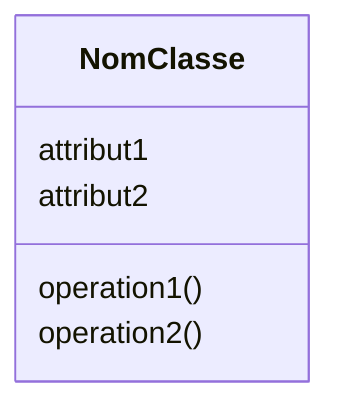
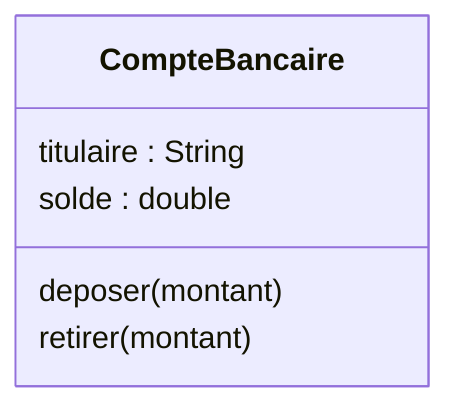

# Qu'est-ce qu'un objet ?

Un <b>objet</b> représente une entité identifiable du problème que l'on souhaite modéliser.

01

### Identité

Permet de distinguer un objet des autres.

Compte d'Alice ≠ Compte de Bob

02

### État

Ensemble des données qui décrivent l'objet.

`titulaire = "Alice"`  
`solde = 1000`

03

### Comportements

Actions que l'objet peut réaliser.

`deposer()`  
`retirer()`

### Un objet : Identité + État + Comportements

---
layout: default
---

# Exemples d'objets

### 🏦 compteAlice

<b>Identité :</b>  
`compteAlice`

<b>État :</b>  
`solde = 1000`  
`titulaire = "Alice"`

<b>Comportements :</b>  
`deposer()` · `retirer()`

### 🏦 compteAlice

<b>Identité :</b>  
`compteBob`

<b>État :</b>  
`solde = 500`  
`titulaire = "Bob"`

<b>Comportements :</b>  
`deposer()` · `retirer()`

### 🚗 voiturePaul

<b>Identité :</b>  
`voiturePaul`

<b>État :</b>  
`vitesse = 50`  
`carburant = 70%`

<b>Comportements :</b>  
`accelerer()` · `freiner()`

`compteAlice` et `compteBob` ont un <b>état différent</b>,
mais partagent les mêmes <b>attributs</b> et <b>comportements</b>.

Ils peuvent donc être décrits par un <b>même modèle : la classe</b>.

---
layout: default
---

# Qu'est-ce qu'une classe ?

Une <b>classe</b> est un modèle qui décrit les caractéristiques
communes à un ensemble d'objets.

### Attributs

Décrivent les <b>données</b>  
qui constituent l'état d'un objet (son état) .

### Opérations

Décrivent les <b>comportements</b>  
que les objets peuvent réaliser.

### Classe : modèle commun pour créer des objets

---
layout: default
---

# Exemple : une classe, plusieurs objets

Une même <b>classe</b> peut être instanciée plusieurs fois.
Chaque objet possède alors son <b>propre état</b>.

↓ &nbsp;&nbsp;&nbsp; instanciation &nbsp;&nbsp;&nbsp; ↓

### compteAlice

Instance de <b>CompteBancaire</b>

`titulaire = "Alice"`  
`solde = 1500`

### compteBob

Instance de <b>CompteBancaire</b>

`titulaire = "Bob"`  
`solde = 800`

### compteCharlie

Instance de <b>CompteBancaire</b>

`titulaire = "Charlie"`  
`solde = 2300`

<b>1 classe</b>
→
<b>3 instances</b>
→
même structure, <b>états différents</b>

