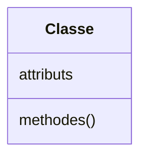
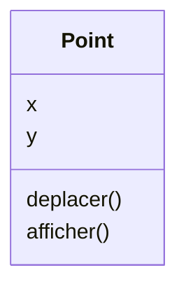
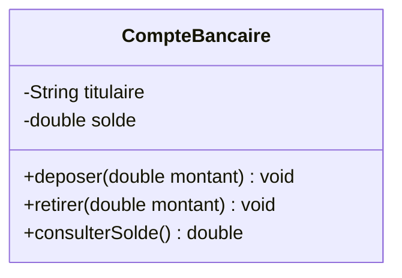

# La notion de classe

<div class="mt-3 text-lg">

Une <strong>classe</strong> décrit les caractéristiques communes d'un ensemble d'objets.

Elle définit deux éléments :

</div>

<div class="flex justify-center mt-5">



</div>

<div class="grid grid-cols-2 gap-8 mt-4">

<div class="text-center">

<div class="font-medium text-lg">
Attributs
</div>

<div class="text-sm text-gray-500 mt-2">
Décrivent la structure de l'état des objets de la classe.
</div>

</div>

<div class="border-l border-gray-200 pl-8 text-center">

<div class="font-medium text-lg">
Méthodes
</div>

<div class="text-sm text-gray-500 mt-2">
Décrivent les comportements disponibles pour ces objets.
</div>

</div>

</div>

<div  class="border-t border-gray-200 mt-4 pt-3 text-center font-medium">

Une classe constitue un <strong>modèle</strong> : elle décrit la structure et les comportements communs à ses instances.

</div>
---
layout: default
---

# Exemple : Point

<div class="mt-3 text-lg">

Pour représenter des points dans un plan, nous retenons les éléments utiles à notre programme.

</div>
<div class="flex justify-center mt-5">


</div>
<div class="grid grid-cols-2 gap-8 mt-4">

<div class="text-center">

<div class="font-medium">
Attributs
</div>

<div class="mt-3">
<code>x</code> · <code>y</code>
</div>

<div class="text-sm text-gray-500 mt-2">
Décrivent la position.
</div>

</div>

<div class="border-l border-gray-200 pl-8 text-center">

<div class="font-medium">
Méthodes
</div>

<div class="mt-3">
<code>deplacer()</code> · <code>afficher()</code>
</div>

<div class="text-sm text-gray-500 mt-2">
Décrivent les opérations utiles.
</div>

</div>

</div>

---
layout: default
---

# Les attributs

<div class="mt-3 text-lg">

Les <strong>attributs</strong>, aussi appelés <strong>champs</strong>, décrivent les informations prévues par une classe.

</div>

<div class="flex justify-center mt-6">

<div class="border border-gray-200 rounded-lg px-12 py-5 text-center">

<div class="text-lg font-medium">
Point
</div>

<div class="border-t border-gray-200 mt-3 pt-3">

<div>
<code>x</code>
<span class="text-gray-300 mx-4">•</span>
<code>y</code>
</div>

<div class="text-sm text-gray-500 mt-3">
coordonnées du point
</div>

</div>

</div>

</div>

<div  class="mt-5 text-center text-gray-500">
La classe définit <strong>quelles informations</strong> seront représentées.
</div>

<div  class="border-t border-gray-200 mt-5 pt-4 text-center font-medium">
Les valeurs particulières de ces attributs appartiendront aux objets créés plus tard.
</div>

---
layout: default
---

# Les méthodes

<div class="mt-3 text-lg">

Les <strong>méthodes</strong> décrivent les opérations associées à une classe.

</div>

<div class="flex justify-center mt-6">

<div class="border border-gray-200 rounded-lg px-12 py-5 text-center">

<div class="text-lg font-medium">
Point
</div>

<div class="border-t border-gray-200 mt-3 pt-3">

<div>
<code>deplacer()</code>
</div>

<div class="mt-2">
<code>afficher()</code>
</div>

</div>

</div>

</div>

<div  class="mt-5 text-center text-gray-500">
Une méthode peut notamment consulter ou modifier les informations décrites par les attributs.
</div>

<div  class="border-t border-gray-200 mt-5 pt-4 text-center font-medium">
Attributs et méthodes sont regroupés parce qu'ils participent à la description d'une même entité.
</div>

---
layout: default
---

# Une classe en Java

<div class="mt-3 text-lg">

En Java, une classe est déclarée avec le mot-clé <code>class</code>.

</div>

```java
class Point {

}
```

<div class="grid grid-cols-2 gap-8 mt-5">

<div class="border border-gray-200 rounded-lg p-4 text-center">

<div class="text-lg font-medium">
<code>class</code>
</div>

<div class="text-sm text-gray-500 mt-2">
Déclare une classe.
</div>

</div>

<div class="border border-gray-200 rounded-lg p-4 text-center">

<div class="text-lg font-medium">
<code>Point</code>
</div>

<div class="text-sm text-gray-500 mt-2">
Nom de la classe.
</div>

</div>

</div>

<div class="border-t border-gray-200 mt-5 pt-4 text-center font-medium">
Le contenu de la classe est placé entre les accolades.
</div>

---
layout: default
---

# Les attributs en Java

<div class="mt-3 text-lg">

Traduisons maintenant les informations de notre modèle.

</div>

```java
class Point {

    private int x;
    private int y;

}
```

<div class="text-center mt-4">

<code>private</code> signifie que l'attribut est <strong>accessible uniquement depuis la classe <code>Point</code></strong>.

</div>

<div class="grid grid-cols-2 gap-8 mt-5 text-center">

<div class="border border-gray-200 rounded-lg p-4">

<div class="font-medium">
<code>x</code>
</div>

<div class="text-sm text-gray-500 mt-2">
abscisse entière
</div>

</div>

<div class="border border-gray-200 rounded-lg p-4">

<div class="font-medium">
<code>y</code>
</div>

<div class="text-sm text-gray-500 mt-2">
ordonnée entière
</div>

</div>

</div>

<div class="border-t border-gray-200 mt-5 pt-4 text-center font-medium">

<code>x</code> et <code>y</code> sont des <strong>attributs privés</strong> de la classe <code>Point</code>.

</div>

---
layout: default
---

# Les méthodes en Java

<div class="mt-3 text-lg">

Traduisons maintenant une opération définie par notre modèle.

</div>

```java
class Point {

    private int x;
    private int y;

    public void deplacer(int dx, int dy) {
        x = x + dx;
        y = y + dy;
    }

}
```

<div class="mt-4 text-center">

<code>public</code> signifie que la méthode est <strong>accessible depuis l'extérieur de la classe <code>Point</code></strong>.

</div>

<div class="mt-3 text-center">

La méthode <code>deplacer()</code> décrit comment modifier les coordonnées.

</div>

<div class="border-t border-gray-200 mt-5 pt-4 text-center font-medium">

Une méthode peut agir sur les attributs définis dans la même classe.

</div>

---
layout: default
---

# Structure d'une méthode

```java
public void deplacer(int dx, int dy) {
    x = x + dx;
    y = y + dy;
}
```

<div class="grid grid-cols-3 gap-4 mt-5 text-center">

<div class="border border-gray-200 rounded-lg p-4">

<div class="font-medium">
<code>public</code>
</div>

<div class="text-sm text-gray-500 mt-2">
Mode d'accès
</div>

</div>

<div class="border border-gray-200 rounded-lg p-4">

<div class="font-medium">
<code>void</code>
</div>

<div class="text-sm text-gray-500 mt-2">
Type de retour
</div>

</div>

<div class="border border-gray-200 rounded-lg p-4">

<div class="font-medium">
<code>deplacer</code>
</div>

<div class="text-sm text-gray-500 mt-2">
Nom
</div>

</div>

</div>

<div class="border border-gray-200 rounded-lg p-4 mt-4 text-center">

<div class="font-medium">
<code>int dx, int dy</code>
</div>

<div class="text-sm text-gray-500 mt-2">
Paramètres nécessaires à l'opération
</div>

</div>

---
layout: default
---

# La classe Point

```java
class Point {

    private int x;
    private int y;

    public void initialiser(int abscisse, int ordonnee) {
        x = abscisse;
        y = ordonnee;
    }

    public void deplacer(int dx, int dy) {
        x = x + dx;
        y = y + dy;
    }

    public void afficher() {
        System.out.println("(" + x + ", " + y + ")");
    }
}
```

<div class="grid grid-cols-2 gap-8 mt-4 text-center">

<div>
<div class="font-medium">Attributs</div>
<div class="text-gray-500 mt-2">
<code>x</code> · <code>y</code>
</div>
</div>

<div class="border-l border-gray-200 pl-8">
<div class="font-medium">Méthodes</div>
<div class="text-gray-500 mt-2">
<code>initialiser()</code> · <code>deplacer()</code> · <code>afficher()</code>
</div>
</div>

</div>

---
layout: default
---

# Les modificateurs d'accès

<div class="mt-3 text-lg">

En Java, les <strong>modificateurs d'accès</strong> indiquent depuis où un attribut ou une méthode peut être utilisé.

</div>

<div class="grid grid-cols-2 gap-8 mt-8">

<div class="border border-gray-200 rounded-lg p-5 text-center">

<div class="text-xl font-medium">
🔒 <code>private</code>
</div>

<div class="mt-4">

Accessible uniquement <strong>à l'intérieur de la classe</strong>.

</div>

<div class="mt-4 text-gray-500">

Permet de cacher un élément aux autres classes.

</div>

</div>

<div class="border border-gray-200 rounded-lg p-5 text-center">

<div class="text-xl font-medium">
🌐 <code>public</code>
</div>

<div class="mt-4">

Accessible <strong>depuis n'importe quelle autre classe</strong>.

</div>

<div class="mt-4 text-gray-500">

Permet de rendre un élément accessible aux autres classes.

</div>

</div>

</div>

<div class="mt-7 text-center">

```java
private int x;
public void deplacer(int dx, int dy) { ... }
```

</div>

<div class="mt-5 px-5 py-3 bg-gray-50 rounded-lg text-center">

<strong>Remarque :</strong> les modificateurs d'accès
<code>private</code> et <code>public</code> peuvent être utilisés
<strong>aussi bien pour les attributs que pour les méthodes</strong>.

</div>

<div class="border-t border-gray-200 mt-5 pt-4 text-center font-medium">

Les modificateurs d'accès permettent de contrôler qui peut accéder aux éléments d'une classe.

</div>
---
layout: default
---

# L'encapsulation

<div class="mt-3 text-lg">

Les modificateurs d'accès permettent de mettre en œuvre un principe important de la programmation orientée objet : <strong>l'encapsulation</strong>.

</div>

<div class="grid grid-cols-2 gap-8 mt-8">

<div class="border border-gray-200 rounded-lg p-5 text-center">

<div class="text-xl font-medium">
🔒 Cacher les données
</div>

<div class="mt-4">

Les attributs sont généralement déclarés <code>private</code>.

</div>

<div class="mt-4 text-gray-500">

On évite ainsi qu'ils soient modifiés directement depuis l'extérieur de la classe.

</div>

</div>

<div class="border border-gray-200 rounded-lg p-5 text-center">

<div class="text-xl font-medium">
🚪 Contrôler l'accès
</div>

<div class="mt-4">

Des méthodes <code>public</code> permettent d'interagir avec l'objet.

</div>

<div class="mt-4 text-gray-500">

La classe contrôle ainsi la manière dont ses données sont utilisées ou modifiées.

</div>

</div>

</div>

<div class="mt-7 text-center text-lg">

<strong>L'encapsulation</strong> consiste à <strong>cacher l'état interne</strong> d'un objet
et à <strong>contrôler l'accès</strong> à cet état.

</div>

<div class="border-t border-gray-200 mt-6 pt-4 text-center font-medium">

💡 L'objet ne laisse pas les autres classes manipuler librement ses données internes.

</div>
---
layout: default
---

# Exercice : CompteBancaire

<div class="mt-3 text-lg">

Nous souhaitons maintenant modéliser un compte bancaire.

Un compte doit permettre de représenter :

</div>

<div class="border border-gray-200 rounded-lg p-5 mt-4">

<div>
• le nom du <strong>titulaire</strong>
</div>

<div class="mt-2">
• le <strong>solde</strong>
</div>

<div class="mt-2">
• le dépôt et le retrait d'un montant
</div>

<div class="mt-2">
• la consultation du solde
</div>

</div>

<div class="grid grid-cols-2 gap-8 mt-5 text-center">

<div>
<div class="font-medium">Quels attributs ?</div>
<div class="text-sm text-gray-500 mt-2">
Nom et type
</div>
</div>

<div class="border-l border-gray-200 pl-8">
<div class="font-medium">Quelles méthodes ?</div>
<div class="text-sm text-gray-500 mt-2">
Nom, paramètres et type de retour
</div>
</div>

</div>

<div  class="border-t border-gray-200 mt-5 pt-4 text-center font-medium">
Commencez par construire le modèle avant d'écrire le code Java.
</div>

---
layout: default
---

# CompteBancaire
<div class="flex justify-center mt-5">


</div>
<div class="grid grid-cols-2 gap-8 mt-4 text-center">

<div>

<div class="font-medium">
Attributs
</div>

<div class="mt-2">
<code>titulaire</code>
</div>

<div>
<code>solde</code>
</div>

</div>

<div class="border-l border-gray-200 pl-8">

<div class="font-medium">
Méthodes
</div>

<div class="mt-2">
<code>deposer()</code>
</div>

<div>
<code>retirer()</code>
</div>

<div>
<code>consulterSolde()</code>
</div>

</div>

</div>

<div  class="border-t border-gray-200 mt-5 pt-4 text-center font-medium">
Le domaine change, mais le raisonnement reste le même.
</div>

