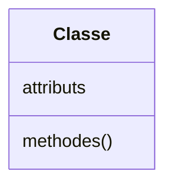
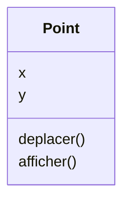
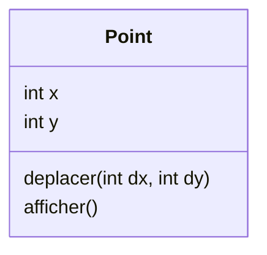
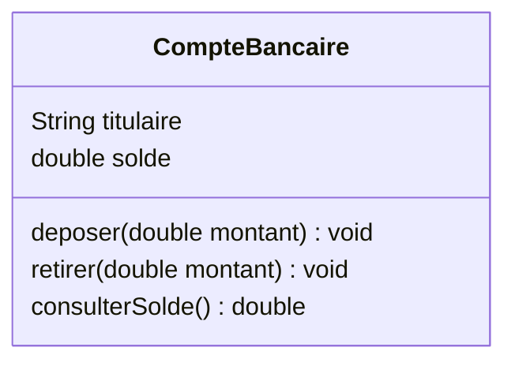

# La notion de classe

<div class="mt-3 text-lg">

Une <strong>classe</strong> décrit les caractéristiques communes d'un ensemble d'objets.

Elle définit principalement deux éléments :

</div>

<div class="flex justify-center mt-5">



</div>

<div class="grid grid-cols-2 gap-8 mt-4">

<div class="text-center">

<div class="font-medium text-lg">
Attributs
</div>

<div class="text-sm text-gray-500 mt-2">
Décrivent les informations qui caractérisent les objets.
</div>

</div>

<div class="border-l border-gray-200 pl-8 text-center">

<div class="font-medium text-lg">
Méthodes
</div>

<div class="text-sm text-gray-500 mt-2">
Décrivent les opérations que les objets pourront réaliser.
</div>

</div>

</div>

<div class="border-t border-gray-200 mt-4 pt-3 text-center font-medium">

Une classe constitue un <strong>modèle</strong> à partir duquel des objets pourront être créés.

</div>

---
layout: default
---

# Exemple : Point

<div class="mt-3 text-lg">

Pour représenter des points dans un plan, nous retenons les informations et les opérations utiles à notre programme.

</div>

<div class="flex justify-center mt-5">



</div>

<div class="grid grid-cols-2 gap-8 mt-4">

<div class="text-center">

<div class="font-medium">
Attributs
</div>

<div class="mt-3">
<code>x</code> · <code>y</code>
</div>

<div class="text-sm text-gray-500 mt-2">
Décrivent la position d'un point.
</div>

</div>

<div class="border-l border-gray-200 pl-8 text-center">

<div class="font-medium">
Méthodes
</div>

<div class="mt-3">
<code>deplacer()</code> · <code>afficher()</code>
</div>

<div class="text-sm text-gray-500 mt-2">
Décrivent les opérations disponibles.
</div>

</div>

</div>

<div class="border-t border-gray-200 mt-5 pt-4 text-center font-medium">

La classe <code>Point</code> décrit ce que les différents points auront en commun.

</div>

---
layout: default
---

# Les attributs

<div class="mt-3 text-lg">

Les <strong>attributs</strong>, aussi appelés <strong>champs</strong>, représentent les informations décrites par une classe.

</div>

<div class="flex justify-center mt-6">

<div class="border border-gray-200 rounded-lg px-12 py-5 text-center">

<div class="text-lg font-medium">
Point
</div>

<div class="border-t border-gray-200 mt-3 pt-3">

<div>
<code>x</code>
<span class="text-gray-300 mx-4">•</span>
<code>y</code>
</div>

<div class="text-sm text-gray-500 mt-3">
coordonnées du point
</div>

</div>

</div>

</div>

<div class="mt-5 text-center text-gray-500">

La classe indique <strong>quelles informations</strong> seront présentes dans ses objets.

</div>

<div class="border-t border-gray-200 mt-5 pt-4 text-center font-medium">

Chaque objet créé à partir de cette classe possédera ses propres valeurs pour ces attributs.

</div>

---
layout: default
---

# Les méthodes

<div class="mt-3 text-lg">

Les <strong>méthodes</strong> représentent les opérations définies dans une classe.

</div>

<div class="flex justify-center mt-6">

<div class="border border-gray-200 rounded-lg px-12 py-5 text-center">

<div class="text-lg font-medium">
Point
</div>

<div class="border-t border-gray-200 mt-3 pt-3">

<div>
<code>deplacer()</code>
</div>

<div class="mt-2">
<code>afficher()</code>
</div>

</div>

</div>

</div>

<div class="mt-5 text-center text-gray-500">

Une méthode peut consulter ou modifier les informations représentées par les attributs.

</div>

<div class="border-t border-gray-200 mt-5 pt-4 text-center font-medium">

Attributs et méthodes sont regroupés dans une même classe car ils décrivent une même entité.

</div>

---
layout: default
---

# Une classe en Java

<div class="mt-3 text-lg">

En Java, une classe est déclarée avec le mot-clé <code>class</code>.

</div>

```java
class Point {

}
```

<div class="grid grid-cols-2 gap-8 mt-5">

<div class="border border-gray-200 rounded-lg p-4 text-center">

<div class="text-lg font-medium">
<code>class</code>
</div>

<div class="text-sm text-gray-500 mt-2">
Indique que nous déclarons une classe.
</div>

</div>

<div class="border border-gray-200 rounded-lg p-4 text-center">

<div class="text-lg font-medium">
<code>Point</code>
</div>

<div class="text-sm text-gray-500 mt-2">
Nom donné à la classe.
</div>

</div>

</div>

<div class="border-t border-gray-200 mt-5 pt-4 text-center font-medium">

Le contenu de la classe est placé entre les accolades <code>{ }</code>.

</div>

---
layout: default
---

# Déclarer des attributs

<div class="mt-3 text-lg">

Ajoutons maintenant les informations prévues par notre modèle.

</div>

```java
class Point {

    int x;
    int y;

}
```

<div class="grid grid-cols-2 gap-8 mt-5 text-center">

<div class="border border-gray-200 rounded-lg p-4">

<div class="font-medium">
<code>int x;</code>
</div>

<div class="text-sm text-gray-500 mt-2">
Attribut représentant l'abscisse.
</div>

</div>

<div class="border border-gray-200 rounded-lg p-4">

<div class="font-medium">
<code>int y;</code>
</div>

<div class="text-sm text-gray-500 mt-2">
Attribut représentant l'ordonnée.
</div>

</div>

</div>

<div class="border-t border-gray-200 mt-5 pt-4 text-center font-medium">

Un attribut est déclaré avec un <strong>type</strong> et un <strong>nom</strong>.

</div>

---
layout: default
---

# Structure d'un attribut

<div class="mt-3 text-lg">

Observons la déclaration suivante :

</div>

<div class="flex justify-center mt-6">

<div class="border border-gray-200 rounded-lg px-12 py-5 text-center text-xl">

<code>int x;</code>

</div>

</div>

<div class="grid grid-cols-2 gap-8 mt-7 text-center">

<div class="border border-gray-200 rounded-lg p-4">

<div class="font-medium">
<code>int</code>
</div>

<div class="text-sm text-gray-500 mt-2">
Type de l'information.
</div>

</div>

<div class="border border-gray-200 rounded-lg p-4">

<div class="font-medium">
<code>x</code>
</div>

<div class="text-sm text-gray-500 mt-2">
Nom de l'attribut.
</div>

</div>

</div>

<div class="border-t border-gray-200 mt-6 pt-4 text-center font-medium">

Le type indique quelles valeurs pourront être représentées par l'attribut.

</div>

---
layout: default
---

# Déclarer une méthode

<div class="mt-3 text-lg">

Ajoutons maintenant une opération permettant de déplacer un point.

</div>

```java
class Point {

    int x;
    int y;

    void deplacer(int dx, int dy) {
        x = x + dx;
        y = y + dy;
    }

}
```

<div class="mt-5 text-center text-gray-500">

La méthode <code>deplacer()</code> modifie les coordonnées du point.

</div>

<div class="border-t border-gray-200 mt-5 pt-4 text-center font-medium">

Une méthode regroupe les instructions nécessaires pour réaliser une opération.

</div>

---
layout: default
---

# Structure d'une méthode

```java
void deplacer(int dx, int dy) {
    x = x + dx;
    y = y + dy;
}
```

<div class="grid grid-cols-3 gap-4 mt-6 text-center">

<div class="border border-gray-200 rounded-lg p-4">

<div class="font-medium">
<code>void</code>
</div>

<div class="text-sm text-gray-500 mt-2">
Type de retour
</div>

</div>

<div class="border border-gray-200 rounded-lg p-4">

<div class="font-medium">
<code>deplacer</code>
</div>

<div class="text-sm text-gray-500 mt-2">
Nom de la méthode
</div>

</div>

<div class="border border-gray-200 rounded-lg p-4">

<div class="font-medium">
<code>int dx, int dy</code>
</div>

<div class="text-sm text-gray-500 mt-2">
Paramètres
</div>

</div>

</div>

<div class="border-t border-gray-200 mt-6 pt-4 text-center font-medium">

Les paramètres représentent les informations nécessaires à l'exécution de la méthode.

</div>

---
layout: default
---

# Une méthode qui retourne une valeur

<div class="mt-3 text-lg">

Une méthode peut également produire une valeur.

</div>

```java
class Point {

    int x;
    int y;

    int obtenirX() {
        return x;
    }

}
```

<div class="grid grid-cols-2 gap-8 mt-6 text-center">

<div class="border border-gray-200 rounded-lg p-4">

<div class="font-medium">
<code>int</code>
</div>

<div class="text-sm text-gray-500 mt-2">
Type de la valeur retournée.
</div>

</div>

<div class="border border-gray-200 rounded-lg p-4">

<div class="font-medium">
<code>return x;</code>
</div>

<div class="text-sm text-gray-500 mt-2">
Renvoie la valeur de <code>x</code>.
</div>

</div>

</div>

<div class="border-t border-gray-200 mt-6 pt-4 text-center font-medium">

<code>void</code> est utilisé lorsqu'une méthode ne retourne aucune valeur.

</div>

---
layout: default
---

# La classe Point

```java
class Point {

    int x;
    int y;

    void initialiser(int abscisse, int ordonnee) {
        x = abscisse;
        y = ordonnee;
    }

    void deplacer(int dx, int dy) {
        x = x + dx;
        y = y + dy;
    }

    void afficher() {
        System.out.println("(" + x + ", " + y + ")");
    }
}
```

<div class="grid grid-cols-2 gap-8 mt-4 text-center">

<div>

<div class="font-medium">
Attributs
</div>

<div class="text-gray-500 mt-2">
<code>x</code> · <code>y</code>
</div>

</div>

<div class="border-l border-gray-200 pl-8">

<div class="font-medium">
Méthodes
</div>

<div class="text-gray-500 mt-2">
<code>initialiser()</code> · <code>deplacer()</code> · <code>afficher()</code>
</div>

</div>

</div>

<div class="border-t border-gray-200 mt-5 pt-4 text-center font-medium">

Une classe regroupe les <strong>données</strong> et les <strong>opérations</strong> qui décrivent une même entité.

</div>

---
layout: default
---

# Du modèle au code Java

<div class="grid grid-cols-2 gap-8 mt-6">

<div>

<div class="text-center font-medium mb-4">
Le modèle
</div>



</div>

<div class="border-l border-gray-200 pl-8">

<div class="text-center font-medium mb-4">
Le code Java
</div>

```java
class Point {

    int x;
    int y;

    void deplacer(int dx, int dy) {
        x = x + dx;
        y = y + dy;
    }

    void afficher() {
        System.out.println(
            "(" + x + ", " + y + ")"
        );
    }
}
```

</div>

</div>

<div class="border-t border-gray-200 mt-5 pt-4 text-center font-medium">

Le diagramme décrit la classe ; le code Java permet de l'implémenter.

</div>

---
layout: default
---

# Exercice : CompteBancaire

<div class="mt-3 text-lg">

Nous souhaitons maintenant modéliser un compte bancaire.

Un compte doit permettre de représenter :

</div>

<div class="border border-gray-200 rounded-lg p-5 mt-4">

<div>
• le nom du <strong>titulaire</strong>
</div>

<div class="mt-2">
• le <strong>solde</strong>
</div>

<div class="mt-2">
• le dépôt d'un montant
</div>

<div class="mt-2">
• le retrait d'un montant
</div>

<div class="mt-2">
• la consultation du solde
</div>

</div>

<div class="grid grid-cols-2 gap-8 mt-5 text-center">

<div>

<div class="font-medium">
Quels attributs ?
</div>

<div class="text-sm text-gray-500 mt-2">
Nom et type
</div>

</div>

<div class="border-l border-gray-200 pl-8">

<div class="font-medium">
Quelles méthodes ?
</div>

<div class="text-sm text-gray-500 mt-2">
Nom, paramètres et type de retour
</div>

</div>

</div>

<div class="border-t border-gray-200 mt-5 pt-4 text-center font-medium">

Commencez par identifier les informations et les opérations avant d'écrire le code Java.

</div>

---
layout: default
---

# CompteBancaire

<div class="flex justify-center mt-5">



</div>

<div class="grid grid-cols-2 gap-8 mt-4 text-center">

<div>

<div class="font-medium">
Attributs
</div>

<div class="mt-2">
<code>titulaire</code>
</div>

<div>
<code>solde</code>
</div>

</div>

<div class="border-l border-gray-200 pl-8">

<div class="font-medium">
Méthodes
</div>

<div class="mt-2">
<code>deposer()</code>
</div>

<div>
<code>retirer()</code>
</div>

<div>
<code>consulterSolde()</code>
</div>

</div>

</div>

<div class="border-t border-gray-200 mt-5 pt-4 text-center font-medium">

Le domaine change, mais la démarche reste la même : identifier les <strong>attributs</strong> et les <strong>méthodes</strong>.

</div>

---
layout: default
---

# CompteBancaire en Java

```java
class CompteBancaire {

    String titulaire;
    double solde;

    void deposer(double montant) {
        solde = solde + montant;
    }

    void retirer(double montant) {
        solde = solde - montant;
    }

    double consulterSolde() {
        return solde;
    }
}
```

<div class="border-t border-gray-200 mt-5 pt-4 text-center font-medium">

Une classe Java traduit notre modèle en regroupant ses attributs et ses méthodes.

</div>

---
layout: default
---

# À retenir

<div class="grid grid-cols-3 gap-5 mt-7 text-center">

<div class="border border-gray-200 rounded-lg p-5">

<div class="text-2xl">
📦
</div>

<div class="font-medium mt-3">
Classe
</div>

<div class="text-sm text-gray-500 mt-2">

Décrit un modèle commun.

</div>

</div>

<div class="border border-gray-200 rounded-lg p-5">

<div class="text-2xl">
🧩
</div>

<div class="font-medium mt-3">
Attributs
</div>

<div class="text-sm text-gray-500 mt-2">

Décrivent les informations.

</div>

</div>

<div class="border border-gray-200 rounded-lg p-5">

<div class="text-2xl">
⚙️
</div>

<div class="font-medium mt-3">
Méthodes
</div>

<div class="text-sm text-gray-500 mt-2">

Décrivent les opérations.

</div>

</div>

</div>

<div class="border-t border-gray-200 mt-7 pt-4 text-center text-lg font-medium">

Une classe décrit la <strong>structure</strong> et les <strong>comportements</strong> communs aux objets qui seront créés à partir d'elle.

</div>