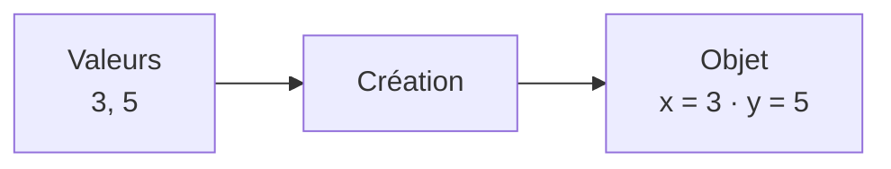
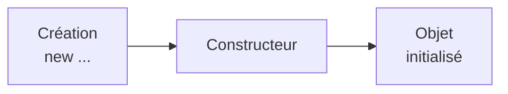
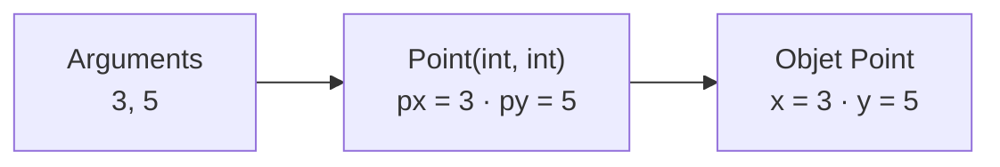
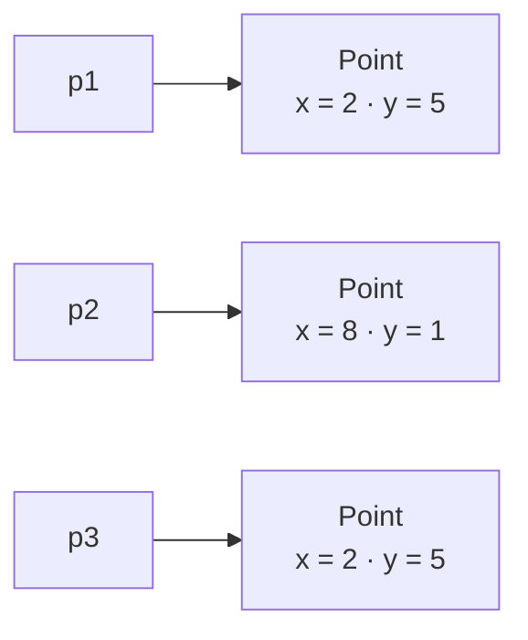

# Initialisation d'un objet

<div class="mt-3 text-lg">

Lorsqu'un objet est créé, il possède immédiatement un <strong>état</strong>.

Pour certains objets, nous voulons choisir cet état <strong>dès leur création</strong>.

</div>

<div class="grid grid-cols-2 gap-10 mt-6 items-center">

<div class="border border-gray-200 rounded-lg p-5 text-center">

<div class="text-sm text-gray-400">
NOUVEL OBJET
</div>

<div class="text-lg font-medium mt-2">
Point
</div>

<div class="mt-3">
<code>x = ?</code>
<span class="text-gray-300 mx-3">•</span>
<code>y = ?</code>
</div>

</div>

<div  class="border border-gray-200 rounded-lg p-5 text-center">

<div class="text-sm text-gray-400">
ÉTAT SOUHAITÉ
</div>

<div class="text-lg font-medium mt-2">
Point
</div>

<div class="mt-3">
<code>x = 3</code>
<span class="text-gray-300 mx-3">•</span>
<code>y = 5</code>
</div>

</div>

</div>

<div  class="border-t border-gray-200 mt-6 pt-4 text-center font-medium">

Comment donner à l'objet son <strong>état initial au moment de sa création</strong> ?

</div>

---
layout: default
---

# Des valeurs existent déjà

<div class="mt-3 text-lg">

En Java, les attributs d'un objet reçoivent des <strong>valeurs par défaut</strong> s'ils ne sont pas initialisés explicitement.

</div>

```java
class Point {

    private int x;
    private int y;

}
```

<div class="flex justify-center mt-5">

<div class="border border-gray-200 rounded-lg px-10 py-5 text-center">

<div class="text-sm text-gray-400">
APRÈS
</div>

<div class="mt-2 font-medium">
<code>new Point()</code>
</div>

<div class="mt-4 text-xl">

<code>x = 0</code>
<span class="text-gray-300 mx-3">•</span>
<code>y = 0</code>

</div>

</div>

</div>

<div  class="mt-5 text-center text-gray-500">

Pour les attributs de type <code>int</code>, Java utilise par défaut la valeur <code>0</code>.

</div>

<div  class="border-t border-gray-200 mt-5 pt-4 text-center font-medium">

Une valeur par défaut n'est pas forcément une <strong>valeur cohérente pour notre modèle</strong>.

</div>

---
layout: default
---

# Un état peut être incohérent

<div class="mt-3 text-lg">

Pour un <code>Point</code>, l'état <code>(0, 0)</code> peut être parfaitement valide.

Mais ce n'est pas toujours le cas.

</div>

```java
class Rectangle {

    private int largeur;
    private int hauteur;

}
```

<div  class="mt-5 text-center">

Supposons que notre modèle impose :

</div>

<div  class="mt-4 text-center text-lg font-medium">

<code>largeur &gt; 0</code>
<span class="text-gray-300 mx-4">et</span>
<code>hauteur &gt; 0</code>

</div>

<div  class="border-t border-gray-200 mt-6 pt-4 text-center font-medium">

Un objet doit respecter les <strong>règles du modèle</strong> auquel il appartient.

</div>

---
layout: default
---

# Exemple : un état incohérent

<div class="mt-3 text-lg">

Que se passe-t-il si nous créons simplement le rectangle ?

</div>

```java
Rectangle r = new Rectangle();
```

<div class="flex justify-center mt-6">

<div class="border border-gray-200 rounded-lg px-10 py-5 text-center">

<div class="text-sm text-gray-400">
ÉTAT OBTENU
</div>

<div class="mt-3 text-xl">

<code>largeur = 0</code>
<span class="text-gray-300 mx-3">•</span>
<code>hauteur = 0</code>

</div>

</div>

</div>

<div  class="mt-5 text-center text-lg">

Cet état ne respecte pas les règles de notre modèle.

</div>

<div  class="border-t border-gray-200 mt-6 pt-4 text-center font-medium">

L'objet existe, mais il se trouve dans un <strong>état incohérent</strong>.

</div>

---
layout: default
---

# Comment éviter cet état ?

<div class="mt-3 text-lg">

Nous voudrions obliger le programmeur à fournir les informations nécessaires <strong>dès la création</strong>.

</div>

<div class="flex justify-center mt-7">



</div>

<div  class="mt-6 text-center text-lg">

L'objet serait ainsi initialisé directement avec les valeurs souhaitées.

</div>

<div  class="border-t border-gray-200 mt-6 pt-4 text-center font-medium">

Java fournit un mécanisme pour réaliser cette initialisation : le <strong>constructeur</strong>.

</div>

---
layout: default
---

# Le constructeur

<div class="mt-3 text-lg">

Un <strong>constructeur</strong> est exécuté lors de la création d'un objet.

Il permet notamment de déterminer son <strong>état initial</strong>.

</div>

<div class="flex justify-center mt-6">



</div>

<div  class="grid grid-cols-2 gap-8 mt-5">

<div class="text-center">

<div class="font-medium">
Création
</div>

<div class="text-sm text-gray-500 mt-2">
Un nouvel objet est créé.
</div>

</div>

<div class="border-l border-gray-200 pl-8 text-center">

<div class="font-medium">
Initialisation
</div>

<div class="text-sm text-gray-500 mt-2">
Le constructeur établit son état initial.
</div>

</div>

</div>

<div class="border-t border-gray-200 mt-5 pt-4 text-center font-medium">

Le constructeur intervient au <strong>début de la vie de l'objet</strong>.

</div>

---
layout: default
---

# Un constructeur en Java

<div class="mt-3 text-lg">

Ajoutons un constructeur à notre classe <code>Point</code>.

</div>

```java
class Point {

    private int x;
    private int y;

    Point(int px, int py) {
        x = px;
        y = py;
    }
}
```

<div class="grid grid-cols-2 gap-8 mt-5 text-center">

<div class="border border-gray-200 rounded-lg p-4">

<div class="font-medium">
<code>Point</code>
</div>

<div class="text-sm text-gray-500 mt-2">
Même nom que la classe
</div>

</div>

<div class="border border-gray-200 rounded-lg p-4">

<div class="font-medium">
<code>int px, int py</code>
</div>

<div class="text-sm text-gray-500 mt-2">
Paramètres du constructeur
</div>

</div>

</div>

<div class="border-t border-gray-200 mt-5 pt-4 text-center font-medium">

Un constructeur porte le <strong>même nom que la classe</strong> et ne possède <strong>aucun type de retour</strong>.

</div>

---
layout: default
---

# Que fait ce constructeur ?

```java
Point(int px, int py) {
    x = px;
    y = py;
}
```

<div class="grid grid-cols-2 gap-8 mt-6 text-center">

<div class="border border-gray-200 rounded-lg p-5">

<div class="font-medium">
<code>px</code> et <code>py</code>
</div>

<div class="text-sm text-gray-500 mt-3">

Valeurs reçues par le constructeur.

</div>

</div>

<div class="border border-gray-200 rounded-lg p-5">

<div class="font-medium">
<code>x</code> et <code>y</code>
</div>

<div class="text-sm text-gray-500 mt-3">

Attributs de l'objet en cours de création.

</div>

</div>

</div>

<div  class="mt-6 text-center text-lg">

<code>x = px;</code>
<span class="text-gray-300 mx-3">•</span>
<code>y = py;</code>

</div>

<div  class="border-t border-gray-200 mt-5 pt-4 text-center font-medium">

Le constructeur utilise les valeurs reçues pour <strong>initialiser les attributs</strong>.

</div>

---
layout: default
---

# Appel du constructeur

<div class="mt-3 text-lg">

Les valeurs nécessaires sont fournies au moment de la création.

</div>

```java
Point p = new Point(3, 5);
```

<div class="flex justify-center mt-6">



</div>

<div  class="mt-5 text-center">

<code>3</code> est transmis à <code>px</code>.

<br>

<code>5</code> est transmis à <code>py</code>.

</div>

<div  class="border-t border-gray-200 mt-5 pt-4 text-center font-medium">

Le constructeur transforme les <strong>arguments fournis</strong> en <strong>état initial de l'objet</strong>.

</div>

---
layout: default
---

# Suivons l'initialisation

<div class="mt-3 text-lg">

Que se passe-t-il lors de cette création ?

</div>

```java
Point p = new Point(4, 7);
```

<div class="grid grid-cols-3 gap-5 mt-6 text-center">

<div class="border border-gray-200 rounded-lg p-4">

<div class="text-sm text-gray-400">
1. ARGUMENTS
</div>

<div class="mt-3">
<code>4</code> · <code>7</code>
</div>

</div>

<div class="border border-gray-200 rounded-lg p-4">

<div class="text-sm text-gray-400">
2. PARAMÈTRES
</div>

<div class="mt-3">
<code>px = 4</code> · <code>py = 7</code>
</div>

</div>

<div class="border border-gray-200 rounded-lg p-4">

<div class="text-sm text-gray-400">
3. ATTRIBUTS
</div>

<div class="mt-3">
<code>x = 4</code> · <code>y = 7</code>
</div>

</div>

</div>

<div  class="mt-7 text-center font-medium">

Arguments
<span class="text-gray-300 mx-3">→</span>
Paramètres
<span class="text-gray-300 mx-3">→</span>
Attributs

</div>

<div  class="border-t border-gray-200 mt-6 pt-4 text-center font-medium">

Le nouvel objet possède donc l'état <code>(4, 7)</code>.

</div>

---
layout: default
---

# Plusieurs objets

<div class="mt-3 text-lg">

Le même constructeur peut être utilisé pour initialiser plusieurs objets.

</div>

```java
Point p1 = new Point(2, 5);
Point p2 = new Point(8, 1);
Point p3 = new Point(2, 5);
```

<div  class="flex justify-center mt-5">



</div>

<div  class="border-t border-gray-200 mt-5 pt-4 text-center font-medium">

Chaque appel à <code>new</code> crée un <strong>nouvel objet</strong> et exécute son constructeur.

</div>

---
layout: default
---

# Vérification

<div class="mt-3 text-lg">

Considérons ce constructeur :

</div>

```java
Point(int px, int py) {
    x = px;
    y = py;
}
```

<div class="mt-5 text-center font-medium text-lg">

Quel sera l'état de chaque objet ?

</div>

```java
Point p1 = new Point(4, 7);
Point p2 = new Point(-2, 3);
```

<div  class="grid grid-cols-2 gap-8 mt-5 text-center">

<div class="border border-gray-200 rounded-lg p-4">

<div class="font-medium">
<code>p1</code>
</div>

<div class="mt-3 text-lg">
<code>(4, 7)</code>
</div>

</div>

<div class="border border-gray-200 rounded-lg p-4">

<div class="font-medium">
<code>p2</code>
</div>

<div class="mt-3 text-lg">
<code>(-2, 3)</code>
</div>

</div>

</div>

---
layout: default
---

# Le constructeur peut contrôler l'état

<div class="mt-3 text-lg">

Le constructeur peut aussi vérifier que les valeurs fournies respectent les <strong>règles de la classe</strong>.

</div>

```java
class Rectangle {

    private int largeur;
    private int hauteur;

    Rectangle(int l, int h) {

        if (l <= 0 || h <= 0) {
            throw new IllegalArgumentException();
        }

        largeur = l;
        hauteur = h;
    }
}
```

<div  class="border-t border-gray-200 mt-5 pt-4 text-center font-medium">

Le constructeur contribue à garantir un <strong>état initial cohérent</strong>.

</div>

---
layout: default
---

# Plusieurs façons d'initialiser un objet

<div class="mt-3 text-lg">

Une classe peut proposer plusieurs façons pertinentes d'initialiser ses objets.

</div>

<div class="grid grid-cols-2 gap-8 mt-7 text-center">

<div class="border border-gray-200 rounded-lg p-5">

<div class="font-medium text-lg">
Sans coordonnées
</div>

<div class="mt-3">
<code>new Point()</code>
</div>

<div class="text-sm text-gray-500 mt-3">
Le point commence à l'origine.
</div>

<div class="mt-2">
<code>(0, 0)</code>
</div>

</div>

<div class="border border-gray-200 rounded-lg p-5">

<div class="font-medium text-lg">
Avec des coordonnées
</div>

<div class="mt-3">
<code>new Point(3, 5)</code>
</div>

<div class="text-sm text-gray-500 mt-3">
Le point commence aux valeurs choisies.
</div>

<div class="mt-2">
<code>(3, 5)</code>
</div>

</div>

</div>

<div  class="border-t border-gray-200 mt-6 pt-4 text-center font-medium">

Une classe peut posséder <strong>plusieurs constructeurs</strong>.

</div>

---
layout: default
---

# Surcharge des constructeurs

```java
class Point {

    private int x;
    private int y;

    Point() {
        x = 0;
        y = 0;
    }

    Point(int px, int py) {
        x = px;
        y = py;
    }
}
```

<div class="grid grid-cols-2 gap-8 mt-5 text-center">

<div class="border border-gray-200 rounded-lg p-4">

<code>new Point()</code>

<div class="text-sm text-gray-500 mt-2">
→ utilise <code>Point()</code>
</div>

</div>

<div class="border border-gray-200 rounded-lg p-4">

<code>new Point(3, 5)</code>

<div class="text-sm text-gray-500 mt-2">
→ utilise <code>Point(int, int)</code>
</div>

</div>

</div>

<div class="border-t border-gray-200 mt-6 pt-4 text-center font-medium">

Même nom, mais <strong>listes de paramètres différentes</strong> : c'est la surcharge.

</div>

---
layout: default
---

# Quel constructeur est appelé ?

<div class="mt-3 text-lg">

Java choisit le constructeur correspondant aux arguments fournis.

</div>

<div class="grid grid-cols-2 gap-8 mt-6 text-center">

<div class="border border-gray-200 rounded-lg p-5">

<div class="font-medium">
<code>new Point()</code>
</div>

<div class="mt-3 text-gray-500">
Aucun argument
</div>

<div class="mt-3">
→ <code>Point()</code>
</div>

</div>

<div class="border border-gray-200 rounded-lg p-5">

<div class="font-medium">
<code>new Point(3, 5)</code>
</div>

<div class="mt-3 text-gray-500">
Deux arguments <code>int</code>
</div>

<div class="mt-3">
→ <code>Point(int, int)</code>
</div>

</div>

</div>

<div class="border-t border-gray-200 mt-6 pt-4 text-center font-medium">

La <strong>liste des arguments</strong> détermine quel constructeur est appelé.

</div>

---
layout: default
---

# Et si aucun constructeur n'est déclaré ?

<div class="mt-3 text-lg">

Considérons cette classe :

</div>

```java
class Point {

    private int x;
    private int y;

}
```

<div class="mt-5 text-center font-medium text-lg">

Cette instruction est-elle valide ?

</div>

```java
Point p = new Point();
```

<div  class="mt-5 text-center text-xl font-medium">

Oui.

</div>

<div  class="mt-3 text-center text-gray-500">

Comme aucun constructeur n'a été déclaré, Java fournit automatiquement un <strong>constructeur sans paramètre</strong>.

</div>

---
layout: default
---

# Le constructeur par défaut

<div class="mt-3 text-lg">

Lorsqu'une classe ne déclare <strong>aucun constructeur</strong>, Java fournit automatiquement un constructeur sans paramètre.

</div>

<div class="flex items-center justify-center gap-8 mt-7">

<div class="border border-gray-200 rounded-lg px-8 py-5 text-center">

<div class="text-sm text-gray-400">
CLASSE
</div>

<div class="mt-3">
Aucun constructeur déclaré
</div>

</div>

<div class="text-3xl text-gray-300">
→
</div>

<div class="border border-gray-200 rounded-lg px-8 py-5 text-center">

<div class="text-sm text-gray-400">
JAVA
</div>

<div class="mt-3 font-medium">
Constructeur par défaut
</div>

<div class="mt-2">
<code>Point()</code>
</div>

</div>

</div>

<div  class="border-t border-gray-200 mt-7 pt-4 text-center font-medium">

Ce constructeur est fourni <strong>uniquement si aucun constructeur n'est déclaré</strong>.

</div>

---
layout: default
---

# Attention : il n'est plus fourni

<div class="mt-3 text-lg">

Dès que nous déclarons nous-mêmes un constructeur :

</div>

```java
class Point {

    private int x;
    private int y;

    Point(int px, int py) {
        x = px;
        y = py;
    }
}
```

<div class="grid grid-cols-2 gap-8 mt-6 text-center">

<div class="border border-gray-200 rounded-lg p-4">

<div class="font-medium">
<code>new Point(3, 5)</code>
</div>

<div class="text-sm text-gray-500 mt-2">
✓ valide
</div>

</div>

<div class="border border-gray-200 rounded-lg p-4">

<div class="font-medium">
<code>new Point()</code>
</div>

<div class="text-sm text-gray-500 mt-2">
✗ invalide
</div>

</div>

</div>

<div class="border-t border-gray-200 mt-6 pt-4 text-center font-medium">

Java ne fournit plus automatiquement le constructeur sans paramètre.

</div>

---
layout: default
---

# À retenir : le constructeur

<div class="grid grid-cols-2 gap-6 mt-6">

<div class="border border-gray-200 rounded-lg p-5">

<div class="font-medium text-lg">
🏗️ Constructeur
</div>

<div class="text-sm text-gray-500 mt-3">

Initialise l'objet au moment de sa création.

</div>

</div>

<div class="border border-gray-200 rounded-lg p-5">

<div class="font-medium text-lg">
✨ <code>new</code>
</div>

<div class="text-sm text-gray-500 mt-3">

Crée un nouvel objet et déclenche un constructeur.

</div>

</div>

<div class="border border-gray-200 rounded-lg p-5">

<div class="font-medium text-lg">
📥 Paramètres
</div>

<div class="text-sm text-gray-500 mt-3">

Permettent de fournir les valeurs nécessaires à l'initialisation.

</div>

</div>

<div class="border border-gray-200 rounded-lg p-5">

<div class="font-medium text-lg">
🔁 Surcharge
</div>

<div class="text-sm text-gray-500 mt-3">

Permet de proposer plusieurs façons d'initialiser un objet.

</div>

</div>

</div>

<div class="border-t border-gray-200 mt-7 pt-4 text-center text-lg font-medium">

Le constructeur permet de créer un objet directement dans un <strong>état initial cohérent</strong>.

</div>

---
layout: default
---

# Peut-on simplifier l'écriture ?

<div class="mt-3 text-lg">

Jusqu'ici, nous avons utilisé des noms différents pour les attributs et les paramètres.

</div>

```java
class Point {

    private int x;
    private int y;

    Point(int px, int py) {
        x = px;
        y = py;
    }
}
```

<div  class="mt-6 text-center text-lg">

Mais il serait souvent plus naturel d'appeler les paramètres :

</div>

<div  class="mt-4 text-center text-xl">

<code>x</code>
<span class="text-gray-300 mx-3">et</span>
<code>y</code>

</div>

<div  class="border-t border-gray-200 mt-6 pt-4 text-center font-medium">

Que se passe-t-il si un <strong>paramètre porte le même nom qu'un attribut</strong> ?

</div>

---
layout: default
---

# Un problème de nom

<div class="mt-3 text-lg">

Essayons d'utiliser les mêmes noms :

</div>

```java
class Point {

    private int x;
    private int y;

    Point(int x, int y) {
        x = x;
        y = y;
    }
}
```

<div  class="mt-5 text-center text-lg">

Que signifie réellement :

</div>

<div  class="mt-4 text-center text-2xl font-medium">

<code>x = x;</code>

</div>

<div  class="mt-5 text-center text-gray-500">

Dans le constructeur, <code>x</code> désigne en priorité le <strong>paramètre</strong>.

<br>

L'attribut <code>x</code> n'est donc pas modifié.

</div>

<div  class="border-t border-gray-200 mt-5 pt-4 text-center font-medium">

Nous avons besoin d'un moyen de désigner explicitement <strong>l'attribut de l'objet courant</strong>.

</div>

---
layout: default
---

# Le mot-clé `this`

<div class="mt-3 text-lg">

En Java, <code>this</code> est une référence vers <strong>l'objet courant</strong>.

</div>

<div class="grid grid-cols-2 gap-8 mt-7 text-center">

<div class="border border-gray-200 rounded-lg p-5">

<div class="font-medium text-lg">
<code>this.x</code>
</div>

<div class="text-sm text-gray-500 mt-3">

L'attribut <code>x</code> de l'objet courant.

</div>

</div>

<div class="border border-gray-200 rounded-lg p-5">

<div class="font-medium text-lg">
<code>x</code>
</div>

<div class="text-sm text-gray-500 mt-3">

Le paramètre <code>x</code> du constructeur.

</div>

</div>

</div>

<div  class="mt-6 text-center text-xl">

<code>this.x</code>
<span class="text-gray-300 mx-4">≠</span>
<code>x</code>

</div>

<div  class="border-t border-gray-200 mt-5 pt-4 text-center font-medium">

<code>this</code> permet de désigner explicitement un élément appartenant à <strong>l'objet courant</strong>.

</div>

---
layout: default
---

# Le constructeur avec `this`

<div class="mt-3 text-lg">

Nous pouvons maintenant utiliser les mêmes noms pour les paramètres et les attributs.

</div>

```java
class Point {

    private int x;
    private int y;

    Point(int x, int y) {
        this.x = x;
        this.y = y;
    }
}
```

<div class="grid grid-cols-2 gap-8 mt-5 text-center">

<div class="border border-gray-200 rounded-lg p-4">

<div class="font-medium">
<code>this.x</code>
</div>

<div class="text-sm text-gray-500 mt-2">
attribut de l'objet courant
</div>

</div>

<div class="border border-gray-200 rounded-lg p-4">

<div class="font-medium">
<code>x</code>
</div>

<div class="text-sm text-gray-500 mt-2">
paramètre du constructeur
</div>

</div>

</div>

---
layout: default
---

# À retenir : classes et objets

<div class="grid grid-cols-2 gap-6 mt-5">

<div class="border border-gray-200 rounded-lg p-5">

<div class="font-medium text-lg">
📐 Classe
</div>

<div class="text-sm text-gray-500 mt-3">

Définit la structure et les comportements communs.

</div>

</div>

<div class="border border-gray-200 rounded-lg p-5">

<div class="font-medium text-lg">
🧩 Objet
</div>

<div class="text-sm text-gray-500 mt-3">

Est une instance d'une classe avec son propre état et sa propre identité.

</div>

</div>

<div class="border border-gray-200 rounded-lg p-5">

<div class="font-medium text-lg">
🔗 Référence
</div>

<div class="text-sm text-gray-500 mt-3">

Permet à une variable de désigner un objet.

</div>

</div>

<div class="border border-gray-200 rounded-lg p-5">

<div class="font-medium text-lg">
🏗️ Constructeur
</div>

<div class="text-sm text-gray-500 mt-3">

Initialise l'objet au moment de sa création.

</div>

</div>

</div>

<div class="border-t border-gray-200 mt-7 pt-4 text-center text-lg font-medium">

Une <strong>classe</strong> définit un modèle
<span class="text-gray-300 mx-2">→</span>
<code>new</code> crée un <strong>objet</strong>
<span class="text-gray-300 mx-2">→</span>
une <strong>référence</strong> permet de le manipuler.

</div>