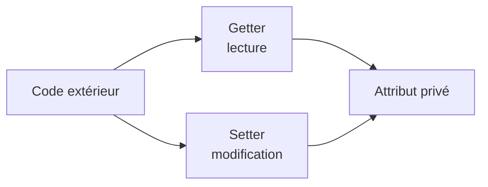

# Accéder aux attributs privés

<div class="mt-3 text-lg">

Nous avons choisi de protéger les attributs avec <code>private</code>.

</div>

```java
class Point {

    private int x;
    private int y;

}
```

<div class="mt-5 text-center">

Depuis l'extérieur de la classe :

</div>

```java
Point p = new Point();

p.x = 5;
```

<div v-click class="mt-5 text-center text-xl font-medium">

✗ Impossible

</div>

<div v-click class="border-t border-gray-200 mt-6 pt-4 text-center font-medium">

Un attribut <code>private</code> n'est pas directement accessible depuis l'extérieur de sa classe.

</div>

---
layout: default
---

# Mais comment connaître sa valeur ?

<div class="mt-3 text-lg">

Même si un attribut est privé, nous pouvons vouloir permettre sa <strong>lecture</strong>.

</div>

```java
class Point {

    private int x;
    private int y;

    public int getX() {
        return x;
    }
}
```

<div v-click class="mt-5 text-center">

Nous pouvons maintenant écrire :

</div>

```java
int valeur = p.getX();
```

<div v-click class="border-t border-gray-200 mt-6 pt-4 text-center font-medium">

Une méthode permettant de <strong>lire</strong> la valeur d'un attribut est appelée un <strong>getter</strong>.

</div>

---
layout: default
---

# Les getters

<div class="mt-3 text-lg">

Un <strong>getter</strong> permet de consulter la valeur d'un attribut privé.

</div>

```java
class Point {

    private int x;
    private int y;

    public int getX() {
        return x;
    }

    public int getY() {
        return y;
    }
}
```

<div class="grid grid-cols-2 gap-8 mt-5 text-center">

<div class="border border-gray-200 rounded-lg p-4">

<code>p.getX()</code>

<div class="text-sm text-gray-500 mt-2">
retourne la valeur de <code>x</code>
</div>

</div>

<div class="border border-gray-200 rounded-lg p-4">

<code>p.getY()</code>

<div class="text-sm text-gray-500 mt-2">
retourne la valeur de <code>y</code>
</div>

</div>

</div>

<div class="border-t border-gray-200 mt-5 pt-4 text-center font-medium">

Le getter donne un <strong>accès contrôlé en lecture</strong> à l'état de l'objet.

</div>

---
layout: default
---

# Et pour modifier un attribut ?

<div class="mt-3 text-lg">

Nous pouvons également autoriser la modification d'un attribut à travers une méthode.

</div>

```java
class Point {

    private int x;

    public void setX(int nouvelleValeur) {
        x = nouvelleValeur;
    }
}
```

<div v-click class="mt-5 text-center">

Depuis l'extérieur :

</div>

```java
p.setX(5);
```

<div v-click class="border-t border-gray-200 mt-6 pt-4 text-center font-medium">

Une méthode permettant de <strong>modifier</strong> un attribut est appelée un <strong>setter</strong>.

</div>

---
layout: default
---

# Les setters

<div class="mt-3 text-lg">

Un <strong>setter</strong> permet de modifier un attribut privé de manière contrôlée.

</div>

```java
class Point {

    private int x;
    private int y;

    public void setX(int nouvelleValeur) {
        x = nouvelleValeur;
    }

    public void setY(int nouvelleValeur) {
        y = nouvelleValeur;
    }
}
```

<div class="grid grid-cols-2 gap-8 mt-5 text-center">

<div class="border border-gray-200 rounded-lg p-4">

<code>p.setX(3)</code>

<div class="text-sm text-gray-500 mt-2">
modifie <code>x</code>
</div>

</div>

<div class="border border-gray-200 rounded-lg p-4">

<code>p.setY(5)</code>

<div class="text-sm text-gray-500 mt-2">
modifie <code>y</code>
</div>

</div>

</div>

<div class="border-t border-gray-200 mt-5 pt-4 text-center font-medium">

Le setter donne un <strong>accès contrôlé en modification</strong> à l'état de l'objet.

</div>

---
layout: default
---

# Pourquoi passer par un setter ?

<div class="mt-3 text-lg">

L'intérêt n'est pas seulement de modifier un attribut privé.

Le setter peut aussi <strong>contrôler la nouvelle valeur</strong>.

</div>

```java
class Rectangle {

    private int largeur;

    public void setLargeur(int nouvelleLargeur) {

        if (nouvelleLargeur > 0) {
            largeur = nouvelleLargeur;
        }

    }
}
```

<div v-click class="mt-5 text-center">

Une largeur négative ou nulle n'est pas acceptée.

</div>

<div v-click class="border-t border-gray-200 mt-6 pt-4 text-center font-medium">

L'encapsulation permet de <strong>protéger la cohérence de l'état</strong> de l'objet.

</div>

---
layout: default
---

# Faut-il toujours créer un setter ?

<div class="mt-3 text-lg">

Non.

Un attribut privé ne doit pas nécessairement être modifiable depuis l'extérieur.

</div>

<div class="grid grid-cols-2 gap-8 mt-7 text-center">

<div class="border border-gray-200 rounded-lg p-5">

<div class="font-medium text-lg">
Getter seulement
</div>

<div class="mt-3">

```java
public int getX() {
    return x;
}
```

</div>

<div class="text-sm text-gray-500 mt-3">
Lecture autorisée
</div>

</div>

<div class="border border-gray-200 rounded-lg p-5">

<div class="font-medium text-lg">
Getter + Setter
</div>

<div class="mt-3 text-sm text-gray-500">

Lecture et modification autorisées

</div>

</div>

</div>

<div v-click class="border-t border-gray-200 mt-6 pt-4 text-center font-medium">

On expose uniquement les opérations dont les utilisateurs de la classe ont <strong>réellement besoin</strong>.

</div>

---
layout: default
---

# Getter, setter et encapsulation

<div class="flex justify-center mt-7">



</div>

<div class="grid grid-cols-2 gap-8 mt-7 text-center">

<div>

<div class="font-medium">
Getter
</div>

<div class="text-sm text-gray-500 mt-2">
Contrôle l'accès en lecture.
</div>

</div>

<div class="border-l border-gray-200 pl-8">

<div class="font-medium">
Setter
</div>

<div class="text-sm text-gray-500 mt-2">
Contrôle l'accès en modification.
</div>

</div>

</div>

<div class="border-t border-gray-200 mt-6 pt-4 text-center font-medium">

<code>private</code> ne signifie pas « inaccessible » :

<br>

cela signifie que <strong>la classe contrôle la manière d'accéder à son état</strong>.

</div>