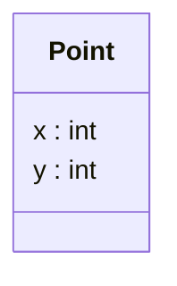

# De la classe à l'objet

<div class="mt-3 text-lg">

Nous avons défini une classe <code>Point</code> avec deux attributs.

Mais cette classe représente-t-elle déjà un point précis ?

</div>

<div class="flex justify-center mt-5">



</div>

<div class="grid grid-cols-2 gap-8 mt-4 text-center">

<div>

<div class="font-medium">
La classe <code>Point</code>
</div>

<div class="text-sm text-gray-500 mt-2">
décrit les informations communes
</div>

</div>

<div class="border-l border-gray-200 pl-8">

<div class="font-medium">
Un point particulier
</div>

<div class="text-sm text-gray-500 mt-2">
possède des valeurs précises : <code>x = 3</code> · <code>y = 5</code>
</div>

</div>

</div>

<div class="border-t border-gray-200 mt-5 pt-4 text-center font-medium">

La <strong>classe</strong> décrit le modèle ; un <strong>objet</strong> représente une réalisation particulière de ce modèle.

</div>

---
layout: default
---

# La notion d'objet

<div class="mt-3 text-lg">

Prenons deux points du plan qui suivent tous les deux le modèle <code>Point</code>.

</div>

<div class="grid grid-cols-2 gap-8 mt-6 text-center">

<div class="border border-gray-200 rounded-lg p-5">

<div class="text-sm font-medium text-gray-400">
POINT A
</div>

<div class="text-2xl mt-3">
<code>(2, 5)</code>
</div>

<div class="text-sm text-gray-500 mt-2">
x = 2 · y = 5
</div>

</div>

<div class="border border-gray-200 rounded-lg p-5">

<div class="text-sm font-medium text-gray-400">
POINT B
</div>

<div class="text-2xl mt-3">
<code>(8, 1)</code>
</div>

<div class="text-sm text-gray-500 mt-2">
x = 8 · y = 1
</div>

</div>

</div>

<div class="mt-5 text-center text-gray-500">

Ils suivent le même modèle, mais possèdent leurs <strong>propres valeurs</strong>.

</div>

<div class="border-t border-gray-200 mt-5 pt-4 text-center font-medium">

Chaque point est un <strong>objet</strong>, aussi appelé une <strong>instance</strong> de la classe <code>Point</code>.

</div>

---
layout: default
---

# Une classe, plusieurs objets

<div class="mt-3 text-lg">

Une même classe peut servir à créer <strong>plusieurs objets</strong>.

</div>

<div class="grid grid-cols-2 gap-8 mt-5">

<div>

<div class="text-center font-medium mb-3">
Le modèle
</div>


</div>

<div class="border-l border-gray-200 pl-8">

<div class="text-center font-medium mb-3">
Les objets
</div>

<div class="grid grid-cols-3 gap-3 text-center">

<div class="border border-gray-200 rounded-lg p-4">

<div class="text-sm text-gray-400">
A
</div>

<div class="mt-2">
<code>(2, 5)</code>
</div>

</div>

<div class="border border-gray-200 rounded-lg p-4">

<div class="text-sm text-gray-400">
B
</div>

<div class="mt-2">
<code>(8, 1)</code>
</div>

</div>

<div class="border border-gray-200 rounded-lg p-4">

<div class="text-sm text-gray-400">
C
</div>

<div class="mt-2">
<code>(-1, 4)</code>
</div>

</div>

</div>

</div>

</div>

<div class="border-t border-gray-200 mt-5 pt-4 text-center font-medium">

Même <strong>classe</strong> → mêmes attributs, mais valeurs différentes pour chaque <strong>objet</strong>.

</div>

---
layout: default
---

# L'état d'un objet

<div class="mt-3 text-lg">

Les valeurs des attributs d'un objet décrivent son <strong>état</strong>.

</div>

<div class="grid grid-cols-2 gap-8 mt-6 text-center">

<div class="border border-gray-200 rounded-lg p-5">

<div class="text-sm text-gray-400">
OBJET A
</div>

<div class="mt-3 text-xl">
<code>x = 2</code> · <code>y = 5</code>
</div>

<div class="text-sm text-gray-500 mt-3">
État : <code>(2, 5)</code>
</div>

</div>

<div class="border border-gray-200 rounded-lg p-5">

<div class="text-sm text-gray-400">
OBJET B
</div>

<div class="mt-3 text-xl">
<code>x = 8</code> · <code>y = 1</code>
</div>

<div class="text-sm text-gray-500 mt-3">
État : <code>(8, 1)</code>
</div>

</div>

</div>

<div class="mt-5 text-center text-gray-500">

Deux objets d'une même classe peuvent donc posséder des états différents.

</div>

<div class="border-t border-gray-200 mt-5 pt-4 text-center font-medium">

L'<strong>état</strong> d'un objet correspond aux valeurs de ses attributs à un instant donné.

</div>

---
layout: default
---

# L'état peut changer

<div class="mt-3 text-lg">

Un objet peut évoluer pendant l'exécution du programme.

</div>

<div class="flex justify-center items-center gap-10 mt-8">

<div class="border border-gray-200 rounded-lg px-12 py-5 text-center">

<div class="text-sm text-gray-400">
AVANT
</div>

<div class="text-xl mt-3">
<code>(2, 5)</code>
</div>

</div>

<div class="text-center">

<div class="text-sm text-gray-500 mb-2">
<code>deplacer(3, 1)</code>
</div>

<div class="text-3xl text-gray-300">
→
</div>

</div>

<div class="border border-gray-200 rounded-lg px-12 py-5 text-center">

<div class="text-sm text-gray-400">
APRÈS
</div>

<div class="text-xl mt-3">
<code>(5, 6)</code>
</div>

</div>

</div>

<div class="mt-6 text-center text-gray-500">

L'objet reste <strong>le même</strong>, mais ses valeurs ont changé.

</div>

<div class="border-t border-gray-200 mt-5 pt-4 text-center font-medium">

Les méthodes peuvent notamment consulter ou faire évoluer l'<strong>état</strong> d'un objet.

</div>

---
layout: default
---

# Deux objets peuvent avoir le même état

<div class="mt-3 text-lg">

Deux objets distincts peuvent posséder exactement les mêmes valeurs.

</div>

<div class="grid grid-cols-2 gap-8 mt-6 text-center">

<div class="border border-gray-200 rounded-lg p-5">

<div class="text-sm text-gray-400">
OBJET A
</div>

<div class="mt-3 text-xl">
<code>(3, 5)</code>
</div>

</div>

<div class="border border-gray-200 rounded-lg p-5">

<div class="text-sm text-gray-400">
OBJET B
</div>

<div class="mt-3 text-xl">
<code>(3, 5)</code>
</div>

</div>

</div>

<div class="mt-6 text-center text-xl font-medium">

Même état

<span class="text-gray-300 mx-4">≠</span>

même objet

</div>

<div class="border-t border-gray-200 mt-6 pt-4 text-center font-medium">

Chaque objet possède sa propre <strong>identité</strong>.

</div>

---
layout: default
---

# L'identité d'un objet

<div class="mt-3 text-lg">

L'<strong>identité</strong> permet de distinguer un objet de tous les autres.

</div>

<div class="grid grid-cols-2 gap-8 mt-6 text-center">

<div class="border border-gray-200 rounded-lg p-5">

<div class="text-sm text-gray-400">
OBJET A
</div>

<div class="mt-3 text-xl">
<code>(3, 5)</code>
</div>

<div class="text-sm text-gray-500 mt-3">
une identité propre
</div>

</div>

<div class="border border-gray-200 rounded-lg p-5">

<div class="text-sm text-gray-400">
OBJET B
</div>

<div class="mt-3 text-xl">
<code>(3, 5)</code>
</div>

<div class="text-sm text-gray-500 mt-3">
une autre identité
</div>

</div>

</div>

<div class="mt-5 text-center text-gray-500">

Les valeurs sont identiques, mais il s'agit toujours de <strong>deux objets différents</strong>.

</div>

<div class="border-t border-gray-200 mt-5 pt-4 text-center font-medium">

L'identité d'un objet est indépendante de son <strong>état</strong>.

</div>

---
layout: default
---

# Un objet : trois notions à retenir

<div class="mt-3 text-lg">

Pour décrire un objet, on distingue trois notions.

</div>

<div class="grid grid-cols-3 gap-5 mt-6 text-center">

<div class="border border-gray-200 rounded-lg p-5">

<div class="text-2xl">
🪪
</div>

<div class="font-medium mt-3">
Identité
</div>

<div class="text-sm text-gray-500 mt-2">
Le distingue des autres objets.
</div>

</div>

<div class="border border-gray-200 rounded-lg p-5">

<div class="text-2xl">
📦
</div>

<div class="font-medium mt-3">
État
</div>

<div class="text-sm text-gray-500 mt-2">
Correspond aux valeurs de ses attributs.
</div>

</div>

<div class="border border-gray-200 rounded-lg p-5">

<div class="text-2xl">
⚙️
</div>

<div class="font-medium mt-3">
Comportement
</div>

<div class="text-sm text-gray-500 mt-2">
Correspond aux opérations disponibles.
</div>

</div>

</div>

<div class="border-t border-gray-200 mt-6 pt-4 text-center text-lg font-medium">

Un objet possède une <strong>identité</strong>, un <strong>état</strong> et un <strong>comportement</strong>.

</div>

---
layout: default
---

# Où écrire notre programme ?

<div class="mt-3 text-lg">

Nous savons maintenant ce qu'est un objet.

Mais où écrire les instructions qui permettent de créer et d'utiliser ces objets ?

</div>

<div class="grid grid-cols-2 gap-8 mt-6 items-center">

<div>

```java
class Point {
    int x;
    int y;

    void afficher() {
        // ...
    }
}
```

</div>

<div class="text-center">

<div class="border border-gray-200 rounded-lg p-5">

<div class="font-medium">

La classe <code>Point</code>

</div>

<div class="text-sm text-gray-500 mt-3">

définit le modèle des objets que nous voulons manipuler.

</div>

</div>

<div class="text-3xl text-gray-300 my-3">

↓

</div>

<div class="font-medium">

Il nous faut maintenant un point de départ pour le programme.

</div>

</div>

</div>

<div v-click class="border-t border-gray-200 mt-5 pt-4 text-center font-medium">

En Java, nous allons utiliser une méthode particulière : <code>main</code>.

</div>
---
layout: default
---

# La méthode `main`

<div class="mt-3 text-lg">

La méthode <code>main</code> constitue le point de départ de l'exécution de notre programme.

</div>

<div class="grid grid-cols-2 gap-8 mt-5 items-center">

<div>

```java
public class Main {

    public static void main(String[] args) {

        System.out.println("Bonjour");

    }
}
```

</div>

<div class="space-y-4">

<div class="border border-gray-200 rounded-lg p-4 text-center">

### `Main`

Une classe qui contient le point de départ du programme.

</div>

<div class="border border-gray-200 rounded-lg p-4 text-center">

### `main`

Les instructions du programme peuvent être écrites ici.

</div>

</div>

</div>

<div class="border-t border-gray-200 mt-5 pt-4 text-center font-medium">

Pour l'instant, retenons simplement que l'exécution commence dans <code>main</code>.

</div>
---
layout: default
---

# Créons maintenant un objet en Java

<div class="mt-3 text-lg">

En Java, l'opérateur <code>new</code> permet de créer un nouvel objet.

</div>

```java
Point p = new Point();
```

<div class="grid grid-cols-3 gap-5 mt-5 text-center">

<div class="border border-gray-200 rounded-lg p-4">

<div class="text-lg font-medium">
<code>Point</code>
</div>

<div class="text-sm text-gray-500 mt-2">
Type de la variable.
</div>

</div>

<div class="border border-gray-200 rounded-lg p-4">

<div class="text-lg font-medium">
<code>p</code>
</div>

<div class="text-sm text-gray-500 mt-2">
Variable permettant d'accéder à l'objet.
</div>

</div>

<div class="border border-gray-200 rounded-lg p-4">

<div class="text-lg font-medium">
<code>new Point()</code>
</div>

<div class="text-sm text-gray-500 mt-2">
Création d'un nouvel objet.
</div>

</div>

</div>

<div class="border-t border-gray-200 mt-5 pt-4 text-center font-medium">

À chaque exécution de <code>new Point()</code>, un <strong>nouvel objet</strong> est créé.

</div>

---
layout: default
---

# Utiliser un objet

<div class="mt-3 text-lg">

Une fois l'objet créé, nous pouvons utiliser ses attributs et ses méthodes.

</div>

```java
Point p = new Point();

p.x = 3;
p.y = 5;

p.afficher();
```

<div class="grid grid-cols-2 gap-8 mt-4 text-center">

<div>

<div class="font-medium">
État de l'objet
</div>

<div class="text-xl mt-2">
<code>(3, 5)</code>
</div>

</div>

<div class="border-l border-gray-200 pl-8">

<div class="font-medium">
Appel de méthode
</div>

<div class="mt-2">
<code>p.afficher()</code>
</div>

</div>

</div>

<div class="border-t border-gray-200 mt-5 pt-4 text-center font-medium">

L'opérateur <code>.</code> permet d'accéder à un membre de l'objet.

</div>

---
layout: default
---

# Appeler une méthode sur un objet

<div class="mt-3 text-lg">

Une méthode peut agir sur l'état de l'objet sur lequel elle est appelée.

</div>

```java
Point p = new Point();

p.x = 2;
p.y = 5;

p.deplacer(3, 1);
```

<div class="flex justify-center items-center gap-10 mt-4">

<div class="text-center">

<div class="text-sm text-gray-400">
AVANT
</div>

<div class="text-xl mt-2">
<code>(2, 5)</code>
</div>

</div>

<div class="text-3xl text-gray-300">
→
</div>

<div class="text-center">

<div class="text-sm text-gray-400">
APRÈS
</div>

<div class="text-xl mt-2">
<code>(5, 6)</code>
</div>

</div>

</div>

<div class="border-t border-gray-200 mt-5 pt-4 text-center font-medium">

L'appel <code>p.deplacer(...)</code> agit sur l'<strong>objet désigné par <code>p</code></strong>.

</div>

---
layout: default
---

# Combien d'objets sont créés ?

<div class="mt-3 text-lg">

Observons ce programme :

</div>

```java
Point p1 = new Point();
Point p2 = new Point();

p1.x = 3;
p1.y = 5;

p2.x = 3;
p2.y = 5;
```

<div class="grid grid-cols-2 gap-8 mt-4 text-center">

<div class="border border-gray-200 rounded-lg p-4">

<div class="font-medium">
<code>p1</code>
</div>

<div class="text-lg mt-2">
<code>(3, 5)</code>
</div>

</div>

<div class="border border-gray-200 rounded-lg p-4">

<div class="font-medium">
<code>p2</code>
</div>

<div class="text-lg mt-2">
<code>(3, 5)</code>
</div>

</div>

</div>

<div class="border-t border-gray-200 mt-4 pt-3 text-center font-medium">

<strong>2 appels</strong> à <code>new Point()</code>
<span class="text-gray-300 mx-3">→</span>
<strong>2 objets distincts</strong>

</div>

---
layout: default
---

# Chaque objet possède son propre état

<div class="mt-3 text-lg">

Déplaçons maintenant uniquement l'objet désigné par <code>p1</code>.

</div>

```java
Point p1 = new Point();
Point p2 = new Point();

p1.x = 3; p1.y = 5;
p2.x = 3; p2.y = 5;

p1.deplacer(2, 1);
```

<div class="grid grid-cols-2 gap-8 mt-4 text-center">

<div>

<div class="font-medium">
<code>p1</code>
</div>

<div class="mt-2">
<code>(3, 5)</code>
<span class="text-gray-300 mx-2">→</span>
<strong><code>(5, 6)</code></strong>
</div>

</div>

<div class="border-l border-gray-200 pl-8">

<div class="font-medium">
<code>p2</code>
</div>

<div class="mt-2">
<code>(3, 5)</code>
<span class="text-gray-300 mx-2">→</span>
<strong><code>(3, 5)</code></strong>
</div>

</div>

</div>

<div class="border-t border-gray-200 mt-4 pt-3 text-center font-medium">

Modifier un objet ne modifie pas automatiquement les autres objets de la même classe.

</div>

---
layout: default
---

# À retenir : les objets

<div class="grid grid-cols-2 gap-5 mt-5">

<div class="border border-gray-200 rounded-lg p-4">

<div class="font-medium text-lg">
🧩 Instance
</div>

<div class="text-sm text-gray-500 mt-2">
Un objet est une <strong>instance d'une classe</strong>.
</div>

</div>

<div class="border border-gray-200 rounded-lg p-4">

<div class="font-medium text-lg">
📦 État
</div>

<div class="text-sm text-gray-500 mt-2">
Chaque objet possède ses <strong>propres valeurs d'attributs</strong>.
</div>

</div>

<div class="border border-gray-200 rounded-lg p-4">

<div class="font-medium text-lg">
🪪 Identité
</div>

<div class="text-sm text-gray-500 mt-2">
Deux objets de même état peuvent rester <strong>distincts</strong>.
</div>

</div>

<div class="border border-gray-200 rounded-lg p-4">

<div class="font-medium text-lg">
⚙️ Comportement
</div>

<div class="text-sm text-gray-500 mt-2">
Les méthodes définissent les opérations disponibles.
</div>

</div>

</div>

<div class="border-t border-gray-200 mt-5 pt-4 text-center font-medium">

Une <strong>classe</strong> définit le modèle ; les <strong>objets</strong> sont les réalisations particulières de ce modèle.

</div>

