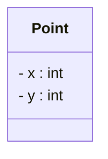

# De la classe à l'objet

<div class="mt-3 text-lg">

Nous avons défini une classe <code>Point</code> avec deux attributs :

</div>

<div class="flex justify-center mt-5">



</div>

<div class="mt-5 text-center text-lg">

Mais cette classe représente-t-elle déjà un point précis ?

</div>

<div class="grid grid-cols-2 gap-8 mt-5 text-center">

<div class="border border-gray-200 rounded-lg p-4">

<div class="font-medium">
La classe <code>Point</code>
</div>

<div class="text-sm text-gray-500 mt-2">
décrit ce que possède un point
</div>

<div class="mt-3">
<code>x</code> · <code>y</code>
</div>

</div>

<div class="border border-gray-200 rounded-lg p-4">

<div class="font-medium">
Un point particulier
</div>

<div class="text-sm text-gray-500 mt-2">
possède des valeurs précises
</div>

<div class="mt-3">
<code>x = 3</code> · <code>y = 5</code>
</div>

</div>

</div>

<div class="border-t border-gray-200 mt-6 pt-4 text-center font-medium">

La <strong>classe</strong> décrit le modèle.  
Un <strong>objet</strong> représente un élément particulier construit à partir de ce modèle.

</div>

---
layout: default
---

# La notion d'objet

<div class="mt-3 text-lg">

Prenons deux points du plan :

</div>

<div class="grid grid-cols-2 gap-10 mt-7 text-center">

<div class="border border-gray-200 rounded-lg p-5">

<div class="text-sm font-medium text-gray-400">
POINT A
</div>

<div class="text-2xl mt-3">
<code>(2, 5)</code>
</div>

<div class="mt-3 text-sm text-gray-500">
x = 2 · y = 5
</div>

</div>

<div class="border border-gray-200 rounded-lg p-5">

<div class="text-sm font-medium text-gray-400">
POINT B
</div>

<div class="text-2xl mt-3">
<code>(8, 1)</code>
</div>

<div class="mt-3 text-sm text-gray-500">
x = 8 · y = 1
</div>

</div>

</div>

<div class="mt-6 text-center text-lg">

Ces deux points suivent le même modèle <code>Point</code>,  
mais possèdent leurs <strong>propres valeurs</strong>.

</div>

<div class="border-t border-gray-200 mt-6 pt-4 text-center font-medium">

Chaque point est un <strong>objet</strong> de la classe <code>Point</code>.

<br>

<span class="text-gray-500">
On dit aussi : une <strong>instance</strong> de la classe <code>Point</code>.
</span>

</div>

---
layout: default
---

# Une classe, plusieurs objets

<div class="mt-3 text-lg">

Une même classe peut servir à créer <strong>plusieurs objets</strong>.

</div>

<div class="grid grid-cols-[1fr_100px_2fr] gap-6 mt-7 items-center">

<div class="text-center">

<div class="text-sm font-medium text-gray-400 mb-3">
MODÈLE
</div>


</div>

<div class="text-center">

<div class="text-3xl text-gray-300">→</div>

<div class="text-xs text-gray-500 mt-2">
permet de créer
</div>

</div>

<div>

<div class="text-sm font-medium text-gray-400 mb-3 text-center">
OBJETS
</div>

<div class="grid grid-cols-3 gap-3">

<div class="border border-gray-200 rounded-lg p-4 text-center">

<div class="text-sm text-gray-400">
Point A
</div>

<div class="font-medium mt-2">
<code>(2, 5)</code>
</div>

</div>

<div class="border border-gray-200 rounded-lg p-4 text-center">

<div class="text-sm text-gray-400">
Point B
</div>

<div class="font-medium mt-2">
<code>(8, 1)</code>
</div>

</div>

<div class="border border-gray-200 rounded-lg p-4 text-center">

<div class="text-sm text-gray-400">
Point C
</div>

<div class="font-medium mt-2">
<code>(-1, 4)</code>
</div>

</div>

</div>

</div>

</div>

<div class="border-t border-gray-200 mt-7 pt-4 text-center font-medium">

Même <strong>classe</strong>
<span class="text-gray-300 mx-3">→</span>
mêmes <strong>attributs</strong>
<span class="text-gray-300 mx-3">→</span>
valeurs différentes pour chaque <strong>objet</strong>

</div>

---
layout: default
---

# L'état d'un objet

<div class="mt-3 text-lg">

Les valeurs des attributs d'un objet décrivent son <strong>état</strong>.

</div>

<div class="mt-6 text-center text-gray-500">

Prenons deux objets de la classe <code>Point</code> :

</div>

<div class="grid grid-cols-2 gap-10 mt-5 text-center">

<div class="border border-gray-200 rounded-lg p-5">

<div class="text-sm text-gray-400">
OBJET A
</div>

<div class="mt-3 text-xl">

<code>x = 2</code>
<span class="text-gray-300 mx-3">•</span>
<code>y = 5</code>

</div>

<div class="mt-4 font-medium">
État : <code>(2, 5)</code>
</div>

</div>

<div class="border border-gray-200 rounded-lg p-5">

<div class="text-sm text-gray-400">
OBJET B
</div>

<div class="mt-3 text-xl">

<code>x = 8</code>
<span class="text-gray-300 mx-3">•</span>
<code>y = 1</code>

</div>

<div class="mt-4 font-medium">
État : <code>(8, 1)</code>
</div>

</div>

</div>

<div class="border-t border-gray-200 mt-6 pt-4 text-center font-medium">

L'<strong>état d'un objet</strong> correspond aux valeurs de ses attributs à un instant donné.

</div>

---
layout: default
---

# L'état peut changer

<div class="mt-3 text-lg">

Un objet peut évoluer pendant l'exécution du programme.

</div>

<div class="flex justify-center items-center gap-8 mt-10">

<div class="border border-gray-200 rounded-lg p-5 text-center">

<div class="text-sm text-gray-400">
AVANT
</div>

<div class="text-xl mt-3">
<code>(2, 5)</code>
</div>

</div>

<div class="text-center">

<div class="text-sm text-gray-500 mb-2">
<code>deplacer(3, 1)</code>
</div>

<div class="text-3xl text-gray-300">
→
</div>

</div>

<div class="border border-gray-200 rounded-lg p-5 text-center">

<div class="text-sm text-gray-400">
APRÈS
</div>

<div class="text-xl mt-3">
<code>(5, 6)</code>
</div>

</div>

</div>

<div class="mt-7 text-center text-lg">

L'objet est toujours <strong>le même point</strong>,  
mais son <strong>état a changé</strong>.

</div>

<div class="border-t border-gray-200 mt-6 pt-4 text-center font-medium">

Les méthodes permettent notamment de faire évoluer l'état d'un objet.

</div>

---
layout: default
---

# Deux objets peuvent avoir le même état

<div class="mt-3 text-lg">

Observons maintenant ces deux objets :

</div>

<div class="grid grid-cols-2 gap-10 mt-7 text-center">

<div class="border border-gray-200 rounded-lg p-5">

<div class="text-sm text-gray-400">
OBJET A
</div>

<div class="mt-3 text-xl">
<code>x = 3</code> · <code>y = 5</code>
</div>

</div>

<div class="border border-gray-200 rounded-lg p-5">

<div class="text-sm text-gray-400">
OBJET B
</div>

<div class="mt-3 text-xl">
<code>x = 3</code> · <code>y = 5</code>
</div>

</div>

</div>

<div class="mt-7 text-center text-xl font-medium">

Même état
<span class="text-gray-300 mx-4">≠</span>
même objet

</div>

<div class="mt-5 text-center text-gray-500">

A et B possèdent les mêmes valeurs, mais restent deux objets distincts.

</div>

<div class="border-t border-gray-200 mt-6 pt-4 text-center font-medium">

Chaque objet possède sa propre <strong>identité</strong>.

</div>

---
layout: default
---

# L'identité d'un objet

<div class="mt-3 text-lg">

L'<strong>identité</strong> permet de distinguer un objet de tous les autres.

</div>

<div class="grid grid-cols-[1fr_100px_1fr] gap-6 mt-8 items-center text-center">

<div class="border border-gray-200 rounded-lg p-5">

<div class="text-sm text-gray-400">
OBJET A
</div>

<div class="mt-3 text-xl">
<code>(3, 5)</code>
</div>

<div class="mt-3 text-sm text-gray-500">
une identité propre
</div>

</div>

<div>

<div class="text-2xl text-gray-300">
≠
</div>

</div>

<div class="border border-gray-200 rounded-lg p-5">

<div class="text-sm text-gray-400">
OBJET B
</div>

<div class="mt-3 text-xl">
<code>(3, 5)</code>
</div>

<div class="mt-3 text-sm text-gray-500">
une autre identité
</div>

</div>

</div>

<div class="mt-7 text-center">

Les valeurs sont identiques, mais il s'agit toujours de <strong>deux objets différents</strong>.

</div>

<div class="border-t border-gray-200 mt-6 pt-4 text-center font-medium">

L'identité d'un objet est indépendante de son état.

</div>

---
layout: default
---

# Un objet : trois notions à retenir

<div class="mt-3 text-lg text-center">

Pour décrire un objet, on distingue trois notions.

</div>

<div class="grid grid-cols-3 gap-5 mt-7 text-center">

<div class="border border-gray-200 rounded-lg p-5">

<div class="text-2xl">
🪪
</div>

<div class="font-medium text-lg mt-2">
Identité
</div>

<div class="text-sm text-gray-500 mt-3">
Qui est cet objet ?
</div>

<div class="mt-3 text-sm">
Le distingue des autres.
</div>

</div>

<div class="border border-gray-200 rounded-lg p-5">

<div class="text-2xl">
📦
</div>

<div class="font-medium text-lg mt-2">
État
</div>

<div class="text-sm text-gray-500 mt-3">
Quelles sont ses valeurs ?
</div>

<div class="mt-3 text-sm">
Déterminé par ses attributs.
</div>

</div>

<div class="border border-gray-200 rounded-lg p-5">

<div class="text-2xl">
⚙️
</div>

<div class="font-medium text-lg mt-2">
Comportement
</div>

<div class="text-sm text-gray-500 mt-3">
Que peut-il faire ?
</div>

<div class="mt-3 text-sm">
Déterminé par ses méthodes.
</div>

</div>

</div>

<div class="border-t border-gray-200 mt-7 pt-4 text-center font-medium">

Objet = <strong>identité</strong> + <strong>état</strong> + <strong>comportement</strong>

</div>

---
layout: default
---

# Créons maintenant un objet en Java

<div class="mt-3 text-lg">

Nous savons ce qu'est un objet. Voyons maintenant comment en créer un en Java.

</div>

<div class="mt-6">

```java
Point p = new Point();
```

</div>

<div class="grid grid-cols-3 gap-5 mt-6 text-center">

<div class="border border-gray-200 rounded-lg p-4">

<div class="font-medium text-lg">
<code>Point</code>
</div>

<div class="text-sm text-gray-500 mt-2">
Le type
</div>

<div class="text-sm mt-2">
La classe de l'objet
</div>

</div>

<div class="border border-gray-200 rounded-lg p-4">

<div class="font-medium text-lg">
<code>p</code>
</div>

<div class="text-sm text-gray-500 mt-2">
La variable
</div>

<div class="text-sm mt-2">
Permet d'accéder à l'objet
</div>

</div>

<div class="border border-gray-200 rounded-lg p-4">

<div class="font-medium text-lg">
<code>new Point()</code>
</div>

<div class="text-sm text-gray-500 mt-2">
La création
</div>

<div class="text-sm mt-2">
Crée un nouvel objet
</div>

</div>

</div>

<div class="border-t border-gray-200 mt-6 pt-4 text-center font-medium">

À chaque exécution de <code>new Point()</code>, un <strong>nouvel objet</strong> est créé.

</div>

---
layout: default
---

# Combien d'objets sont créés ?

<div class="mt-3 text-lg">

Observons ce programme :

</div>

```java
Point p1 = new Point();
Point p2 = new Point();

p1.initialiser(3, 5);
p2.initialiser(3, 5);
```

<div class="mt-4 text-center text-xl font-medium">

❓ Combien d'objets <code>Point</code> avons-nous créés ?

</div>

<div class="grid grid-cols-2 gap-8 mt-5 text-center">

<div class="border border-gray-200 rounded-lg p-4">

<div class="font-medium">
Objet accessible via <code>p1</code>
</div>

<div class="mt-2">
<code>(3, 5)</code>
</div>

</div>

<div class="border border-gray-200 rounded-lg p-4">

<div class="font-medium">
Objet accessible via <code>p2</code>
</div>

<div class="mt-2">
<code>(3, 5)</code>
</div>

</div>

</div>

<div class="border-t border-gray-200 mt-5 pt-4 text-center font-medium">

<strong>2 appels</strong> à <code>new Point()</code>
<span class="text-gray-300 mx-2">→</span>
<strong>2 objets distincts</strong>

</div>

---
layout: default
---

# Chaque objet possède son propre état

<div class="mt-3 text-lg">

Que se passe-t-il si nous déplaçons uniquement <code>p1</code> ?

</div>

```java
Point p1 = new Point();
Point p2 = new Point();

p1.initialiser(3, 5);
p2.initialiser(3, 5);

p1.deplacer(2, 1);
```

<div class="grid grid-cols-2 gap-8 mt-5 text-center">

<div class="border border-gray-200 rounded-lg p-4">

<div class="font-medium">
<code>p1</code>
</div>

<div class="mt-3">
<code>(3, 5)</code>
<span class="text-gray-300 mx-2">→</span>
<strong><code>(5, 6)</code></strong>
</div>

<div class="text-sm text-gray-500 mt-2">
son état change
</div>

</div>

<div class="border border-gray-200 rounded-lg p-4">

<div class="font-medium">
<code>p2</code>
</div>

<div class="mt-3">
<code>(3, 5)</code>
<span class="text-gray-300 mx-2">→</span>
<strong><code>(3, 5)</code></strong>
</div>

<div class="text-sm text-gray-500 mt-2">
son état ne change pas
</div>

</div>

</div>

<div class="border-t border-gray-200 mt-5 pt-4 text-center font-medium">

Appeler une méthode sur <code>p1</code> agit sur <strong>l'objet désigné par <code>p1</code></strong>, pas sur <code>p2</code>.

</div>

---
layout: default
---

# À retenir : les objets

<div class="grid grid-cols-2 gap-6 mt-6">

<div class="border border-gray-200 rounded-lg p-5">

<div class="font-medium text-lg">
🧩 Instance
</div>

<div class="text-sm text-gray-500 mt-2">

Un objet est une <strong>instance d'une classe</strong>.

</div>

</div>

<div class="border border-gray-200 rounded-lg p-5">

<div class="font-medium text-lg">
📦 État
</div>

<div class="text-sm text-gray-500 mt-2">

Chaque objet possède ses <strong>propres valeurs d'attributs</strong>.

</div>

</div>

<div class="border border-gray-200 rounded-lg p-5">

<div class="font-medium text-lg">
🪪 Identité
</div>

<div class="text-sm text-gray-500 mt-2">

Deux objets peuvent avoir le même état tout en restant <strong>distincts</strong>.

</div>

</div>

<div class="border border-gray-200 rounded-lg p-5">

<div class="font-medium text-lg">
⚙️ Comportement
</div>

<div class="text-sm text-gray-500 mt-2">

Les objets utilisent les <strong>méthodes définies par leur classe</strong>.

</div>

</div>

</div>

<div class="border-t border-gray-200 mt-7 pt-4 text-center text-lg font-medium">

Une <strong>classe</strong> définit le modèle
<span class="text-gray-300 mx-3">→</span>
les <strong>objets</strong> sont les réalisations concrètes de ce modèle.

</div>