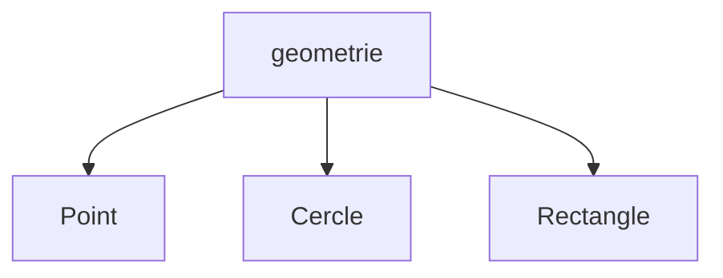
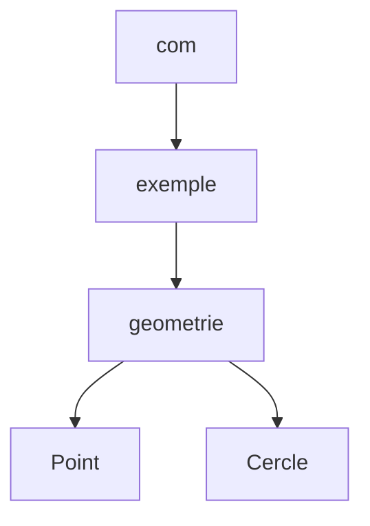

# Organisation des classes

Jusqu'à présent, notre programme contient essentiellement une classe :

```text
projet/
└── Point.java
```

Nous avons utilisé `Point` pour découvrir les classes et les objets.

<div v-click class="mt-8 text-center font-medium">

Mais un programme Java contient généralement plusieurs classes.

</div>

---
layout: default
---

# Plusieurs classes

Notre programme peut progressivement s'enrichir avec de nouvelles classes.

```text
projet/
├── Point.java
├── Cercle.java
├── Rectangle.java
└── Main.java
```

<div class="mt-8 text-center">

Toutes ces classes pourraient être placées dans le même dossier.

</div>

<div v-click class="border-t border-gray-200 mt-8 pt-4 text-center font-medium">

Lorsque le nombre de classes augmente, il devient utile de les organiser.

</div>

---
layout: default
---

# Regrouper les classes

Les classes peuvent être regroupées selon leur rôle.

<div class="grid grid-cols-2 gap-8 mt-8">

<div class="border border-gray-200 rounded-lg p-6">

### Géométrie

- `Point`
- `Cercle`
- `Rectangle`

</div>

<div class="border border-gray-200 rounded-lg p-6">

### Application

- `Main`
- `Menu`
- `Configuration`

</div>

</div>

<div v-click class="mt-8 text-center font-medium">

Java fournit les **packages** pour organiser les classes.

</div>

---
layout: default
---

# Notion de package

Un **package** permet de regrouper des classes.

<div class="flex justify-center mt-8">



</div>

<div class="mt-7 text-center">

`Point`, `Cercle` et `Rectangle` peuvent être regroupées dans le package `geometrie`.

</div>

<div v-click class="border-t border-gray-200 mt-6 pt-4 text-center font-medium">

Un package permet d'organiser les classes d'un programme.

</div>

---
layout: default
---

# Notion de package

Un **package** est un regroupement de classes.

<div class="flex justify-center mt-8">


</div>

<div class="mt-7 text-center">

Ici, `Point`, `Cercle` et `Rectangle` appartiennent au package `geometrie`.

</div>

<div v-click class="border-t border-gray-200 mt-6 pt-4 text-center font-medium">

Le package permet d'organiser les classes d'un programme.

</div>

---
layout: default
---

# Déclaration d'un package

En Java, le mot-clé `package` indique le package auquel appartient une classe.

```java
package geometrie;

class Point {
    private int x;
    private int y;
}
```

<div class="mt-7 text-center">

La classe `Point` appartient maintenant au package `geometrie`.

</div>

<div v-click class="border-t border-gray-200 mt-7 pt-4 text-center font-medium">

La déclaration `package` se place au début du fichier Java.

</div>

---
layout: default
---

# Le fichier `Point.java`

Le fichier commence par la déclaration de son package.

```java
package geometrie;

public class Point {
    private int x;
    private int y;

    public Point(int x, int y) {
        this.x = x;
        this.y = y;
    }
}
```

<div class="mt-6 text-center font-medium">

`Point` appartient au package `geometrie`.

</div>

---
layout: default
---

# Package et fichiers

L'organisation des fichiers correspond généralement à celle des packages.

```text
projet/
└── geometrie/
    ├── Point.java
    ├── Cercle.java
    └── Rectangle.java
```

Les fichiers contiennent alors :

```java
package geometrie;
```

<div v-click class="mt-7 text-center font-medium">

Le dossier `geometrie` contient les classes du package `geometrie`.

</div>

---
layout: default
---

# Exemple : `Point`

Plaçons notre classe `Point` dans le package `geometrie`.

```text
projet/
└── geometrie/
    └── Point.java
```

`Point.java` :

```java
package geometrie;

public class Point {
    private int x;
    private int y;
}
```

<div class="mt-5 text-center font-medium">

Le package fait maintenant partie de l'identité de la classe.

</div>

---
layout: default
---

# Plusieurs packages

Un programme peut contenir plusieurs packages.

```text
projet/
├── geometrie/
│   ├── Point.java
│   └── Cercle.java
│
└── application/
    └── Main.java
```

<div class="grid grid-cols-2 gap-8 mt-6 text-center">

<div class="border border-gray-200 rounded-lg p-4">

`geometrie`

Classes liées à la géométrie.

</div>

<div class="border border-gray-200 rounded-lg p-4">

`application`

Classes de l'application.

</div>

</div>

---
layout: default
---

# Déclaration des packages

Chaque classe indique le package auquel elle appartient.

<div class="grid grid-cols-2 gap-6 mt-7">

<div>

### `Point.java`

```java
package geometrie;

public class Point {
    // ...
}
```

</div>

<div>

### `Main.java`

```java
package application;

public class Main {
    // ...
}
```

</div>

</div>

<div v-click class="mt-8 text-center font-medium">

Les deux classes appartiennent à des packages différents.

</div>

---
layout: default
---

# Packages et sous-packages

Les packages peuvent être organisés avec plusieurs niveaux.

```text
com/
└── exemple/
    └── geometrie/
        └── Point.java
```

La déclaration correspondante est :

```java
package com.exemple.geometrie;
```

<div class="mt-7 text-center">

Les niveaux sont séparés par des points `.`.

</div>

<div v-click class="border-t border-gray-200 mt-7 pt-4 text-center font-medium">

`com.exemple.geometrie` est le nom complet du package.

</div>

---
layout: default
---

# Organisation des packages

Un package peut lui-même avoir plusieurs niveaux d'organisation.

<div class="flex justify-center mt-8">



</div>

<div class="mt-7 text-center font-medium">

`Point` appartient au package `com.exemple.geometrie`.

</div>

---
layout: default
---

# Nommage des packages

Par convention, les noms de packages sont écrits en **minuscules**.

```java
package geometrie;
```

```java
package com.exemple.geometrie;
```

<div class="mt-7 text-center">

On évite généralement :

</div>

```java
package Geometrie;
package MonPackage;
```

<div v-click class="mt-6 text-center font-medium">

Les conventions rendent l'organisation du projet plus régulière et lisible.

</div>

---
layout: default
---

# Nom d'une classe

Jusqu'à présent, nous utilisions simplement le nom :

```java
Point
```

C'est le **nom simple** de la classe.

<div class="mt-8 text-center">

Mais `Point` appartient maintenant au package :

</div>

```java
package geometrie;
```

<div v-click class="mt-7 text-center font-medium">

Le package permet de préciser exactement de quelle classe il s'agit.

</div>

---
layout: default
---

# Nom pleinement qualifié

Le **nom pleinement qualifié** contient le package et le nom de la classe.

<div class="mt-10 text-center text-2xl">

`geometrie.Point`

</div>

<div class="flex justify-center gap-8 mt-10">

<div class="border border-gray-200 rounded-lg px-8 py-4 text-center">

`geometrie`

<div class="text-sm text-gray-500 mt-2">
Package
</div>

</div>

<div class="border border-gray-200 rounded-lg px-8 py-4 text-center">

`Point`

<div class="text-sm text-gray-500 mt-2">
Classe
</div>

</div>

</div>

---
layout: default
---

# Utiliser le nom pleinement qualifié

Une classe peut être désignée avec son nom pleinement qualifié.

```java
geometrie.Point p =
    new geometrie.Point(3, 5);
```

<div class="mt-8 text-center">

`geometrie.Point` indique précisément la classe utilisée.

</div>

<div v-click class="border-t border-gray-200 mt-8 pt-4 text-center font-medium">

Le package permet donc aussi de distinguer des classes portant le même nom.

</div>

---
layout: default
---

# Classes de même nom

Deux packages différents peuvent contenir une classe portant le même nom.

```text
projet/
├── geometrie/
│   └── Point.java
│
└── graphique/
    └── Point.java
```

<div class="grid grid-cols-2 gap-8 mt-7 text-center">

<div class="border border-gray-200 rounded-lg p-5">

`geometrie.Point`

</div>

<div class="border border-gray-200 rounded-lg p-5">

`graphique.Point`

</div>

</div>

<div v-click class="mt-7 text-center font-medium">

Les noms pleinement qualifiés permettent de distinguer les deux classes.

</div>

---
layout: default
---

# Exemple d'organisation

Notre projet peut maintenant être organisé ainsi :

```text
projet/
├── geometrie/
│   ├── Point.java
│   ├── Cercle.java
│   └── Rectangle.java
│
└── application/
    └── Main.java
```

<div class="mt-7 text-center">

Chaque classe appartient à un package correspondant à son rôle.

</div>

<div v-click class="border-t border-gray-200 mt-7 pt-4 text-center font-medium">

Les packages structurent un programme composé de plusieurs classes.

</div>

---
layout: default
---

# À retenir : packages

<div class="grid grid-cols-2 gap-6 mt-8">

<div class="border border-gray-200 rounded-lg p-5">

### `package`

Déclare le package d'une classe.

</div>

<div class="border border-gray-200 rounded-lg p-5">

### Organisation

Regroupe les classes selon leur rôle.

</div>

<div class="border border-gray-200 rounded-lg p-5">

### Fichiers

L'organisation des dossiers suit les packages.

</div>

<div class="border border-gray-200 rounded-lg p-5">

### Nom complet

`geometrie.Point`

identifie précisément une classe.

</div>

</div>

<div class="border-t border-gray-200 mt-7 pt-4 text-center font-medium">

Les packages permettent d'organiser et d'identifier les classes d'un programme Java.

</div>