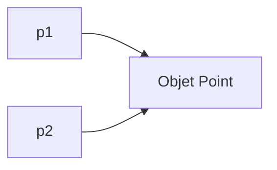
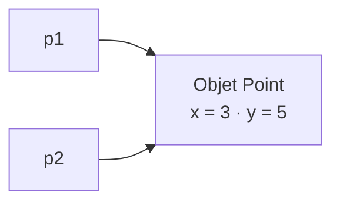
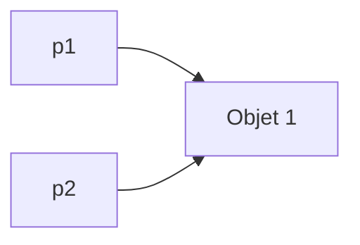
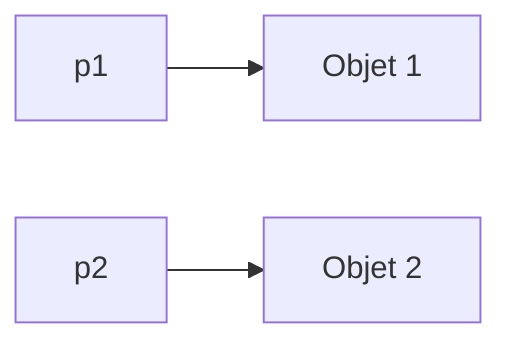
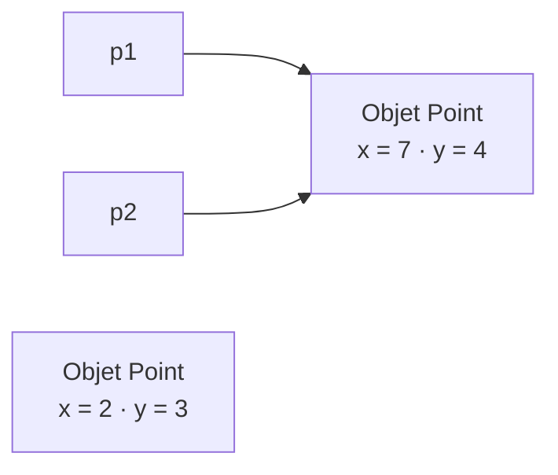
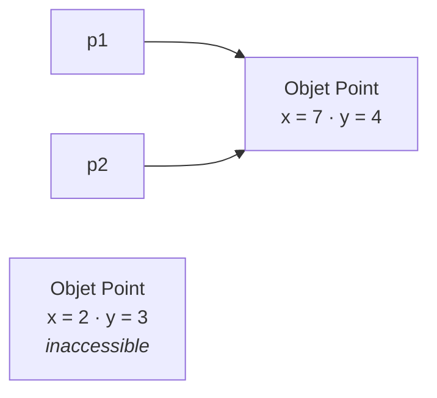

# De l'objet à la référence

<div class="mt-3 text-lg">

Nous savons maintenant créer et manipuler des objets.

Mais lorsqu'on écrit :

</div>

```java
Point p = new Point();
```

<div class="mt-5 text-center text-lg">

La variable <code>p</code> contient-elle directement tout l'objet <code>Point</code> ?

</div>

<div v-click class="mt-4 text-center text-xl font-medium">

Non.

</div>

<div v-click class="mt-3 text-center text-gray-500">

<code>p</code> contient une <strong>référence</strong> permettant de retrouver l'objet.

</div>

<div v-click class="border-t border-gray-200 mt-5 pt-4 text-center font-medium">

Variable
<span class="text-gray-300 mx-3">→</span>
Référence
<span class="text-gray-300 mx-3">→</span>
Objet

</div>

---
layout: default
---

# La notion de référence

<div class="mt-3 text-lg">

Une <strong>référence</strong> permet à une variable de désigner un objet.

</div>

<div class="flex items-center justify-center gap-10 mt-7">

<div class="text-center">

<div class="text-sm text-gray-400 mb-2">
VARIABLE
</div>

<div class="border border-gray-200 rounded-lg px-10 py-5">

<div class="text-xl font-medium">
<code>p</code>
</div>

<div class="text-sm text-gray-500 mt-2">
contient une référence
</div>

</div>

</div>

<div class="text-center">

<div class="text-4xl text-gray-300">
→
</div>

<div class="text-sm text-gray-500 mt-2">
désigne
</div>

</div>

<div class="text-center">

<div class="text-sm text-gray-400 mb-2">
OBJET
</div>

<div class="border border-gray-200 rounded-lg px-10 py-5">

<div class="font-medium">
Point
</div>

<div class="mt-2">
<code>x = 3</code> · <code>y = 5</code>
</div>

</div>

</div>

</div>

<div v-click class="border-t border-gray-200 mt-6 pt-4 text-center font-medium">

La <strong>variable</strong>, la <strong>référence</strong> et l'<strong>objet</strong> sont trois notions différentes.

</div>

---
layout: default
---

# Référence en Java

<div class="mt-3 text-lg">

Observons à nouveau la création d'un objet :

</div>

```java
Point p = new Point();
```

<div class="grid grid-cols-3 gap-5 mt-5 text-center">

<div class="border border-gray-200 rounded-lg p-4">

<div class="font-medium text-lg">
<code>Point</code>
</div>

<div class="text-sm text-gray-500 mt-2">
Type de la variable
</div>

</div>

<div class="border border-gray-200 rounded-lg p-4">

<div class="font-medium text-lg">
<code>p</code>
</div>

<div class="text-sm text-gray-500 mt-2">
Stocke une référence
</div>

</div>

<div class="border border-gray-200 rounded-lg p-4">

<div class="font-medium text-lg">
<code>new Point()</code>
</div>

<div class="text-sm text-gray-500 mt-2">
Crée un nouvel objet
</div>

</div>

</div>

<div v-click class="flex items-center justify-center gap-5 mt-5">

<div class="border border-gray-200 rounded-lg px-7 py-3">
<code>p</code>
</div>

<div class="text-3xl text-gray-300">
→
</div>

<div class="border border-gray-200 rounded-lg px-7 py-3">
Objet <code>Point</code>
</div>

</div>

<div v-click class="border-t border-gray-200 mt-4 pt-3 text-center font-medium">

La référence stockée dans <code>p</code> permet d'accéder à l'objet créé par <code>new</code>.

</div>

---
layout: default
---

# Que fait une affectation ?

<div class="mt-3 text-lg">

Observons maintenant cette affectation :

</div>

```java
Point p1 = new Point();
Point p2 = p1;
```

<div class="mt-4 text-center text-xl font-medium">

❓ Combien d'objets ont été créés ?

</div>

<div v-click class="flex justify-center mt-4">



</div>

<div v-click class="border-t border-gray-200 mt-4 pt-3 text-center font-medium">

Un seul objet : <code>p2 = p1</code> copie la <strong>référence</strong>, pas l'objet.

</div>

---
layout: default
---

# Deux variables, un seul objet

<div class="mt-3 text-lg">

Après l'affectation suivante :

</div>

```java
Point p1 = new Point();
Point p2 = p1;
```

<div class="flex justify-center mt-4">



</div>

<div v-click class="mt-4 text-center text-lg">

<code>p1</code> et <code>p2</code> permettent d'accéder au <strong>même objet</strong>.

</div>

<div v-click class="border-t border-gray-200 mt-4 pt-3 text-center font-medium">

Deux variables
<span class="text-gray-300 mx-3">≠</span>
deux objets

</div>

---
layout: default
---

# Une modification est partagée

<div class="mt-3 text-lg">

Que se passe-t-il si nous modifions l'objet via <code>p2</code> ?

</div>

```java
Point p1 = new Point();
p1.initialiser(3, 5);

Point p2 = p1;
p2.deplacer(2, 1);
```

<div class="grid grid-cols-2 gap-8 mt-4 text-center">

<div>

<div class="font-medium">
Via <code>p2</code>
</div>

<div class="text-xl mt-2">
<code>(5, 6)</code>
</div>

</div>

<div class="border-l border-gray-200 pl-8">

<div class="font-medium">
Via <code>p1</code>
</div>

<div class="text-xl mt-2">
<code>(5, 6)</code>
</div>

</div>

</div>

<div v-click class="border-t border-gray-200 mt-4 pt-3 text-center font-medium">

<code>p1</code> et <code>p2</code> désignent le même objet : la modification est donc visible via les deux variables.

</div>

---
layout: default
---

# Même objet ou objets distincts ?

<div class="grid grid-cols-2 gap-8 mt-5">

<div>

<div class="text-center font-medium mb-3">
Même objet
</div>

```java
Point p1 = new Point();
Point p2 = p1;
```

<div class="flex justify-center mt-3">



</div>

</div>

<div class="border-l border-gray-200 pl-8">

<div class="text-center font-medium mb-3">
Objets distincts
</div>

```java
Point p1 = new Point();
Point p2 = new Point();
```

<div class="flex justify-center mt-3">



</div>

</div>

</div>

<div v-click class="border-t border-gray-200 mt-4 pt-3 text-center font-medium">

C'est <code>new</code> qui crée un <strong>nouvel objet</strong>.  
Créer une nouvelle variable ne crée pas automatiquement un objet.

</div>

---
layout: default
---

# Une référence peut changer

<div class="mt-3 text-lg">

Une variable peut recevoir une nouvelle référence.

</div>

```java
Point p1 = new Point();
Point p2 = new Point();

p1.initialiser(2, 3);
p2.initialiser(7, 4);

p1 = p2;
```

<div class="mt-4 text-center font-medium">

Après <code>p1 = p2</code>, quel objet <code>p1</code> désigne-t-il ?

</div>

<div v-click class="flex justify-center mt-4">



</div>

<div v-click class="border-t border-gray-200 mt-4 pt-3 text-center font-medium">

<code>p1</code> désigne maintenant le même objet que <code>p2</code>.

</div>

---
layout: default
---

# Perte de la dernière référence

<div class="mt-3 text-lg">

Que devient alors l'ancien objet <code>(2, 3)</code> ?

</div>

<div class="flex justify-center mt-5">



</div>

<div v-click class="mt-5 text-center text-lg">

Aucune référence accessible ne permet désormais d'atteindre cet objet.

</div>

<div v-click class="border-t border-gray-200 mt-5 pt-4 text-center font-medium">

L'objet devient <strong>inaccessible</strong>.

</div>

---
layout: default
---

# Le Garbage Collector

<div class="mt-3 text-lg">

Java gère automatiquement la mémoire occupée par les objets.

</div>

<div class="grid grid-cols-2 gap-8 mt-6">

<div class="border border-gray-200 rounded-lg p-5 text-center">

<div class="font-medium text-lg">
Objet accessible
</div>

<div class="text-sm text-gray-500 mt-3">

Il existe encore un chemin de références permettant de l'atteindre.

</div>

</div>

<div class="border border-gray-200 rounded-lg p-5 text-center">

<div class="font-medium text-lg">
Objet inaccessible
</div>

<div class="text-sm text-gray-500 mt-3">

Sa mémoire pourra être récupérée automatiquement.

</div>

</div>

</div>

<div v-click class="mt-5 text-center text-lg">

Le <strong>Garbage Collector</strong> peut récupérer la mémoire des objets devenus inaccessibles.

</div>

<div v-click class="border-t border-gray-200 mt-5 pt-4 text-center font-medium">

Le programmeur ne choisit pas exactement <strong>quand</strong> cette récupération a lieu.

</div>

---
layout: default
---

# La référence `null`

<div class="mt-3 text-lg">

Une variable de type objet peut aussi ne désigner <strong>aucun objet</strong>.

</div>

```java
Point p = null;
```

<div class="flex items-center justify-center gap-10 mt-6">

<div class="border border-gray-200 rounded-lg px-10 py-5 text-center">

<div class="text-sm text-gray-400">
VARIABLE
</div>

<div class="mt-2 text-xl">
<code>p</code>
</div>

</div>

<div class="text-4xl text-gray-300">
→
</div>

<div class="border border-gray-200 rounded-lg px-10 py-5 text-center">

<div class="text-xl font-medium">
<code>null</code>
</div>

<div class="text-sm text-gray-500 mt-2">
aucun objet désigné
</div>

</div>

</div>

<div class="border-t border-gray-200 mt-5 pt-4 text-center font-medium">

<code>null</code> indique l'<strong>absence de référence vers un objet</strong>.

</div>

---
layout: default
---

# Que se passe-t-il avec `null` ?

<div class="mt-3 text-lg">

Observons l'appel suivant :

</div>

```java
Point p = null;

p.deplacer(2, 1);
```

<div class="grid grid-cols-2 gap-8 mt-5 items-center">

<div class="text-center">

<div class="font-medium">
<code>p</code>
</div>

<div class="text-sm text-gray-500 mt-2">
ne désigne aucun objet
</div>

</div>

<div class="border-l border-gray-200 pl-8">

<div class="border border-gray-200 rounded-lg p-4 text-center">

<div class="font-medium text-lg">
<code>NullPointerException</code>
</div>

<div class="text-sm text-gray-500 mt-2">
Aucun objet sur lequel exécuter <code>deplacer()</code>.
</div>

</div>

</div>

</div>

<div v-click class="border-t border-gray-200 mt-5 pt-4 text-center font-medium">

Pour appeler une méthode, la référence doit désigner un objet.

</div>

---
layout: default
---

# À retenir : les références

<div class="grid grid-cols-3 gap-5 mt-6 text-center">

<div class="border border-gray-200 rounded-lg p-5">

<div class="font-medium text-lg">
Variable
</div>

<div class="text-sm text-gray-500 mt-3">

Stocke une référence pour un type objet.

</div>

</div>

<div class="border border-gray-200 rounded-lg p-5">

<div class="font-medium text-lg">
Référence
</div>

<div class="text-sm text-gray-500 mt-3">

Permet de désigner et d'accéder à un objet.

</div>

</div>

<div class="border border-gray-200 rounded-lg p-5">

<div class="font-medium text-lg">
Objet
</div>

<div class="text-sm text-gray-500 mt-3">

Possède son propre état et sa propre identité.

</div>

</div>

</div>

<div class="mt-5 text-center text-gray-500">

Plusieurs variables peuvent désigner le <strong>même objet</strong>.

</div>

<div class="border-t border-gray-200 mt-5 pt-4 text-center font-medium">

Affecter une référence <strong>ne copie pas l'objet</strong> ; c'est <code>new</code> qui crée un nouvel objet.

</div>

