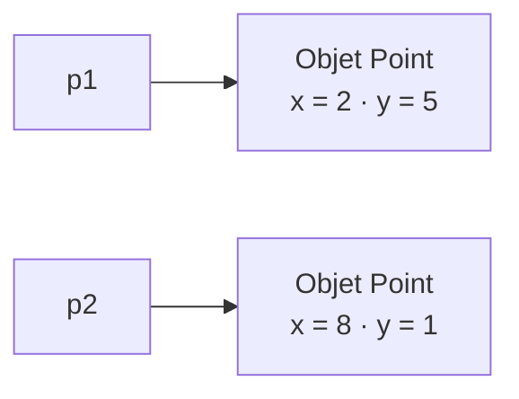
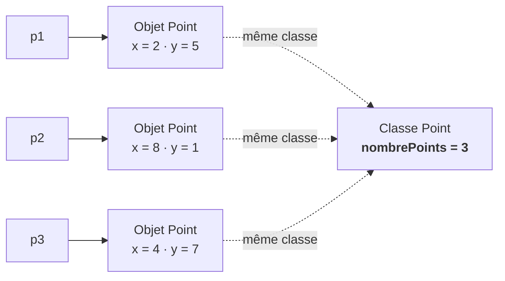
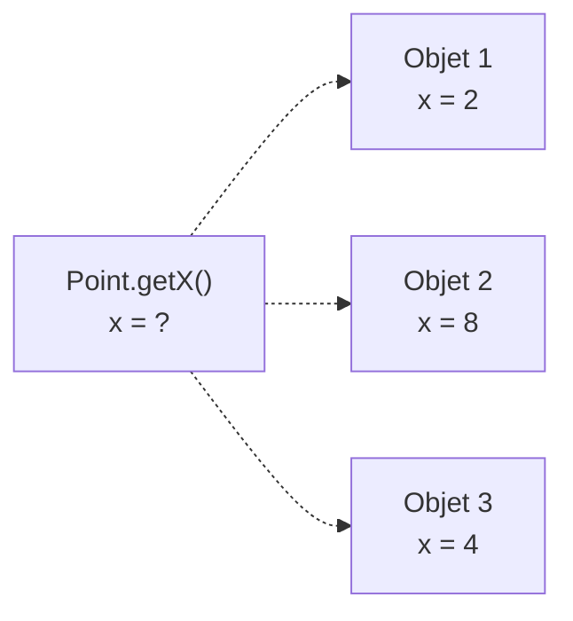

# Jusqu'ici : des membres d'instance

<div class="mt-3 text-lg">

Jusqu'à présent, les attributs que nous avons définis appartiennent à <strong>chaque objet</strong>.

</div>

```java
class Point {

    int x;
    int y;

}
```

<div class="flex justify-center mt-6">



</div>

<div v-click class="mt-5 text-center text-lg">

Chaque objet possède ses <strong>propres valeurs</strong> de <code>x</code> et <code>y</code>.

</div>

<div v-click class="border-t border-gray-200 mt-5 pt-4 text-center font-medium">

<code>x</code> et <code>y</code> sont des <strong>attributs d'instance</strong>.

</div>

---
layout: default
---

# Une information commune à tous les objets ?

<div class="mt-3 text-lg">

Imaginons maintenant que nous voulions connaître le <strong>nombre de points créés</strong>.

</div>

```java
Point p1 = new Point(2, 5);
Point p2 = new Point(8, 1);
Point p3 = new Point(4, 7);
```

<div class="mt-6 text-center text-xl font-medium">

Nombre de points créés : <code>3</code>

</div>

<div v-click class="mt-6 text-center text-lg">

Cette information appartient-elle vraiment à <code>p1</code>, <code>p2</code> ou <code>p3</code> ?

</div>

<div v-click class="mt-4 text-center font-medium">

Non : elle concerne <strong>l'ensemble des objets Point</strong>.

</div>

<div v-click class="border-t border-gray-200 mt-5 pt-4 text-center font-medium">

Nous avons besoin d'une information associée à la <strong>classe elle-même</strong>.

</div>

---
layout: default
---

# Attribut d'instance ou attribut de classe ?

<div class="grid grid-cols-2 gap-8 mt-7">

<div class="border border-gray-200 rounded-lg p-5 text-center">

<div class="text-sm text-gray-400">
INSTANCE
</div>

<div class="font-medium text-lg mt-2">
Coordonnées
</div>

<div class="mt-4">
<code>x</code> · <code>y</code>
</div>

<div class="text-sm text-gray-500 mt-4">

Chaque objet possède ses propres valeurs.

</div>

</div>

<div class="border border-gray-200 rounded-lg p-5 text-center">

<div class="text-sm text-gray-400">
CLASSE
</div>

<div class="font-medium text-lg mt-2">
Nombre de points
</div>

<div class="mt-4">
<code>nombrePoints</code>
</div>

<div class="text-sm text-gray-500 mt-4">

Une information commune à tous les objets.

</div>

</div>

</div>

<div v-click class="border-t border-gray-200 mt-7 pt-4 text-center font-medium">

Certaines données appartiennent aux <strong>objets</strong>, d'autres à la <strong>classe</strong>.

</div>

---
layout: default
---

# Le mot-clé `static`

<div class="mt-3 text-lg">

En Java, le mot-clé <code>static</code> permet de déclarer un membre associé à la <strong>classe</strong>.

</div>

```java
class Point {

    int x;
    int y;

    static int nombrePoints = 0;

}
```

<div class="grid grid-cols-2 gap-8 mt-6 text-center">

<div class="border border-gray-200 rounded-lg p-4">

<div class="font-medium">
<code>x</code> et <code>y</code>
</div>

<div class="text-sm text-gray-500 mt-2">
Attributs d'instance
</div>

</div>

<div class="border border-gray-200 rounded-lg p-4">

<div class="font-medium">
<code>nombrePoints</code>
</div>

<div class="text-sm text-gray-500 mt-2">
Attribut de classe
</div>

</div>

</div>

<div class="border-t border-gray-200 mt-5 pt-4 text-center font-medium">

Un membre déclaré <code>static</code> est associé à la <strong>classe</strong>, et non à un objet particulier.

</div>

---
layout: default
---

# Une donnée partagée

<div class="mt-3 text-lg">

Un attribut <code>static</code> est commun à l'ensemble des objets de la classe.

</div>

<div class="flex justify-center mt-6">



</div>

<div v-click class="mt-5 text-center text-lg">

Les trois objets ont leurs propres coordonnées,

<br>

mais ils utilisent la <strong>même information</strong> <code>nombrePoints</code>.

</div>

<div v-click class="border-t border-gray-200 mt-5 pt-4 text-center font-medium">

<code>static</code>

<span class="text-gray-300 mx-3">→</span>

une donnée associée à la classe

</div>

---
layout: default
---

# Compter les objets créés

<div class="mt-3 text-lg">

Nous pouvons utiliser le constructeur pour mettre à jour le compteur.

</div>

```java
class Point {

    int x;
    int y;

    static int nombrePoints = 0;

    Point(int px, int py) {
        x = px;
        y = py;

        nombrePoints++;
    }
}
```

<div v-click class="mt-5 text-center">

À chaque exécution du constructeur :

</div>

<div v-click class="mt-4 text-center text-xl font-medium">

<code>nombrePoints++</code>

</div>

<div v-click class="border-t border-gray-200 mt-5 pt-4 text-center font-medium">

Chaque nouvel objet augmente le <strong>même compteur de classe</strong>.

</div>

---
layout: default
---

# Suivons le compteur

```java
Point p1 = new Point(2, 5);
Point p2 = new Point(8, 1);
Point p3 = new Point(4, 7);
```

<div class="grid grid-cols-3 gap-5 mt-7 text-center">

<div class="border border-gray-200 rounded-lg p-5">

<div class="text-sm text-gray-400">
APRÈS p1
</div>

<div class="mt-3 text-2xl font-medium">
<code>1</code>
</div>

</div>

<div v-click class="border border-gray-200 rounded-lg p-5">

<div class="text-sm text-gray-400">
APRÈS p2
</div>

<div class="mt-3 text-2xl font-medium">
<code>2</code>
</div>

</div>

<div v-click class="border border-gray-200 rounded-lg p-5">

<div class="text-sm text-gray-400">
APRÈS p3
</div>

<div class="mt-3 text-2xl font-medium">
<code>3</code>
</div>

</div>

</div>

<div v-click class="border-t border-gray-200 mt-7 pt-4 text-center font-medium">

Les objets sont distincts, mais ils utilisent le <strong>même attribut de classe</strong>.

</div>

---
layout: default
---

# Accéder à un attribut `static`

<div class="mt-3 text-lg">

Un attribut <code>static</code> est associé à la classe.

Il est donc naturel d'y accéder avec le <strong>nom de la classe</strong>.

</div>

```java
Point.nombrePoints
```

<div class="flex items-center justify-center gap-6 mt-7">

<div class="border border-gray-200 rounded-lg px-8 py-4 text-center">

<div class="font-medium">
<code>Point</code>
</div>

<div class="text-sm text-gray-500 mt-2">
la classe
</div>

</div>

<div class="text-3xl text-gray-300">
.
</div>

<div class="border border-gray-200 rounded-lg px-8 py-4 text-center">

<div class="font-medium">
<code>nombrePoints</code>
</div>

<div class="text-sm text-gray-500 mt-2">
attribut de classe
</div>

</div>

</div>

<div v-click class="border-t border-gray-200 mt-7 pt-4 text-center font-medium">

Pour un membre <code>static</code>, on privilégie :

<br>

<code>NomDeLaClasse.membre</code>

</div>

---
layout: default
---

# Exemple d'utilisation

<div class="mt-3 text-lg">

Nous pouvons consulter le compteur directement à partir de la classe.

</div>

```java
Point p1 = new Point(2, 5);
Point p2 = new Point(8, 1);

System.out.println(Point.nombrePoints);
```

<div v-click class="mt-6 text-center text-xl font-medium">

Affichage :

<code>2</code>

</div>

<div v-click class="mt-5 text-center text-gray-500">

Nous n'avons pas besoin de choisir <code>p1</code> ou <code>p2</code> pour accéder à cette information.

</div>

<div v-click class="border-t border-gray-200 mt-6 pt-4 text-center font-medium">

<code>nombrePoints</code> concerne la <strong>classe Point</strong> dans son ensemble.

</div>

---
layout: default
---

# Les méthodes peuvent aussi être `static`

<div class="mt-3 text-lg">

Le mot-clé <code>static</code> peut également être utilisé avec une méthode.

</div>

```java
class Point {

    static int nombrePoints = 0;

    static int getNombrePoints() {
        return nombrePoints;
    }

}
```

<div class="mt-6 text-center text-lg">

Cette méthode est associée à la <strong>classe</strong>.

</div>

<div v-click class="mt-5 text-center text-xl">

<code>Point.getNombrePoints()</code>

</div>

<div v-click class="border-t border-gray-200 mt-5 pt-4 text-center font-medium">

Une méthode déclarée <code>static</code> est une <strong>méthode de classe</strong>.

</div>

---
layout: default
---

# Appeler une méthode de classe

```java
Point p1 = new Point(2, 5);
Point p2 = new Point(8, 1);
Point p3 = new Point(4, 7);

int n = Point.getNombrePoints();
```

<div v-click class="mt-6 text-center text-xl font-medium">

<code>n = 3</code>

</div>

<div v-click class="mt-6 text-center text-gray-500">

Nous n'avons pas besoin de choisir <code>p1</code>, <code>p2</code> ou <code>p3</code>.

</div>

<div v-click class="border-t border-gray-200 mt-6 pt-4 text-center font-medium">

La méthode concerne la <strong>classe Point</strong> dans son ensemble.

</div>

---
layout: default
---

# Méthode d'instance ou méthode de classe ?

<div class="grid grid-cols-2 gap-8 mt-6">

<div class="border border-gray-200 rounded-lg p-5">

<div class="text-center text-sm text-gray-400">
MÉTHODE D'INSTANCE
</div>

```java
void deplacer(int dx, int dy) {
    x += dx;
    y += dy;
}
```

<div class="text-center mt-4">

<code>p.deplacer(2, 1);</code>

</div>

<div class="text-sm text-gray-500 text-center mt-3">

Agit sur un objet particulier.

</div>

</div>

<div class="border border-gray-200 rounded-lg p-5">

<div class="text-center text-sm text-gray-400">
MÉTHODE DE CLASSE
</div>

```java
static int getNombrePoints() {
    return nombrePoints;
}
```

<div class="text-center mt-4">

<code>Point.getNombrePoints();</code>

</div>

<div class="text-sm text-gray-500 text-center mt-3">

Concerne la classe.

</div>

</div>

</div>

<div class="border-t border-gray-200 mt-5 pt-4 text-center font-medium">

Instance

<span class="text-gray-300 mx-2">→</span>

<code>objet.methode()</code>

<span class="text-gray-300 mx-4">|</span>

Classe

<span class="text-gray-300 mx-2">→</span>

<code>Classe.methode()</code>

</div>

---
layout: default
---

# `static` existe sans objet

<div class="mt-3 text-lg">

Un membre <code>static</code> appartient à la classe.

Il peut donc être utilisé même si <strong>aucun objet n'a encore été créé</strong>.

</div>

```java
class Exemple {

    static int valeur = 10;

}
```

<div class="mt-5 text-center">

Nous pouvons écrire directement :

</div>

```java
System.out.println(Exemple.valeur);
```

<div v-click class="mt-5 text-center text-xl font-medium">

<code>10</code>

</div>

<div v-click class="border-t border-gray-200 mt-6 pt-4 text-center font-medium">

Aucune instance de <code>Exemple</code> n'est nécessaire pour accéder à <code>valeur</code>.

</div>

---
layout: default
---

# Une méthode `static` n'a pas d'objet courant

<div class="mt-3 text-lg">

Une méthode d'instance est exécutée pour un <strong>objet particulier</strong>.

Elle possède donc un objet courant désigné par <code>this</code>.

</div>

<div class="grid grid-cols-2 gap-8 mt-6 text-center">

<div class="border border-gray-200 rounded-lg p-5">

<div class="font-medium">
Méthode d'instance
</div>

<div class="mt-4">
<code>p.deplacer(...)</code>
</div>

<div class="text-sm text-gray-500 mt-3">
Un objet courant existe.
</div>

<div class="mt-3">
<code>this</code> ✓
</div>

</div>

<div class="border border-gray-200 rounded-lg p-5">

<div class="font-medium">
Méthode <code>static</code>
</div>

<div class="mt-4">
<code>Point.getNombrePoints()</code>
</div>

<div class="text-sm text-gray-500 mt-3">
Aucun objet courant.
</div>

<div class="mt-3">
<code>this</code> ✗
</div>

</div>

</div>

<div v-click class="border-t border-gray-200 mt-6 pt-4 text-center font-medium">

Dans un contexte <code>static</code>, il n'existe pas de <strong><code>this</code></strong>.

</div>

---
layout: default
---

# Pourquoi cette méthode est impossible ?

<div class="mt-3 text-lg">

Considérons :

</div>

```java
class Point {

    int x;
    int y;

    static int getX() {
        return x;
    }

}
```

<div class="mt-5 text-center font-medium">

Quel <code>x</code> faudrait-il retourner ?

</div>

<div v-click class="flex justify-center mt-5">



</div>

<div v-click class="border-t border-gray-200 mt-5 pt-4 text-center font-medium">

Une méthode <code>static</code> n'est associée à <strong>aucun objet particulier</strong>.

</div>

---
layout: default
---

# Ce qu'une méthode `static` peut utiliser

<div class="mt-3 text-lg">

Une méthode <code>static</code> peut accéder directement aux autres membres <code>static</code> de sa classe.

</div>

```java
class Point {

    static int nombrePoints = 0;

    static int getNombrePoints() {
        return nombrePoints;
    }

}
```

<div class="mt-6 text-center">

Ici, tout est cohérent :

</div>

<div class="mt-4 text-center text-lg font-medium">

Méthode de classe

<span class="text-gray-300 mx-3">→</span>

Attribut de classe

</div>

<div v-click class="border-t border-gray-200 mt-6 pt-4 text-center font-medium">

Un contexte <code>static</code> peut utiliser directement les <strong>membres de classe</strong>.

</div>

---
layout: default
---

# Un exemple que vous connaissez déjà

<div class="mt-3 text-lg">

Nous avons déjà utilisé des méthodes de classe en Java.

</div>

```java
double r = Math.sqrt(25);
```

<div class="mt-6 text-center text-lg">

Nous n'avons pas besoin de créer un objet <code>Math</code>.

</div>

<div v-click class="mt-5 text-center">

<code>sqrt()</code> est une méthode <code>static</code> de la classe <code>Math</code>.

</div>

<div v-click class="border-t border-gray-200 mt-6 pt-4 text-center font-medium">

<code>Math.sqrt(...)</code>

<span class="text-gray-300 mx-3">→</span>

appel d'une <strong>méthode de classe</strong>.

</div>

---
layout: default
---

# Attribut d'instance ou `static` ?

<div class="mt-3 text-lg">

Pour chaque information, demandons-nous :

</div>

<div class="mt-4 text-center text-xl font-medium">

« Cette valeur appartient-elle à <strong>un objet</strong> ou à <strong>la classe</strong> ? »

</div>

<div class="grid grid-cols-2 gap-8 mt-7 text-center">

<div class="border border-gray-200 rounded-lg p-5">

<div class="font-medium">
Un objet particulier
</div>

<div class="mt-4">
<code>x</code>, <code>y</code>
</div>

<div class="text-sm text-gray-500 mt-3">
Attributs d'instance
</div>

</div>

<div class="border border-gray-200 rounded-lg p-5">

<div class="font-medium">
La classe entière
</div>

<div class="mt-4">
<code>nombrePoints</code>
</div>

<div class="text-sm text-gray-500 mt-3">
Attribut <code>static</code>
</div>

</div>

</div>

<div class="border-t border-gray-200 mt-6 pt-4 text-center font-medium">

On n'utilise pas <code>static</code> simplement pour éviter de créer un objet.

</div>

---
layout: default
---

# Vérification

<div class="mt-3 text-lg">

Considérons la classe suivante :

</div>

```java
class Voiture {

    String couleur;

    static int nombreVoitures = 0;

}
```

<div class="mt-5 text-center font-medium text-lg">

Quelle affirmation est correcte ?

</div>

<div class="grid grid-cols-2 gap-8 mt-5 text-center">

<div class="border border-gray-200 rounded-lg p-4">

Chaque voiture possède sa propre

<code>couleur</code>.

</div>

<div class="border border-gray-200 rounded-lg p-4">

Toutes les voitures utilisent le même

<code>nombreVoitures</code>.

</div>

</div>

<div v-click class="mt-5 text-center text-xl font-medium">

✓ Les deux

</div>

---
layout: default
---

# À retenir : instance et classe

<div class="grid grid-cols-2 gap-8 mt-6">

<div class="border border-gray-200 rounded-lg p-5 text-center">

<div class="text-sm text-gray-400">
MEMBRE D'INSTANCE
</div>

<div class="font-medium text-lg mt-3">
Appartient à un objet
</div>

<div class="mt-4">
<code>x</code>
</div>

<div class="mt-3">
<code>p.deplacer(...)</code>
</div>

<div class="text-sm text-gray-500 mt-4">

Chaque objet possède ses propres valeurs.

</div>

</div>

<div class="border border-gray-200 rounded-lg p-5 text-center">

<div class="text-sm text-gray-400">
MEMBRE DE CLASSE
</div>

<div class="font-medium text-lg mt-3">
Appartient à la classe
</div>

<div class="mt-4">
<code>static nombrePoints</code>
</div>

<div class="mt-3">
<code>Point.getNombrePoints()</code>
</div>

<div class="text-sm text-gray-500 mt-4">

Le membre est commun au niveau de la classe.

</div>

</div>

</div>

<div class="border-t border-gray-200 mt-7 pt-4 text-center text-lg font-medium">

<code>static</code> permet de définir des membres associés à la <strong>classe elle-même</strong> plutôt qu'à chacun de ses objets.

</div>