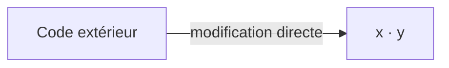
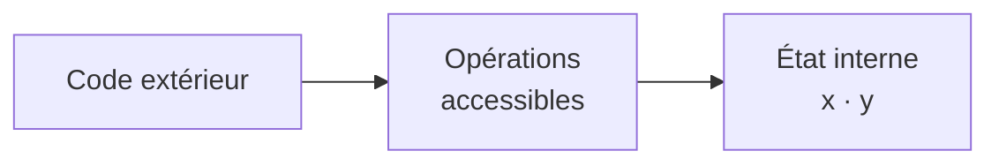
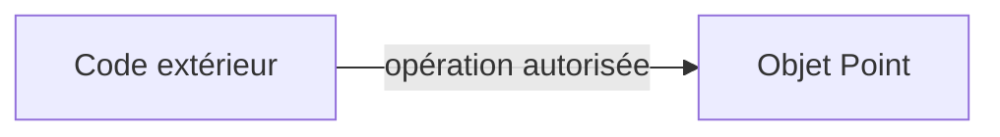
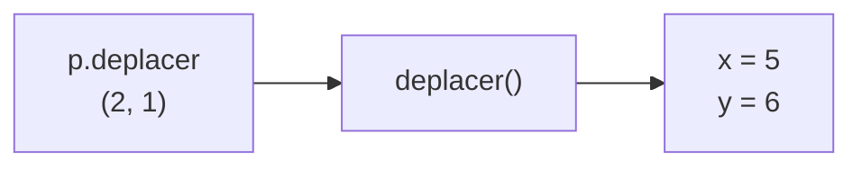
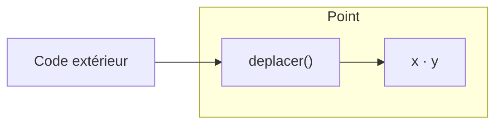

# Accès aux attributs

<div class="mt-3 text-lg">

Jusqu'à présent, les attributs étaient directement accessibles.

</div>

<div class="grid grid-cols-2 gap-8 mt-5 items-center">

<div>

```java
class Point {
    int x;
    int y;

    Point(int x, int y) {
        this.x = x;
        this.y = y;
    }
}
```

</div>

<div>

<div class="font-medium mb-3">

Le code extérieur pouvait écrire :

</div>

```java
Point p = new Point(3, 5);

p.x = 100;
p.y = -50;
```

<div class="text-sm text-gray-500 mt-3 text-center">

L'état du point est modifié directement.

</div>

</div>

</div>

<div class="border-t border-gray-200 mt-5 pt-4 text-center font-medium">

La classe <code>Point</code> ne contrôle pas ces modifications.

</div>

---
layout: default
---

# Modification directe de l'état

<div class="mt-3 text-lg">

Lorsqu'un attribut est accessible, sa valeur peut être modifiée depuis l'extérieur.

</div>

<div class="flex justify-center mt-6">



</div>

<div class="mt-5 text-center">

Le code extérieur accède directement aux coordonnées.

</div>

<div v-click class="border-t border-gray-200 mt-5 pt-4 text-center font-medium">

Nous voulons que l'objet garde le contrôle de son état.

</div>

---
layout: default
---

# Protection de l'état

<div class="mt-3 text-lg">

L'état d'un <code>Point</code> est déterminé par ses coordonnées <code>x</code> et <code>y</code>.

</div>

<div class="grid grid-cols-2 gap-8 mt-6 text-center">

<div class="border border-gray-200 rounded-lg p-4">

### Accès direct

Code extérieur

<div class="my-3">↓</div>

<code>x</code> · <code>y</code>

<div class="text-sm text-gray-500 mt-3">

Les attributs sont directement manipulés.

</div>

</div>

<div class="border border-gray-200 rounded-lg p-4">

### Accès contrôlé

Code extérieur

<div class="my-2">↓</div>

<code>Point</code>

<div class="my-2">↓</div>

<code>x</code> · <code>y</code>

</div>

</div>

<div v-click class="border-t border-gray-200 mt-5 pt-4 text-center font-medium">

La classe doit contrôler l'accès à ses attributs.

</div>

---
layout: default
---

# Principe d'encapsulation

<div class="mt-3 text-lg">

L'**encapsulation** consiste à contrôler l'accès à l'état interne d'un objet.

</div>

<div class="flex justify-center mt-6">



</div>

<div class="mt-5 text-center">

Le code extérieur utilise les opérations proposées par <code>Point</code>.

</div>

<div v-click class="border-t border-gray-200 mt-5 pt-4 text-center font-medium">

Les coordonnées restent sous le contrôle de la classe.

</div>

---
layout: default
---

# Le modificateur `private`

<div class="mt-3 text-lg">

En Java, <code>private</code> interdit l'accès direct à un membre depuis l'extérieur de sa classe.

</div>

<div class="grid grid-cols-2 gap-8 mt-5 items-center">

<div>

```java
class Point {
    private int x;
    private int y;
}
```

</div>

<div class="border border-gray-200 rounded-lg p-5 text-center">

<div class="text-lg font-medium">

<code>private</code>

</div>

<div class="my-3">↓</div>

Accessible uniquement dans la classe qui le déclare.

</div>

</div>

<div class="border-t border-gray-200 mt-5 pt-4 text-center font-medium">

Les coordonnées deviennent des données internes à <code>Point</code>.

</div>

---
layout: default
---

# Attributs privés

<div class="mt-3 text-lg">

Appliquons <code>private</code> aux coordonnées du point.

</div>

<div class="grid grid-cols-2 gap-8 mt-4 items-center">

<div>

```java
class Point {
    private int x;
    private int y;

    Point(int x, int y) {
        this.x = x;
        this.y = y;
    }
}
```
<div class="border-t border-gray-200 mt-3 pt-3 text-center font-medium">

<code>private</code> protège les attributs de l'extérieur, mais pas de la classe elle-même.

</div>
</div>


<div class="space-y-3">

<div class="border border-gray-200 rounded-lg p-3 text-center">

### Depuis `Point`

<code>this.x = x;</code>

<div class="mt-2 font-medium">

✓ Autorisé

</div>

<div class="text-sm text-gray-500 mt-1">

La classe peut accéder à ses attributs privés.

</div>

</div>

<div class="border border-gray-200 rounded-lg p-3 text-center">

### Depuis l'extérieur

<code>p.x = 10;</code>

<div class="mt-2 font-medium">

✗ Interdit

</div>

<div class="text-sm text-gray-500 mt-1">

L'accès direct à <code>x</code> est impossible.

</div>

</div>

</div>

</div>


---
layout: default
---

# Accès depuis l'extérieur

<div class="mt-3 text-lg">

Que se passe-t-il maintenant ?

</div>

<div class="grid grid-cols-2 gap-8 mt-6 items-center">

<div>

```java
Point p = new Point(3, 5);

p.x = 10;
```

</div>

<div v-click class="text-center">

<div class="text-xl font-medium">

✗ Erreur de compilation

</div>

<div class="text-sm text-gray-500 mt-3">

<code>x</code> est déclaré <code>private</code>.

</div>

</div>

</div>

<div v-click class="border-t border-gray-200 mt-6 pt-4 text-center font-medium">

Le code extérieur ne peut plus modifier directement <code>x</code>.

</div>

---
layout: default
---

# Un objet doit rester utilisable

<div class="mt-3 text-lg">

Protéger les attributs ne signifie pas empêcher l'utilisation de l'objet.

</div>

<div class="flex justify-center mt-6">



</div>

<div class="mt-5 text-center">

La classe choisit les opérations accessibles depuis l'extérieur.

</div>

<div v-click class="border-t border-gray-200 mt-5 pt-4 text-center font-medium">

Java fournit notamment pour cela le modificateur <code>public</code>.

</div>

---
layout: default
---

# Le modificateur `public`

<div class="grid grid-cols-2 gap-8 mt-4 items-center">

<div>

```java
class Point {
    private int x;
    private int y;

    public void deplacer(int dx, int dy) {
        x += dx;
        y += dy;
    }
}
```

</div>

<div class="space-y-4">

<div class="border border-gray-200 rounded-lg p-4 text-center">

### `private`

<code>x</code> · <code>y</code>

<div class="text-sm text-gray-500 mt-2">

État interne

</div>

</div>

<div class="border border-gray-200 rounded-lg p-4 text-center">

### `public`

<code>deplacer()</code>

<div class="text-sm text-gray-500 mt-2">

Opération accessible

</div>

</div>

</div>

</div>

<div class="border-t border-gray-200 mt-5 pt-4 text-center font-medium">

La classe choisit ce qu'elle protège et ce qu'elle expose.

</div>

---
layout: default
---

# Utilisation d'une méthode publique

<div class="mt-3 text-lg">

Le code extérieur peut appeler <code>deplacer()</code>.

</div>

<div class="grid grid-cols-2 gap-8 mt-5 items-center">

<div>

```java
Point p = new Point(3, 5);

p.deplacer(2, 1);
```

</div>

<div class="flex justify-center">



</div>

</div>

<div class="border-t border-gray-200 mt-6 pt-4 text-center font-medium">

Les coordonnées sont modifiées depuis l'intérieur de <code>Point</code>.

</div>

---
layout: default
---

# Interface publique

<div class="mt-3 text-lg">

Les méthodes <code>public</code> définissent ce que le code extérieur peut utiliser.

</div>

<div class="grid grid-cols-2 gap-8 mt-5 items-center">

<div class="flex justify-center">



</div>

<div class="space-y-4 text-center">

<div class="border border-gray-200 rounded-lg p-4">

### Interface publique

<code>deplacer()</code>

</div>

<div class="border border-gray-200 rounded-lg p-4">

### Implémentation interne

<code>x</code> · <code>y</code>

</div>

</div>

</div>

<div class="border-t border-gray-200 mt-5 pt-4 text-center font-medium">

L'utilisation de l'objet est séparée de son fonctionnement interne.

</div>

---
layout: default
---

# L'implémentation peut évoluer

<div class="mt-3 text-lg">

Le code extérieur utilise l'interface publique, sans dépendre des détails internes.

</div>

<div class="grid grid-cols-2 gap-8 mt-5 items-center">

<div class="border border-gray-200 rounded-lg p-4">

### Code extérieur

```java
Point p = new Point(3, 5);

p.deplacer(2, 1);

int x = p.getX();
```

</div>

<div class="border border-gray-200 rounded-lg p-4 text-center">

### Classe `Point`

<div class="mt-4">

L'implémentation interne peut évoluer.

</div>

<div class="text-sm text-gray-500 mt-3">

Le code extérieur continue d'utiliser les mêmes opérations.

</div>

</div>

</div>

<div class="border-t border-gray-200 mt-5 pt-4 text-center font-medium">

Une interface stable permet de modifier l'implémentation sans modifier le code qui utilise la classe.

</div>
---
layout: default
---

# Consulter un attribut privé

<div class="mt-3 text-lg">

Les coordonnées sont protégées : l'accès direct n'est plus possible.

</div>

<div class="grid grid-cols-2 gap-8 mt-6 text-center">

<div class="border border-gray-200 rounded-lg p-4">

### Accès direct

```java
int valeur = p.x;
```

<div class="mt-3">

✗ Interdit

</div>

</div>

<div v-click class="border border-gray-200 rounded-lg p-4">

### Accès contrôlé

Consulter <code>x</code>

sans rendre l'attribut public.

</div>

</div>

<div v-click class="border-t border-gray-200 mt-6 pt-4 text-center font-medium">

La classe peut fournir un <strong>accesseur</strong>, appelé aussi <strong>getter</strong>.

</div>


