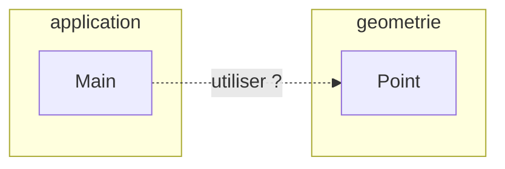

# Classes d'un autre package

<div class="mt-3 text-lg">

Notre projet contient maintenant deux packages distincts.

</div>

<div class="grid grid-cols-2 gap-8 mt-5 items-center">

<div>

### Organisation du projet

```text
projet/
├── geometrie/
│   └── Point.java
│
└── application/
    └── Main.java
```

<div class="text-sm text-gray-500 mt-3">

Chaque classe est placée dans le dossier correspondant à son package.

</div>

</div>

<div class="border-l border-gray-200 pl-8">

### Organisation des classes

<div class="flex justify-center mt-3">



</div>

<div class="text-sm text-gray-500 text-center mt-3">

<code>Main</code> et <code>Point</code> appartiennent à des packages différents.

</div>

</div>

</div>

<div v-click class="border-t border-gray-200 mt-5 pt-4 text-center font-medium">

Comment <code>Main</code> peut-il utiliser la classe <code>Point</code> ?

</div>

---
layout: default
---

# Nom pleinement qualifié

Nous avons vu qu'une classe peut être désignée par son nom pleinement qualifié.

```java
package application;

public class Main {

    public static void main(String[] args) {

        geometrie.Point p =
            new geometrie.Point(3, 5);
    }
}
```

<div class="mt-6 text-center">

`geometrie.Point` indique précisément la classe utilisée.

</div>

---
layout: default
---

# Limite du nom pleinement qualifié

Le nom pleinement qualifié peut rapidement alourdir le code.

```java
geometrie.Point p1 =
    new geometrie.Point(3, 5);

geometrie.Point p2 =
    new geometrie.Point(8, 2);

geometrie.Point p3 =
    new geometrie.Point(1, 4);
```

<div v-click class="mt-7 text-center font-medium">

Nous répétons `geometrie.Point` à chaque utilisation.

</div>

<div v-click class="border-t border-gray-200 mt-6 pt-4 text-center">

Java permet d'utiliser directement le nom simple de la classe.

</div>

---
layout: default
---

# Le mot-clé `import`

Le mot-clé `import` permet d'utiliser le nom simple d'une classe située dans un autre package.

```java
import geometrie.Point;
```

<div class="flex justify-center mt-8">

<div class="border border-gray-200 rounded-lg px-10 py-5 text-center">

`geometrie.Point`

↓

`Point`

</div>

</div>

<div v-click class="mt-7 text-center font-medium">

L'import évite de répéter le nom pleinement qualifié.

</div>

---
layout: default
---

# Déclaration d'un import

Les imports sont placés après la déclaration du package et avant la classe.

```java
package application;

import geometrie.Point;

public class Main {

    // ...

}
```

<div class="mt-7 text-center">

L'ordre général du fichier devient :

</div>

<div class="mt-5 text-center font-medium">

`package` → `import` → `class`

</div>

---
layout: default
---

# Utilisation d'une classe importée

Après l'import, nous pouvons utiliser le nom simple `Point`.

```java
package application;

import geometrie.Point;

public class Main {

    public static void main(String[] args) {
        Point p = new Point(3, 5);
    }
}
```

<div class="mt-6 text-center font-medium">

Il n'est plus nécessaire d'écrire `geometrie.Point`.

</div>

---
layout: default
---

# Import et nom simple

L'import établit le lien entre le nom simple et la classe correspondante.

<div class="flex justify-center mt-8">


</div>

<div class="mt-7 text-center">

Dans ce fichier, `Point` désigne la classe `geometrie.Point`.

</div>

---
layout: default
---

# Exemple : `Point` utilisé depuis `Main`

<div class="mt-3 text-lg">

`Point` et `Main` appartiennent à deux packages différents.

</div>

<div class="grid grid-cols-2 gap-8 mt-4">

<div>

### `Point.java`

```java
package geometrie;

public class Point {
    private int x;
    private int y;

    public Point(int x, int y) {
        this.x = x;
        this.y = y;
    }
}
```

<div class="text-sm text-gray-500 mt-3 text-center">

`Point` reste dans son propre package.

</div>

</div>

<div class="border-l border-gray-200 pl-8">

### `Main.java`

```java
package application;

import geometrie.Point;

public class Main {
    public static void main(String[] args) {
        Point p = new Point(3, 5);
        p.deplacer(2, 1);
    }
}
```

<div class="text-sm text-gray-500 mt-3 text-center">

`Main` importe `Point` et utilise son nom simple.

</div>

</div>

</div>

<div class="border-t border-gray-200 mt-4 pt-3 text-center font-medium">

C'est la classe qui souhaite utiliser `Point` qui réalise l'`import`.

</div>

---
layout: default
---

# Importer plusieurs classes

Un fichier peut avoir plusieurs imports.

```java
package application;

import geometrie.Point;
import geometrie.Cercle;
import geometrie.Rectangle;

public class Main {

    // ...

}
```

<div class="mt-7 text-center">

Chaque import désigne une classe.

</div>

<div v-click class="mt-5 text-center font-medium">

`Point`, `Cercle` et `Rectangle` peuvent ensuite être utilisés directement.

</div>

---
layout: default
---

# Import avec `*`

Java permet aussi d'importer les classes d'un package avec `*`.

```java
import geometrie.*;
```

Cela permet par exemple d'utiliser :

```java
Point p = new Point(3, 5);
Cercle c = new Cercle();
Rectangle r = new Rectangle();
```

<div v-click class="mt-6 text-center font-medium">

`*` évite d'écrire un import séparé pour chaque classe du package.

</div>

---
layout: default
---

# Portée de `*`

<div class="mt-3 text-lg">

Un import avec `*` concerne les classes du package, mais pas celles de ses sous-packages.

</div>

<div class="grid grid-cols-2 gap-8 mt-5">

<div>

### Organisation

```text
geometrie/
├── Point.java
├── Cercle.java
│
└── formes/
    └── Triangle.java
```

```java
import geometrie.*;
```

</div>

<div class="border-l border-gray-200 pl-8">

### Classes concernées

<div class="mt-4">

✓ `Point`  
✓ `Cercle`

</div>

<div class="mt-4">

✗ `Triangle`

<div class="text-sm text-gray-500 mt-2">

`Triangle` appartient au package distinct `geometrie.formes`.

</div>

</div>

<div v-click class="mt-5">

Pour utiliser `Triangle` :

```java
import geometrie.formes.Triangle;
```

</div>

</div>

</div>

<div class="border-t border-gray-200 mt-4 pt-3 text-center font-medium">

Importer `geometrie.*` n'importe pas les classes de `geometrie.formes`.

</div>

---
layout: default
---

# Classes du même package

Deux classes appartenant au même package peuvent utiliser leurs noms simples sans import.

### `Point.java`

```java
package geometrie;

public class Point {
    // ...
}
```

### `Cercle.java`

```java
package geometrie;

public class Cercle {
    private Point centre;
}
```

<div v-click class="mt-4 text-center font-medium">

`Cercle` n'a pas besoin d'importer `Point`.

</div>

---
layout: default
---

# Le package `java.lang`

<div class="mt-3 text-lg">

Certaines classes ont déjà été utilisées sans écrire d'`import`.

</div>

<div class="grid grid-cols-2 gap-8 mt-5">

<div>

### Utilisation

```java
String nom = "Point";

double distance = Math.sqrt(25);
```

<div class="mt-4">

Pourtant, nous n'avons pas écrit :

```java
import java.lang.String;
import java.lang.Math;
```

</div>

</div>

<div class="border-l border-gray-200 pl-8">

### Quelques classes de `java.lang`

<div class="grid grid-cols-2 gap-3 mt-4">

<div class="border border-gray-200 rounded-lg p-3 text-center">

**`String`**

<div class="text-sm text-gray-500">
Chaînes de caractères
</div>

</div>

<div class="border border-gray-200 rounded-lg p-3 text-center">

**`Math`**

<div class="text-sm text-gray-500">
Opérations mathématiques
</div>

</div>

<div class="border border-gray-200 rounded-lg p-3 text-center">

**`System`**

<div class="text-sm text-gray-500">
Interaction avec le système
</div>

</div>

<div class="border border-gray-200 rounded-lg p-3 text-center">

**`Object`**

<div class="text-sm text-gray-500">
Classe fondamentale
</div>

</div>

</div>

</div>

</div>

<div v-click class="border-t border-gray-200 mt-5 pt-4 text-center font-medium">

Les classes de `java.lang` sont disponibles automatiquement, sans `import` explicite.

</div>

---
layout: default
---

# Conflit de noms

<div class="mt-3 text-lg">

Deux packages peuvent contenir une classe portant le même nom.

</div>

<div class="grid grid-cols-2 gap-8 mt-5">

<div>

### Le problème

```text
geometrie/
└── Point.java

graphique/
└── Point.java
```

Nous avons donc :

```text
geometrie.Point
graphique.Point
```

<div class="text-sm text-gray-500 mt-3">

Le nom simple `Point` devient ambigu.

</div>

</div>

<div class="border-l border-gray-200 pl-8">

### La solution

Utiliser le nom pleinement qualifié :

```java
geometrie.Point p1 =
    new geometrie.Point(3, 5);

graphique.Point p2 =
    new graphique.Point();
```

<div class="text-sm text-gray-500 mt-3">

Chaque nom désigne précisément la classe souhaitée.

</div>

</div>

</div>

<div v-click class="border-t border-gray-200 mt-5 pt-4 text-center font-medium">

Deux classes de même nom peuvent coexister grâce à leurs noms pleinement qualifiés.

</div>

---
layout: default
---

# `import` et emplacement des classes

L'import ne déplace aucune classe.

```text
projet/
├── geometrie/
│   └── Point.java
│
└── application/
    └── Main.java
```

```java
import geometrie.Point;
```

<div class="mt-6 text-center">

`Point` reste dans le package `geometrie`.

</div>

<div v-click class="border-t border-gray-200 mt-6 pt-4 text-center font-medium">

`import` permet simplement d'utiliser son nom simple dans le fichier.

</div>

---
layout: default
---

# À retenir : imports

<div class="grid grid-cols-2 gap-6 mt-8">

<div class="border border-gray-200 rounded-lg p-5">

### `import`

Permet d'utiliser le nom simple d'une classe.

</div>

<div class="border border-gray-200 rounded-lg p-5">

### Nom complet

`geometrie.Point`

reste toujours utilisable.

</div>

<div class="border border-gray-200 rounded-lg p-5">

### `*`

Concerne les classes d'un package, pas ses sous-packages.

</div>

<div class="border border-gray-200 rounded-lg p-5">

### `java.lang`

Est importé automatiquement.

</div>

</div>

<div class="border-t border-gray-200 mt-7 pt-4 text-center font-medium">

Les imports simplifient l'utilisation des classes situées dans d'autres packages.

</div>