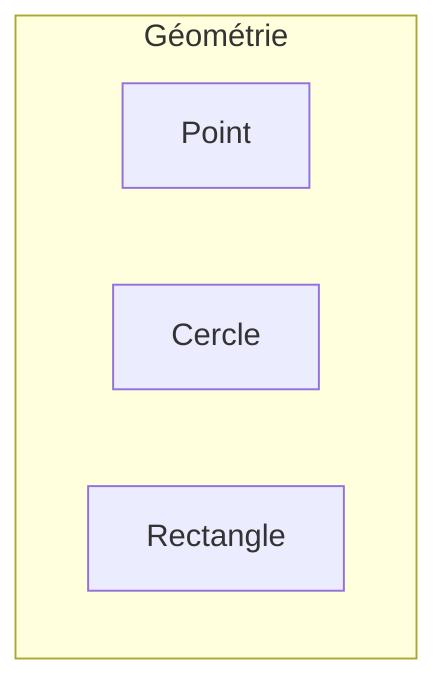
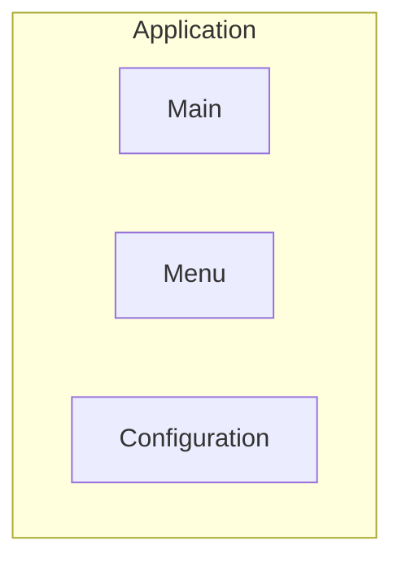
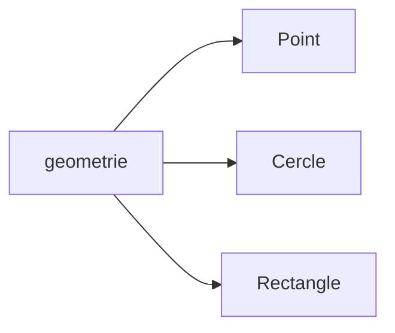

# Organisation des classes

<div class="mt-3 text-lg">

Jusqu'à présent, notre programme contient deux classes.

</div>

<div class="grid grid-cols-2 gap-8 mt-5 items-center">

<div>

```text
projet/
├── Point.java
└── Main.java
```

</div>

<div class="space-y-4">

<div class="border border-gray-200 rounded-lg p-4 text-center">

### `Point`

Définit les objets que nous manipulons.

</div>

<div class="border border-gray-200 rounded-lg p-4 text-center">

### `Main`

Contient le point de départ du programme.

</div>

</div>

</div>

<div class="border-t border-gray-200 mt-5 pt-4 text-center font-medium">

Pour un petit programme, placer les classes dans le même dossier suffit.

</div>

---
layout: default
---

# Lorsque le programme grandit

<div class="mt-3 text-lg">

De nouvelles classes peuvent progressivement être ajoutées.

</div>

<div class="grid grid-cols-2 gap-8 mt-5 items-center">

<div>

```text
projet/
├── Point.java
├── Cercle.java
├── Rectangle.java
├── Menu.java
├── Configuration.java
└── Main.java
```

</div>

<div class="border border-gray-200 rounded-lg p-5 text-center">

<div class="font-medium text-lg">

Toutes les classes sont au même endroit

</div>

<div class="text-sm text-gray-500 mt-3">

La structure devient moins lisible lorsque leur nombre augmente.

</div>

</div>

</div>

<div v-click class="border-t border-gray-200 mt-5 pt-4 text-center font-medium">

Il devient utile de regrouper les classes selon leur rôle.

</div>

---
layout: default
---

# Regrouper les classes

<div class="mt-3 text-lg">

Les classes d'un programme n'ont pas toutes le même rôle.

</div>

<div class="grid grid-cols-2 gap-8 mt-5">

<div>

### Géométrie

<div class="flex justify-center mt-3">



</div>

<div class="text-sm text-gray-500 text-center mt-3">

Classes représentant des objets géométriques.

</div>

</div>

<div class="border-l border-gray-200 pl-8">

### Application

<div class="flex justify-center mt-3">



</div>

<div class="text-sm text-gray-500 text-center mt-3">

Classes liées au fonctionnement de l'application.

</div>

</div>

</div>

<div class="mt-5 text-center">

Les classes ayant un rôle proche peuvent être <strong>regroupées dans un même ensemble</strong>.

</div>

<div v-click class="border-t border-gray-200 mt-5 pt-4 text-center font-medium">

En Java, ces regroupements sont réalisés à l'aide de <strong>packages</strong>.

</div>

---
layout: default
---

# Notion de package

<div class="mt-3 text-lg">

Un <strong>package</strong> permet de regrouper des classes liées entre elles.

</div>

<div class="flex justify-center mt-6">



</div>

<div class="mt-5 text-center">

<code>Point</code>, <code>Cercle</code> et <code>Rectangle</code> peuvent appartenir au package <code>geometrie</code>.

</div>

<div v-click class="border-t border-gray-200 mt-5 pt-4 text-center font-medium">

Un package permet d'organiser les classes d'un programme.

</div>

---
layout: default
---

# Organisons notre programme

<div class="mt-3 text-lg">

Nous pouvons maintenant séparer les classes selon leur rôle.

</div>

<div class="grid grid-cols-2 gap-8 mt-5 items-center">

<div>

```text
projet/
├── geometrie/
│   ├── Point.java
│   ├── Cercle.java
│   └── Rectangle.java
│
└── application/
    └── Main.java
```

</div>

<div class="space-y-4 text-center">

<div class="border border-gray-200 rounded-lg p-4">

### `geometrie`

Classes représentant les objets géométriques.

</div>

<div class="border border-gray-200 rounded-lg p-4">

### `application`

Classes permettant de lancer et gérer l'application.

</div>

</div>

</div>

<div class="border-t border-gray-200 mt-5 pt-4 text-center font-medium">

Notre programme est maintenant organisé en deux groupes de classes.

</div>

---
layout: default
---

# Déclarer un package

<div class="mt-3 text-lg">

En Java, le mot-clé <code>package</code> indique à quel package appartient une classe.

</div>

<div class="grid grid-cols-2 gap-8 mt-5">

<div>

### `Point.java`

```java
package geometrie;

public class Point {
    private int x;
    private int y;
}
```

</div>

<div>

### `Main.java`

```java
package application;

public class Main {

    public static void main(String[] args) {
        // ...
    }
}
```

</div>

</div>

<div class="border-t border-gray-200 mt-5 pt-4 text-center font-medium">

La déclaration <code>package</code> se place au début du fichier Java.

</div>

---
layout: default
---

# Package et organisation des fichiers

<div class="mt-3 text-lg">

L'organisation des fichiers correspond généralement à celle des packages.

</div>

<div class="grid grid-cols-2 gap-8 mt-5 items-center">

<div>

```text
projet/
├── geometrie/
│   └── Point.java
│
└── application/
    └── Main.java
```

</div>

<div class="space-y-4">

<div class="border border-gray-200 rounded-lg p-4 text-center">

<code>geometrie/Point.java</code>

<div class="text-sm text-gray-500 mt-2">

<code>package geometrie;</code>

</div>

</div>

<div class="border border-gray-200 rounded-lg p-4 text-center">

<code>application/Main.java</code>

<div class="text-sm text-gray-500 mt-2">

<code>package application;</code>

</div>

</div>

</div>

</div>

<div class="border-t border-gray-200 mt-5 pt-4 text-center font-medium">

Le dossier et le package suivent la même organisation.

</div>

---
layout: default
---

# Packages et sous-packages

<div class="mt-3 text-lg">

Les packages peuvent être organisés sur plusieurs niveaux.

</div>

<div class="grid grid-cols-2 gap-8 mt-5 items-center">

<div>

```text
com/
└── exemple/
    └── geometrie/
        └── Point.java
```

</div>

<div class="border border-gray-200 rounded-lg p-5 text-center">

```java
package com.exemple.geometrie;
```

<div class="text-sm text-gray-500 mt-3">

Les différents niveaux sont séparés par des points.

</div>

</div>

</div>

<div class="border-t border-gray-200 mt-5 pt-4 text-center font-medium">

Le nom complet du package est <code>com.exemple.geometrie</code>.

</div>

---
layout: default
---

# Packages distincts

<div class="mt-3 text-lg">

Un sous-package constitue un <strong>package différent</strong> de son package parent.

</div>

<div class="grid grid-cols-2 gap-8 mt-6">

<div>

```text
geometrie/
├── Point.java
│
└── formes/
    └── Cercle.java
```

</div>

<div class="border-l border-gray-200 pl-8">

### Deux packages

```java
package geometrie;
```

```java
package geometrie.formes;
```

<div class="mt-4">

Malgré leurs noms proches, ce sont <strong>deux packages distincts</strong>.

</div>

</div>

</div>

<div v-click class="border-t border-gray-200 mt-6 pt-4 text-center font-medium">

`geometrie.formes` n'est pas « à l'intérieur » de `geometrie` du point de vue des règles d'accès.

</div>


---
layout: default
---

# Convention de nommage

<div class="mt-3 text-lg">

Par convention, les noms de packages Java sont écrits en <strong>minuscules</strong>.

</div>

<div class="grid grid-cols-2 gap-8 mt-6 text-center">

<div class="border border-gray-200 rounded-lg p-5">

### ✓ Convention

```java
package geometrie;
```

```java
package com.exemple.geometrie;
```

</div>

<div class="border border-gray-200 rounded-lg p-5">

### ✗ À éviter

```java
package Geometrie;
```

```java
package MonPackage;
```

</div>

</div>

<div class="border-t border-gray-200 mt-5 pt-4 text-center font-medium">

Les conventions rendent l'organisation des projets plus régulière et lisible.

</div>


---
layout: default
---

# Notre projet organisé

<div class="mt-3 text-lg">

Nous sommes passés de deux classes dans un même dossier à une organisation en packages.

</div>

<div class="grid grid-cols-2 gap-8 mt-5 items-center">

<div>

### Avant

```text
projet/
├── Point.java
└── Main.java
```

</div>

<div>

### Après

```text
projet/
├── geometrie/
│   └── Point.java
│
└── application/
    └── Main.java
```

</div>

</div>

<div class="border-t border-gray-200 mt-5 pt-4 text-center font-medium">

Les packages donnent une structure au programme lorsque le nombre de classes augmente.

</div>
---
layout: default
---

# À retenir : packages

<div class="grid grid-cols-2 gap-5 mt-6">

<div class="border border-gray-200 rounded-lg p-4">

### 📦 `package`

Indique à quel package appartient une classe.

</div>

<div class="border border-gray-200 rounded-lg p-4">

### 📁 Organisation

Regroupe les classes selon leur rôle.

</div>

<div class="border border-gray-200 rounded-lg p-4">

### 🌳 Sous-packages

`geometrie` et `geometrie.formes` sont deux packages distincts.

</div>

<div class="border border-gray-200 rounded-lg p-4">

### ✍️ Convention

Les noms de packages sont écrits en minuscules.

</div>

</div>

<div class="border-t border-gray-200 mt-5 pt-4 text-center font-medium">

Les packages permettent d'organiser les classes et de structurer un programme Java.

</div>