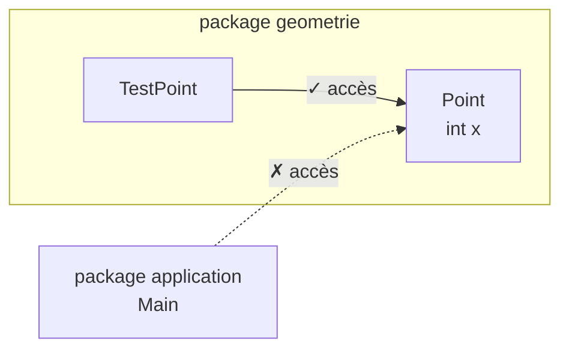

# Contrôle d'accès et packages

<div class="mt-3 text-lg">

Nous connaissons déjà <code>private</code> et <code>public</code>.

Avec les packages, un nouveau niveau d'accès devient important.

</div>

<div class="grid grid-cols-3 gap-5 mt-6 text-center">

<div class="border border-gray-200 rounded-lg p-4">

### `private`

Accessible uniquement dans la classe.

</div>

<div class="border border-gray-200 rounded-lg p-4">

### package-private

Accessible dans le même package.

</div>

<div class="border border-gray-200 rounded-lg p-4">

### `public`

Accessible depuis les autres packages.

</div>

</div>

<div class="border-t border-gray-200 mt-6 pt-4 text-center font-medium">

Le package participe donc au contrôle d'accès.

</div>

---
layout: default
---

# L'accès `package-private`

<div class="mt-3 text-lg">

Lorsqu'aucun modificateur d'accès n'est écrit, Java utilise l'accès <strong>package-private</strong>.

</div>

<div class="grid grid-cols-2 gap-8 mt-5 items-center">

<div>

```java
package geometrie;

public class Point {
    int x;
    int y;
}
```

</div>

<div class="border border-gray-200 rounded-lg p-5 text-center">

<code>x</code> et <code>y</code>

<div class="my-3">↓</div>

Accessibles aux classes du package <code>geometrie</code>

</div>

</div>

<div class="border-t border-gray-200 mt-5 pt-4 text-center font-medium">

Aucun mot-clé n'est utilisé pour déclarer un membre <em>package-private</em>.

</div>

---
layout: default
---

# Même package ou autre package ?

<div class="mt-3 text-lg">

La visibilité <em>package-private</em> dépend de l'emplacement de la classe qui utilise le membre.

</div>

<div class="flex justify-center mt-6">



</div>

<div class="border-t border-gray-200 mt-6 pt-4 text-center font-medium">

Le package constitue une frontière d'accès.

</div>

---
layout: default
---

# Exemple avec `Point`

<div class="mt-3 text-lg">

Une même classe peut utiliser plusieurs niveaux de visibilité.

</div>

<div class="grid grid-cols-2 gap-8 mt-5 items-center">

<div>

```java
package geometrie;

public class Point {

    private int x;
    int y;

    public void deplacer(int dx, int dy) {
        x += dx;
        y += dy;
    }
}
```

</div>

<div class="space-y-4 text-center">

<div class="border border-gray-200 rounded-lg p-3">

<code>x</code>

<div class="text-sm text-gray-500 mt-1">
<code>private</code>
</div>

</div>

<div class="border border-gray-200 rounded-lg p-3">

<code>y</code>

<div class="text-sm text-gray-500 mt-1">
package-private
</div>

</div>

<div class="border border-gray-200 rounded-lg p-3">

<code>deplacer()</code>

<div class="text-sm text-gray-500 mt-1">
<code>public</code>
</div>

</div>

</div>

</div>

---
layout: default
---

# Accès depuis le même package

<div class="mt-3 text-lg">

Une autre classe du package <code>geometrie</code> utilise <code>Point</code>.

</div>

<div class="grid grid-cols-2 gap-8 mt-5 items-center">

<div>

```java
package geometrie;

public class TestPoint {

    void tester(Point p) {
        p.x = 10;
        p.y = 20;
        p.deplacer(1, 2);
    }
}
```

</div>

<div class="space-y-3 text-center">

<div class="border border-gray-200 rounded-lg p-3">

<code>p.x</code> → ✗

</div>

<div class="border border-gray-200 rounded-lg p-3">

<code>p.y</code> → ✓

</div>

<div class="border border-gray-200 rounded-lg p-3">

<code>p.deplacer(...)</code> → ✓

</div>

</div>

</div>

<div class="border-t border-gray-200 mt-5 pt-4 text-center font-medium">

Dans le même package, <em>package-private</em> et <code>public</code> sont accessibles.

</div>

---
layout: default
---

# Accès depuis un autre package

<div class="mt-3 text-lg">

Depuis <code>application</code>, les règles changent.

</div>

<div class="grid grid-cols-2 gap-8 mt-5 items-center">

<div>

```java
package application;

import geometrie.Point;

public class Main {

    public static void main(String[] args) {
        Point p = new Point(3, 5);

        p.x = 10;
        p.y = 20;
        p.deplacer(1, 2);
    }
}
```

</div>

<div class="space-y-3 text-center">

<div class="border border-gray-200 rounded-lg p-3">

<code>p.x</code> → ✗

</div>

<div class="border border-gray-200 rounded-lg p-3">

<code>p.y</code> → ✗

</div>

<div class="border border-gray-200 rounded-lg p-3">

<code>p.deplacer(...)</code> → ✓

</div>

</div>

</div>

<div class="border-t border-gray-200 mt-4 pt-3 text-center font-medium">

Depuis un autre package, seul le membre <code>public</code> est accessible ici.

</div>

---
layout: default
---

# `import` ne change pas la visibilité

<div class="mt-3 text-lg">

L'instruction <code>import</code> permet d'utiliser le nom simple d'une classe.

</div>

<div class="grid grid-cols-2 gap-8 mt-6 text-center">

<div class="border border-gray-200 rounded-lg p-4">

### Sans `import`

```java
geometrie.Point p =
    new geometrie.Point(3, 5);
```

</div>

<div class="border border-gray-200 rounded-lg p-4">

### Avec `import`

```java
import geometrie.Point;

Point p = new Point(3, 5);
```

</div>

</div>

<div v-click class="border-t border-gray-200 mt-6 pt-4 text-center font-medium">

<code>import</code> simplifie le nom utilisé, mais ne donne aucun droit d'accès supplémentaire.

</div>

---
layout: default
---

# La visibilité concerne aussi les classes

<div class="mt-3 text-lg">

Une classe elle-même peut être <code>public</code> ou <em>package-private</em>.

</div>

<div class="grid grid-cols-2 gap-8 mt-5">

<div class="border border-gray-200 rounded-lg p-4">

### Classe `public`

```java
package geometrie;

public class Point {
    // ...
}
```

<div class="text-sm text-gray-500 mt-3 text-center">

Peut être utilisée depuis un autre package.

</div>

</div>

<div class="border border-gray-200 rounded-lg p-4">

### Classe package-private

```java
package geometrie;

class Point {
    // ...
}
```

<div class="text-sm text-gray-500 mt-3 text-center">

Accessible uniquement dans <code>geometrie</code>.

</div>

</div>

</div>

<div class="border-t border-gray-200 mt-5 pt-4 text-center font-medium">

Pour utiliser <code>Point</code> depuis <code>application</code>, la classe doit être <code>public</code>.

</div>

---
layout: default
---

# Comparaison des accès

<div class="mt-6">

| Visibilité | Même classe | Même package | Autre package |
|---|:---:|:---:|:---:|
| `private` | ✓ | ✗ | ✗ |
| *package-private* | ✓ | ✓ | ✗ |
| `public` | ✓ | ✓ | ✓ |

</div>

<div class="mt-7 text-center text-gray-500">

<em>package-private</em> correspond à l'absence de modificateur.

</div>

<div class="border-t border-gray-200 mt-6 pt-4 text-center font-medium">

La visibilité détermine depuis quelles parties du programme un membre peut être utilisé.

</div>

---
layout: default
---

# À retenir : visibilité et packages

<div class="grid grid-cols-3 gap-5 mt-7 text-center">

<div class="border border-gray-200 rounded-lg p-4">

### 🔒 `private`

Même classe

</div>

<div class="border border-gray-200 rounded-lg p-4">

### 📦 package-private

Même package

</div>

<div class="border border-gray-200 rounded-lg p-4">

### 🌐 `public`

Tous les packages

</div>

</div>

<div class="border border-gray-200 rounded-lg p-4 mt-5 text-center">

<code>import</code> permet de désigner une classe, mais ne modifie pas sa visibilité.

</div>

<div class="border-t border-gray-200 mt-5 pt-4 text-center font-medium">

Les packages organisent les classes et participent aussi au contrôle d'accès.

</div>