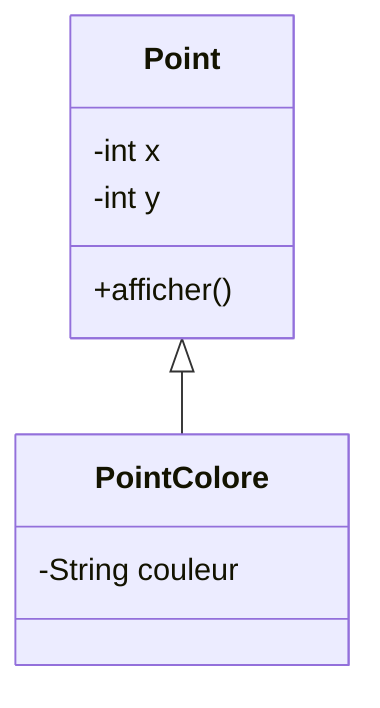
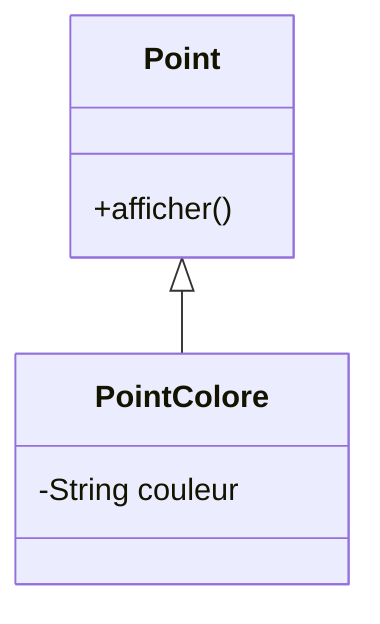
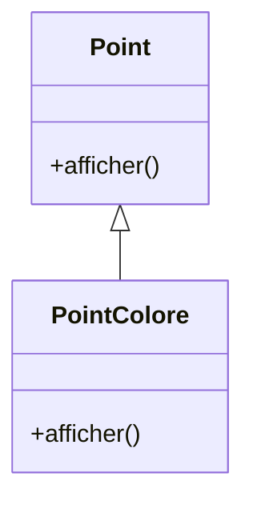
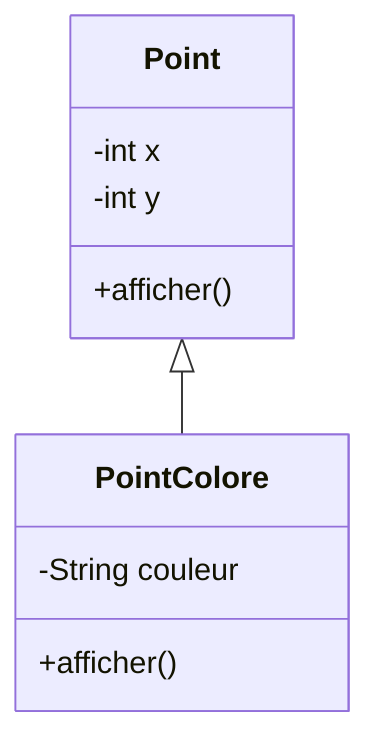
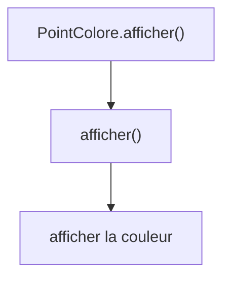
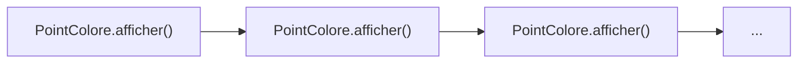
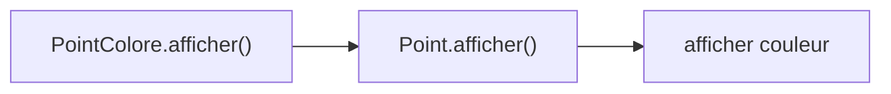
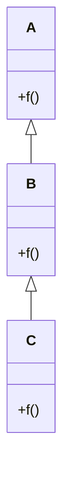
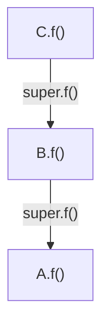

# Afficher un `PointColore`

<div class="grid grid-cols-[1fr_1fr] gap-10 mt-6 items-center">

<div>

Notre classe `Point` sait déjà afficher ses coordonnées.

```java
public class Point {
    private int x;
    private int y;

    public void afficher() {
        System.out.println(
            x + " " + y
        );
    }
}
```

<div v-click class="mt-5">

Mais un `PointColore` possède aussi une couleur.

</div>

</div>

<div>



</div>

</div>

<div v-click class="border-t border-gray-200 mt-5 pt-3 text-center font-medium">

La méthode héritée `afficher()` ne connaît pas la couleur.

</div>

---
layout: default
---

# La méthode héritée suffit-elle ?

<div class="grid grid-cols-[1.05fr_0.95fr] gap-10 mt-7 items-center">

<div>

```java
PointColore p =
    new PointColore(...);

p.afficher();
```

<div v-click class="mt-6">

La méthode utilisée est celle définie dans `Point`.

```text
2 5
```

</div>

<div v-click class="mt-5">

Nous voudrions plutôt obtenir :

```text
2 5 rouge
```

</div>

</div>

<div>



</div>

</div>

<div v-click class="border-t border-gray-200 mt-5 pt-3 text-center font-medium">

Comment adapter un comportement hérité dans la classe dérivée ?

</div>

---
layout: default
---

# Modifier un comportement hérité

Une classe dérivée peut définir une méthode ayant les mêmes caractéristiques qu'une méthode de sa classe de base.

<div class="grid grid-cols-2 gap-10 mt-7">

<div>

### Dans `Point`

```java
public void afficher() {
    System.out.println(
        x + " " + y
    );
}
```

</div>

<div v-click>

### Dans `PointColore`

```java
public void afficher() {
    // nouvel affichage
}
```

</div>

</div>

<div v-click class="flex justify-center mt-7">



</div>

<div v-click class="border-t border-gray-200 mt-5 pt-3 text-center font-medium">

On parle de **redéfinition** d'une méthode héritée.

</div>

---
layout: default
---

# La redéfinition d'une méthode

<div class="grid grid-cols-[0.9fr_1.1fr] gap-10 mt-7 items-center">

<div>


</div>

<div>

La classe de base possède :

```java
public void afficher()
```

<div v-click class="mt-5">

La classe dérivée définit à son tour :

```java
public void afficher()
```

</div>

<div v-click class="mt-5">

La nouvelle méthode adapte le comportement à la classe dérivée.

</div>

</div>

</div>

<div v-click class="border-t border-gray-200 mt-5 pt-3 text-center font-medium">

Une méthode héritée peut être redéfinie pour tenir compte des caractéristiques de la classe dérivée.

</div>

---
layout: default
---

# Redéfinir `afficher()`

<div class="grid grid-cols-[1.15fr_0.85fr] gap-10 mt-6 items-center">

<div>

Une première tentative pourrait être :

```java
public class PointColore extends Point {
    private String couleur;

    public void afficher() {
        System.out.println(
            x + " " + y + " " + couleur
        );
    }
}
```

<div v-click class="mt-5 border border-gray-200 rounded-lg px-5 py-4">

Mais `x` et `y` sont `private` dans `Point`.

```java
x // ✗
y // ✗
```

</div>

</div>

<div>



</div>

</div>

<div v-click class="border-t border-gray-200 mt-5 pt-3 text-center font-medium">

Il faut réutiliser le comportement déjà défini dans `Point`.

</div>

---
layout: default
---

# Réutiliser la méthode de la classe de base

Nous pourrions vouloir écrire :

<div class="grid grid-cols-[1.05fr_0.95fr] gap-10 mt-7 items-center">

<div>

```java
public void afficher() {
    afficher();
    System.out.println(couleur);
}
```

<div v-click class="mt-6">

L'intention est :

1. afficher les coordonnées
2. afficher la couleur

</div>

</div>

<div>



</div>

</div>

<div v-click class="border-t border-gray-200 mt-5 pt-3 text-center font-medium">

Mais quelle méthode `afficher()` est appelée ici ?

</div>

---
layout: default
---

# Un appel récursif involontaire

Dans `PointColore.afficher()` :

```java
public void afficher() {
    afficher();
    System.out.println(couleur);
}
```

<div class="grid grid-cols-[0.85fr_1.15fr] gap-10 mt-6 items-center">

<div v-click>

L'appel :

```java
afficher();
```

désigne la méthode courante de `PointColore`.

</div>

<div v-click>



</div>

</div>

<div v-click class="border-t border-gray-200 mt-5 pt-3 text-center font-medium">

La méthode s'appelle elle-même indéfiniment : c'est une récursion involontaire.

</div>

---
layout: default
---

# Appeler la méthode de la classe de base

Pour désigner explicitement la méthode de la super-classe, on utilise :

```java
super.afficher();
```

<div class="grid grid-cols-[1.1fr_0.9fr] gap-10 mt-6 items-center">

<div>

```java
public class PointColore extends Point {
    private String couleur;

    public void afficher() {
        super.afficher();
        System.out.println(couleur);
    }
}
```

<div v-click class="mt-5">

`super.afficher()` exécute la méthode définie dans `Point`.

</div>

</div>

<div>


</div>

</div>

<div v-click class="border-t border-gray-200 mt-5 pt-3 text-center font-medium">

`super.methode()` permet de réutiliser la version définie dans la super-classe directe.

</div>

---
layout: default
---

# Compléter plutôt que réécrire

<div class="grid grid-cols-2 gap-10 mt-7">

<div class="border border-gray-200 rounded-lg p-5">

### Comportement de `Point`

```java
public void afficher() {
    System.out.println(
        x + " " + y
    );
}
```

Affiche les coordonnées.

</div>

<div class="border border-gray-200 rounded-lg p-5">

### Comportement de `PointColore`

```java
public void afficher() {
    super.afficher();
    System.out.println(couleur);
}
```

Réutilise l'affichage du point puis ajoute la couleur.

</div>

</div>

<div v-click class="flex justify-center mt-6">



</div>

<div v-click class="border-t border-gray-200 mt-5 pt-3 text-center font-medium">

Une redéfinition peut réutiliser le comportement hérité et simplement le compléter.

</div>

---
layout: default
---

# Redéfinition sur plusieurs niveaux

<div class="grid grid-cols-[0.9fr_1.1fr] gap-10 mt-7 items-center">

<div>



</div>

<div>

Chaque niveau peut redéfinir la même méthode.

```java
class A {
    public void f() {
        // version A
    }
}
```

```java
class B extends A {
    public void f() {
        // version B
    }
}
```

```java
class C extends B {
    public void f() {
        // version C
    }
}
```

</div>

</div>

<div v-click class="border-t border-gray-200 mt-5 pt-3 text-center font-medium">

Une même méthode peut être redéfinie successivement dans une hiérarchie.

</div>

---
layout: default
---

# `super` dans une redéfinition successive

<div class="grid grid-cols-[1.05fr_0.95fr] gap-10 mt-6 items-center">

<div>

```java
class B extends A {
    public void f() {
        super.f();
        // traitement B
    }
}

class C extends B {
    public void f() {
        super.f();
        // traitement C
    }
}
```

<div v-click class="mt-5">

Dans `C` :

```java
super.f();
```

appelle la version définie dans `B`.

</div>

</div>

<div>



</div>

</div>

<div v-click class="border-t border-gray-200 mt-5 pt-3 text-center font-medium">

Comme pour les constructeurs, `super` désigne la super-classe directe.

</div>

---
layout: default
---

# Quelle version est appelée avec `super` ?

<div class="grid grid-cols-[0.8fr_1.2fr] gap-10 mt-7 items-center">

<div>

Pour la hiérarchie :


</div>

<div>

Dans la classe `C` :

```java
super.f();
```

<div v-click class="mt-6">

appelle :

```text
B.f()
```

et non directement :

```text
A.f()
```

</div>

</div>

</div>

<div v-click class="border-t border-gray-200 mt-5 pt-3 text-center font-medium">

`super` permet de sélectionner explicitement la version de la super-classe directe.

</div>

---
layout: default
---

# Adapter un comportement hérité

<div class="grid grid-cols-[0.9fr_1.1fr] gap-10 mt-7 items-center">

<div>


</div>

<div>

### À retenir

- une méthode héritée peut ne plus être adaptée
- la classe dérivée peut la **redéfinir**
- la nouvelle version adapte le comportement
- un appel direct à la même méthode peut provoquer une récursion
- `super.methode()` appelle la version de la super-classe directe
- une méthode peut être redéfinie sur plusieurs niveaux

</div>

</div>

<div v-click class="border-t border-gray-200 mt-6 pt-3 text-center font-medium">

La redéfinition permet de **spécialiser un comportement hérité**.

</div>