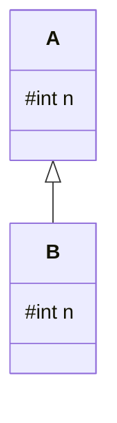
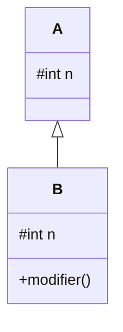

# Peut-on redéclarer un attribut hérité ?

<div class="grid grid-cols-[1fr_1fr] gap-10 mt-7 items-center">

<div>

Considérons une classe `A` qui possède un attribut `n`.

```java
class A {
    protected int n;
}
```

<div v-click class="mt-6">

Une classe dérivée peut-elle déclarer à son tour un attribut du même nom ?

```java
class B extends A {
    protected int n;
}
```

</div>

</div>

<div>



</div>

</div>

<div v-click class="border-t border-gray-200 mt-5 pt-3 text-center font-medium">

Oui. Une classe dérivée peut déclarer un attribut portant le même nom qu'un attribut hérité.

</div>

---
layout: default
---

# Deux attributs de même nom

<div class="grid grid-cols-[0.9fr_1.1fr] gap-10 mt-7 items-center">

<div>


</div>

<div>

La déclaration de `n` dans `B` ne remplace pas celle de `A`.

<div v-click class="mt-6">

Un objet de type `B` possède donc **deux attributs distincts** :

```text
A.n
B.n
```

</div>

<div v-click class="mt-5">

Ils portent le même nom, mais correspondent à deux attributs différents.

</div>

</div>

</div>

<div v-click class="border-t border-gray-200 mt-5 pt-3 text-center font-medium">

Le nouvel attribut s'ajoute à l'attribut hérité : l'ancien attribut existe toujours.

</div>

---
layout: default
---

# Quel attribut désigne `n` ?

<div class="grid grid-cols-[1.1fr_0.9fr] gap-10 mt-6 items-center">

<div>

Dans une méthode de `B` :

```java
class B extends A {
    protected int n;

    public void modifier() {
        n = 10;
    }
}
```

<div v-click class="mt-5">

L'expression :

```java
n
```

désigne l'attribut déclaré dans `B`.

</div>

</div>

<div>



</div>

</div>

<div v-click class="border-t border-gray-200 mt-5 pt-3 text-center font-medium">

L'attribut déclaré dans la classe dérivée masque celui de la classe de base.

</div>

---
layout: default
---

# L'attribut de la classe de base existe toujours

<div class="grid grid-cols-[0.85fr_1.15fr] gap-10 mt-7 items-center">

<div>


</div>

<div>

Dans `B`, écrire simplement :

```java
n
```

désigne l'attribut de `B`.

<div v-click class="mt-6">

Mais l'attribut `n` défini dans `A` n'a pas disparu.

<div class="mt-4 border border-gray-200 rounded-lg px-5 py-4 text-center">

Comment accéder explicitement au `n` de la classe de base ?

</div>

</div>

</div>

</div>

<div v-click class="border-t border-gray-200 mt-5 pt-3 text-center font-medium">

Il faut pouvoir distinguer les deux attributs portant le même nom.

</div>

---
layout: default
---

# Accéder à l'attribut de la classe de base

Pour désigner l'attribut de la super-classe, on utilise `super`.

<div class="grid grid-cols-[1.1fr_0.9fr] gap-10 mt-6 items-center">

<div>

```java
class A {
    protected int n;
}

class B extends A {
    protected int n;

    public void modifier() {
        n = 10;
        super.n = 20;
    }
}
```

<div v-click class="mt-5">

Dans `B` :

```java
n        // attribut de B
super.n  // attribut de A
```

</div>

</div>

<div>


</div>

</div>

<div v-click class="border-t border-gray-200 mt-5 pt-3 text-center font-medium">

`super.attribut` permet de désigner explicitement l'attribut de la super-classe.

</div>

---
layout: default
---

# `this.n` ou `super.n` ?

<div class="grid grid-cols-2 gap-10 mt-7">

<div class="border border-gray-200 rounded-lg p-5">

### `this.n`

```java
this.n = 10;
```

<div class="mt-5">

Désigne l'attribut `n` de l'objet vu depuis la classe courante `B`.

```text
B.n = 10
```

</div>

</div>

<div class="border border-gray-200 rounded-lg p-5">

### `super.n`

```java
super.n = 20;
```

<div class="mt-5">

Désigne l'attribut `n` défini dans la super-classe `A`.

```text
A.n = 20
```

</div>

</div>

</div>

<div v-click class="flex justify-center mt-6">


</div>

<div v-click class="border-t border-gray-200 mt-5 pt-3 text-center font-medium">

`this.n` et `super.n` peuvent donc désigner deux attributs différents.

</div>

---
layout: default
---

# Suivre les deux attributs

<div class="grid grid-cols-[1.15fr_0.85fr] gap-10 mt-6 items-center">

<div>

```java
class A {
    protected int n = 1;
}

class B extends A {
    protected int n = 2;

    public void afficher() {
        System.out.println(n);
        System.out.println(super.n);
    }
}
```

<div v-click class="mt-5">

Que va afficher :

```java
B b = new B();
b.afficher();
```

</div>

</div>

<div>

<div v-click class="border border-gray-200 rounded-lg p-6">

### Résultat

```text
2
1
```

<div class="mt-5">

```java
n
```

→ attribut de `B`

```java
super.n
```

→ attribut de `A`

</div>

</div>

</div>

</div>

<div v-click class="border-t border-gray-200 mt-5 pt-3 text-center font-medium">

Les deux attributs coexistent dans le même objet.

</div>

---
layout: default
---

# Masquer n'est pas redéfinir

<div class="grid grid-cols-2 gap-8 mt-7">

<div class="border border-gray-200 rounded-lg p-5">

### Méthode

```java
class A {
    public void afficher() { }
}

class B extends A {
    public void afficher() { }
}
```

<div class="mt-4 text-center font-medium">

Méthode **redéfinie**

</div>

</div>

<div class="border border-gray-200 rounded-lg p-5">

### Attribut

```java
class A {
    protected int n;
}

class B extends A {
    protected int n;
}
```

<div class="mt-4 text-center font-medium">

Attribut **masqué**

</div>

</div>

</div>

<div v-click class="border-t border-gray-200 mt-6 pt-3 text-center font-medium">

On redéfinit une méthode ; un attribut de même nom masque l'attribut hérité.

</div>

---
layout: default
---

# Éviter le masquage des attributs

<div class="grid grid-cols-[1fr_1fr] gap-10 mt-7 items-center">

<div>

Java autorise :

```java
class A {
    protected int n;
}

class B extends A {
    protected int n;
}
```

<div v-click class="mt-5">

Mais deux attributs de même nom peuvent rendre le code difficile à comprendre :

```java
n
this.n
super.n
```

</div>

</div>

<div class="border border-gray-200 rounded-lg p-6">

### Bonne pratique

Éviter de déclarer dans une classe dérivée un attribut portant le même nom qu'un attribut hérité.

<div v-click class="mt-6">

Préférer des noms qui expriment clairement le rôle de chaque attribut.

</div>

</div>

</div>

<div v-click class="border-t border-gray-200 mt-5 pt-3 text-center font-medium">

Le masquage est possible, mais il peut nuire à la lisibilité du code.

</div>

---
layout: default
---

# Deux attributs de même nom

<div class="grid grid-cols-[0.9fr_1.1fr] gap-10 mt-7 items-center">

<div>


</div>

<div>

### À retenir

- une classe dérivée peut déclarer un attribut de même nom
- le nouvel attribut **ne remplace pas** l'ancien
- les deux attributs coexistent
- l'attribut de la classe dérivée **masque** celui de la classe de base
- `this.n` désigne celui de la classe courante
- `super.n` permet d'accéder à celui de la super-classe

</div>

</div>

<div v-click class="border-t border-gray-200 mt-6 pt-3 text-center font-medium">

Deux attributs peuvent porter le même nom, mais ils restent deux attributs distincts.

</div>