# Rappel : initialisation d'un objet

<div class="grid grid-cols-[1.05fr_0.95fr] gap-10 mt-6 items-center">

<div>

Pour une classe simple, l'initialisation suit cet ordre :

1. initialisation implicite
2. initialisation explicite
3. exécution du constructeur

<div v-click class="mt-6">

```java
public class A {
    private int n = 10;
    private int p;

    public A() {
        // ...
    }
}
```

</div>

</div>

<div>

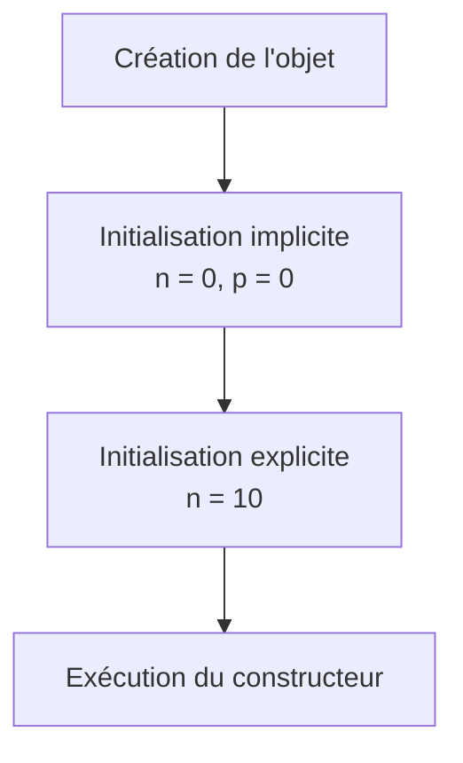

</div>

</div>

<div v-click class="border-t border-gray-200 mt-5 pt-3 text-center font-medium">

Les champs reçoivent d'abord leur valeur par défaut, puis leur éventuelle valeur explicite.

</div>

---
layout: default
---

# Initialisation implicite

<div class="grid grid-cols-[1.1fr_0.9fr] gap-10 mt-7 items-center">

<div>

Lors de la création de l'objet :

```java
A a = new A();
```

les attributs sont d'abord initialisés avec leur valeur par défaut.

```java
private int n = 10;
private int p;
```

<div v-click class="mt-5">

Avant toute initialisation explicite :

```text
n = 0
p = 0
```

</div>

</div>

<div>

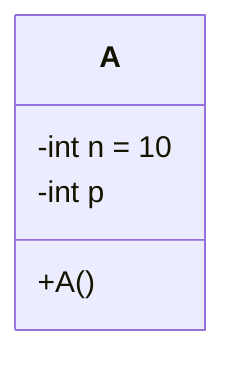

</div>

</div>

<div v-click class="border-t border-gray-200 mt-5 pt-3 text-center font-medium">

L'initialisation implicite intervient avant toute autre initialisation.

</div>

---
layout: default
---

# Initialisation explicite

<div class="grid grid-cols-[1.05fr_0.95fr] gap-10 mt-7 items-center">

<div>

Après l'initialisation implicite, les initialisations écrites dans les déclarations sont appliquées.

```java
private int n = 10;
private int p;
```

<div v-click class="mt-5">

On obtient alors :

```text
n = 10
p = 0
```

</div>

</div>

<div>

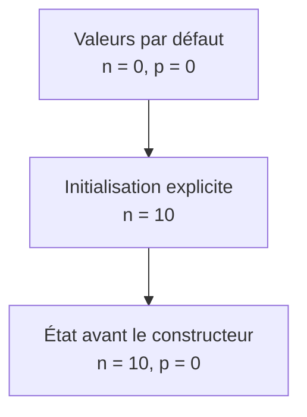

</div>

</div>

<div v-click class="border-t border-gray-200 mt-5 pt-3 text-center font-medium">

Une initialisation explicite remplace la valeur par défaut du champ concerné.

</div>

---
layout: default
---

# Puis le constructeur s'exécute

<div class="grid grid-cols-2 gap-10 mt-7 items-center">

<div>

```java
public class A {
    private int n = 10;
    private int p;

    public A() {
        p = 5;
    }
}
```

<div v-click class="mt-5">

Juste avant le constructeur :

```text
n = 10
p = 0
```

</div>

<div v-click class="mt-4">

Après le constructeur :

```text
n = 10
p = 5
```

</div>

</div>

<div>

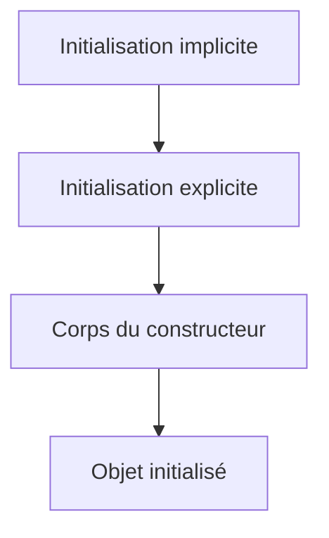

</div>

</div>

<div v-click class="border-t border-gray-200 mt-5 pt-3 text-center font-medium">

Le corps du constructeur intervient après les initialisations des champs.

</div>

---
layout: default
---

# Et pour un objet dérivé ?

<div class="grid grid-cols-[0.9fr_1.1fr] gap-10 mt-7 items-center">

<div>

Considérons :

```java
public class B extends A {
    private int q = 20;

    public B() {
        // ...
    }
}
```

<div v-click class="mt-5">

La création de :

```java
B b = new B();
```

doit initialiser :

- la partie héritée de `A`
- la partie propre à `B`

</div>

</div>

<div>

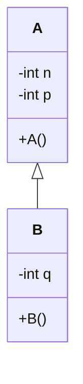

</div>

</div>

<div v-click class="border-t border-gray-200 mt-5 pt-3 text-center font-medium">

L'objet dérivé doit initialiser successivement sa partie de base puis sa partie spécifique.

</div>

---
layout: default
---

# Étape 1 — Allocation de l'objet

<div class="grid grid-cols-[1fr_1fr] gap-10 mt-7 items-center">

<div>

Lors de :

```java
B b = new B();
```

Java commence par réserver la mémoire nécessaire à un objet de type `B`.

<div v-click class="mt-6">

Cet objet contient :

- les champs hérités de `A`
- les champs propres à `B`

</div>

</div>

<div>

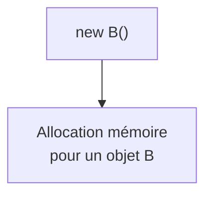

</div>

</div>

<div v-click class="border-t border-gray-200 mt-5 pt-3 text-center font-medium">

L'ensemble de l'objet est alloué avant le début de son initialisation.

</div>

---
layout: default
---

# Étape 2 — Valeurs par défaut

<div class="grid grid-cols-[1.05fr_0.95fr] gap-10 mt-7 items-center">

<div>

Tous les champs de l'objet reçoivent d'abord leur valeur par défaut.

```java
class A {
    private int n = 10;
}

class B extends A {
    private int q = 20;
}
```

<div v-click class="mt-5">

Avant les initialisations explicites :

```text
n = 0
q = 0
```

</div>

</div>

<div>

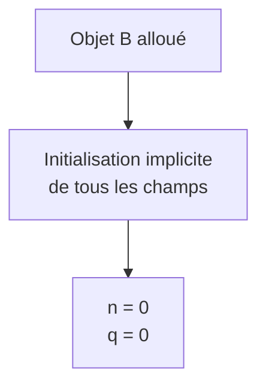

</div>

</div>

<div v-click class="border-t border-gray-200 mt-5 pt-3 text-center font-medium">

L'initialisation implicite concerne tous les champs de l'objet dérivé.

</div>

---
layout: default
---

# Étape 3 — Initialiser la partie héritée

<div class="grid grid-cols-[1fr_1fr] gap-10 mt-6 items-center">

<div>

Les champs hérités sont ensuite initialisés selon les règles de la classe de base.

```java
public class A {
    private int n = 10;

    public A() {
        // ...
    }
}
```

<div v-click class="mt-5">

Ordre pour la partie `A` :

1. initialisation explicite de `n`
2. exécution du constructeur `A()`

</div>

</div>

<div>

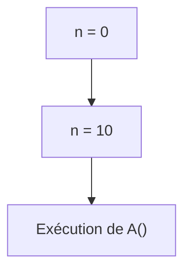

</div>

</div>

<div v-click class="border-t border-gray-200 mt-5 pt-3 text-center font-medium">

La partie héritée est initialisée avant la partie propre à la classe dérivée.

</div>

---
layout: default
---

# Étape 4 — Initialiser la partie dérivée

<div class="grid grid-cols-[1fr_1fr] gap-10 mt-6 items-center">

<div>

Une fois la partie `A` initialisée, Java initialise les champs propres à `B`.

```java
public class B extends A {
    private int q = 20;

    public B() {
        // ...
    }
}
```

<div v-click class="mt-5">

Ordre pour la partie `B` :

1. initialisation explicite de `q`
2. exécution du constructeur `B()`

</div>

</div>

<div>

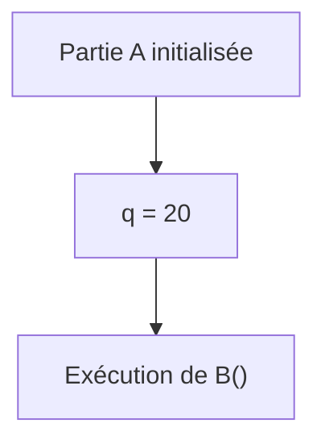

</div>

</div>

<div v-click class="border-t border-gray-200 mt-5 pt-3 text-center font-medium">

La partie spécifique est initialisée après la partie héritée.

</div>

---
layout: default
---

# Ordre complet d'initialisation

<div class="flex justify-center mt-6">

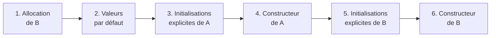

</div>

<div class="grid grid-cols-2 gap-8 mt-7">

<div class="border border-gray-200 rounded-lg px-5 py-4">

### Partie héritée

- initialisations explicites de `A`
- constructeur de `A`

</div>

<div class="border border-gray-200 rounded-lg px-5 py-4">

### Partie spécifique

- initialisations explicites de `B`
- constructeur de `B`

</div>

</div>

<div v-click class="border-t border-gray-200 mt-5 pt-3 text-center font-medium">

La partie de base est entièrement initialisée avant la partie dérivée.

</div>

---
layout: default
---

# Suivre l'initialisation pas à pas

<div class="grid grid-cols-[1.15fr_0.85fr] gap-10 mt-5 items-center">

<div>

```java
class A {
    private int n = initialiserN();

    public A() {
        System.out.println("constructeur A");
    }

    private int initialiserN() {
        System.out.println("initialisation n");
        return 10;
    }
}
```

```java
class B extends A {
    private int q = initialiserQ();

    public B() {
        System.out.println("constructeur B");
    }

    private int initialiserQ() {
        System.out.println("initialisation q");
        return 20;
    }
}
```

</div>

<div>

<div class="font-medium mb-4">

Quel sera l'ordre d'affichage ?

</div>

<div v-click>

```text
initialisation n
constructeur A
initialisation q
constructeur B
```

</div>

</div>

</div>

<div v-click class="border-t border-gray-200 mt-4 pt-3 text-center font-medium">

L'ordre observé correspond à l'ordre d'initialisation de la hiérarchie.

</div>

---
layout: default
---

# Comprendre l'initialisation

<div class="grid grid-cols-[0.95fr_1.05fr] gap-10 mt-7 items-center">

<div>

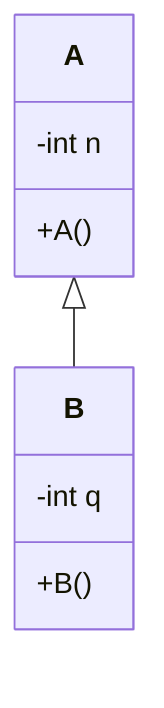

</div>

<div>

### À retenir

1. mémoire allouée pour l'objet complet
2. initialisation implicite de tous les champs
3. initialisations explicites de la classe de base
4. constructeur de la classe de base
5. initialisations explicites de la classe dérivée
6. constructeur de la classe dérivée

</div>

</div>

<div v-click class="border-t border-gray-200 mt-6 pt-3 text-center font-medium">

Lors de la création d'un objet dérivé, la partie héritée est initialisée avant la partie spécifique.

</div>