# Rappel : notre classe `Point`

<div class="grid grid-cols-[1.15fr_0.85fr] gap-10 mt-5 items-center">

<div>

```java
public class Point {
    private int x;
    private int y;

    public void deplacer(int dx, int dy) {
        x += dx;
        y += dy;
    }

    public void afficher() {
        System.out.println(x + " " + y);
    }
}
```

</div>

<div>

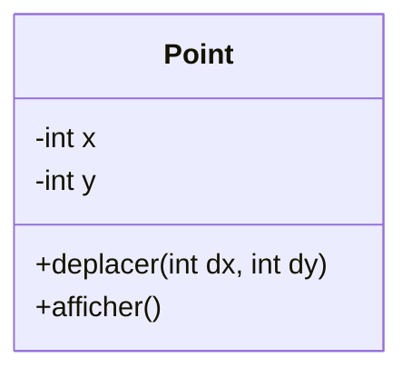

</div>

</div>

<div class="border-t border-gray-200 mt-4 pt-3 text-center font-medium">

Un `Point` possède un **état** et des **comportements**.

</div>

---
layout: default
---

# Des points avec une couleur

<div class="grid grid-cols-2 gap-10 mt-6 items-center">

<div>

Nous voulons maintenant manipuler des **points colorés**.

<div class="mt-5">

Un point coloré possède :

- des coordonnées `x` et `y`
- une couleur
- les comportements d'un point
- un comportement permettant de changer sa couleur

</div>

</div>

<div>

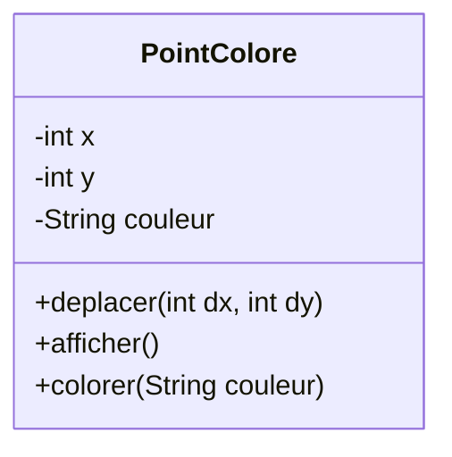

</div>

</div>

<div v-click class="border-t border-gray-200 mt-5 pt-3 text-center font-medium">

Comment définir `PointColore` sans repartir de zéro ?

</div>

---
layout: default
---

# Créer une classe `PointColore`

<div class="grid grid-cols-[1.25fr_0.75fr] gap-10 mt-5 items-center">

<div>

Une première solution consiste à créer une classe indépendante.

```java
public class PointColore {
    private int x;
    private int y;
    private String couleur;

    public void deplacer(int dx, int dy) {
        x += dx;
        y += dy;
    }

    public void colorer(String couleur) {
        this.couleur = couleur;
    }
}
```

</div>

<div>

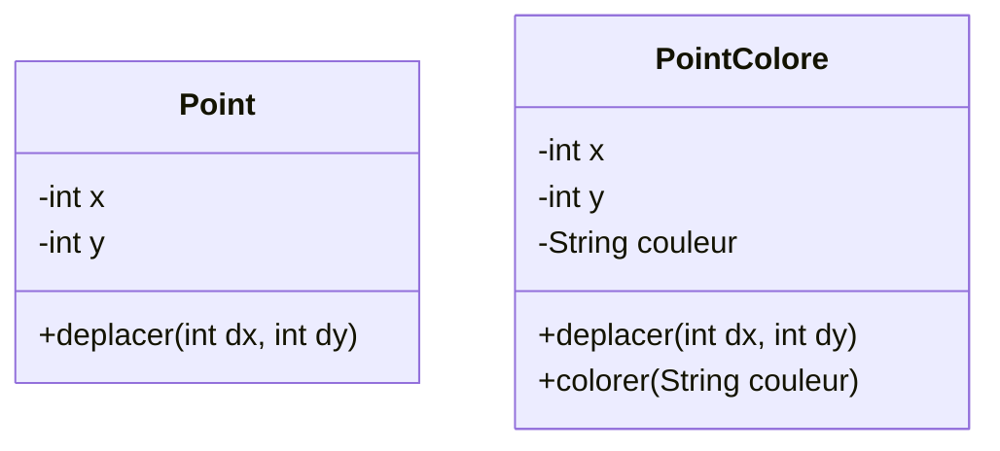

</div>

</div>

<div v-click class="border-t border-gray-200 mt-4 pt-3 text-center font-medium">

Cette solution fonctionne, mais une partie du code est dupliquée.

</div>

---
layout: default
---

# Beaucoup de choses en commun

<div class="grid grid-cols-[0.95fr_1.05fr] gap-10 mt-6 items-center">

<div>

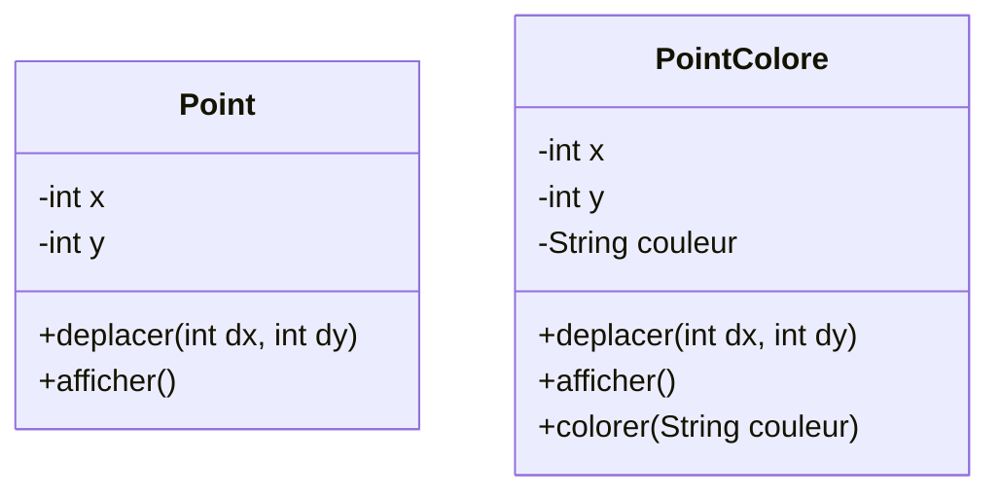

</div>

<div>

### Éléments communs

- `x`
- `y`
- `deplacer(...)`
- `afficher()`

<div v-click class="mt-5">

### Éléments spécifiques

- `couleur`
- `colorer(...)`

</div>

</div>

</div>

<div v-click class="border-t border-gray-200 mt-4 pt-3 text-center font-medium">

`PointColore` est essentiellement un `Point` auquel on ajoute une couleur.

</div>

---
layout: default
---

# Éviter de tout redéfinir

<div class="grid grid-cols-2 gap-12 mt-8 items-center">

<div>

Nous aimerions **conserver ce qui existe déjà** dans `Point` :

```text
x
y
deplacer(...)
afficher()
```

</div>

<div>

Et définir uniquement ce qui est propre à `PointColore` :

```text
couleur
colorer(...)
```

</div>

</div>

<div v-click class="flex justify-center mt-8">

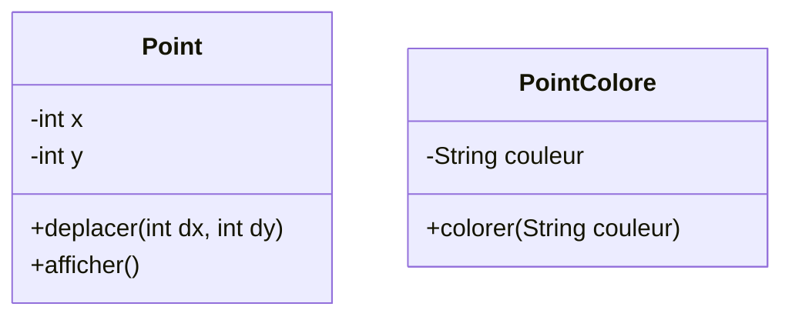

</div>

<div v-click class="border-t border-gray-200 mt-5 pt-3 text-center font-medium">

Il nous faut un mécanisme permettant de **réutiliser et spécialiser** une classe existante.

</div>

---
layout: default
---

# La notion d'héritage

<div class="grid grid-cols-[0.85fr_1.15fr] gap-12 mt-7 items-center">

<div>

L'**héritage** permet de définir une nouvelle classe à partir d'une classe existante.

<div v-click class="mt-6">

`PointColore` :

- récupère les caractéristiques de `Point`
- ajoute ses propres caractéristiques

</div>

</div>

<div class="flex justify-center">

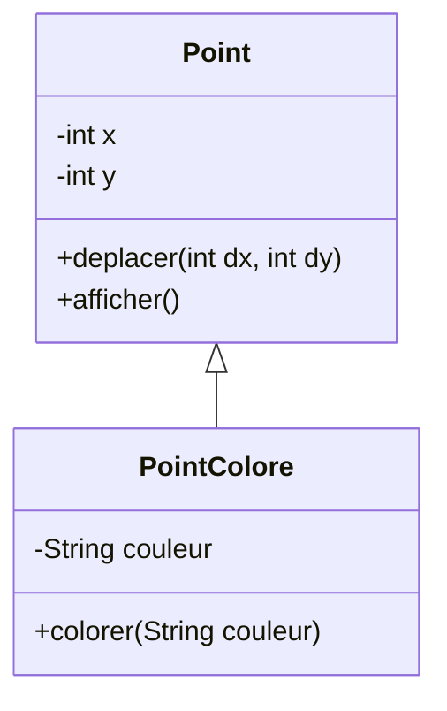

</div>

</div>

<div v-click class="border-t border-gray-200 mt-5 pt-3 text-center font-medium">

`PointColore` **hérite de** `Point`.

</div>

---
layout: default
---

# Le mot-clé `extends`

<div class="grid grid-cols-[1.25fr_0.75fr] gap-10 mt-5 items-center">

<div>

```java
public class Point {
    private int x;
    private int y;

    public void deplacer(int dx, int dy) {
        x += dx;
        y += dy;
    }
}
```

```java
public class PointColore extends Point {
    private String couleur;

    public void colorer(String couleur) {
        this.couleur = couleur;
    }
}
```

</div>

<div>

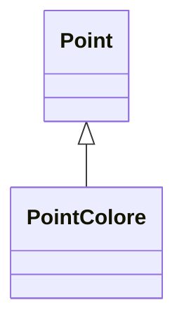

<div v-click class="mt-6 text-center">

```java
PointColore extends Point
```

</div>

</div>

</div>

<div v-click class="border-t border-gray-200 mt-4 pt-3 text-center font-medium">

`extends` indique que `PointColore` dérive de `Point`.

</div>

---
layout: default
---

# `PointColore` hérite de `Point`

<div class="grid grid-cols-[1fr_0.9fr] gap-12 mt-7 items-center">

<div class="flex justify-center">


</div>

<div>

### `PointColore` bénéficie de

`deplacer(...)`  
`afficher()`

<div v-click class="mt-6">

### `PointColore` ajoute

`couleur`  
`colorer(...)`

</div>

</div>

</div>

<div v-click class="border-t border-gray-200 mt-5 pt-3 text-center font-medium">

Une classe dérivée **hérite** de caractéristiques existantes et peut en **ajouter** de nouvelles.

</div>

---
layout: default
---

# Utiliser un `PointColore`

<div class="grid grid-cols-[1.1fr_0.9fr] gap-12 mt-7 items-center">

<div>

```java
PointColore p = new PointColore();

p.colorer("rouge");
p.deplacer(2, 3);
p.afficher();
```

<div v-click class="mt-6">

`colorer(...)` est définie dans `PointColore`.

`deplacer(...)` et `afficher()` sont définies dans `Point`.

</div>

</div>

<div class="flex justify-center">

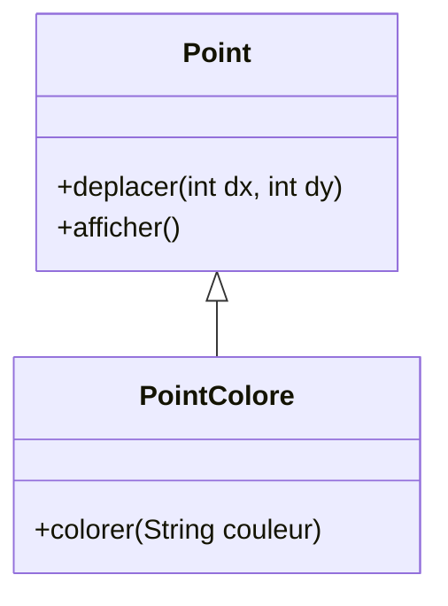

</div>

</div>

<div v-click class="border-t border-gray-200 mt-5 pt-3 text-center font-medium">

Un objet dérivé peut utiliser les **méthodes accessibles héritées** de sa classe de base.

</div>

---
layout: default
---

# Les méthodes héritées

<div class="grid grid-cols-[1.15fr_0.85fr] gap-12 mt-7 items-center">

<div>

`PointColore` ne contient aucune méthode `deplacer`.

```java
public class PointColore extends Point {
    private String couleur;

    public void colorer(String couleur) {
        this.couleur = couleur;
    }
}
```

<div v-click class="mt-5">

Pourtant :

```java
PointColore p = new PointColore();

p.deplacer(2, 3);   // ✓
p.colorer("rouge"); // ✓
```

</div>

</div>

<div>

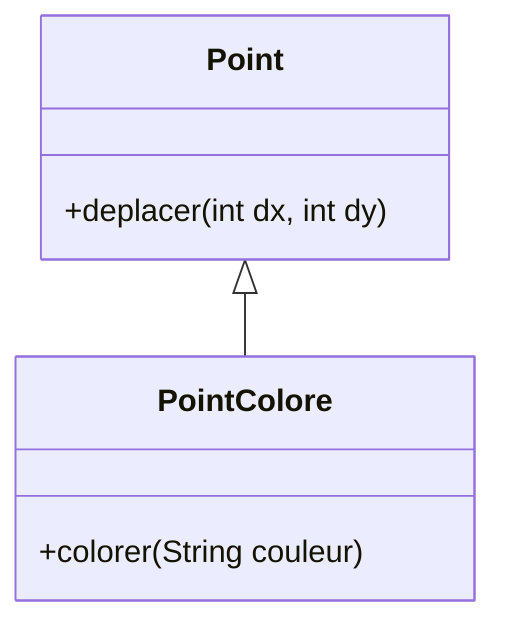

</div>

</div>

<div v-click class="border-t border-gray-200 mt-4 pt-3 text-center font-medium">

Une méthode héritée n'a pas besoin d'être réécrite dans la classe dérivée.

</div>

---
layout: default
---

# Ce qu'apporte une classe dérivée

<div class="grid grid-cols-[0.9fr_1.1fr] gap-12 mt-8 items-center">

<div>

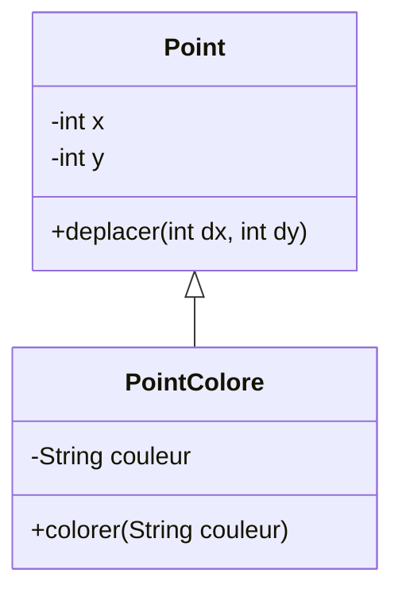

</div>

<div class="grid grid-cols-1 gap-5">

<div class="border border-gray-200 rounded-lg p-5">

### Hériter

Réutiliser les caractéristiques déjà définies dans la classe de base.

</div>

<div v-click class="border border-gray-200 rounded-lg p-5">

### Enrichir

Ajouter les caractéristiques propres à la classe dérivée.

</div>

</div>

</div>

<div v-click class="border-t border-gray-200 mt-5 pt-3 text-center font-medium">

L'héritage permet de construire une classe **plus spécialisée** à partir d'une classe existante.

</div>

---
layout: default
---

# Classe de base et classe dérivée

<div class="grid grid-cols-[0.9fr_1.1fr] gap-12 mt-7 items-center">

<div class="flex justify-center">

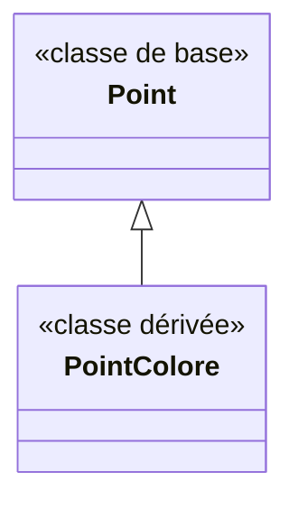

</div>

<div class="grid grid-cols-1 gap-5">

<div class="border border-gray-200 rounded-lg px-6 py-4">

### `Point`

**Classe de base**  
ou **super-classe**

</div>

<div class="border border-gray-200 rounded-lg px-6 py-4">

### `PointColore`

**Classe dérivée**  
ou **sous-classe**

</div>

</div>

</div>

<div v-click class="border-t border-gray-200 mt-5 pt-3 text-center font-medium">

`PointColore` est une **spécialisation** de `Point`.

</div>