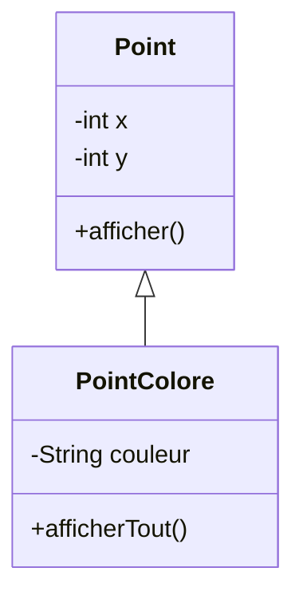
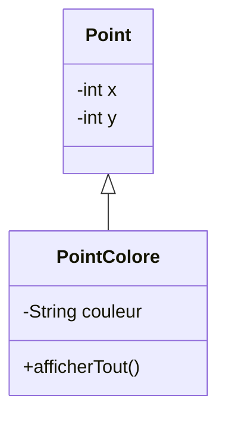
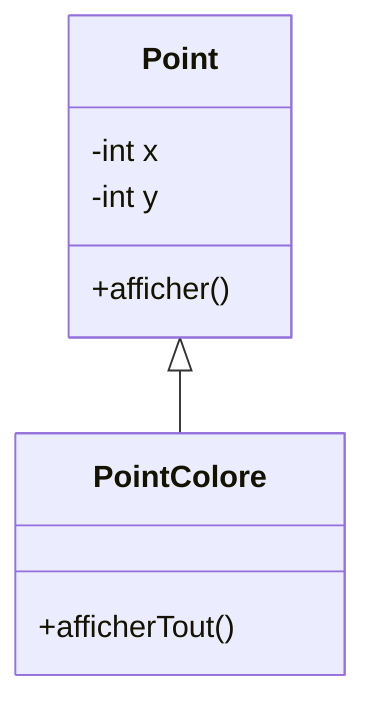
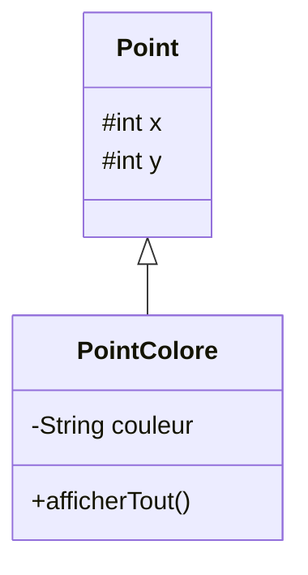
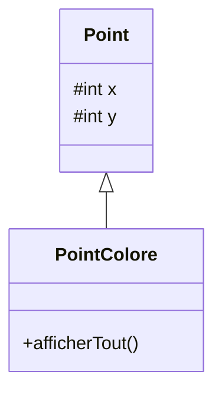
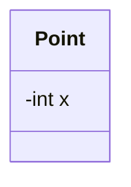
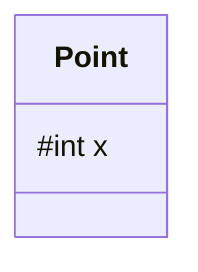
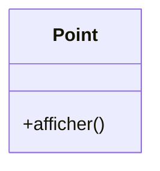

# Ajouter `afficherTout()`

<div class="grid grid-cols-[1.1fr_0.9fr] gap-10 mt-6 items-center">

<div>

Nous voulons afficher :

- les coordonnées du point
- sa couleur

```java
public class PointColore extends Point {
    private String couleur;

    public void afficherTout() {
        // afficher x, y et couleur
    }
}
```

<div v-click class="mt-5">

Comment accéder aux coordonnées `x` et `y` héritées de `Point` ?

</div>

</div>

<div>



</div>

</div>

<div v-click class="border-t border-gray-200 mt-5 pt-3 text-center font-medium">

Une classe dérivée hérite de `Point`, mais peut-elle accéder directement à tous ses membres ?

</div>

---
layout: default
---

# Peut-on accéder directement à `x` et `y` ?

<div class="grid grid-cols-[1.2fr_0.8fr] gap-10 mt-6 items-center">

<div>

```java
public class PointColore extends Point {
    private String couleur;

    public void afficherTout() {
        System.out.println(
            x + " " + y + " " + couleur
        );
    }
}
```

<div v-click class="mt-5 font-medium">

Correct ou incorrect ?

</div>

<div v-click class="mt-4 border border-gray-200 rounded-lg px-5 py-4">

**Incorrect.**

`x` et `y` sont déclarés `private` dans `Point`.

</div>

</div>

<div>



</div>

</div>

<div v-click class="border-t border-gray-200 mt-5 pt-3 text-center font-medium">

L'héritage ne rend pas les membres `private` directement accessibles.

</div>

---
layout: default
---

# Les attributs `private` restent privés

<div class="grid grid-cols-[0.9fr_1.1fr] gap-10 mt-7 items-center">

<div>


</div>

<div>

Dans `Point` :

```java
private int x;
private int y;
```

<div v-click class="mt-5">

Ces attributs appartiennent à l'état du `Point`, mais ils ne sont accessibles directement que depuis la classe `Point`.

</div>

<div v-click class="mt-5 border border-gray-200 rounded-lg px-5 py-4">

`PointColore` ne peut donc pas écrire directement :

```java
x
y
```

</div>

</div>

</div>

<div v-click class="border-t border-gray-200 mt-5 pt-3 text-center font-medium">

`private` reste une frontière d'accès, même dans une relation d'héritage.

</div>

---
layout: default
---

# Utiliser les méthodes de la classe de base

<div class="grid grid-cols-[1.15fr_0.85fr] gap-10 mt-6 items-center">

<div>

`Point` possède déjà une méthode publique permettant d'afficher ses coordonnées.

```java
public class Point {
    private int x;
    private int y;

    public void afficher() {
        System.out.println(x + " " + y);
    }
}
```

<div v-click class="mt-5">

`PointColore` peut donc réutiliser cette méthode :

```java
public void afficherTout() {
    afficher();
    System.out.println(couleur);
}
```

</div>

</div>

<div>


</div>

</div>

<div v-click class="border-t border-gray-200 mt-5 pt-3 text-center font-medium">

La classe dérivée peut passer par les méthodes accessibles de sa classe de base.

</div>

---
layout: default
---

# Accéder à l'état sans casser l'encapsulation

<div class="grid grid-cols-2 gap-10 mt-7 items-center">

<div class="border border-gray-200 rounded-lg p-5">

### Accès direct

```java
System.out.println(x);
```

<div class="mt-4">

✗ impossible si `x` est `private`

</div>

</div>

<div class="border border-gray-200 rounded-lg p-5">

### Accès via une méthode

```java
afficher();
```

<div class="mt-4">

✓ possible si la méthode est accessible

</div>

</div>

</div>

<div v-click class="flex justify-center mt-7">



</div>

<div v-click class="border-t border-gray-200 mt-5 pt-3 text-center font-medium">

L'encapsulation reste valable dans une hiérarchie d'héritage.

</div>

---
layout: default
---

# Une autre visibilité : `protected`

<div class="grid grid-cols-[1.15fr_0.85fr] gap-10 mt-6 items-center">

<div>

Il existe une visibilité intermédiaire : `protected`.

```java
public class Point {
    protected int x;
    protected int y;
}
```

<div v-click class="mt-5">

Dans ce cas, une classe dérivée peut accéder directement à ces attributs.

```java
public void afficherTout() {
    System.out.println(
        x + " " + y + " " + couleur
    );
}
```

</div>

</div>

<div>



</div>

</div>

<div v-click class="border-t border-gray-200 mt-5 pt-3 text-center font-medium">

En UML, `#` représente un membre `protected`.

</div>

---
layout: default
---

# Que permet `protected` ?

<div class="grid grid-cols-[0.95fr_1.05fr] gap-10 mt-7 items-center">

<div>



</div>

<div>

Avec :

```java
protected int x;
protected int y;
```

<div v-click class="mt-5">

une méthode de `PointColore` peut utiliser directement :

```java
x
y
```

</div>

<div v-click class="mt-5">

Cela donne plus d'accès aux classes dérivées qu'avec `private`.

</div>

</div>

</div>

<div v-click class="border-t border-gray-200 mt-5 pt-3 text-center font-medium">

`protected` permet notamment l'accès depuis les classes dérivées.

</div>

---
layout: default
---

# `private`, `protected` ou `public` ?

<div class="grid grid-cols-3 gap-6 mt-8">

<div class="border border-gray-200 rounded-lg p-5">

### `private`



Accessible uniquement dans la classe qui le déclare.

</div>

<div class="border border-gray-200 rounded-lg p-5">

### `protected`



Accessible notamment dans les classes dérivées.

</div>

<div class="border border-gray-200 rounded-lg p-5">

### `public`



Accessible partout où la classe est visible.

</div>

</div>

<div v-click class="border-t border-gray-200 mt-6 pt-3 text-center font-medium">

L'héritage ne remplace pas les règles de visibilité.

</div>

---
layout: default
---

# Faut-il mettre les attributs en `protected` ?

<div class="grid grid-cols-[1fr_1fr] gap-10 mt-7 items-center">

<div>

`protected` permettrait à `PointColore` d'accéder directement à `x` et `y`.

```java
protected int x;
protected int y;
```

<div v-click class="mt-5">

Mais cela expose davantage l'état interne de `Point` aux classes dérivées.

</div>

</div>

<div class="border border-gray-200 rounded-lg p-6">

### Bonne pratique

<div class="text-lg">

Les attributs restent généralement :

```java
private
```

</div>

<div v-click class="mt-5">

La classe dérivée utilise les méthodes fournies par la classe de base lorsque cela est possible.

</div>

</div>

</div>

<div v-click class="border-t border-gray-200 mt-5 pt-3 text-center font-medium">

`protected` est un outil de conception, pas un remplacement systématique de `private`.

</div>

---
layout: default
---

# Héritage et encapsulation

<div class="grid grid-cols-[0.9fr_1.1fr] gap-10 mt-8 items-center">

<div>


</div>

<div>

### À retenir

- une classe dérivée n'accède pas directement aux membres `private`
- elle peut utiliser les méthodes accessibles de la classe de base
- `protected` autorise un accès plus large aux classes dérivées
- l'héritage ne supprime pas l'encapsulation

</div>

</div>

<div v-click class="border-t border-gray-200 mt-6 pt-3 text-center font-medium">

Une méthode d'une classe dérivée n'accède pas aux membres `private` de sa classe de base.

</div>