# Une classe dérivée peut-elle être héritée ?

<div class="grid grid-cols-[1fr_1fr] gap-10 mt-7 items-center">

<div>

Nous avons déjà :

```java
public class PointColore extends Point {
    private String couleur;
}
```

<div v-click class="mt-6">

Peut-on maintenant créer une classe encore plus spécialisée ?

```java
public class PointColoreEtiquete
    extends PointColore {
    // ...
}
```

</div>

</div>

<div>

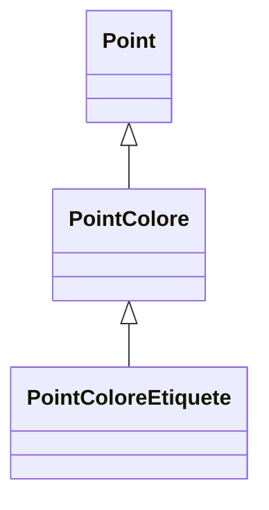

</div>

</div>

<div v-click class="border-t border-gray-200 mt-5 pt-3 text-center font-medium">

Une classe dérivée peut elle-même servir de classe de base.

</div>

---
layout: default
---

# Les dérivations successives

<div class="grid grid-cols-[0.9fr_1.1fr] gap-10 mt-7 items-center">

<div>

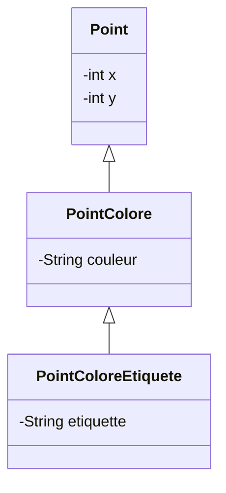

</div>

<div>

Chaque niveau ajoute ses propres caractéristiques.

<div v-click class="mt-6">

`PointColoreEtiquete` hérite :

- directement de `PointColore`
- indirectement de `Point`

</div>

<div v-click class="mt-5">

Il bénéficie donc des caractéristiques accessibles des deux niveaux précédents.

</div>

</div>

</div>

<div v-click class="border-t border-gray-200 mt-5 pt-3 text-center font-medium">

L'héritage peut être appliqué sur plusieurs niveaux successifs.

</div>

---
layout: default
---

# Une hiérarchie de classes

<div class="grid grid-cols-[0.85fr_1.15fr] gap-10 mt-7 items-center">

<div>

Une succession de relations d'héritage forme une **hiérarchie de classes**.

<div v-click class="mt-6">

Chaque classe occupe un niveau plus ou moins spécialisé.

</div>

</div>

<div class="flex justify-center">

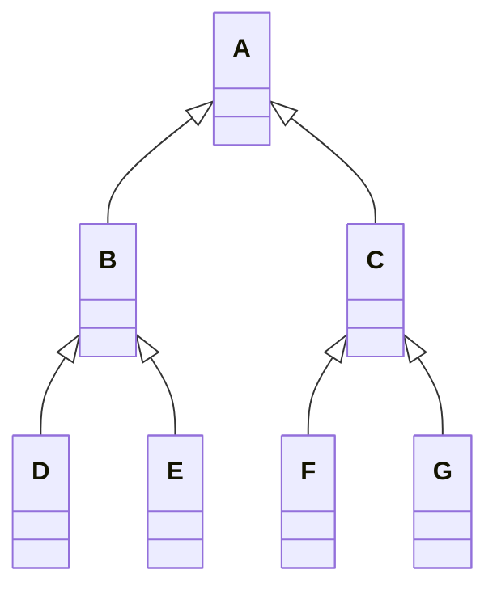

</div>

</div>

<div v-click class="border-t border-gray-200 mt-5 pt-3 text-center font-medium">

Une hiérarchie organise les classes du plus général vers le plus spécialisé.

</div>

---
layout: default
---

# Du général vers le spécialisé

<div class="flex justify-center mt-7">

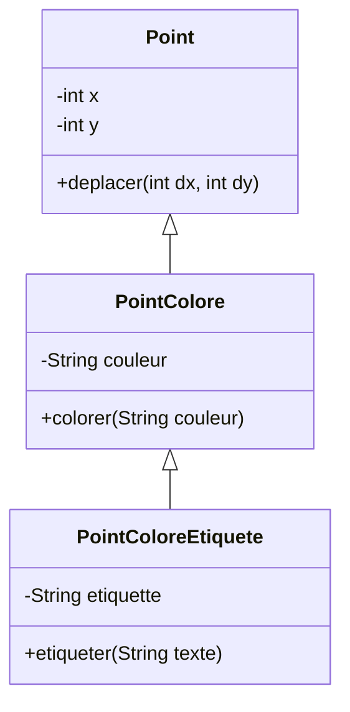

</div>

<div class="grid grid-cols-3 gap-6 mt-7">

<div class="border border-gray-200 rounded-lg p-4 text-center">

### `Point`

Caractéristiques générales

</div>

<div class="border border-gray-200 rounded-lg p-4 text-center">

### `PointColore`

Ajoute la couleur

</div>

<div class="border border-gray-200 rounded-lg p-4 text-center">

### `PointColoreEtiquete`

Ajoute une étiquette

</div>

</div>

<div v-click class="border-t border-gray-200 mt-5 pt-3 text-center font-medium">

Chaque niveau conserve les caractéristiques des niveaux précédents et peut en ajouter de nouvelles.

</div>

---
layout: default
---

# Héritage direct et indirect

<div class="grid grid-cols-[1fr_1fr] gap-10 mt-7 items-center">

<div>

Pour :

```java
class B extends A { }

class C extends B { }
```

<div v-click class="mt-6">

`C` hérite :

- **directement** de `B`
- **indirectement** de `A`

</div>

</div>

<div>

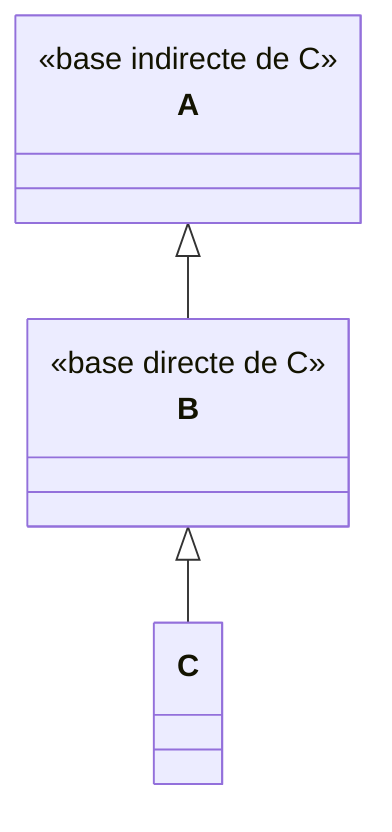

</div>

</div>

<div v-click class="border-t border-gray-200 mt-5 pt-3 text-center font-medium">

La super-classe directe de `C` est `B`, même si `C` hérite aussi de caractéristiques de `A`.

</div>

---
layout: default
---

# Une seule super-classe directe

<div class="grid grid-cols-[1.1fr_0.9fr] gap-10 mt-7 items-center">

<div>

En Java, une classe ne peut étendre qu'une seule classe directement.

```java
public class B extends A {
}
```

<div v-click class="mt-6">

Cette relation est valide :

```text
B possède une seule super-classe directe : A
```

</div>

</div>

<div>

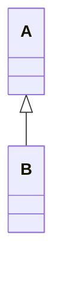

</div>

</div>

<div v-click class="border-t border-gray-200 mt-5 pt-3 text-center font-medium">

Une classe Java possède au plus une super-classe directe.

</div>

---
layout: default
---

# Plusieurs classes peuvent hériter de la même classe

<div class="grid grid-cols-[0.8fr_1.2fr] gap-10 mt-7 items-center">

<div>

Une classe de base peut en revanche avoir plusieurs classes dérivées.

<div v-click class="mt-6">

Par exemple, plusieurs sortes de points peuvent dériver de `Point`.

</div>

</div>

<div>

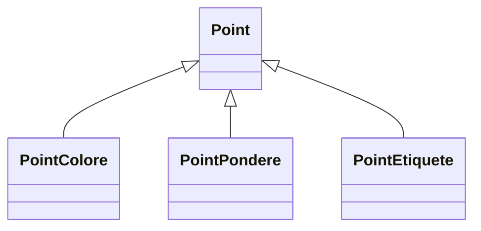

</div>

</div>

<div v-click class="border-t border-gray-200 mt-5 pt-3 text-center font-medium">

Une super-classe peut être à l'origine de plusieurs spécialisations différentes.

</div>

---
layout: default
---

# `super` dans une hiérarchie

<div class="grid grid-cols-[1.05fr_0.95fr] gap-10 mt-6 items-center">

<div>

Considérons trois niveaux :

```java
class A {
    public A(int n) {
        // ...
    }
}

class B extends A {
    public B(int n) {
        super(n);
    }
}

class C extends B {
    public C(int n) {
        super(n);
    }
}
```

</div>

<div>


<div v-click class="mt-6 text-center">

Dans `C` :

```java
super(n);
```

appelle un constructeur de `B`.

</div>

</div>

</div>

<div v-click class="border-t border-gray-200 mt-5 pt-3 text-center font-medium">

`super(...)` désigne toujours la super-classe directe.

</div>

---
layout: default
---

# `super` ne saute pas un niveau

<div class="grid grid-cols-[0.85fr_1.15fr] gap-10 mt-7 items-center">

<div>


</div>

<div>

Dans le constructeur de `C` :

```java
super(...);
```

<div v-click class="mt-5">

appelle un constructeur de :

```text
B
```

et non directement de :

```text
A
```

</div>

<div v-click class="mt-5">

C'est ensuite `B` qui construit sa propre partie de base.

</div>

</div>

</div>

<div v-click class="border-t border-gray-200 mt-5 pt-3 text-center font-medium">

La construction remonte la hiérarchie niveau par niveau.

</div>

---
layout: default
---

# Construction sur plusieurs niveaux

<div class="grid grid-cols-[0.85fr_1.15fr] gap-10 mt-7 items-center">

<div>

Lors de :

```java
C c = new C();
```

avec :

```java
class C extends B { }
class B extends A { }
```

</div>

<div>

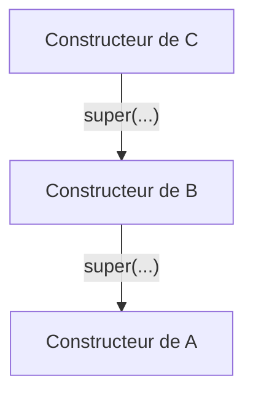

</div>

</div>

<div v-click class="mt-6 text-center">

L'exécution des constructeurs commence finalement par le niveau le plus haut atteint.

</div>

<div v-click class="border-t border-gray-200 mt-5 pt-3 text-center font-medium">

Chaque constructeur appelle celui de sa super-classe directe.

</div>

---
layout: default
---

# Peut-on hériter de plusieurs classes ?

<div class="grid grid-cols-2 gap-10 mt-7 items-center">

<div>

On pourrait vouloir écrire :

```java
class C extends A, B {
}
```

<div v-click class="mt-6 text-lg font-medium">

Ce n'est pas autorisé en Java.

</div>

</div>

<div>

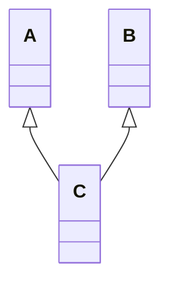

<div v-click class="mt-5 text-center font-medium">

✗ Héritage multiple de classes

</div>

</div>

</div>

<div v-click class="border-t border-gray-200 mt-5 pt-3 text-center font-medium">

Java n'autorise pas une classe à avoir plusieurs super-classes directes.

</div>

---
layout: default
---

# Pas d'héritage multiple de classes en Java

<div class="grid grid-cols-2 gap-8 mt-7">

<div class="border border-gray-200 rounded-lg p-5">

### Autorisé

```java
class B extends A { }

class C extends A { }
```

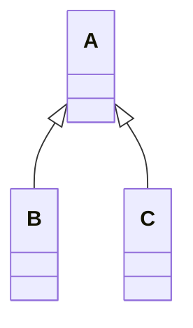

</div>

<div class="border border-gray-200 rounded-lg p-5">

### Non autorisé

```java
class C extends A, B { }
```


</div>

</div>

<div v-click class="border-t border-gray-200 mt-6 pt-3 text-center font-medium">

Plusieurs classes peuvent partager la même base, mais une classe ne peut pas étendre plusieurs classes.

</div>

---
layout: default
---

# Construire une hiérarchie

<div class="grid grid-cols-[0.95fr_1.05fr] gap-10 mt-7 items-center">

<div>

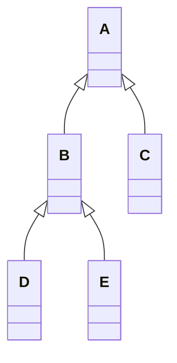

</div>

<div>

### À retenir

- une classe dérivée peut elle-même être héritée
- l'héritage peut comporter plusieurs niveaux
- une classe peut hériter indirectement d'autres classes
- `super` désigne la super-classe directe
- une classe de base peut avoir plusieurs classes dérivées
- une classe Java ne possède qu'une seule super-classe directe
- Java n'autorise pas l'héritage multiple de classes

</div>

</div>

<div v-click class="border-t border-gray-200 mt-6 pt-3 text-center font-medium">

Une hiérarchie organise progressivement les classes du plus général vers le plus spécialisé.

</div>