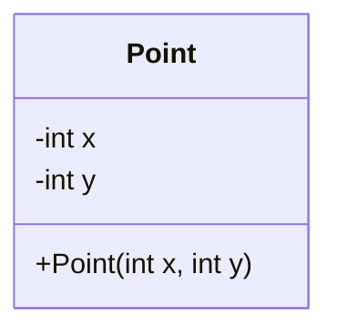
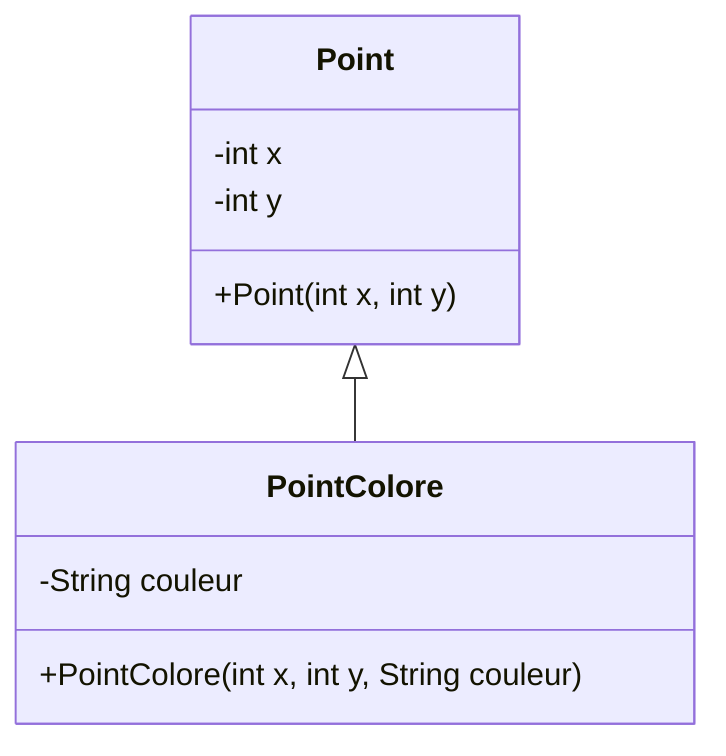
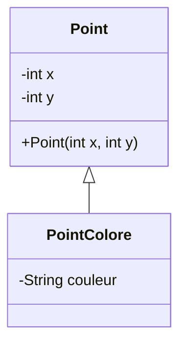
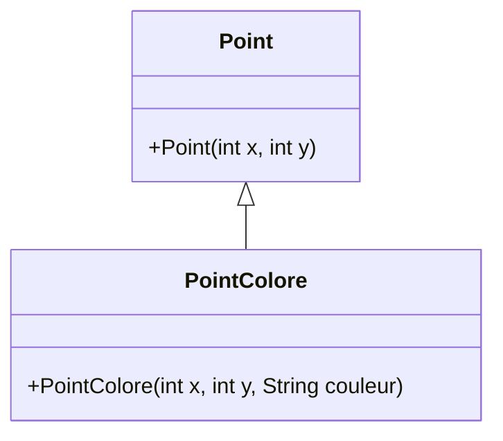
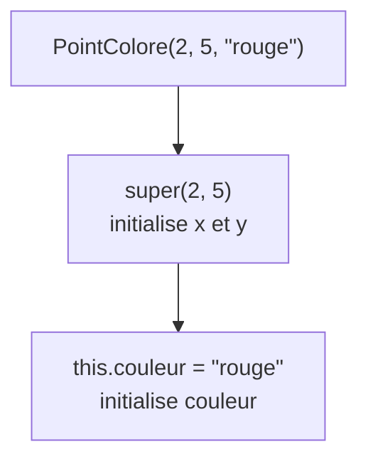
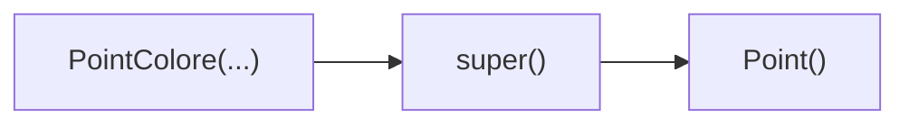
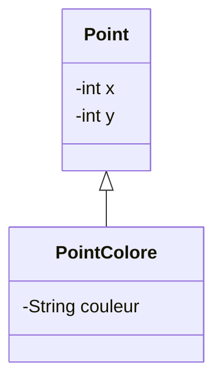
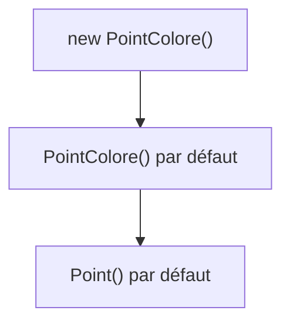
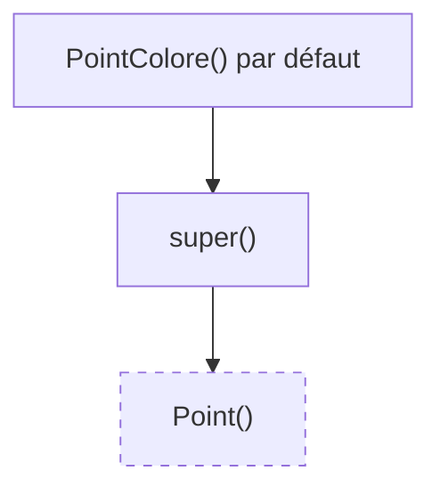

# Ajouter un constructeur à `Point`

Jusqu'à présent, `Point` pouvait être initialisé par son constructeur.

<div class="grid grid-cols-[1.15fr_0.85fr] gap-10 mt-6 items-center">

<div>

```java
public class Point {
    private int x;
    private int y;

    public Point(int x, int y) {
        this.x = x;
        this.y = y;
    }
}
```

<div v-click class="mt-5">

La création d'un objet appelle le constructeur correspondant :

```java
Point p = new Point(2, 5);
```

</div>

</div>

<div>



</div>

</div>

<div v-click class="border-t border-gray-200 mt-5 pt-3 text-center font-medium">

Le constructeur initialise l'état de l'objet lors de sa création.

</div>

---
layout: default
---

# Construire un `PointColore`

Nous voulons maintenant initialiser également la couleur.

<div class="grid grid-cols-[0.9fr_1.1fr] gap-10 mt-7 items-center">

<div>



</div>

<div>

Nous aimerions pouvoir écrire :

```java
PointColore p =
    new PointColore(2, 5, "rouge");
```

<div v-click class="mt-6">

Le constructeur doit initialiser :

- `x`
- `y`
- `couleur`

</div>

</div>

</div>

<div v-click class="border-t border-gray-200 mt-5 pt-3 text-center font-medium">

Mais `x` et `y` appartiennent à la partie héritée de l'objet.

</div>

---
layout: default
---

# Qui initialise `x` et `y` ?

<div class="grid grid-cols-[1.1fr_0.9fr] gap-10 mt-6 items-center">

<div>

Une première idée serait :

```java
public PointColore(
    int x, int y, String couleur
) {
    this.x = x;
    this.y = y;
    this.couleur = couleur;
}
```

<div v-click class="mt-5 border border-gray-200 rounded-lg px-5 py-4">

**Problème :** `x` et `y` sont `private` dans `Point`.

```java
this.x = x; // ✗
this.y = y; // ✗
```

</div>

</div>

<div>



</div>

</div>

<div v-click class="border-t border-gray-200 mt-5 pt-3 text-center font-medium">

La classe de base doit initialiser elle-même sa partie de l'objet.

</div>

---
layout: default
---

# Appeler le constructeur de la classe de base

`Point` possède déjà le constructeur dont nous avons besoin.

<div class="grid grid-cols-2 gap-10 mt-6">

<div>

### Classe de base

```java
public Point(int x, int y) {
    this.x = x;
    this.y = y;
}
```

<div v-click class="mt-5">

Il sait initialiser :

```text
x
y
```

</div>

</div>

<div>

### Classe dérivée

```java
public PointColore(
    int x, int y, String couleur
) {
    // initialiser la partie Point

    this.couleur = couleur;
}
```

<div v-click class="mt-5">

Elle doit initialiser :

```text
couleur
```

</div>

</div>

</div>

<div v-click class="border-t border-gray-200 mt-6 pt-3 text-center font-medium">

Comment demander à `Point` d'initialiser la partie héritée ?

</div>

---
layout: default
---

# Le mot-clé `super`

Un constructeur peut appeler un constructeur de sa classe de base avec `super(...)`.

<div class="grid grid-cols-[1.15fr_0.85fr] gap-10 mt-6 items-center">

<div>

```java
public class PointColore extends Point {
    private String couleur;

    public PointColore(
        int x, int y, String couleur
    ) {
        super(x, y);
        this.couleur = couleur;
    }
}
```

<div v-click class="mt-4">

```java
super(x, y);
```

appelle :

```java
Point(int x, int y)
```

</div>

</div>

<div>



</div>

</div>

<div v-click class="border-t border-gray-200 mt-4 pt-3 text-center font-medium">

`super(...)` permet au constructeur dérivé d'appeler un constructeur de sa classe de base.

</div>

---
layout: default
---

# Construire les deux parties de l'objet

<div class="grid grid-cols-[0.85fr_1.15fr] gap-10 mt-7 items-center">

<div>

```java
new PointColore(
    2, 5, "rouge"
);
```

</div>

<div>



</div>

</div>

<div v-click class="grid grid-cols-2 gap-8 mt-7">

<div class="border border-gray-200 rounded-lg px-5 py-4 text-center">

**`Point`**

initialise la partie héritée

</div>

<div class="border border-gray-200 rounded-lg px-5 py-4 text-center">

**`PointColore`**

initialise la partie spécifique

</div>

</div>

<div v-click class="border-t border-gray-200 mt-5 pt-3 text-center font-medium">

Chaque classe est responsable de l'initialisation de sa partie de l'objet.

</div>

---
layout: default
---

# `super(...)` doit être appelé en premier

L'appel au constructeur de la classe de base doit être la **première instruction** du constructeur.

<div class="grid grid-cols-2 gap-10 mt-7">

<div class="border border-gray-200 rounded-lg p-5">

### Correct

```java
public PointColore(
    int x, int y, String couleur
) {
    super(x, y);
    this.couleur = couleur;
}
```

<div class="mt-3 text-center">

✓

</div>

</div>

<div v-click class="border border-gray-200 rounded-lg p-5">

### Incorrect

```java
public PointColore(
    int x, int y, String couleur
) {
    this.couleur = couleur;
    super(x, y);
}
```

<div class="mt-3 text-center">

✗ Erreur de compilation

</div>

</div>

</div>

<div v-click class="border-t border-gray-200 mt-6 pt-3 text-center font-medium">

Un appel explicite à `super(...)` doit apparaître en premier dans le constructeur.

</div>

---
layout: default
---

# Et si on n'écrit pas `super(...)` ?

Considérons maintenant une classe de base avec un constructeur sans argument.

<div class="grid grid-cols-2 gap-10 mt-6">

<div>

### `Point`

```java
public class Point {
    private int x;
    private int y;

    public Point() {
        x = 0;
        y = 0;
    }
}
```

</div>

<div>

### `PointColore`

```java
public class PointColore extends Point {
    private String couleur;

    public PointColore(String couleur) {
        this.couleur = couleur;
    }
}
```

</div>

</div>

<div v-click class="mt-6 text-center">

Aucun `super(...)` n'apparaît dans `PointColore`.

</div>

<div v-click class="border-t border-gray-200 mt-5 pt-3 text-center font-medium">

Le constructeur de `Point` est-il quand même appelé ?

</div>

---
layout: default
---

# L'appel implicite à `super()`

Si aucun appel explicite n'est écrit, Java insère implicitement :

```java
super();
```

<div class="grid grid-cols-2 gap-10 mt-6">

<div>

### Code écrit

```java
public PointColore(String couleur) {
    this.couleur = couleur;
}
```

</div>

<div v-click>

### Comportement équivalent

```java
public PointColore(String couleur) {
    super();
    this.couleur = couleur;
}
```

</div>

</div>

<div v-click class="flex justify-center mt-6">



</div>

<div v-click class="border-t border-gray-200 mt-5 pt-3 text-center font-medium">

En l'absence d'appel explicite, le constructeur cherche à appeler `super()`.

</div>

---
layout: default
---

# Aucun constructeur déclaré dans `Point`

Que se passe-t-il si `Point` ne déclare aucun constructeur ?

<div class="grid grid-cols-2 gap-10 mt-6">

<div>

```java
public class Point {
    private int x;
    private int y;

    // aucun constructeur déclaré
}
```

</div>

<div v-click>

Java fournit alors un **constructeur par défaut** sans argument.

```java
Point()
```

</div>

</div>

<div v-click class="flex justify-center mt-7">



</div>

<div v-click class="border-t border-gray-200 mt-5 pt-3 text-center font-medium">

Le constructeur par défaut existe uniquement lorsqu'aucun constructeur n'est déclaré.

</div>

---
layout: default
---

# Aucun constructeur dans les deux classes

<div class="grid grid-cols-[1.15fr_0.85fr] gap-10 mt-6 items-center">

<div>

```java
public class Point {
    private int x;
    private int y;
    // aucun constructeur
}

public class PointColore extends Point {
    private String couleur;
    // aucun constructeur
}
```

<div v-click class="mt-5">

Java fournit un constructeur par défaut à chacune des deux classes.

</div>

</div>

<div>



</div>

</div>

<div v-click class="border-t border-gray-200 mt-5 pt-3 text-center font-medium">

Le constructeur par défaut de la classe dérivée appelle celui de la classe de base.

</div>

---
layout: default
---

# Un constructeur uniquement dans `PointColore`

`Point` ne déclare toujours aucun constructeur.

<div class="grid grid-cols-2 gap-10 mt-6">

<div>

```java
public class Point {
    private int x;
    private int y;

    // aucun constructeur
}
```

</div>

<div>

```java
public class PointColore extends Point {
    private String couleur;

    public PointColore(String couleur) {
        super();
        this.couleur = couleur;
    }
}
```

</div>

</div>

<div v-click class="mt-6 text-center">

L'appel à `super()` utilise le constructeur par défaut fourni à `Point`.

</div>

<div v-click class="border-t border-gray-200 mt-5 pt-3 text-center font-medium">

Ici, `super()` peut être écrit explicitement ou laissé implicite.

</div>

---
layout: default
---

# Aucun constructeur dans `PointColore`

Supposons maintenant que seule la classe de base possède un constructeur.

<div class="grid grid-cols-2 gap-10 mt-6">

<div>

```java
public class Point {
    private int x;
    private int y;

    public Point(int x, int y) {
        this.x = x;
        this.y = y;
    }
}
```

</div>

<div>

```java
public class PointColore extends Point {
    private String couleur;

    // aucun constructeur
}
```

</div>

</div>

<div v-click class="mt-7 text-center text-lg">

Java fournit un constructeur par défaut à `PointColore`.

</div>

<div v-click class="mt-3 text-center">

Mais ce constructeur tente implicitement d'appeler :

```java
super();
```

</div>

---
layout: default
---

# Quand la construction ne compile pas

<div class="grid grid-cols-[1.1fr_0.9fr] gap-10 mt-6 items-center">

<div>

```java
public class Point {
    public Point(int x, int y) {
        // ...
    }
}

public class PointColore extends Point {
    // aucun constructeur
}
```

<div v-click class="mt-5 border border-gray-200 rounded-lg px-5 py-4">

Le constructeur par défaut de `PointColore` cherche à appeler :

```java
super();
```

Mais `Point()` n'existe pas.

</div>

</div>

<div>



<div v-click class="text-center mt-4 font-medium">

✗ Erreur de compilation

</div>

</div>

</div>

<div v-click class="border-t border-gray-200 mt-4 pt-3 text-center font-medium">

Un constructeur avec arguments ne crée pas automatiquement un constructeur sans argument.

</div>

---
layout: default
---

# Comment corriger la construction ?

Deux solutions sont possibles.

<div class="grid grid-cols-2 gap-8 mt-7">

<div class="border border-gray-200 rounded-lg p-5">

### 1. Construire explicitement la partie `Point`

```java
public PointColore(
    int x, int y, String couleur
) {
    super(x, y);
    this.couleur = couleur;
}
```

</div>

<div v-click class="border border-gray-200 rounded-lg p-5">

### 2. Fournir `Point()`

```java
public Point() {
}
```

Le constructeur par défaut de `PointColore` peut alors appeler :

```java
super();
```

</div>

</div>

<div v-click class="border-t border-gray-200 mt-7 pt-3 text-center font-medium">

Le constructeur appelé par `super(...)` doit exister dans la classe de base.

</div>

---
layout: default
---

# Construction : les cas à retenir

<div class="grid grid-cols-2 gap-7 mt-6">

<div class="border border-gray-200 rounded-lg p-5">

### `PointColore` possède un constructeur

Si `Point` possède seulement un constructeur avec arguments :

```java
super(arguments);
```

doit appeler explicitement un constructeur compatible.

</div>

<div class="border border-gray-200 rounded-lg p-5">

### `Point()` existe

Si la classe de base possède un constructeur sans argument :

```java
super();
```

peut être explicite ou implicite.

</div>

<div class="border border-gray-200 rounded-lg p-5">

### Aucun constructeur dans `Point`

Java fournit :

```java
Point()
```

Le constructeur par défaut peut donc être appelé.

</div>

<div class="border border-gray-200 rounded-lg p-5">

### Aucun constructeur dans `PointColore`

Son constructeur par défaut tente :

```java
super();
```

`Point()` doit donc exister.

</div>

</div>

---
layout: default
---

# Construction d'un objet dérivé

<div class="grid grid-cols-[0.9fr_1.1fr] gap-10 mt-7 items-center">

<div>


</div>

<div>

### À retenir

- la partie héritée est construite par la classe de base
- `super(...)` appelle un constructeur de la classe de base
- cet appel doit être la première instruction
- sans appel explicite, Java tente `super()`
- le constructeur appelé doit exister

</div>

</div>

<div v-click class="border-t border-gray-200 mt-6 pt-3 text-center font-medium">

La construction d'un objet dérivé implique toujours la construction de sa partie héritée.

</div>