# Peut-on redéfinir une méthode librement ?

<div class="grid grid-cols-[1fr_1fr] gap-10 mt-7 items-center">

<div>

Nous savons redéfinir une méthode héritée :

```java
class A {
    public void f(int n) {
        // ...
    }
}

class B extends A {
    public void f(int n) {
        // ...
    }
}
```

<div v-click class="mt-6">

Mais peut-on modifier librement :

- les paramètres ?
- le type de retour ?
- la visibilité ?

</div>

</div>

<div>

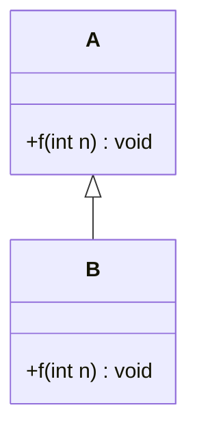

</div>

</div>

<div v-click class="border-t border-gray-200 mt-5 pt-3 text-center font-medium">

La redéfinition d'une méthode doit respecter certaines règles.

</div>

---
layout: default
---

# Première règle : même signature

<div class="grid grid-cols-2 gap-10 mt-7">

<div class="border border-gray-200 rounded-lg p-5">

### Classe de base

```java
class A {
    public void f(int n) {
        // ...
    }
}
```

</div>

<div class="border border-gray-200 rounded-lg p-5">

### Classe dérivée

```java
class B extends A {
    public void f(int n) {
        // ...
    }
}
```

</div>

</div>

<div v-click class="flex justify-center mt-6">


</div>

<div v-click class="border-t border-gray-200 mt-5 pt-3 text-center font-medium">

Pour redéfinir une méthode, la classe dérivée doit conserver la **même signature**.

</div>

---
layout: default
---

# Et si les paramètres changent ?

<div class="grid grid-cols-[1.1fr_0.9fr] gap-10 mt-7 items-center">

<div>

```java
class A {
    public void f(int n) {
        // ...
    }
}

class B extends A {
    public void f(double n) {
        // ...
    }
}
```

<div v-click class="mt-5">

Les deux méthodes sont :

```java
f(int)
f(double)
```

</div>

<div v-click class="mt-4 font-medium">

Les signatures sont différentes.

</div>

</div>

<div>

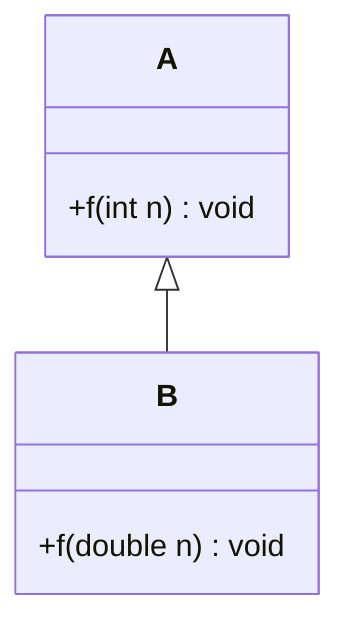

</div>

</div>

<div v-click class="border-t border-gray-200 mt-5 pt-3 text-center font-medium">

Ce n'est pas une redéfinition : nous obtenons deux méthodes de signatures différentes.

</div>

---
layout: default
---

# Vérifier une redéfinition avec `@Override`

<div class="grid grid-cols-[1.15fr_0.85fr] gap-10 mt-6 items-center">

<div>

Lorsqu'une méthode doit redéfinir une méthode héritée, on peut utiliser :

```java
@Override
public void f(int n) {
    // ...
}
```

<div v-click class="mt-5">

Si la méthode ne correspond pas à une méthode redéfinissable de la super-classe :

```java
@Override
public void f(double n) {
    // ...
}
```

le compilateur signale le problème.

</div>

</div>

<div>


</div>

</div>

<div v-click class="border-t border-gray-200 mt-5 pt-3 text-center font-medium">

`@Override` permet de faire vérifier l'intention de redéfinition par le compilateur.

</div>

---
layout: default
---

# Deuxième règle : le type de retour

<div class="grid grid-cols-2 gap-10 mt-7">

<div>

### Classe de base

```java
class A {
    public int f(int n) {
        return n;
    }
}
```

</div>

<div>

### Classe dérivée

```java
class B extends A {
    public int f(int n) {
        return n * 2;
    }
}
```

</div>

</div>

<div v-click class="flex justify-center mt-7">

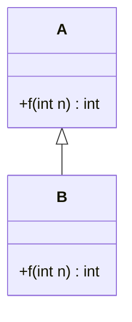

</div>

<div v-click class="border-t border-gray-200 mt-5 pt-3 text-center font-medium">

Dans le cadre présenté ici, la méthode redéfinie conserve le **même type de retour**.

</div>

---
layout: default
---

# Peut-on changer le type de retour ?

<div class="grid grid-cols-[1.1fr_0.9fr] gap-10 mt-7 items-center">

<div>

```java
class A {
    public int f(int n) {
        return n;
    }
}

class B extends A {
    public double f(int n) {
        return n * 2.0;
    }
}
```

<div v-click class="mt-5 border border-gray-200 rounded-lg px-5 py-4">

Même nom et mêmes paramètres...

```java
f(int)
```

...mais un type de retour différent.

</div>

</div>

<div>

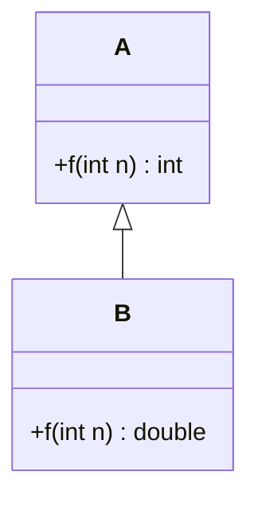

<div v-click class="mt-4 text-center font-medium">

✗ Erreur de compilation

</div>

</div>

</div>

<div v-click class="border-t border-gray-200 mt-5 pt-3 text-center font-medium">

Changer uniquement le type de retour ne permet pas de redéfinir la méthode.

</div>

---
layout: default
---

# Troisième règle : les droits d'accès

<div class="grid grid-cols-[0.9fr_1.1fr] gap-10 mt-7 items-center">

<div>

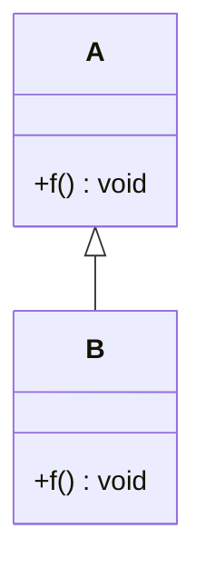

</div>

<div>

La visibilité fait également partie des contraintes de redéfinition.

```java
class A {
    public void f() {
        // ...
    }
}

class B extends A {
    public void f() {
        // ...
    }
}
```

<div v-click class="mt-5">

Ici, la visibilité reste :

```java
public
```

</div>

</div>

</div>

<div v-click class="border-t border-gray-200 mt-5 pt-3 text-center font-medium">

Une redéfinition ne doit pas réduire les droits d'accès de la méthode héritée.

</div>

---
layout: default
---

# Peut-on réduire la visibilité ?

<div class="grid grid-cols-2 gap-10 mt-7">

<div class="border border-gray-200 rounded-lg p-5">

### Classe de base

```java
class A {
    public void f() {
        // ...
    }
}
```

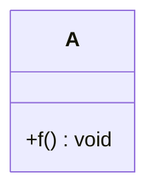

</div>

<div v-click class="border border-gray-200 rounded-lg p-5">

### Classe dérivée

```java
class B extends A {
    protected void f() {
        // ...
    }
}
```

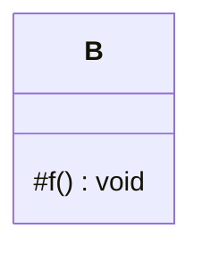

</div>

</div>

<div v-click class="border-t border-gray-200 mt-6 pt-3 text-center font-medium">

✗ Une méthode `public` ne peut pas devenir `protected` lors de sa redéfinition.

</div>

---
layout: default
---

# La visibilité ne peut pas être réduite

<div class="grid grid-cols-[0.9fr_1.1fr] gap-10 mt-7 items-center">

<div>

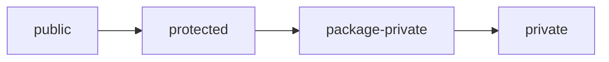

<div class="text-center mt-4">

Visibilité de plus en plus restrictive →

</div>

</div>

<div>

Si la méthode héritée est :

```java
public void f()
```

la méthode redéfinie ne peut pas devenir :

```java
protected void f()
```

ou plus restrictive.

<div v-click class="mt-6">

La classe dérivée doit conserver au moins le même niveau d'accès.

</div>

</div>

</div>

<div v-click class="border-t border-gray-200 mt-5 pt-3 text-center font-medium">

Redéfinir une méthode ne permet pas de retirer un accès déjà offert par la classe de base.

</div>

---
layout: default
---

# Peut-on augmenter la visibilité ?

<div class="grid grid-cols-2 gap-10 mt-7">

<div>

### Classe de base

```java
class A {
    protected void f() {
        // ...
    }
}
```

</div>

<div v-click>

### Classe dérivée

```java
class B extends A {
    public void f() {
        // ...
    }
}
```

</div>

</div>

<div v-click class="flex justify-center mt-7">

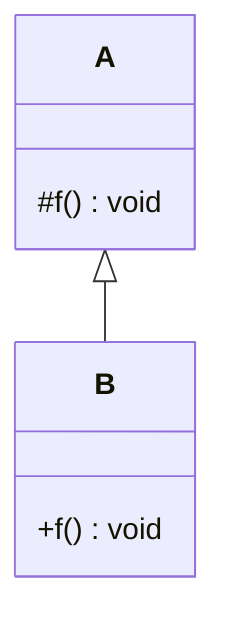

</div>

<div v-click class="border-t border-gray-200 mt-5 pt-3 text-center font-medium">

✓ La classe dérivée peut accorder des droits d'accès plus larges.

</div>

---
layout: default
---

# Pourquoi ne pas réduire la visibilité ?

<div class="grid grid-cols-[1fr_1fr] gap-10 mt-7 items-center">

<div>

La classe de base annonce :

```java
public void afficher()
```

Cette méthode fait partie de ce que la classe rend accessible.

<div v-click class="mt-6">

Une classe dérivée ne doit pas transformer cette méthode en :

```java
protected void afficher()
```

</div>

</div>

<div>

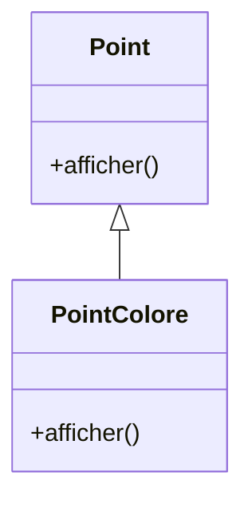

</div>

</div>

<div v-click class="border-t border-gray-200 mt-5 pt-3 text-center font-medium">

La redéfinition adapte le comportement sans diminuer les droits d'accès existants.

</div>

---
layout: default
---

# Respecter le contrat de la classe de base

<div class="grid grid-cols-[0.9fr_1.1fr] gap-10 mt-7 items-center">

<div>

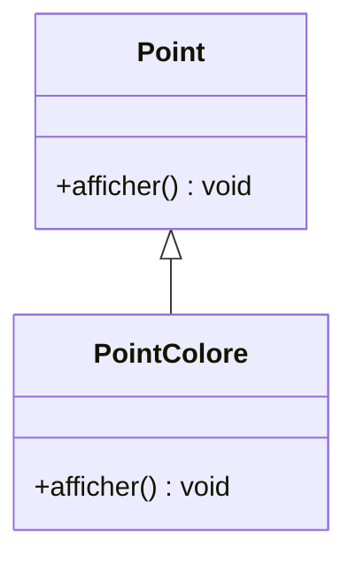

</div>

<div>

`Point` définit une méthode :

```java
public void afficher()
```

<div v-click class="mt-5">

`PointColore` peut modifier **la manière dont elle travaille**...

```java
@Override
public void afficher() {
    super.afficher();
    System.out.println(couleur);
}
```

</div>

<div v-click class="mt-5">

...tout en conservant les caractéristiques nécessaires à sa redéfinition.

</div>

</div>

</div>

<div v-click class="border-t border-gray-200 mt-5 pt-3 text-center font-medium">

La redéfinition change l'implémentation, tout en respectant le contrat de la méthode héritée.

</div>

---
layout: default
---

# Redéfinition : correct ou incorrect ?

<div class="grid grid-cols-3 gap-6 mt-7">

<div class="border border-gray-200 rounded-lg p-4">

### A

```java
// Classe de base
public int f(int n)

// Classe dérivée
public int f(int n)
```

<div v-click class="mt-4 text-center font-medium">

✓ Redéfinition

</div>

</div>

<div class="border border-gray-200 rounded-lg p-4">

### B

```java
// Classe de base
public int f(int n)

// Classe dérivée
public int f(double n)
```

<div v-click class="mt-4 text-center font-medium">

✗ Signature différente

</div>

</div>

<div class="border border-gray-200 rounded-lg p-4">

### C

```java
// Classe de base
public int f(int n)

// Classe dérivée
protected int f(int n)
```

<div v-click class="mt-4 text-center font-medium">

✗ Visibilité réduite

</div>

</div>

</div>

<div v-click class="border-t border-gray-200 mt-6 pt-3 text-center font-medium">

Avant de conclure à une redéfinition, vérifiez la signature, le retour et la visibilité.

</div>

---
layout: default
---

# Les règles de la redéfinition

<div class="grid grid-cols-[0.85fr_1.15fr] gap-10 mt-7 items-center">

<div>


</div>

<div>

### Pour redéfinir une méthode héritée

1. conserver la **même signature**
2. conserver le **type de retour** présenté dans ce cadre
3. ne pas **réduire la visibilité**
4. la visibilité peut être **augmentée**
5. utiliser `@Override` pour faire vérifier la redéfinition

</div>

</div>

<div v-click class="border-t border-gray-200 mt-6 pt-3 text-center font-medium">

La redéfinition permet de changer le comportement d'une méthode sans rompre les règles établies par la classe de base.

</div>