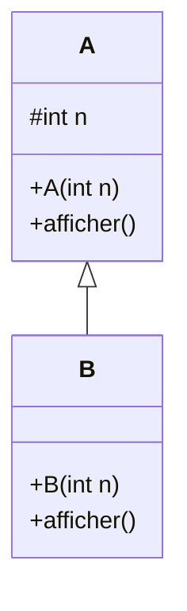
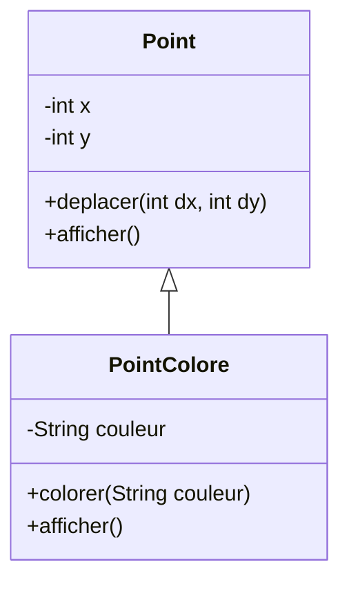
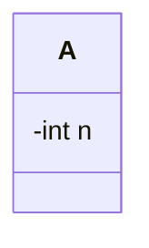
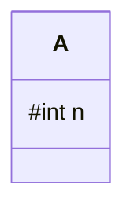
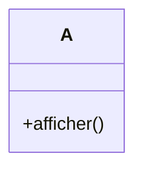
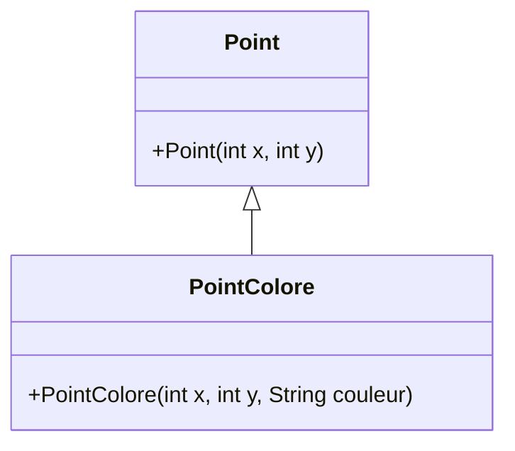
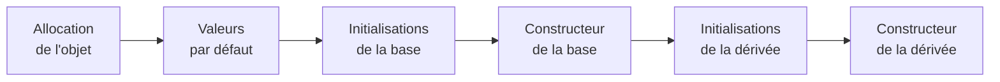
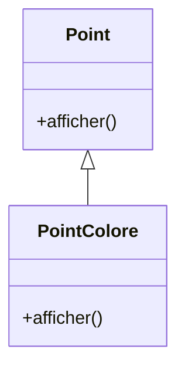
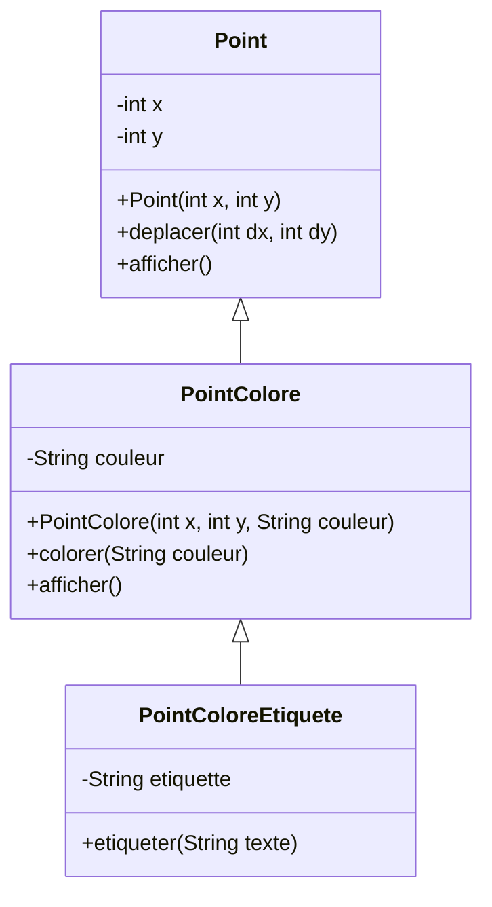

# Les usages de `super`

Nous avons rencontré `super` dans plusieurs situations.

<div class="grid grid-cols-3 gap-6 mt-7">

<div class="border border-gray-200 rounded-lg p-5">

### Constructeur

```java
super(x, y);
```

<div class="mt-4">

Appelle un constructeur de la **super-classe directe**.

</div>

</div>

<div v-click class="border border-gray-200 rounded-lg p-5">

### Méthode

```java
super.afficher();
```

<div class="mt-4">

Appelle la version définie dans la **super-classe directe**.

</div>

</div>

<div v-click class="border border-gray-200 rounded-lg p-5">

### Attribut

```java
super.n
```

<div class="mt-4">

Désigne l'attribut de même nom défini dans la **super-classe directe**.

</div>

</div>

</div>

<div v-click class="flex justify-center mt-7">



</div>

<div v-click class="border-t border-gray-200 mt-5 pt-3 text-center font-medium">

`super` permet de désigner explicitement la **super-classe directe**.

</div>

---
layout: default
---

# Ce qu'une classe dérivée peut faire

<div class="grid grid-cols-[0.85fr_1.15fr] gap-10 mt-7 items-center">

<div>



</div>

<div>

Une classe dérivée peut :

<div class="mt-4">

- **hériter** de membres accessibles
- **ajouter** de nouveaux attributs
- **ajouter** de nouvelles méthodes
- **redéfinir** des méthodes héritées
- utiliser `super` pour accéder à la super-classe

</div>

<div v-click class="mt-6">

Elle permet ainsi de construire une classe plus **spécialisée** à partir d'une classe existante.

</div>

</div>

</div>

<div v-click class="border-t border-gray-200 mt-5 pt-3 text-center font-medium">

Hériter ne signifie pas seulement réutiliser : une classe dérivée peut aussi enrichir et adapter.

</div>

---
layout: default
---

# Héritage et visibilité

<div class="grid grid-cols-3 gap-6 mt-8">

<div class="border border-gray-200 rounded-lg p-5 text-center">

### `private`



Pas d'accès direct depuis la classe dérivée.

</div>

<div class="border border-gray-200 rounded-lg p-5 text-center">

### `protected`



Accessible notamment depuis les classes dérivées.

</div>

<div class="border border-gray-200 rounded-lg p-5 text-center">

### `public`



Accessible partout où la classe est visible.

</div>

</div>

<div v-click class="border-t border-gray-200 mt-7 pt-3 text-center font-medium">

L'héritage ne supprime pas les règles d'encapsulation et de visibilité.

</div>

---
layout: default
---

# Construction : ce qu'il faut retenir

<div class="grid grid-cols-[0.8fr_1.2fr] gap-10 mt-7 items-center">

<div>



</div>

<div>

Dans un constructeur dérivé :

```java
public PointColore(
    int x, int y, String couleur
) {
    super(x, y);
    this.couleur = couleur;
}
```

<div v-click class="mt-5">

- la partie héritée est construite par la super-classe
- `super(...)` doit être la première instruction
- sans appel explicite, Java tente `super()`
- le constructeur appelé doit exister

</div>

</div>

</div>

<div v-click class="border-t border-gray-200 mt-5 pt-3 text-center font-medium">

Construire un objet dérivé implique toujours de construire sa partie héritée.

</div>

---
layout: default
---

# Initialisation : ce qu'il faut retenir

<div class="flex justify-center mt-7">



</div>

<div class="grid grid-cols-2 gap-8 mt-8">

<div class="border border-gray-200 rounded-lg px-5 py-4 text-center">

### D'abord

La partie de la **classe de base**

</div>

<div class="border border-gray-200 rounded-lg px-5 py-4 text-center">

### Ensuite

La partie de la **classe dérivée**

</div>

</div>

<div v-click class="border-t border-gray-200 mt-7 pt-3 text-center font-medium">

La partie héritée est initialisée avant la partie spécifique.

</div>

---
layout: default
---

# Redéfinition : ce qu'il faut retenir

<div class="grid grid-cols-[0.85fr_1.15fr] gap-10 mt-7 items-center">

<div>



</div>

<div>

Une classe dérivée peut adapter une méthode héritée :

```java
@Override
public void afficher() {
    super.afficher();
    System.out.println(couleur);
}
```

<div v-click class="mt-5">

Pour la redéfinition présentée dans ce cours :

- même signature
- même type de retour
- visibilité non réduite
- `@Override` permet de vérifier l'intention

</div>

</div>

</div>

<div v-click class="border-t border-gray-200 mt-5 pt-3 text-center font-medium">

Redéfinir permet d'adapter un comportement hérité à une classe plus spécialisée.

</div>

---
layout: default
---

# Héritage : les erreurs fréquentes

<div class="grid grid-cols-2 gap-x-8 gap-y-5 mt-6">

<div class="border border-gray-200 rounded-lg px-5 py-4">

### Accéder à un attribut `private`

```java
x = 10; // ✗
```

depuis la classe dérivée.

</div>

<div class="border border-gray-200 rounded-lg px-5 py-4">

### Oublier le constructeur de base

```java
// super() implicite
```

alors que `A()` n'existe pas.

</div>

<div class="border border-gray-200 rounded-lg px-5 py-4">

### Appeler `super(...)` trop tard

```java
this.n = n;
super(); // ✗
```

</div>

<div class="border border-gray-200 rounded-lg px-5 py-4">

### Provoquer une récursion

```java
public void afficher() {
    afficher(); // ✗
}
```

au lieu de `super.afficher()`.

</div>

</div>

<div v-click class="border-t border-gray-200 mt-6 pt-3 text-center font-medium">

Comprendre la relation entre classe de base et classe dérivée évite la plupart de ces erreurs.

</div>

---
layout: default
---

# Héritage : les erreurs fréquentes

<div class="grid grid-cols-2 gap-x-8 gap-y-5 mt-7">

<div class="border border-gray-200 rounded-lg px-5 py-4">

### Réduire la visibilité

```java
// dans A
public void f()

// dans B
protected void f() // ✗
```

</div>

<div class="border border-gray-200 rounded-lg px-5 py-4">

### Confondre avec la surcharge

```java
f(int)
f(double)
```

Signatures différentes.

</div>

<div class="border border-gray-200 rounded-lg px-5 py-4">

### Masquer un attribut

```java
class A { int n; }
class B extends A { int n; }
```

Les deux attributs coexistent.

</div>

<div class="border border-gray-200 rounded-lg px-5 py-4">

### Chercher plusieurs super-classes

```java
class C extends A, B // ✗
```

Pas d'héritage multiple de classes.

</div>

</div>

<div v-click class="border-t border-gray-200 mt-6 pt-3 text-center font-medium">

Une même syntaxe peut sembler proche, mais correspondre à des mécanismes différents.

</div>

---
layout: default
---

# Héritage : bonnes pratiques

<div class="grid grid-cols-[1fr_1fr] gap-8 mt-7">

<div class="border border-gray-200 rounded-lg p-5">

### Préserver l'encapsulation

Les attributs doivent être déclarés :

```java
private
```

Utiliser les méthodes de la classe pour accéder ou modifier son état.

</div>

<div class="border border-gray-200 rounded-lg p-5">

### Utiliser `@Override`

```java
@Override
public void afficher() {
    // ...
}
```

Le compilateur vérifie que la méthode redéfinit bien une méthode héritée.

</div>

<div class="border border-gray-200 rounded-lg p-5">

### Réutiliser avant de dupliquer

```java
super.afficher();
```

Réutiliser le comportement existant lorsqu'il reste pertinent.

</div>

<div class="border border-gray-200 rounded-lg p-5">

### Éviter le masquage

Éviter de redéclarer un attribut portant le même nom qu'un attribut hérité.

</div>

</div>

<div v-click class="border-t border-gray-200 mt-6 pt-3 text-center font-medium">

L'héritage doit améliorer la réutilisation et la lisibilité, pas augmenter la complexité.

</div>

---
layout: default
---

# Une hiérarchie en un coup d'œil

<div class="flex justify-center mt-6">



</div>

<div class="grid grid-cols-3 gap-6 mt-6 text-center">

<div v-click>

**Hériter**

Réutiliser

</div>

<div v-click>

**Enrichir**

Ajouter

</div>

<div v-click>

**Redéfinir**

Adapter

</div>

</div>

<div v-click class="border-t border-gray-200 mt-6 pt-3 text-center font-medium">

Une hiérarchie construit progressivement des classes de plus en plus spécialisées.

</div>

---
layout: default
---

# Ce qu'il faut retenir

<div class="grid grid-cols-2 gap-x-10 gap-y-5 mt-7">

<div>

**1. Héritage**

```java
class B extends A
```

`B` dérive de `A`.

</div>

<div>

**2. Encapsulation**

Les membres `private` restent inaccessibles directement depuis la classe dérivée.

</div>

<div>

**3. Construction**

```java
super(...);
```

construit la partie héritée.

</div>

<div>

**4. Hiérarchie**

Une classe peut avoir plusieurs dérivées, mais une seule super-classe directe.

</div>

<div>

**5. Redéfinition**

Une méthode héritée peut être adaptée dans la classe dérivée.

</div>

<div>

**6. `super`**

Permet d'accéder explicitement à la super-classe directe.

</div>

</div>

<div v-click class="border-t border-gray-200 mt-7 pt-3 text-center font-medium">

L'héritage permet de **réutiliser, enrichir et spécialiser** des classes existantes.

</div>

---
layout: default
---

# Vers le polymorphisme

<div class="grid grid-cols-[0.9fr_1.1fr] gap-12 mt-8 items-center">

<div>

Nous savons maintenant construire une hiérarchie :


</div>

<div>

Nous savons également qu'une même méthode peut être redéfinie :

```java
Point.afficher()
```

```java
PointColore.afficher()
```

<div v-click class="mt-7 text-lg">

Une nouvelle question apparaît :

**comment Java choisit-il le comportement à exécuter lorsqu'on manipule des objets d'une même hiérarchie ?**

</div>

</div>

</div>

<div v-click class="border-t border-gray-200 mt-6 pt-3 text-center font-medium">

C'est ce qui nous conduira au **polymorphisme**.

</div>