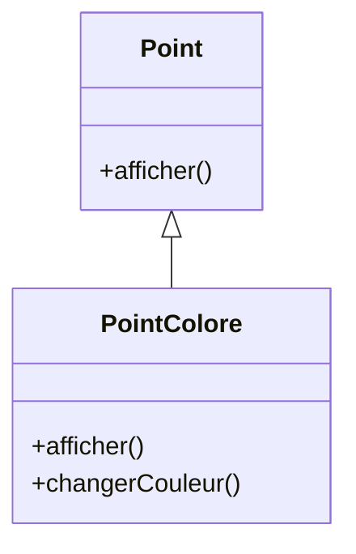
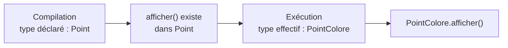
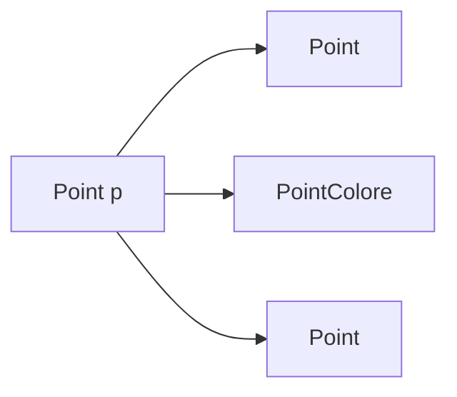
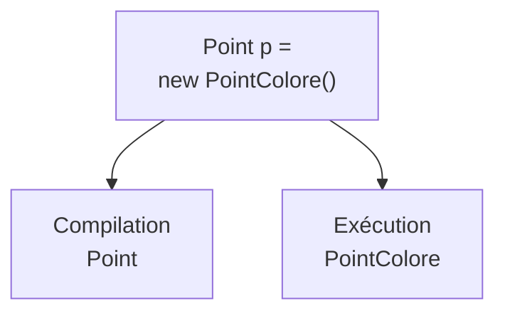

# Peut-on appeler toutes les méthodes de `PointColore` ?

Considérons les deux classes suivantes :

<div class="grid grid-cols-2 gap-8 mt-5">

<div>

### `Point`

```java
public class Point {

    public void afficher() {
        System.out.println("Point");
    }
}
```

</div>

<div>

### `PointColore`

```java
public class PointColore extends Point {

    @Override
    public void afficher() {
        System.out.println("Point coloré");
    }

    public void changerCouleur() {
        // ...
    }
}
```

</div>

</div>

<div class="mt-5">

```java
Point p = new PointColore();
```

</div>

<div v-click class="mt-4 text-center text-lg">

Peut-on écrire `p.changerCouleur()` ?

</div>

---
layout: default
---

# Que va-t-il se passer ?

Avec :

```java
Point p = new PointColore();
```

Considérons ces deux appels :

<div class="grid grid-cols-2 gap-8 mt-7">

<div class="border border-gray-200 rounded-lg p-5">

```java
p.afficher();
```

<div v-click class="mt-5 text-center font-medium">

✓ accepté par le compilateur

</div>

</div>

<div class="border border-gray-200 rounded-lg p-5">

```java
p.changerCouleur();
```

<div v-click class="mt-5 text-center font-medium">

✗ erreur de compilation

</div>

</div>

</div>

<div v-click class="border-t border-gray-200 mt-7 pt-4 text-center font-medium">

Pourquoi, alors que l’objet référencé est bien un `PointColore` ?

</div>

---
layout: default
---

# Le compilateur voit le type déclaré

Avec :

```java
Point p = new PointColore();
```

<div class="grid grid-cols-2 gap-8 mt-7">

<div class="border border-gray-200 rounded-lg p-5 text-center">

### Type déclaré

`Point`

<div class="mt-3 text-gray-600">

Connu par le compilateur à partir de la déclaration.

</div>

</div>

<div class="border border-gray-200 rounded-lg p-5 text-center">

### Type effectif

`PointColore`

<div class="mt-3 text-gray-600">

Type de l’objet réellement créé.

</div>

</div>

</div>

<div v-click class="mt-7 text-center text-lg">

Pour vérifier les appels possibles sur `p`, le compilateur utilise le **type déclaré**.

</div>

<div v-click class="border-t border-gray-200 mt-6 pt-4 text-center font-medium">

Pour le compilateur, `p` est une référence de type `Point`.

</div>

---
layout: default
---

# Quelles méthodes sont accessibles ?

Considérons :

```java
Point p = new PointColore();
```

<div class="flex justify-center mt-6">



</div>

<div class="grid grid-cols-2 gap-8 mt-6">

<div class="text-center">

```java
p.afficher();
```

✓ `afficher()` existe dans `Point`

</div>

<div class="text-center">

```java
p.changerCouleur();
```

✗ `changerCouleur()` n’existe pas dans `Point`

</div>

</div>

<div class="border-t border-gray-200 mt-6 pt-4 text-center font-medium">

Le type déclaré détermine les méthodes que l’on peut appeler.

</div>

---
layout: default
---

# Mais quelle version est exécutée ?

Reprenons l’appel accepté par le compilateur :

```java
Point p = new PointColore();

p.afficher();
```

<div class="flex justify-center mt-7">



</div>

<div class="mt-7 text-center text-lg">

Le compilateur vérifie que `afficher()` peut être appelée.

</div>

<div v-click class="mt-3 text-center text-lg">

À l’exécution, Java choisit la version adaptée à l’objet réel.

</div>

---
layout: default
---

# Deux décisions différentes

Avec :

```java
Point p = new PointColore();

p.afficher();
```

<div class="grid grid-cols-2 gap-8 mt-7">

<div class="border border-gray-200 rounded-lg p-5">

### À la compilation

Java utilise le **type déclaré** :

`Point`

<div class="mt-4">

Il vérifie que :

```java
afficher()
```

existe dans `Point`.

</div>

</div>

<div class="border border-gray-200 rounded-lg p-5">

### À l’exécution

Java utilise le **type effectif** :

`PointColore`

<div class="mt-4">

Il exécute :

```java
PointColore.afficher()
```

</div>

</div>

</div>

<div class="border-t border-gray-200 mt-7 pt-4 text-center font-medium">

Compilation : appel autorisé ? — Exécution : quelle redéfinition utiliser ?

</div>

---
layout: default
---

# Type déclaré vs type effectif

<div class="grid grid-cols-2 gap-8 mt-6">

<div class="border border-gray-200 rounded-lg p-6">

### Type déclaré

Déterminé par la déclaration :

```java
Point p
```

Il détermine notamment :

- les méthodes accessibles
- la validité de l’appel
- la signature recherchée

</div>

<div class="border border-gray-200 rounded-lg p-6">

### Type effectif

Déterminé par l’objet référencé :

```java
new PointColore()
```

Pour une méthode redéfinie, il détermine :

- la version exécutée
- le comportement obtenu à l’exécution

</div>

</div>

<div class="border-t border-gray-200 mt-7 pt-4 text-center font-medium">

Le type déclaré contrôle ce que l’on peut demander ; le type effectif contrôle comment une méthode redéfinie répond.

</div>

---
layout: default
---

# Le type effectif peut changer

Une même référence conserve toujours son type déclaré.

```java
Point p;
```

Mais son type effectif peut changer au cours du programme.

<div class="mt-5">

```java
p = new Point();
p.afficher();          // Point

p = new PointColore();
p.afficher();          // Point coloré

p = new Point();
p.afficher();          // Point
```

</div>

<div class="flex justify-center mt-6">



</div>

<div class="border-t border-gray-200 mt-5 pt-4 text-center font-medium">

Le type déclaré reste `Point`, mais le comportement peut varier selon l’objet référencé.

</div>

---
layout: default
---

# Une méthode doit d’abord être accessible

Ajoutons une méthode propre à `PointColore` :

```java
public void changerCouleur() {
    // ...
}
```

Puis :

```java
Point p = new PointColore();

p.changerCouleur();
```

<div v-click class="mt-6 text-center text-lg font-medium">

✗ Erreur de compilation

</div>

<div v-click class="mt-5 text-center">

La liaison dynamique ne permet pas de contourner le type déclaré.

</div>

<div v-click class="border-t border-gray-200 mt-7 pt-4 text-center font-medium">

Java choisit dynamiquement une version uniquement pour un appel déjà valide à la compilation.

</div>

---
layout: default
---

# Méthodes accessibles vs méthodes exécutées

<div class="grid grid-cols-2 gap-10 mt-7">

<div>

### Méthodes accessibles

Dépendent du **type déclaré**.

```java
Point p = new PointColore();

p.afficher();        // ✓
p.changerCouleur();  // ✗
```

Le compilateur travaille avec `Point`.

</div>

<div>

### Méthode exécutée

Pour une méthode redéfinie, elle dépend du **type effectif**.

```java
Point p = new PointColore();

p.afficher();
```

Résultat :

```text
Point coloré
```

</div>

</div>

<div class="border-t border-gray-200 mt-7 pt-4 text-center font-medium">

Ne pas confondre **ce que la référence permet d’appeler** et **la version de la méthode qui sera exécutée**.

</div>

---
layout: default
---

# Compilation et exécution

<div class="grid grid-cols-[0.9fr_1.4fr] gap-10 mt-7 items-center">

<div class="flex justify-center">



</div>

<div>

### À retenir

- une référence possède un **type déclaré**
- l’objet référencé possède un **type effectif**
- le compilateur utilise le type déclaré pour déterminer les appels autorisés
- pour une méthode redéfinie, le type effectif détermine la version exécutée
- la liaison dynamique intervient seulement après qu’un appel a été accepté à la compilation

</div>

</div>

<div class="border-t border-gray-200 mt-7 pt-4 text-center font-medium">

**Type déclaré → ce que je peux appeler**  
**Type effectif → quelle redéfinition est exécutée**

</div>