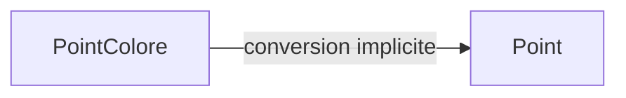
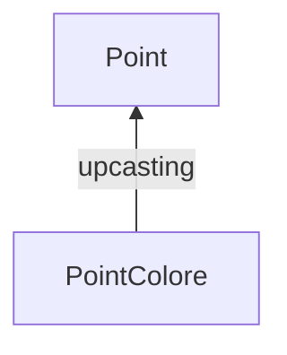
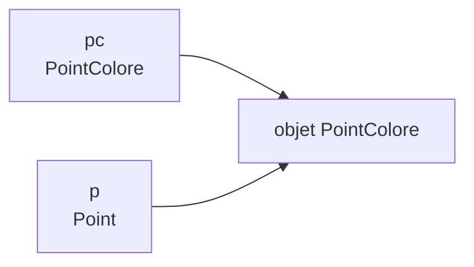
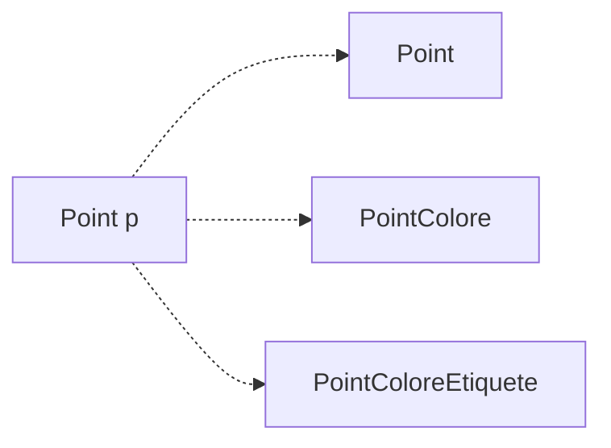
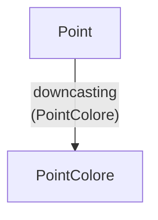
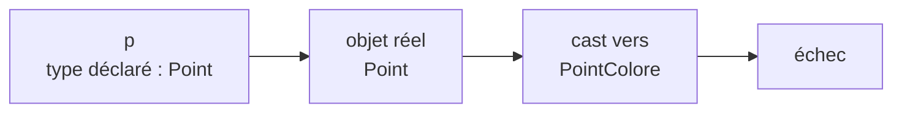
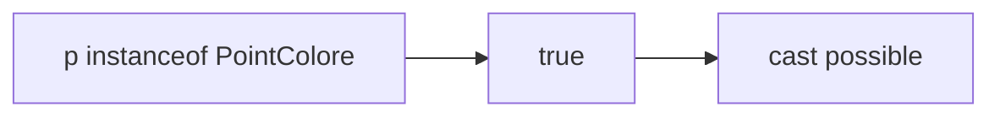
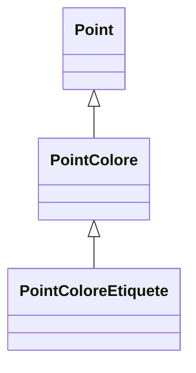
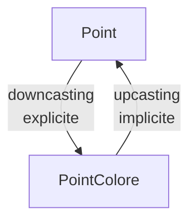

# De `PointColore` vers `Point`

Considérons :

```java
PointColore pc = new PointColore();
```

Nous pouvons écrire :

```java
Point p = pc;
```

<div class="flex justify-center mt-7">



</div>

<div class="mt-7 text-center text-lg">

`PointColore` est une classe dérivée de `Point`.

</div>

<div class="border-t border-gray-200 mt-7 pt-4 text-center font-medium">

La conversion d’une référence dérivée vers une référence de classe de base est implicite.

</div>

---
layout: default
---

# L’upcasting

La conversion :

```java
PointColore pc = new PointColore();

Point p = pc;
```

est appelée **upcasting**.

<div class="flex justify-center mt-7">



</div>

<div class="mt-7 text-center">

On remonte vers un type plus général dans la hiérarchie.

</div>

<div class="border-t border-gray-200 mt-7 pt-4 text-center font-medium">

L’upcasting est sûr et ne nécessite aucun cast explicite.

</div>

---
layout: default
---

# L’objet a-t-il changé ?

Avec :

```java
PointColore pc = new PointColore();

Point p = pc;
```

<div class="flex justify-center mt-7">



</div>

<div class="mt-7 text-center text-lg">

`pc` et `p` référencent le **même objet**.

</div>

<div class="border-t border-gray-200 mt-7 pt-4 text-center font-medium">

Une conversion de référence ne transforme pas l’objet : elle change seulement la manière de le référencer.

</div>

---
layout: default
---

# De `Point` vers `PointColore`

Considérons maintenant :

```java
Point p = new PointColore();
```

Peut-on écrire directement :

```java
PointColore pc = p;
```

<div v-click class="mt-7 text-center text-lg font-medium">

✗ Erreur de compilation

</div>

<div v-click class="mt-5 text-center">

Pour le compilateur, une référence `Point` peut désigner plusieurs types d’objets.

</div>

<div v-click class="border-t border-gray-200 mt-7 pt-4 text-center font-medium">

La conversion d’une référence de base vers une référence dérivée n’est pas implicite.

</div>

---
layout: default
---

# Pourquoi Java refuse-t-il ?

Avec :

```java
Point p;
```

`p` pourrait référencer :

<div class="flex justify-center mt-7">



</div>

<div class="mt-7 text-center">

Le type déclaré `Point` ne garantit pas que l’objet soit un `PointColore`.

</div>

<div class="border-t border-gray-200 mt-7 pt-4 text-center font-medium">

Java exige donc une conversion explicite vers la classe dérivée.

</div>

---
layout: default
---

# Le downcasting

Si l’objet réellement référencé est bien un `PointColore`, nous pouvons écrire :

```java
Point p = new PointColore();

PointColore pc = (PointColore) p;
```

<div class="flex justify-center mt-7">



</div>

<div class="border-t border-gray-200 mt-7 pt-4 text-center font-medium">

Le downcasting nécessite un cast explicite.

</div>

---
layout: default
---

# Que signifie le cast ?

Dans :

```java
PointColore pc = (PointColore) p;
```

le cast :

```java
(PointColore)
```

indique au compilateur :

<div class="mt-6 text-center text-lg">

« Je considère que l’objet référencé par `p` est compatible avec `PointColore`. »

</div>

<div v-click class="mt-6 text-center">

Le compilateur accepte alors l’affectation.

</div>

<div v-click class="border-t border-gray-200 mt-7 pt-4 text-center font-medium">

Mais cette hypothèse doit encore être vérifiée à l’exécution.

</div>

---
layout: default
---

# Un cast accepté peut-il échouer ?

Considérons :

```java
Point p = new Point();

PointColore pc = (PointColore) p;
```

<div class="mt-7 text-center text-lg">

Le compilateur accepte le cast.

</div>

<div v-click class="mt-6 text-center text-lg font-medium">

Mais l’objet réel est un `Point`, pas un `PointColore`.

</div>

<div v-click class="border-t border-gray-200 mt-7 pt-4 text-center font-medium">

Le programme échoue à l’exécution.

</div>

---
layout: default
---

# Quand le cast échoue

Avec :

```java
Point p = new Point();

PointColore pc = (PointColore) p;
```

<div class="flex justify-center mt-7">



</div>

<div class="mt-7 text-center">

L’objet réel n’est pas compatible avec `PointColore`.

</div>

<div class="border-t border-gray-200 mt-7 pt-4 text-center font-medium">

Un downcasting incorrect provoque une erreur à l’exécution.

</div>

---
layout: default
---

# Deux casts, deux résultats

<div class="grid grid-cols-2 gap-8 mt-7">

<div class="border border-gray-200 rounded-lg p-5">

### Cast valide

```java
Point p =
    new PointColore();

PointColore pc =
    (PointColore) p;
```

<div class="mt-4 text-center font-medium">

✓ compatible

</div>

</div>

<div class="border border-gray-200 rounded-lg p-5">

### Cast invalide

```java
Point p =
    new Point();

PointColore pc =
    (PointColore) p;
```

<div class="mt-4 text-center font-medium">

✗ échec à l’exécution

</div>

</div>

</div>

<div class="border-t border-gray-200 mt-7 pt-4 text-center font-medium">

La validité d’un downcasting dépend du type effectif de l’objet.

</div>

---
layout: default
---

# Vérifier avant de convertir

Avant un downcasting, nous pouvons tester si l’objet est compatible.

```java
if (p instanceof PointColore) {
    PointColore pc = (PointColore) p;
}
```

<div class="flex justify-center mt-7">



</div>

<div class="border-t border-gray-200 mt-7 pt-4 text-center font-medium">

`instanceof` permet de vérifier la compatibilité avant une conversion explicite.

</div>

---
layout: default
---

# L’opérateur `instanceof`

Considérons :

```java
Point p = new PointColore();
```

Alors :

```java
p instanceof Point
```

donne :

```text
true
```

et :

```java
p instanceof PointColore
```

donne également :

```text
true
```

<div class="border-t border-gray-200 mt-7 pt-4 text-center font-medium">

`instanceof` teste si l’objet est compatible avec un type donné.

</div>

---
layout: default
---

# `instanceof` suit la hiérarchie

Avec :

```java
Point p = new PointColoreEtiquete();
```

et la hiérarchie :

<div class="flex justify-center mt-5">



</div>

Nous obtenons :

```java
p instanceof Point                 // true
p instanceof PointColore           // true
p instanceof PointColoreEtiquete   // true
```

<div class="border-t border-gray-200 mt-5 pt-4 text-center font-medium">

`instanceof` prend en compte les relations d’héritage.

</div>

---
layout: default
---

# Connaître la classe exacte

Il est également possible d’obtenir la classe effective d’un objet avec :

```java
p.getClass()
```

Par exemple :

```java
Point p = new PointColore();

System.out.println(p.getClass());
```

<div v-click class="mt-6 text-center">

La classe obtenue correspond exactement au type réel de l’objet.

</div>

<div v-click class="border-t border-gray-200 mt-7 pt-4 text-center font-medium">

`getClass()` permet de connaître la classe effective exacte de l’objet.

</div>

---
layout: default
---

# `instanceof` ou `getClass()` ?

<div class="grid grid-cols-2 gap-8 mt-7">

<div class="border border-gray-200 rounded-lg p-5">

### `instanceof`

```java
p instanceof Point
```

Teste si l’objet est compatible avec :

- la classe indiquée
- ou une de ses sous-classes

</div>

<div class="border border-gray-200 rounded-lg p-5">

### `getClass()`

```java
p.getClass()
```

Donne :

- la classe effective exacte
- sans remonter la hiérarchie

</div>

</div>

<div class="border-t border-gray-200 mt-7 pt-4 text-center font-medium">

`instanceof` teste une compatibilité ; `getClass()` identifie la classe exacte.

</div>

---
layout: default
---

# Upcasting et downcasting

<div class="grid grid-cols-2 gap-8 mt-7">

<div class="border border-gray-200 rounded-lg p-5">

### Upcasting

```java
PointColore pc =
    new PointColore();

Point p = pc;
```

- vers une classe de base
- implicite
- compatible par héritage

</div>

<div class="border border-gray-200 rounded-lg p-5">

### Downcasting

```java
Point p =
    new PointColore();

PointColore pc =
    (PointColore) p;
```

- vers une classe dérivée
- explicite
- vérifié à l’exécution

</div>

</div>

<div class="border-t border-gray-200 mt-7 pt-4 text-center font-medium">

Monter dans la hiérarchie est implicite ; redescendre nécessite une vérification.

</div>

---
layout: default
---

# Conversions de références

<div class="grid grid-cols-[0.8fr_1.4fr] gap-10 mt-7 items-center">

<div class="flex justify-center">



</div>

<div>

### À retenir

- une référence dérivée peut être convertie implicitement vers une référence de base
- cette conversion ne change pas l’objet
- la conversion inverse nécessite un cast explicite
- un downcasting n’est valide que si le type effectif est compatible
- une conversion incorrecte peut échouer à l’exécution
- `instanceof` permet de tester la compatibilité
- `getClass()` permet d’obtenir la classe effective exacte

</div>

</div>

<div class="border-t border-gray-200 mt-7 pt-4 text-center font-medium">

La conversion concerne la **référence** ; l’objet référencé conserve toujours son type effectif.

</div>