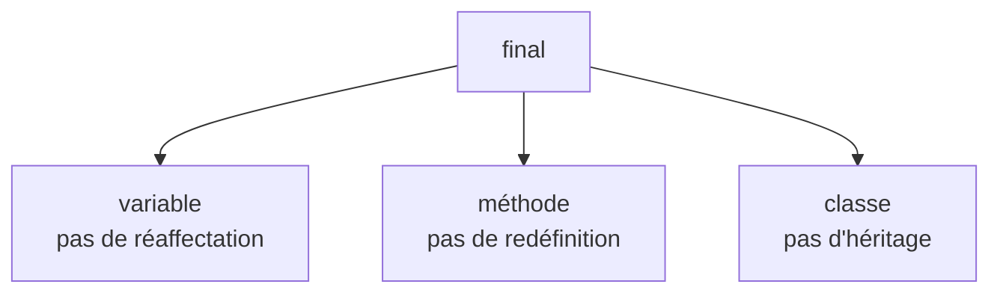

# Peut-on toujours modifier une variable ?

Considérons :

```java
Point p = new Point();

p = new PointColore();
```

La référence `p` peut être réaffectée.

<div class="mt-7 text-center text-lg">

Comment empêcher cette réaffectation ?

</div>

<div v-click class="mt-6 text-center">

Avec le mot-clé :

```java
final
```

</div>

<div v-click class="border-t border-gray-200 mt-7 pt-4 text-center font-medium">

`final` peut être utilisé pour empêcher certaines modifications.

</div>

---
layout: default
---

# Une référence `final`

Nous pouvons écrire :

```java
final Point p = new Point();
```

Puis :

```java
p = new PointColore();
```

<div v-click class="mt-6 text-center text-lg font-medium">

✗ Erreur de compilation

</div>

<div v-click class="mt-5 text-center">

La variable `p` ne peut plus recevoir une autre référence.

</div>

<div v-click class="border-t border-gray-200 mt-7 pt-4 text-center font-medium">

Une variable `final` ne peut être affectée qu’une seule fois.

</div>

---
layout: default
---

# L’objet devient-il immuable ?

Considérons :

```java
final Point p = new Point();
```

Nous ne pouvons pas écrire :

```java
p = new PointColore();
```

Mais nous pouvons toujours écrire, si la classe l’autorise :

```java
p.deplacer(2, 3);
```

<div class="border-t border-gray-200 mt-7 pt-4 text-center font-medium">

`final` empêche la réaffectation de la référence, pas la modification de l’objet référencé.

</div>

---
layout: default
---

# Peut-on toujours redéfinir une méthode ?

Considérons :

```java
class Point {

    public void afficher() {
        System.out.println("Point");
    }
}
```

Une classe dérivée peut normalement redéfinir cette méthode :

```java
class PointColore extends Point {

    @Override
    public void afficher() {
        System.out.println("Point coloré");
    }
}
```

<div class="border-t border-gray-200 mt-7 pt-4 text-center font-medium">

Par défaut, une méthode héritée peut être redéfinie si les règles de redéfinition sont respectées.

</div>

---
layout: default
---

# Interdire la redéfinition avec `final`

Une méthode peut être déclarée `final`.

```java
class Point {

    public final void afficher() {
        System.out.println("Point");
    }
}
```

Puis :

```java
class PointColore extends Point {

    @Override
    public void afficher() {
        System.out.println("Point coloré");
    }
}
```

<div v-click class="mt-5 text-center text-lg font-medium">

✗ Erreur de compilation

</div>

<div v-click class="border-t border-gray-200 mt-6 pt-4 text-center font-medium">

Une méthode `final` ne peut pas être redéfinie dans une classe dérivée.

</div>

---
layout: default
---

# Pourquoi déclarer une méthode `final` ?

Une classe peut vouloir imposer un comportement qui ne doit pas être modifié.

```java
class Point {

    public final void initialiser() {
        // comportement imposé
    }
}
```

<div class="mt-7 text-center text-lg">

Toutes les classes dérivées héritent alors de la même implémentation.

</div>

<div class="border-t border-gray-200 mt-7 pt-4 text-center font-medium">

`final` permet de verrouiller une méthode lorsqu’une redéfinition ne serait pas souhaitable.

</div>

---
layout: default
---

# Peut-on toujours dériver une classe ?

Considérons :

```java
class Point {
}
```

Nous pouvons normalement écrire :

```java
class PointColore extends Point {
}
```

<div class="mt-7 text-center text-lg">

Comment interdire complètement l’héritage d’une classe ?

</div>

<div v-click class="border-t border-gray-200 mt-7 pt-4 text-center font-medium">

Une classe peut elle aussi être déclarée `final`.

</div>

---
layout: default
---

# Interdire l’héritage avec `final`

Déclarons :

```java
final class Point {
}
```

Puis :

```java
class PointColore extends Point {
}
```

<div v-click class="mt-6 text-center text-lg font-medium">

✗ Erreur de compilation

</div>

<div v-click class="border-t border-gray-200 mt-7 pt-4 text-center font-medium">

Une classe `final` ne peut pas être utilisée comme classe de base.

</div>

---
layout: default
---

# Classe `final` ou méthode `final` ?

<div class="grid grid-cols-2 gap-8 mt-7">

<div class="border border-gray-200 rounded-lg p-5">

### Méthode `final`

```java
class A {

    public final void f() {
        // ...
    }
}
```

Empêche uniquement la redéfinition de `f()`.

La classe peut toujours être dérivée.

</div>

<div class="border border-gray-200 rounded-lg p-5">

### Classe `final`

```java
final class A {
}
```

Empêche toute création de classe dérivée.

</div>

</div>

<div class="border-t border-gray-200 mt-7 pt-4 text-center font-medium">

Une méthode `final` verrouille un comportement ; une classe `final` verrouille toute la hiérarchie en dessous d’elle.

</div>

---
layout: default
---

# Les trois usages de `final`

<div class="grid grid-cols-3 gap-5 mt-7">

<div class="border border-gray-200 rounded-lg p-4">

### Variable

```java
final Point p =
    new Point();
```

Impossible de réaffecter `p`.

</div>

<div class="border border-gray-200 rounded-lg p-4">

### Méthode

```java
public final
void afficher() {
}
```

Impossible de la redéfinir.

</div>

<div class="border border-gray-200 rounded-lg p-4">

### Classe

```java
final class Point {
}
```

Impossible d’en hériter.

</div>

</div>

<div class="border-t border-gray-200 mt-7 pt-4 text-center font-medium">

Le mot-clé `final` limite ce qui pourra être modifié ou étendu par la suite.

</div>

---
layout: default
---

# `final` : à retenir

<div class="grid grid-cols-[0.8fr_1.4fr] gap-10 mt-7 items-center">

<div class="flex justify-center">



</div>

<div>

### À retenir

- une variable `final` ne peut pas être réaffectée
- une référence `final` ne rend pas automatiquement l’objet immuable
- une méthode `final` ne peut pas être redéfinie
- une classe `final` ne peut pas être dérivée
- `final` permet de contrôler les possibilités d’évolution d’un programme

</div>

</div>

<div class="border-t border-gray-200 mt-7 pt-4 text-center font-medium">

`final` permet de fixer une référence, un comportement ou une hiérarchie.

</div>