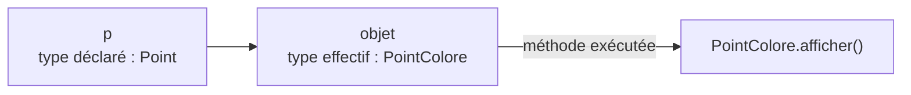
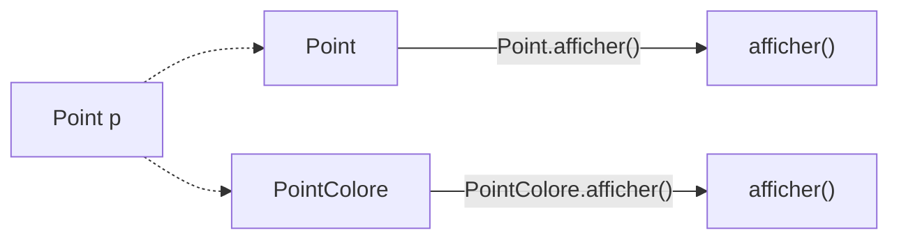
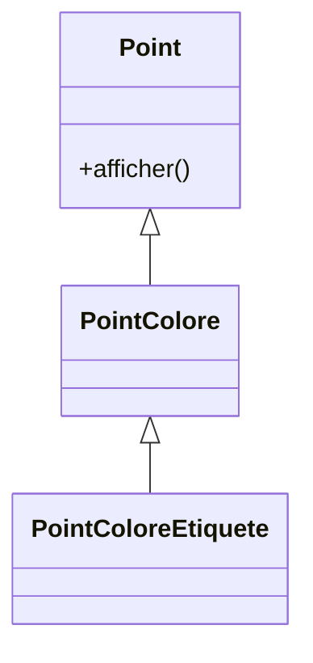
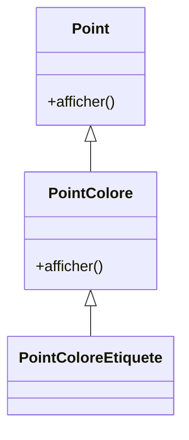
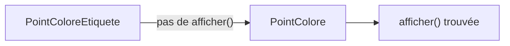
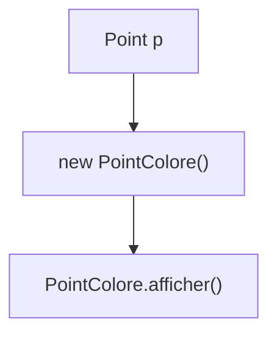

# Même référence, objets différents

Considérons une référence de type `Point`.

```java
Point p;
```

Elle peut désigner différents objets :

<div class="grid grid-cols-2 gap-8 mt-6">

<div class="border border-gray-200 rounded-lg p-5">

### Un `Point`

```java
p = new Point();
p.afficher();
```

</div>

<div class="border border-gray-200 rounded-lg p-5">

### Un `PointColore`

```java
p = new PointColore();
p.afficher();
```

</div>

</div>

<div class="border-t border-gray-200 mt-7 pt-4 text-center font-medium">

La même expression `p.afficher()` est utilisée dans les deux cas.

</div>

---
layout: default
---

# Que va afficher ce programme ?

Nous avons deux classes qui définissent la même méthode.

<div class="grid grid-cols-2 gap-8 mt-5">

<div>

### `Point`

```java
public class Point {

    public void afficher() {
        System.out.println("Point");
    }
}
```

</div>

<div>

### `PointColore`

```java
public class PointColore extends Point {

    @Override
    public void afficher() {
        System.out.println("Point coloré");
    }
}
```

</div>

</div>

<div class="mt-5">

```java
Point p = new PointColore();

p.afficher();
```

</div>

<div v-click class="border-t border-gray-200 mt-5 pt-4 text-center text-lg font-medium">

Résultat : `Point coloré`

</div>

---
layout: default
---

# Pourquoi `PointColore.afficher()` ?

Avec :

```java
Point p = new PointColore();

p.afficher();
```

<div class="grid grid-cols-2 gap-8 mt-7">

<div class="border border-gray-200 rounded-lg p-5 text-center">

### Type déclaré

`Point`

<div class="mt-3 text-gray-600">
Type de la référence `p`
</div>

</div>

<div class="border border-gray-200 rounded-lg p-5 text-center">

### Type effectif

`PointColore`

<div class="mt-3 text-gray-600">
Type de l’objet réellement référencé
</div>

</div>

</div>

<div v-click class="mt-7 text-center text-lg">

L’objet référencé est un `PointColore`.

</div>

<div v-click class="border-t border-gray-200 mt-6 pt-4 text-center font-medium">

C’est donc la version `PointColore.afficher()` qui est exécutée.

</div>

---
layout: default
---

# Le type effectif de l’objet

Observons successivement les deux affectations.

<div class="grid grid-cols-2 gap-8 mt-6">

<div class="border border-gray-200 rounded-lg p-5">

```java
Point p = new Point();

p.afficher();
```

<div class="mt-5 text-center">

Type effectif : `Point`

</div>

<div class="mt-3 text-center font-medium">

→ `Point.afficher()`

</div>

</div>

<div class="border border-gray-200 rounded-lg p-5">

```java
Point p = new PointColore();

p.afficher();
```

<div class="mt-5 text-center">

Type effectif : `PointColore`

</div>

<div class="mt-3 text-center font-medium">

→ `PointColore.afficher()`

</div>

</div>

</div>

<div class="border-t border-gray-200 mt-7 pt-4 text-center font-medium">

Pour une méthode redéfinie, la version exécutée dépend du type effectif de l’objet.

</div>

---
layout: default
---

# La liaison dynamique

Considérons :

```java
Point p = new PointColore();

p.afficher();
```

<div class="flex justify-center mt-7">



</div>

<div class="mt-7 text-center text-lg">

Java détermine la version de la méthode à exécuter en fonction de l’objet réellement référencé.

</div>

<div class="border-t border-gray-200 mt-7 pt-4 text-center font-medium">

Ce mécanisme est appelé **liaison dynamique**.

</div>

---
layout: default
---

# Le choix se fait à l’exécution

La référence reste de type `Point`.

```java
Point p;
```

Mais l’objet qu’elle référence peut changer :

<div class="mt-5">

```java
p = new Point();
p.afficher();          // Point

p = new PointColore();
p.afficher();          // Point coloré
```

</div>

<div class="flex justify-center mt-6">



</div>

<div class="border-t border-gray-200 mt-5 pt-4 text-center font-medium">

Le même appel peut donc produire des comportements différents selon l’objet référencé.

</div>

---
layout: default
---

# Et si la méthode n’est pas redéfinie ?

Ajoutons une méthode uniquement dans `Point`.

```java
public class Point {

    public void deplacer(int dx, int dy) {
        // ...
    }
}
```

`PointColore` hérite de cette méthode sans la redéfinir.

```java
public class PointColore extends Point {
    // aucune méthode deplacer(...)
}
```

<div v-click class="mt-5">

```java
Point p = new PointColore();

p.deplacer(2, 3);
```

</div>

<div v-click class="border-t border-gray-200 mt-6 pt-4 text-center font-medium">

Java utilise la méthode héritée `Point.deplacer(...)`.

</div>

---
layout: default
---

# La recherche remonte la hiérarchie

Considérons trois niveaux :

<div class="flex justify-center mt-5">



</div>

Avec :

```java
Point p = new PointColoreEtiquete();

p.afficher();
```

<div v-click class="mt-5 text-center">

`PointColoreEtiquete` ne redéfinit pas `afficher()`.

</div>

<div v-click class="mt-3 text-center">

`PointColore` ne redéfinit pas `afficher()`.

</div>

<div v-click class="border-t border-gray-200 mt-5 pt-4 text-center font-medium">

Java remonte la hiérarchie jusqu’à trouver `Point.afficher()`.

</div>

---
layout: default
---

# Et si un niveau redéfinit la méthode ?

Cette fois, `PointColore` redéfinit `afficher()`.

<div class="flex justify-center mt-5">



</div>

Avec :

```java
Point p = new PointColoreEtiquete();

p.afficher();
```

<div v-click class="flex justify-center mt-5">



</div>

<div v-click class="border-t border-gray-200 mt-5 pt-4 text-center font-medium">

La première version rencontrée en remontant la hiérarchie est exécutée : `PointColore.afficher()`.

</div>

---
layout: default
---

# Une même méthode, plusieurs comportements

Considérons :

```java
Point p;
```

<div class="grid grid-cols-2 gap-8 mt-6">

<div>

```java
p = new Point();
p.afficher();
```

<div class="mt-3 text-center font-medium">

→ `Point.afficher()`

</div>

</div>

<div>

```java
p = new PointColore();
p.afficher();
```

<div class="mt-3 text-center font-medium">

→ `PointColore.afficher()`

</div>

</div>

</div>

<div class="mt-8 text-center text-lg">

L’appel reste :

```java
p.afficher();
```

</div>

<div class="border-t border-gray-200 mt-6 pt-4 text-center font-medium">

Un même appel peut déclencher des comportements différents : c’est le cœur du polymorphisme.

</div>

---
layout: default
---

# Liaison dynamique

<div class="grid grid-cols-[0.9fr_1.4fr] gap-10 mt-7 items-center">

<div class="flex justify-center">



</div>

<div>

### À retenir

- une référence peut désigner un objet d’une classe dérivée
- une méthode peut être redéfinie dans cette classe dérivée
- pour une méthode redéfinie, la version exécutée dépend du **type effectif**
- le choix de cette version se fait à **l’exécution**
- si la méthode n’est pas redéfinie, la recherche remonte la hiérarchie

</div>

</div>

<div class="border-t border-gray-200 mt-7 pt-4 text-center font-medium">

La liaison dynamique permet à un même appel de méthode de produire un comportement adapté à l’objet réellement référencé.

</div>