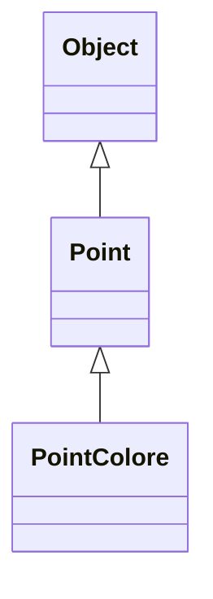
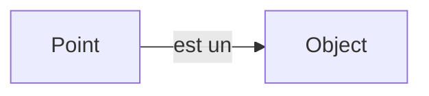
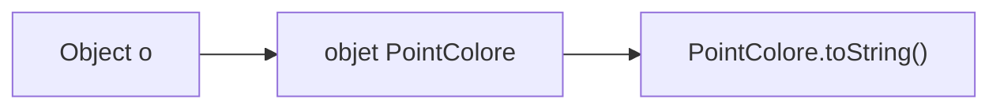
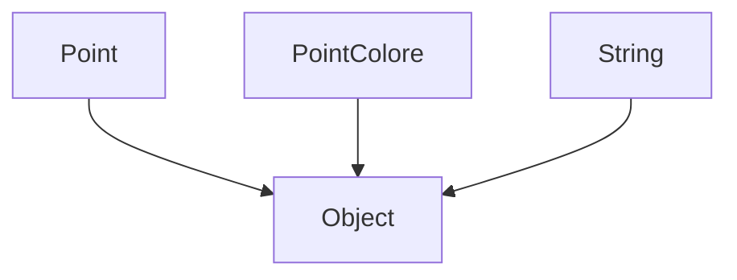

# Toutes les classes héritent de `Object`

En Java, toutes les classes appartiennent à une même hiérarchie.

<div class="flex justify-center mt-7">



</div>

<div class="mt-7 text-center text-lg">

Même si nous n’écrivons pas explicitement :

```java
extends Object
```

</div>

<div class="border-t border-gray-200 mt-7 pt-4 text-center font-medium">

Toute classe Java hérite directement ou indirectement de `Object`.

</div>

---
layout: default
---

# `Point` est aussi un `Object`

Considérons :

```java
Point p = new Point();
```

Puis :

```java
Object o = p;
```

<div class="flex justify-center mt-7">



</div>

<div class="mt-7 text-center text-lg">

Un `Point` peut donc être référencé par une variable de type `Object`.

</div>

<div class="border-t border-gray-200 mt-7 pt-4 text-center font-medium">

`Object` est le type le plus général pour les objets Java.

</div>

---
layout: default
---

# Que peut référencer une variable `Object` ?

Considérons :

```java
Object o;
```

Cette référence peut désigner des objets très différents.

<div class="grid grid-cols-3 gap-5 mt-7">

<div class="border border-gray-200 rounded-lg p-4 text-center">

```java
o = new Point();
```

✓

</div>

<div class="border border-gray-200 rounded-lg p-4 text-center">

```java
o = new PointColore();
```

✓

</div>

<div class="border border-gray-200 rounded-lg p-4 text-center">

```java
o = new String("Java");
```

✓

</div>

</div>

<div class="border-t border-gray-200 mt-7 pt-4 text-center font-medium">

Une référence `Object` peut désigner un objet de n’importe quelle classe.

</div>

---
layout: default
---

# Mais que peut-on appeler sur `Object` ?

Considérons :

```java
Object o = new PointColore();
```

L’objet réel est bien un `PointColore`.

Mais le type déclaré de `o` est :

```java
Object
```

<div class="mt-7 text-center text-lg">

Le compilateur ne permet donc d’appeler que les méthodes connues dans `Object`.

</div>

<div class="border-t border-gray-200 mt-7 pt-4 text-center font-medium">

Le type déclaré `Object` donne une vue très générale de l’objet.

</div>

---
layout: default
---

# Exemple : une méthode propre à `Point`

Supposons que `Point` possède :

```java
public void afficher() {
    System.out.println("Point");
}
```

Puis :

```java
Object o = new Point();

o.afficher();
```

<div v-click class="mt-6 text-center text-lg font-medium">

✗ Erreur de compilation

</div>

<div v-click class="mt-5 text-center">

`afficher()` n’est pas déclarée dans `Object`.

</div>

<div v-click class="border-t border-gray-200 mt-7 pt-4 text-center font-medium">

Le type effectif ne rend pas accessibles les méthodes absentes du type déclaré.

</div>

---
layout: default
---

# Les méthodes héritées de `Object`

Toutes les classes héritent de plusieurs méthodes définies dans `Object`.

<div class="grid grid-cols-3 gap-5 mt-7">

<div class="border border-gray-200 rounded-lg p-4 text-center">

### `toString()`

Fournit une représentation textuelle de l’objet.

</div>

<div class="border border-gray-200 rounded-lg p-4 text-center">

### `equals(...)`

Permet de comparer un objet avec un autre.

</div>

<div class="border border-gray-200 rounded-lg p-4 text-center">

### `getClass()`

Retourne la classe effective de l’objet.

</div>

</div>

<div class="border-t border-gray-200 mt-7 pt-4 text-center font-medium">

Ces méthodes sont disponibles dans toutes les classes Java.

</div>

---
layout: default
---

# Afficher un objet avec `toString()`

Considérons :

```java
Point p = new Point();
```

Nous pouvons écrire :

```java
System.out.println(p);
```

<div v-click class="mt-6 text-center text-lg">

Java utilise alors la représentation textuelle de l’objet.

</div>

<div v-click class="mt-5 text-center">

Cette représentation provient de :

```java
p.toString()
```

</div>

<div v-click class="border-t border-gray-200 mt-7 pt-4 text-center font-medium">

`toString()` fournit une représentation textuelle d’un objet.

</div>

---
layout: default
---

# La version héritée de `toString()`

Si `Point` ne redéfinit pas `toString()` :

```java
Point p = new Point();

System.out.println(p.toString());
```

le résultat ressemble à :

```text
Point@5acf9800
```

<div class="mt-6 text-center">

Cette représentation contient notamment le nom de la classe et une valeur hexadécimale dérivée du hash code.

</div>

<div class="border-t border-gray-200 mt-7 pt-4 text-center font-medium">

La version héritée de `Object.toString()` est rarement adaptée à l’affichage métier d’un objet.

</div>

---
layout: default
---

# Redéfinir `toString()`

Nous pouvons fournir une représentation plus utile.

```java
public class Point {

    private int x;
    private int y;

    @Override
    public String toString() {
        return "(" + x + ", " + y + ")";
    }
}
```

Puis :

```java
Point p = new Point();

System.out.println(p);
```

<div v-click class="mt-5 text-center text-lg font-medium">

→ `(x, y)`

</div>

<div class="border-t border-gray-200 mt-6 pt-4 text-center font-medium">

Redéfinir `toString()` permet d’obtenir une représentation adaptée à la classe.

</div>

---
layout: default
---

# `toString()` et polymorphisme

Considérons :

```java
Object o = new PointColore();
```

Si `PointColore` redéfinit `toString()` :

```java
System.out.println(o);
```

<div v-click class="mt-6 text-center text-lg">

Java exécute la version correspondant au type effectif de l’objet.

</div>

<div class="flex justify-center mt-6">



</div>

<div class="border-t border-gray-200 mt-6 pt-4 text-center font-medium">

`toString()` est une méthode comme les autres : si elle est redéfinie, la liaison dynamique s’applique.

</div>

---
layout: default
---

# Comparer deux objets avec `equals()`

Considérons :

```java
Point p1 = new Point();
Point p2 = new Point();
```

Nous pouvons écrire :

```java
p1.equals(p2);
```

<div class="mt-7 text-center text-lg">

La méthode `equals(...)` est héritée de `Object`.

</div>

<div class="border-t border-gray-200 mt-7 pt-4 text-center font-medium">

Toutes les classes disposent donc d’une méthode `equals(...)`.

</div>

---
layout: default
---

# Que fait `Object.equals()` ?

Par défaut, la méthode héritée de `Object` compare les références.

<div class="grid grid-cols-2 gap-8 mt-7">

<div class="border border-gray-200 rounded-lg p-5">

```java
Point p1 = new Point();
Point p2 = new Point();

p1.equals(p2);
```

<div class="mt-4 text-center font-medium">

→ généralement `false`

</div>

</div>

<div class="border border-gray-200 rounded-lg p-5">

```java
Point p1 = new Point();
Point p2 = p1;

p1.equals(p2);
```

<div class="mt-4 text-center font-medium">

→ `true`

</div>

</div>

</div>

<div class="border-t border-gray-200 mt-7 pt-4 text-center font-medium">

Sans redéfinition, `equals()` teste si les deux références désignent le même objet.

</div>

---
layout: default
---

# `==` ou `equals()` ?

Considérons deux références :

```java
Point p1 = ...;
Point p2 = ...;
```

<div class="grid grid-cols-2 gap-8 mt-7">

<div class="border border-gray-200 rounded-lg p-5">

### `==`

```java
p1 == p2
```

Compare les références.

<div class="mt-4 text-center">

Même objet ?

</div>

</div>

<div class="border border-gray-200 rounded-lg p-5">

### `equals()`

```java
p1.equals(p2)
```

Peut être redéfinie pour exprimer une égalité adaptée à la classe.

</div>

</div>

<div class="border-t border-gray-200 mt-7 pt-4 text-center font-medium">

`==` compare les références ; `equals()` peut représenter une égalité logique si elle est redéfinie.

</div>

---
layout: default
---

# Redéfinir `equals()`

Pour `Point`, on peut vouloir considérer deux objets égaux s’ils ont les mêmes coordonnées.

```java
@Override
public boolean equals(Object obj) {
    if (this == obj)
        return true;

    if (!(obj instanceof Point))
        return false;

    Point p = (Point) obj;

    return x == p.x && y == p.y;
}
```

<div class="border-t border-gray-200 mt-6 pt-4 text-center font-medium">

La redéfinition de `equals()` permet de définir ce que signifie « deux objets égaux » pour une classe donnée.

</div>

---
layout: default
---

# Pourquoi le paramètre est-il de type `Object` ?

La signature héritée est :

```java
public boolean equals(Object obj)
```

Donc une redéfinition correcte conserve cette signature :

```java
@Override
public boolean equals(Object obj)
```

et non :

```java
public boolean equals(Point p)
```

<div v-click class="mt-6 text-center">

Cette deuxième méthode serait une **surcharge**, pas une redéfinition.

</div>

<div v-click class="border-t border-gray-200 mt-7 pt-4 text-center font-medium">

Pour redéfinir `equals()`, il faut conserver le paramètre de type `Object`.

</div>

---
layout: default
---

# `equals()` et type effectif

Considérons :

```java
Object o = new Point();
```

Puis :

```java
o.equals(...);
```

<div class="mt-6 text-center text-lg">

L’appel est valide car `equals()` existe dans `Object`.

</div>

<div v-click class="mt-5 text-center">

Si `Point` redéfinit `equals()`, la version de `Point` sera exécutée.

</div>

<div v-click class="border-t border-gray-200 mt-7 pt-4 text-center font-medium">

`equals()` bénéficie elle aussi de la liaison dynamique.

</div>

---
layout: default
---

# `Object` comme type commun

Grâce à `Object`, on peut manipuler des objets de classes très différentes avec un même type.

```java
Object a = new Point();
Object b = new PointColore();
Object c = new String("Java");
```

<div class="flex justify-center mt-7">



</div>

<div class="border-t border-gray-200 mt-6 pt-4 text-center font-medium">

`Object` fournit le type commun le plus général de tous les objets Java.

</div>

---
layout: default
---

# La classe `Object`

<div class="grid grid-cols-[0.8fr_1.4fr] gap-10 mt-7 items-center">

<div class="flex justify-center">


</div>

<div>

### À retenir

- toutes les classes Java héritent de `Object`
- une référence `Object` peut désigner un objet de n’importe quelle classe
- les méthodes accessibles dépendent toujours du type déclaré
- `toString()` fournit une représentation textuelle d’un objet
- `equals()` permet de comparer des objets
- `==` compare les références
- `toString()` et `equals()` peuvent être redéfinies
- la liaison dynamique s’applique à ces méthodes redéfinies

</div>

</div>

<div class="border-t border-gray-200 mt-7 pt-4 text-center font-medium">

`Object` constitue la racine commune de toutes les classes Java.

</div>