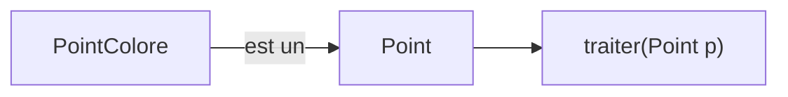
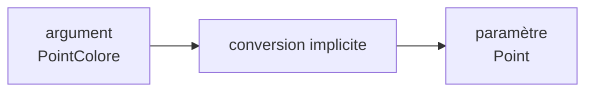
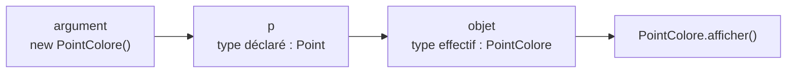
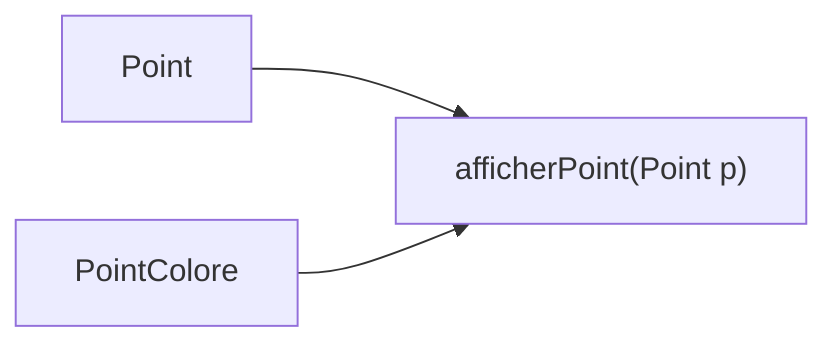
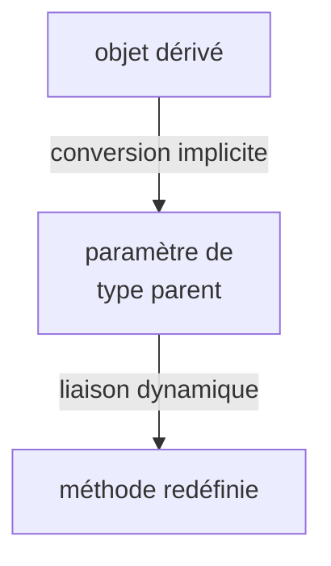

# Une méthode qui attend un `Point`

Considérons une méthode qui reçoit un objet de type `Point`.

```java
public static void traiter(Point p) {
    p.afficher();
}
```

Nous pouvons naturellement écrire :

```java
Point p = new Point();

traiter(p);
```

<div class="border-t border-gray-200 mt-7 pt-4 text-center font-medium">

Le paramètre formel de `traiter(...)` est de type `Point`.

</div>

---
layout: default
---

# Peut-on lui passer un `PointColore` ?

Considérons :

```java
PointColore pc = new PointColore();
```

Puis :

```java
traiter(pc);
```

<div class="mt-7 text-center text-lg">

Correct ou incorrect ?

</div>

<div v-click class="mt-6 text-center text-lg font-medium">

✓ Correct

</div>

<div v-click class="border-t border-gray-200 mt-7 pt-4 text-center font-medium">

Un `PointColore` peut être utilisé là où un `Point` est attendu.

</div>

---
layout: default
---

# Pourquoi cet appel est-il accepté ?

Nous avons :

```java
public static void traiter(Point p) {
    p.afficher();
}
```

et :

```java
PointColore pc = new PointColore();

traiter(pc);
```

<div class="flex justify-center mt-7">



</div>

<div class="border-t border-gray-200 mt-7 pt-4 text-center font-medium">

La compatibilité des références s’applique aussi lors du passage des arguments.

</div>

---
layout: default
---

# Conversion implicite de l’argument

Lors de l’appel :

```java
traiter(pc);
```

avec :

```java
PointColore pc = new PointColore();
```

le paramètre :

```java
Point p
```

peut recevoir cette référence.

<div class="flex justify-center mt-7">



</div>

<div class="border-t border-gray-200 mt-7 pt-4 text-center font-medium">

Une référence vers une classe dérivée est convertie implicitement vers une référence de classe de base.

</div>

---
layout: default
---

# Quel est le type de `p` dans la méthode ?

Avec :

```java
PointColore pc = new PointColore();

traiter(pc);
```

et :

```java
public static void traiter(Point p) {
    p.afficher();
}
```

<div class="grid grid-cols-2 gap-8 mt-7">

<div class="border border-gray-200 rounded-lg p-5 text-center">

### Type déclaré de `p`

`Point`

<div class="mt-3 text-gray-600">

Déterminé par la déclaration du paramètre.

</div>

</div>

<div class="border border-gray-200 rounded-lg p-5 text-center">

### Type effectif de l’objet

`PointColore`

<div class="mt-3 text-gray-600">

L’objet transmis reste un `PointColore`.

</div>

</div>

</div>

<div class="border-t border-gray-200 mt-7 pt-4 text-center font-medium">

Le passage en argument ne change pas le type réel de l’objet.

</div>

---
layout: default
---

# Quelle méthode `afficher()` sera exécutée ?

Considérons :

<div class="grid grid-cols-2 gap-8 mt-5">

<div>

### `Point`

```java
class Point {

    public void afficher() {
        System.out.println("Point");
    }
}
```

</div>

<div>

### `PointColore`

```java
class PointColore extends Point {

    @Override
    public void afficher() {
        System.out.println("Point coloré");
    }
}
```

</div>

</div>

Puis :

```java
public static void traiter(Point p) {
    p.afficher();
}

traiter(new PointColore());
```

<div v-click class="mt-5 text-center text-lg font-medium">

→ `Point coloré`

</div>

---
layout: default
---

# Pourquoi `PointColore.afficher()` ?

Dans :

```java
public static void traiter(Point p) {
    p.afficher();
}
```

le paramètre `p` est déclaré comme `Point`.

Mais lors de :

```java
traiter(new PointColore());
```

l’objet référencé est un `PointColore`.

<div class="flex justify-center mt-7">



</div>

<div class="border-t border-gray-200 mt-6 pt-4 text-center font-medium">

La liaison dynamique fonctionne aussi pour les objets reçus en paramètre.

</div>

---
layout: default
---

# Une méthode peut traiter plusieurs sous-types

La même méthode :

```java
public static void traiter(Point p) {
    p.afficher();
}
```

peut recevoir plusieurs objets.

<div class="grid grid-cols-3 gap-5 mt-7">

<div class="border border-gray-200 rounded-lg p-4 text-center">

```java
traiter(
    new Point()
);
```

→ `Point`

</div>

<div class="border border-gray-200 rounded-lg p-4 text-center">

```java
traiter(
    new PointColore()
);
```

→ `PointColore`

</div>

<div class="border border-gray-200 rounded-lg p-4 text-center">

```java
traiter(
    new PointColoreEtiquete()
);
```

→ comportement adapté

</div>

</div>

<div class="border-t border-gray-200 mt-7 pt-4 text-center font-medium">

Une seule méthode peut manipuler plusieurs types d’objets d’une même hiérarchie.

</div>

---
layout: default
---

# Et si la méthode n’est pas redéfinie ?

Supposons que `PointColore` ne redéfinisse pas `afficher()`.

```java
class Point {

    public void afficher() {
        System.out.println("Point");
    }
}

class PointColore extends Point {
}
```

Puis :

```java
public static void traiter(Point p) {
    p.afficher();
}

traiter(new PointColore());
```

<div v-click class="mt-6 text-center text-lg font-medium">

→ `Point`

</div>

<div v-click class="border-t border-gray-200 mt-7 pt-4 text-center font-medium">

Si la classe dérivée ne redéfinit pas la méthode, la version héritée est utilisée.

</div>

---
layout: default
---

# Le paramètre reste de type `Point`

Considérons maintenant une méthode propre à `PointColore` :

```java
class PointColore extends Point {

    public void changerCouleur() {
        // ...
    }
}
```

Dans :

```java
public static void traiter(Point p) {

    p.changerCouleur();
}
```

<div v-click class="mt-6 text-center text-lg font-medium">

✗ Erreur de compilation

</div>

<div v-click class="mt-5 text-center">

Même si l’objet transmis peut être un `PointColore`.

</div>

<div v-click class="border-t border-gray-200 mt-7 pt-4 text-center font-medium">

Le type déclaré du paramètre détermine les méthodes accessibles dans le corps de la méthode.

</div>

---
layout: default
---

# Plusieurs arguments, un même traitement

Nous pouvons maintenant écrire :

```java
public static void afficherPoint(Point p) {
    p.afficher();
}
```

Et l’utiliser avec :

```java
Point p = new Point();
PointColore pc = new PointColore();

afficherPoint(p);
afficherPoint(pc);
```

<div class="flex justify-center mt-7">



</div>

<div class="border-t border-gray-200 mt-6 pt-4 text-center font-medium">

Le polymorphisme permet de généraliser le traitement à toute une famille de classes.

</div>

---
layout: default
---

# Et avec une méthode surchargée ?

Considérons maintenant :

```java
public static void traiter(Point p) {
    System.out.println("Point");
}

public static void traiter(PointColore p) {
    System.out.println("PointColore");
}
```

Puis :

```java
PointColore pc = new PointColore();

traiter(pc);
```

<div v-click class="mt-6 text-center text-lg font-medium">

→ `traiter(PointColore)`

</div>

<div v-click class="border-t border-gray-200 mt-7 pt-4 text-center font-medium">

Avec une surcharge, le compilateur cherche la signature la plus adaptée à l’argument.

</div>

---
layout: default
---

# Le type déclaré de l’argument compte

Considérons les mêmes méthodes :

```java
public static void traiter(Point p) {
    System.out.println("Point");
}

public static void traiter(PointColore p) {
    System.out.println("PointColore");
}
```

Mais cette fois :

```java
Point p = new PointColore();

traiter(p);
```

<div v-click class="mt-6 text-center text-lg font-medium">

→ `traiter(Point)`

</div>

<div v-click class="mt-5 text-center">

Le type déclaré de l’argument est `Point`.

</div>

<div v-click class="border-t border-gray-200 mt-7 pt-4 text-center font-medium">

La surcharge est résolue à la compilation à partir des types déclarés.

</div>

---
layout: default
---

# Deux appels, deux résultats

<div class="grid grid-cols-2 gap-8 mt-7">

<div class="border border-gray-200 rounded-lg p-5">

### Référence `PointColore`

```java
PointColore pc =
    new PointColore();

traiter(pc);
```

<div class="mt-4 text-center font-medium">

→ `traiter(PointColore)`

</div>

</div>

<div class="border border-gray-200 rounded-lg p-5">

### Référence `Point`

```java
Point p =
    new PointColore();

traiter(p);
```

<div class="mt-4 text-center font-medium">

→ `traiter(Point)`

</div>

</div>

</div>

<div class="border-t border-gray-200 mt-7 pt-4 text-center font-medium">

Même objet effectif, mais type déclaré différent : la surcharge choisie peut changer.

</div>

---
layout: default
---

# Passage d’arguments et polymorphisme

<div class="grid grid-cols-[0.8fr_1.4fr] gap-10 mt-7 items-center">

<div class="flex justify-center">



</div>

<div>

### À retenir

- un objet dérivé peut être passé à une méthode qui attend sa classe de base
- cette conversion est implicite
- le paramètre conserve son **type déclaré**
- l’objet conserve son **type effectif**
- les méthodes accessibles dépendent du type déclaré du paramètre
- une méthode redéfinie est choisie selon le type effectif
- en cas de surcharge, la signature est choisie à la compilation

</div>

</div>

<div class="border-t border-gray-200 mt-7 pt-4 text-center font-medium">

Le polymorphisme permet d’écrire une méthode générale capable de traiter plusieurs types d’objets d’une même hiérarchie.

</div>