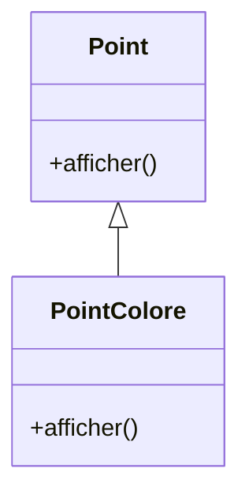
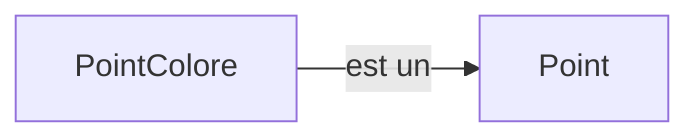
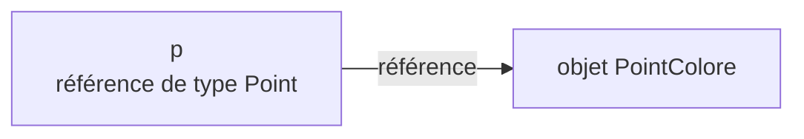
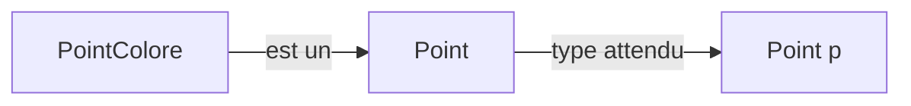
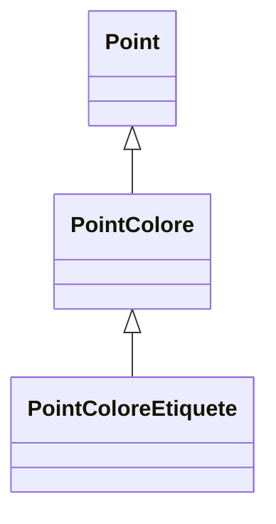
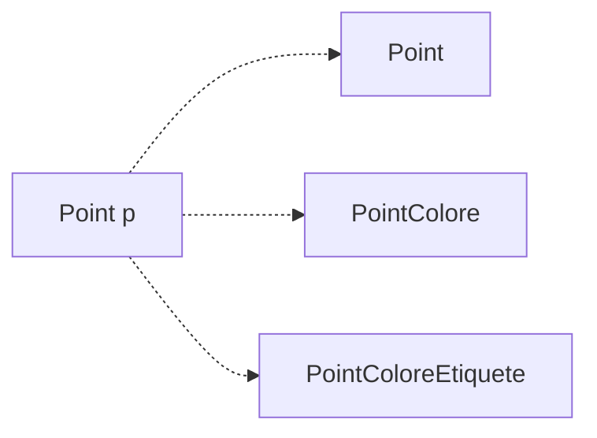

# Repartons de `Point` et `PointColore`

Nous savons maintenant construire une hiérarchie de classes.

<div class="grid grid-cols-2 gap-10 mt-6 items-center">

<div>

```java
public class Point {
    public void afficher() {
        System.out.println("Point");
    }
}

public class PointColore extends Point {
    @Override
    public void afficher() {
        System.out.println("Point coloré");
    }
}
```

</div>

<div class="flex justify-center">



</div>

</div>

<div class="border-t border-gray-200 mt-5 pt-4 text-center font-medium">

`PointColore` hérite de `Point` et adapte son comportement `afficher()`.

</div>

---
layout: default
---

# Un `PointColore` est aussi un `Point`

Un objet `PointColore` possède les caractéristiques d’un `Point` et ajoute les siennes.

<div class="flex justify-center mt-8">



</div>

<div class="grid grid-cols-2 gap-8 mt-8">

<div class="border border-gray-200 rounded-lg p-5">

### `Point`

- peut être déplacé
- peut être affiché

</div>

<div class="border border-gray-200 rounded-lg p-5">

### `PointColore`

- peut être déplacé
- peut être affiché
- possède une couleur

</div>

</div>

<div class="border-t border-gray-200 mt-6 pt-4 text-center font-medium">

La relation d’héritage exprime une relation **« est un »**.

</div>

---
layout: default
---

# Une référence `Point` vers un `PointColore`

Considérons d’abord une référence et un objet du même type :

```java
Point p = new Point();
```

<div v-click class="mt-5">

Nous pouvons également écrire :

```java
Point p = new PointColore();
```

</div>

<div v-click class="grid grid-cols-2 gap-10 mt-6 items-center">

<div>

### Type de la référence

```java
Point
```

</div>

<div>

### Type de l’objet créé

```java
PointColore
```

</div>

</div>

<div v-click class="border-t border-gray-200 mt-6 pt-4 text-center font-medium">

Une référence d’une classe peut désigner un objet d’une classe dérivée.

</div>

---
layout: default
---

# Que contient réellement `p` ?

Avec :

```java
Point p = new PointColore();
```

<div class="flex justify-center mt-8">



</div>

<div class="grid grid-cols-2 gap-8 mt-8">

<div class="border border-gray-200 rounded-lg p-5 text-center">

### Type déclaré

`Point`

Type écrit dans la déclaration de la variable.

</div>

<div class="border border-gray-200 rounded-lg p-5 text-center">

### Type effectif

`PointColore`

Type de l’objet réellement créé.

</div>

</div>

<div class="border-t border-gray-200 mt-6 pt-4 text-center font-medium">

Le type de la référence et le type de l’objet référencé peuvent être différents.

</div>

---
layout: default
---

# Quelles affectations sont possibles ?

Considérons :

```java
public class Point { }

public class PointColore extends Point { }
```

<div class="grid grid-cols-2 gap-8 mt-7">

<div class="border border-gray-200 rounded-lg p-5">

### Correct ✓

```java
Point p1 = new Point();

PointColore p2 =
    new PointColore();

Point p3 =
    new PointColore();
```

</div>

<div class="border border-gray-200 rounded-lg p-5">

### Incorrect ✗

```java
PointColore p4 =
    new Point();
```

<div class="mt-4 text-gray-600">

Un `Point` n’est pas nécessairement un `PointColore`.

</div>

</div>

</div>

<div class="border-t border-gray-200 mt-6 pt-4 text-center font-medium">

Un objet d’une classe dérivée peut être affecté à une référence d’une de ses classes de base.

</div>

---
layout: default
---

# Pourquoi cette affectation fonctionne-t-elle ?

```java
Point p = new PointColore();
```

<div class="flex justify-center mt-8">



</div>

<div class="mt-8 text-center text-lg">

Tout `PointColore` est un `Point`.

</div>

<div v-click class="mt-6 text-center">

Mais tout `Point` n’est pas nécessairement un `PointColore`.

</div>

<div v-click class="border-t border-gray-200 mt-7 pt-4 text-center font-medium">

L’affectation est compatible lorsqu’on remonte la hiérarchie vers une classe de base.

</div>

---
layout: default
---

# La relation « est un »

Pour une hiérarchie plus grande :

<div class="flex justify-center mt-6">



</div>

<div class="grid grid-cols-2 gap-8 mt-6">

<div class="border border-gray-200 rounded-lg p-5">

`PointColoreEtiquete` **est un** `PointColore`.

```java
PointColore pc =
    new PointColoreEtiquete();
```

</div>

<div class="border border-gray-200 rounded-lg p-5">

`PointColoreEtiquete` **est aussi un** `Point`.

```java
Point p =
    new PointColoreEtiquete();
```

</div>

</div>

<div class="border-t border-gray-200 mt-6 pt-4 text-center font-medium">

La compatibilité s’étend à toutes les classes de base directes ou indirectes.

</div>

---
layout: default
---

# Une même référence, plusieurs objets possibles

Une référence de type `Point` peut désigner différents objets de la hiérarchie.

```java
Point p;

p = new Point();
p = new PointColore();
p = new PointColoreEtiquete();
```

<div class="flex justify-center mt-7">



</div>

<div class="border-t border-gray-200 mt-6 pt-4 text-center font-medium">

Une même variable peut référencer successivement des objets de types différents appartenant à la même hiérarchie.

</div>

---
layout: default
---

# Pourquoi est-ce intéressant ?

Sans type commun, il faudrait manipuler chaque classe séparément.

<div class="grid grid-cols-2 gap-8 mt-6">

<div>

### Références spécialisées

```java
Point p = new Point();

PointColore pc =
    new PointColore();

PointColoreEtiquete pe =
    new PointColoreEtiquete();
```

</div>

<div>

### Référence commune

```java
Point p;

p = new Point();
p = new PointColore();
p = new PointColoreEtiquete();
```

</div>

</div>

<div v-click class="mt-7 text-center text-lg">

Nous pouvons manipuler plusieurs objets différents à travers un **même type de référence**.

</div>

<div v-click class="border-t border-gray-200 mt-6 pt-4 text-center font-medium">

C’est l’une des bases du polymorphisme.

</div>

---
layout: default
---

# Références et héritage

<div class="grid grid-cols-[0.8fr_1.4fr] gap-10 mt-7 items-center">

<div class="flex justify-center">


</div>

<div>

### À retenir

- une référence possède un **type déclaré**
- l’objet référencé possède un **type effectif**
- une référence de classe de base peut désigner un objet dérivé
- cette compatibilité suit la hiérarchie d’héritage
- un objet dérivé peut être manipulé à travers un type plus général

</div>

</div>

<div class="border-t border-gray-200 mt-7 pt-4 text-center font-medium">

Le polymorphisme commence par la possibilité de manipuler des objets spécialisés à travers une référence plus générale.

</div>