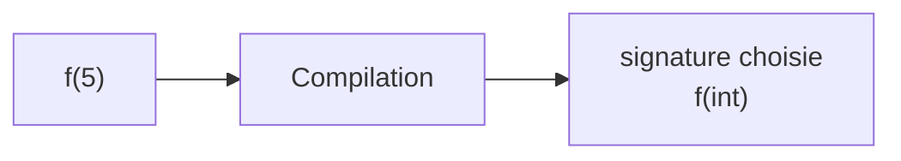
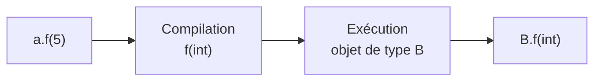
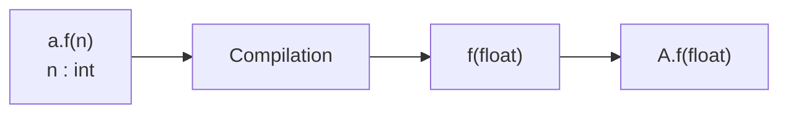
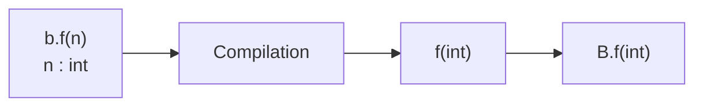
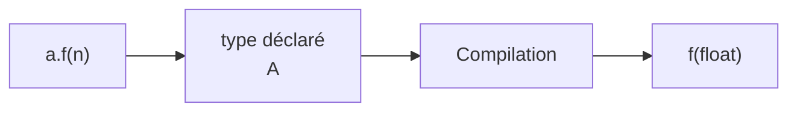
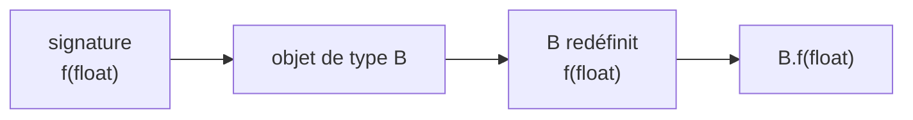
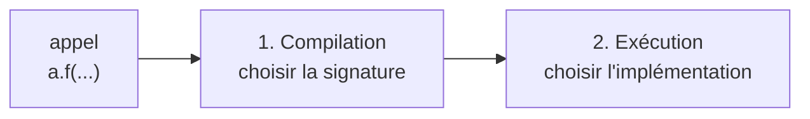
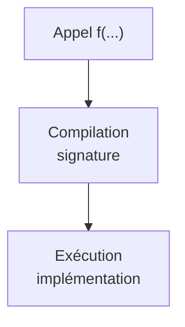

# Redéfinition ou surcharge ?

Nous avons déjà rencontré deux mécanismes différents.

<div class="grid grid-cols-2 gap-8 mt-6">

<div class="border border-gray-200 rounded-lg p-5">

### Redéfinition

Même méthode dans une classe dérivée.

```java
class A {
    public void f(int n) { }
}

class B extends A {
    @Override
    public void f(int n) { }
}
```

</div>

<div class="border border-gray-200 rounded-lg p-5">

### Surcharge

Même nom, paramètres différents.

```java
class A {
    public void f(int n) { }

    public void f(double x) { }
}
```

</div>

</div>

<div class="border-t border-gray-200 mt-6 pt-4 text-center font-medium">

Redéfinir change l’implémentation d’une méthode héritée ; surcharger propose plusieurs signatures.

</div>

---
layout: default
---

# Comment Java choisit-il une méthode surchargée ?

Considérons :

```java
class A {

    public void f(int n) {
        System.out.println("f(int)");
    }

    public void f(double x) {
        System.out.println("f(double)");
    }
}
```

<div class="grid grid-cols-2 gap-8 mt-6">

<div class="border border-gray-200 rounded-lg p-5">

```java
A a = new A();

a.f(5);
```

<div v-click class="mt-4 text-center font-medium">

→ `f(int)`

</div>

</div>

<div class="border border-gray-200 rounded-lg p-5">

```java
A a = new A();

a.f(5.0);
```

<div v-click class="mt-4 text-center font-medium">

→ `f(double)`

</div>

</div>

</div>

<div v-click class="border-t border-gray-200 mt-6 pt-4 text-center font-medium">

Pour une surcharge, le compilateur choisit la signature compatible avec les arguments.

</div>

---
layout: default
---

# La surcharge est résolue à la compilation

Avec plusieurs méthodes de même nom :

```java
void f(int n)
void f(double x)
```

le compilateur examine notamment les arguments de l’appel.

<div class="flex justify-center mt-7">



</div>

<div class="mt-7 text-center text-lg">

La signature de la méthode est donc déterminée **avant l’exécution**.

</div>

<div class="border-t border-gray-200 mt-7 pt-4 text-center font-medium">

**Surcharge → choix de la signature à la compilation.**

</div>

---
layout: default
---

# Et pour une méthode redéfinie ?

Considérons maintenant :

<div class="grid grid-cols-2 gap-8 mt-5">

<div>

### Classe `A`

```java
class A {

    public void f(int n) {
        System.out.println("A");
    }
}
```

</div>

<div>

### Classe `B`

```java
class B extends A {

    @Override
    public void f(int n) {
        System.out.println("B");
    }
}
```

</div>

</div>

Puis :

```java
A a = new B();

a.f(5);
```

<div v-click class="mt-5 text-center text-lg font-medium">

→ `B.f(int)`

</div>

<div v-click class="border-t border-gray-200 mt-5 pt-4 text-center font-medium">

La signature existe dans `A`, mais la version exécutée est celle de l’objet `B`.

</div>

---
layout: default
---

# La redéfinition intervient à l’exécution

Avec :

```java
A a = new B();

a.f(5);
```

<div class="flex justify-center mt-7">



</div>

<div class="mt-7 text-center text-lg">

La signature `f(int)` est connue à la compilation.

</div>

<div v-click class="mt-3 text-center text-lg">

La version `B.f(int)` est choisie à l’exécution.

</div>

<div v-click class="border-t border-gray-200 mt-6 pt-4 text-center font-medium">

**Redéfinition → choix de l’implémentation à l’exécution.**

</div>

---
layout: default
---

# Quand surcharge et redéfinition se rencontrent

Considérons cette hiérarchie :

<div class="grid grid-cols-2 gap-8 mt-5">

<div>

### Classe `A`

```java
class A {

    public void f(float x) {
        System.out.println("A.f(float)");
    }
}
```

</div>

<div>

### Classe `B`

```java
class B extends A {

    @Override
    public void f(float x) {
        System.out.println("B.f(float)");
    }

    public void f(int n) {
        System.out.println("B.f(int)");
    }
}
```

</div>

</div>

<div class="mt-5 text-center">

`B` **redéfinit** `f(float)` et **surcharge** `f` avec `f(int)`.

</div>

<div class="border-t border-gray-200 mt-5 pt-4 text-center font-medium">

Les deux mécanismes peuvent donc apparaître dans une même hiérarchie.

</div>

---
layout: default
---

# Premier appel : `a.f(n)`

Considérons :

```java
A a = new A();
int n = 5;

a.f(n);
```

Dans `A`, nous avons seulement :

```java
public void f(float x)
```

<div v-click class="mt-6 text-center">

L’argument `int` peut être converti en `float`.

</div>

<div v-click class="flex justify-center mt-5">



</div>

<div v-click class="border-t border-gray-200 mt-5 pt-4 text-center font-medium">

Résultat : `A.f(float)`.

</div>

---
layout: default
---

# Deuxième appel : `b.f(n)`

Cette fois :

```java
B b = new B();
int n = 5;

b.f(n);
```

`B` possède deux méthodes applicables :

```java
f(float)
f(int)
```

<div v-click class="mt-6 text-center">

Pour un argument `int`, `f(int)` correspond directement.

</div>

<div v-click class="flex justify-center mt-5">



</div>

<div v-click class="border-t border-gray-200 mt-5 pt-4 text-center font-medium">

Résultat : `B.f(int)`.

</div>

---
layout: default
---

# Et maintenant ?

Considérons :

```java
A a = new B();
int n = 5;

a.f(n);
```

<div class="grid grid-cols-2 gap-8 mt-7">

<div class="border border-gray-200 rounded-lg p-5 text-center">

### Type déclaré

`A`

<div class="mt-3 text-gray-600">

Le compilateur recherche les méthodes accessibles à partir de `A`.

</div>

</div>

<div class="border border-gray-200 rounded-lg p-5 text-center">

### Type effectif

`B`

<div class="mt-3 text-gray-600">

L’objet réellement référencé est un `B`.

</div>

</div>

</div>

<div v-click class="mt-7 text-center text-lg font-medium">

Quelle méthode sera exécutée ?

</div>

---
layout: default
---

# Étape 1 — Choisir la signature

Avec :

```java
A a = new B();
int n = 5;

a.f(n);
```

Le type déclaré de `a` est `A`.

Dans `A`, le compilateur trouve :

```java
f(float)
```

<div class="flex justify-center mt-6">



</div>

<div class="border-t border-gray-200 mt-6 pt-4 text-center font-medium">

À la compilation, la signature choisie est `f(float)`.

</div>

---
layout: default
---

# Étape 2 — Choisir l’implémentation

La signature est maintenant fixée :

```java
f(float)
```

Mais l’objet référencé est de type `B`.

<div class="flex justify-center mt-7">



</div>

<div v-click class="mt-7 text-center text-lg font-medium">

Résultat : `B.f(float)`

</div>

<div v-click class="border-t border-gray-200 mt-6 pt-4 text-center font-medium">

La liaison dynamique choisit l’implémentation de la signature déjà sélectionnée.

</div>

---
layout: default
---

# Pourquoi `B.f(int)` n’est-elle pas appelée ?

Nous avions pourtant dans `B` :

```java
public void f(int n) {
    System.out.println("B.f(int)");
}
```

Mais avec :

```java
A a = new B();
a.f(5);
```

<div v-click class="mt-6 text-center text-lg">

Le compilateur travaille à partir du type déclaré `A`.

</div>

<div v-click class="mt-5 text-center">

Il sélectionne donc :

```java
f(float)
```

et non :

```java
f(int)
```

</div>

<div v-click class="border-t border-gray-200 mt-6 pt-4 text-center font-medium">

La liaison dynamique ne change pas la signature choisie à la compilation.

</div>

---
layout: default
---

# Trois appels, trois raisonnements

Avec les mêmes classes `A` et `B` :

<div class="grid grid-cols-3 gap-5 mt-7">

<div class="border border-gray-200 rounded-lg p-4 text-center">

```java
A a = new A();

a.f(5);
```

Signature :

`f(float)`

Exécution :

**`A.f(float)`**

</div>

<div class="border border-gray-200 rounded-lg p-4 text-center">

```java
B b = new B();

b.f(5);
```

Signature :

`f(int)`

Exécution :

**`B.f(int)`**

</div>

<div class="border border-gray-200 rounded-lg p-4 text-center">

```java
A a = new B();

a.f(5);
```

Signature :

`f(float)`

Exécution :

**`B.f(float)`**

</div>

</div>

<div class="border-t border-gray-200 mt-7 pt-4 text-center font-medium">

Il faut toujours séparer le choix de la **signature** du choix de son **implémentation**.

</div>

---
layout: default
---

# Deux étapes à ne pas confondre

<div class="flex justify-center mt-8">



</div>

<div class="grid grid-cols-2 gap-8 mt-8">

<div class="text-center">

### Surcharge

Choix de la **signature**

selon les informations disponibles à la compilation.

</div>

<div class="text-center">

### Redéfinition

Choix de l’**implémentation**

selon le type effectif de l’objet.

</div>

</div>

<div class="border-t border-gray-200 mt-7 pt-4 text-center font-medium">

**Signature à la compilation → implémentation à l’exécution.**

</div>

---
layout: default
---

# Redéfinition et surcharge

<div class="grid grid-cols-2 gap-8 mt-7">

<div class="border border-gray-200 rounded-lg p-5">

### Redéfinition

```java
class A {
    void f(int n) { }
}

class B extends A {
    @Override
    void f(int n) { }
}
```

- même signature
- relation d’héritage
- implémentation choisie à l’exécution

</div>

<div class="border border-gray-200 rounded-lg p-5">

### Surcharge

```java
class A {
    void f(int n) { }
    void f(double x) { }
}
```

- même nom
- paramètres différents
- signature choisie à la compilation

</div>

</div>

<div class="border-t border-gray-200 mt-7 pt-4 text-center font-medium">

Redéfinition et surcharge utilisent des mécanismes de sélection différents.

</div>

---
layout: default
---

# Redéfinition et surcharge : à retenir

<div class="grid grid-cols-[0.8fr_1.4fr] gap-10 mt-7 items-center">

<div class="flex justify-center">



</div>

<div>

### À retenir

- la **surcharge** propose plusieurs signatures
- le compilateur choisit la signature applicable
- la **redéfinition** fournit une nouvelle implémentation d’une même méthode
- pour une méthode redéfinie, le type effectif détermine l’implémentation exécutée
- la liaison dynamique ne modifie pas la signature choisie à la compilation

</div>

</div>

<div class="border-t border-gray-200 mt-7 pt-4 text-center font-medium">

**D’abord la signature à la compilation, puis l’implémentation à l’exécution.**

</div>