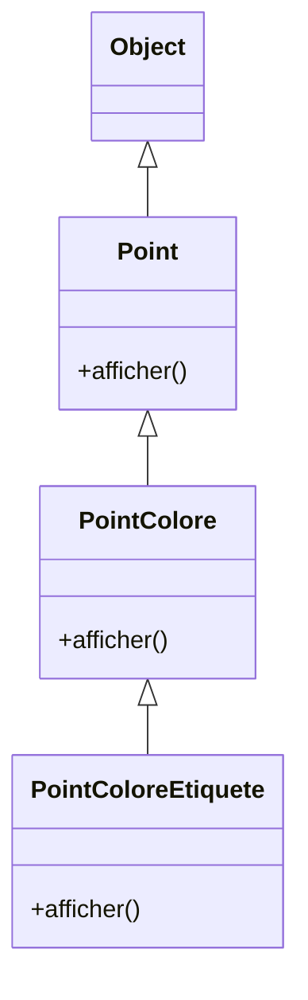
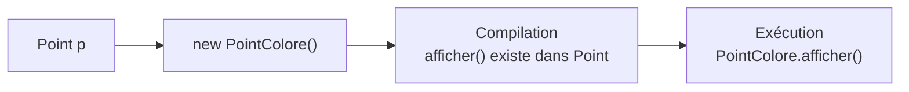
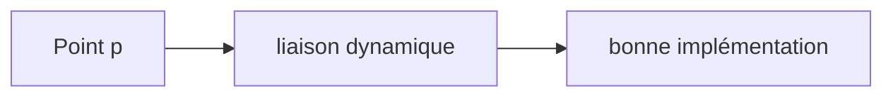
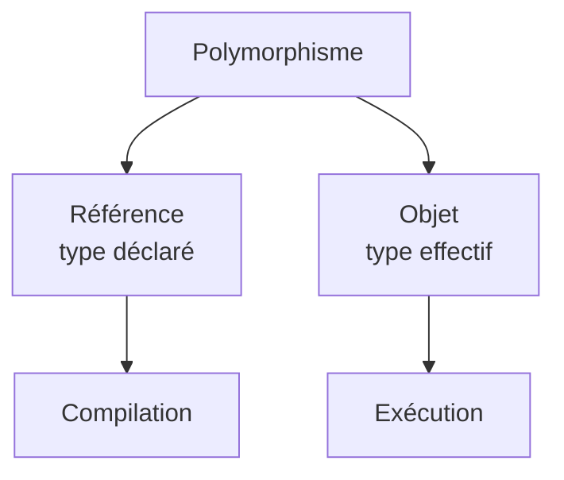
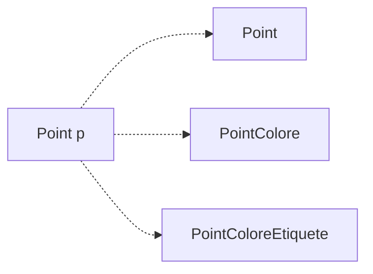

# Le polymorphisme en une hiérarchie

Considérons :

<div class="flex justify-center mt-5">



</div>

<div class="mt-6">

```java
Point p;

p = new Point();
p.afficher();

p = new PointColore();
p.afficher();

p = new PointColoreEtiquete();
p.afficher();
```

</div>

<div class="border-t border-gray-200 mt-5 pt-4 text-center font-medium">

Une même référence peut manipuler plusieurs objets d’une même hiérarchie et déclencher leur comportement propre.

</div>

---
layout: default
---

# Le mécanisme complet

Avec :

```java
Point p = new PointColore();

p.afficher();
```

<div class="flex justify-center mt-7">



</div>

<div class="grid grid-cols-2 gap-8 mt-7">

<div class="border border-gray-200 rounded-lg p-5 text-center">

### Type déclaré

`Point`

Détermine ce que l’on peut appeler.

</div>

<div class="border border-gray-200 rounded-lg p-5 text-center">

### Type effectif

`PointColore`

Détermine la redéfinition exécutée.

</div>

</div>

<div class="border-t border-gray-200 mt-6 pt-4 text-center font-medium">

Le polymorphisme repose sur la distinction entre type déclaré et type effectif.

</div>

---
layout: default
---

# Les idées essentielles

<div class="grid grid-cols-2 gap-8 mt-7">

<div class="border border-gray-200 rounded-lg p-5">

### Compatibilité des références

```java
Point p = new PointColore();
```

Une référence générale peut désigner un objet plus spécialisé.

</div>

<div class="border border-gray-200 rounded-lg p-5">

### Liaison dynamique

```java
p.afficher();
```

La version exécutée dépend du type effectif de l’objet.

</div>

<div class="border border-gray-200 rounded-lg p-5">

### Passage en argument

```java
traiter(new PointColore());
```

Une méthode générale peut traiter plusieurs sous-types.

</div>

<div class="border border-gray-200 rounded-lg p-5">

### Conversions

```java
PointColore pc = (PointColore) p;
```

Le downcasting doit être utilisé avec précaution.

</div>

</div>

<div class="border-t border-gray-200 mt-6 pt-4 text-center font-medium">

Le polymorphisme permet de programmer à partir d’un type commun tout en conservant les comportements spécialisés.

</div>

---
layout: default
---

# Ce que le polymorphisme apporte

Sans polymorphisme, le code dépend fortement des classes concrètes.

<div class="grid grid-cols-2 gap-8 mt-7">

<div class="border border-gray-200 rounded-lg p-5">

### Code spécialisé

```java
Point p = new Point();
PointColore pc =
    new PointColore();

p.afficher();
pc.afficher();
```

Chaque type est manipulé séparément.

</div>

<div class="border border-gray-200 rounded-lg p-5">

### Code polymorphique

```java
Point[] points = {
    new Point(),
    new PointColore()
};

for (Point p : points) {
    p.afficher();
}
```

Un traitement commun suffit.

</div>

</div>

<div class="border-t border-gray-200 mt-6 pt-4 text-center font-medium">

Le polymorphisme réduit la dépendance au type concret des objets.

</div>

---
layout: default
---

# Bonnes pratiques

<div class="grid grid-cols-2 gap-8 mt-6">

<div class="border border-gray-200 rounded-lg p-5">

### Privilégier les types généraux

Lorsque le code n’a besoin que du comportement défini dans `Point` :

```java
Point p =
    new PointColore();
```

plutôt que de dépendre inutilement de `PointColore`.

</div>

<div class="border border-gray-200 rounded-lg p-5">

### Exploiter la redéfinition

Écrire :

```java
p.afficher();
```

et laisser la liaison dynamique choisir la bonne implémentation.

Éviter de tester manuellement chaque type lorsque ce n’est pas nécessaire.

</div>

</div>

<div class="grid grid-cols-2 gap-8 mt-5">

<div class="border border-gray-200 rounded-lg p-5">

### Limiter les casts

```java
(PointColore) p
```

Un cast vers une classe dérivée crée une dépendance à un type plus spécifique.

</div>

<div class="border border-gray-200 rounded-lg p-5">

### Utiliser `instanceof` avec discernement

```java
if (p instanceof PointColore) {
    ...
}
```

Utile lorsqu’un traitement dépend réellement du type concret.

</div>

</div>

<div class="border-t border-gray-200 mt-5 pt-4 text-center font-medium">

Un bon code polymorphique dépend surtout des comportements communs, pas des classes concrètes.

</div>

---
layout: default
---

# Bonnes pratiques : éviter les tests de type inutiles

Considérons :

```java
if (p instanceof PointColore) {
    ((PointColore) p).afficher();
}
else if (p instanceof Point) {
    p.afficher();
}
```

<div class="mt-6 text-center text-lg">

Si `afficher()` est correctement redéfinie, tout cela peut devenir :

</div>

<div v-click class="mt-5 flex justify-center">

```java
p.afficher();
```

</div>

<div v-click class="flex justify-center mt-6">



</div>

<div v-click class="border-t border-gray-200 mt-6 pt-4 text-center font-medium">

Avant de tester le type d’un objet, vérifier si le polymorphisme ne permet pas déjà d’obtenir le comportement souhaité.

</div>

---
layout: default
---

# Polymorphisme : à retenir

<div class="grid grid-cols-[0.8fr_1.5fr] gap-10 mt-7 items-center">

<div class="flex justify-center">



</div>

<div>

### À retenir

- une référence de classe de base peut désigner un objet dérivé
- le **type déclaré** détermine les appels autorisés
- le **type effectif** détermine la version d’une méthode redéfinie
- ce choix à l’exécution repose sur la **liaison dynamique**
- la surcharge est résolue à la compilation
- les objets dérivés peuvent être passés comme arguments d’un type de base
- le downcasting nécessite un cast explicite et peut échouer
- `Object` est la racine commune de toutes les classes Java
- les tableaux permettent de regrouper et traiter des objets polymorphiques

</div>

</div>

<div class="border-t border-gray-200 mt-7 pt-4 text-center font-medium">

Le polymorphisme permet de manipuler plusieurs formes d’un même concept à travers une interface commune de comportement.

</div>

---
layout: default
---

<div class="absolute inset-0 flex flex-col items-center justify-center text-center">

# Polymorphisme

<div class="mt-6 text-xl text-gray-500">

Un même type de référence, plusieurs types d’objets,  
plusieurs comportements possibles.

</div>

<div class="mt-10 flex items-center justify-center">



</div>

<div class="mt-10 text-lg font-medium">

Le code reste général.  
Chaque objet conserve son comportement spécialisé.

</div>

</div>