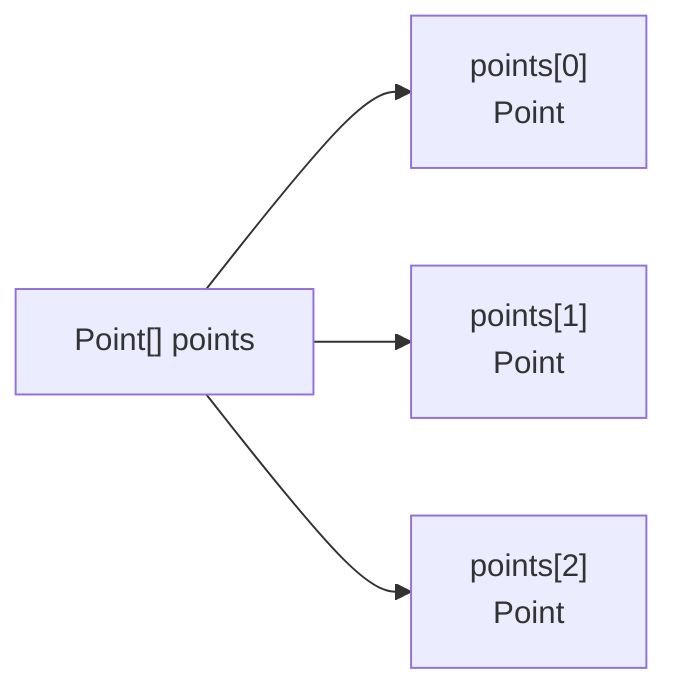
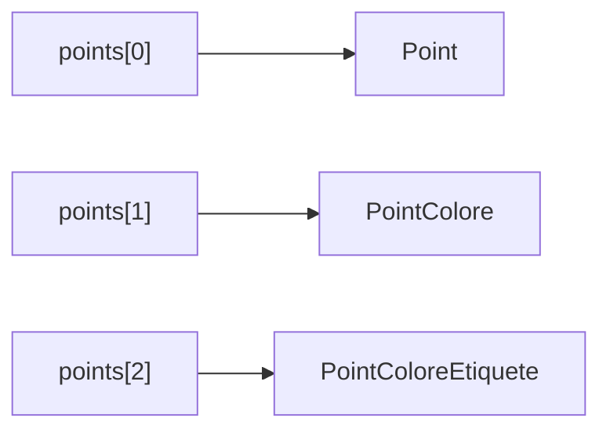
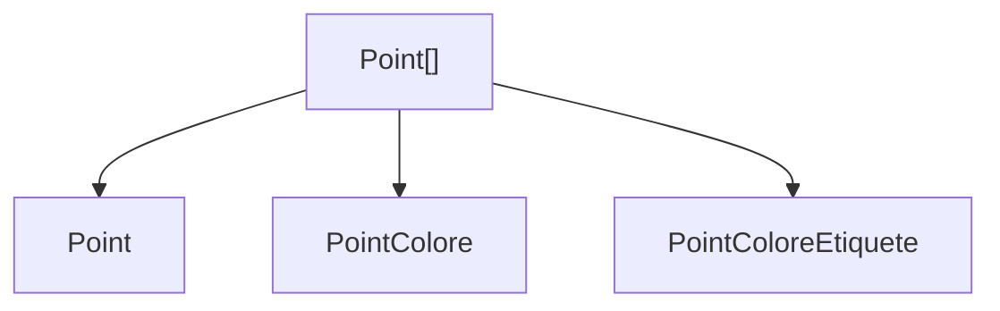
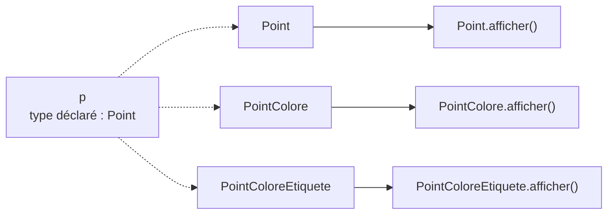
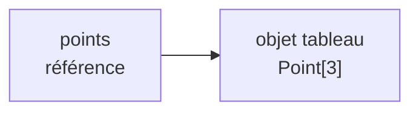
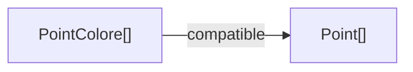
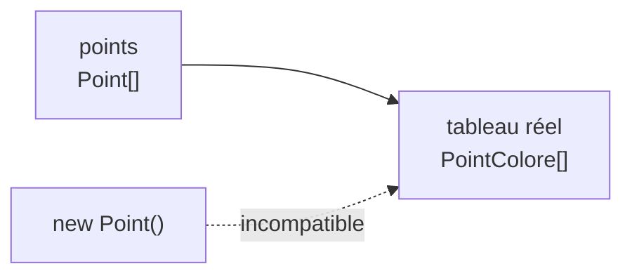

# Un tableau peut-il contenir plusieurs types d’objets ?

Nous savons qu’une référence `Point` peut désigner :

```java
new Point()
```

mais aussi :

```java
new PointColore()
```

<div class="mt-7 text-center text-lg">

Qu’en est-il d’un tableau de `Point` ?

</div>

<div v-click class="mt-6 text-center">

```java
Point[] points = new Point[3];
```

</div>

<div v-click class="border-t border-gray-200 mt-7 pt-4 text-center font-medium">

Peut-on y stocker des objets de différentes classes de la hiérarchie ?

</div>

---
layout: default
---

# Un tableau de `Point`

Considérons :

```java
Point[] points = new Point[3];
```

Chaque case du tableau est une référence de type `Point`.

<div class="flex justify-center mt-8">



</div>

<div class="border-t border-gray-200 mt-7 pt-4 text-center font-medium">

Un tableau d’objets contient des références vers des objets.

</div>

---
layout: default
---

# Que peut contenir une case ?

Une case du tableau se comporte comme une référence `Point`.

Nous pouvons donc écrire :

```java
Point[] points = new Point[3];

points[0] = new Point();
points[1] = new PointColore();
points[2] = new PointColoreEtiquete();
```

<div class="flex justify-center mt-7">



</div>

<div class="border-t border-gray-200 mt-6 pt-4 text-center font-medium">

Un tableau de `Point` peut référencer des objets de `Point` ou de ses classes dérivées.

</div>

---
layout: default
---

# Un tableau polymorphique

Nous obtenons donc :

```java
Point[] points = {
    new Point(),
    new PointColore(),
    new PointColoreEtiquete()
};
```

<div class="flex justify-center mt-7">



</div>

<div class="border-t border-gray-200 mt-7 pt-4 text-center font-medium">

Le type commun `Point` permet de regrouper plusieurs types d’objets dans un même tableau.

</div>

---
layout: default
---

# Parcourir des objets polymorphiques

Considérons :

```java
Point[] points = {
    new Point(),
    new PointColore(),
    new PointColoreEtiquete()
};
```

Nous pouvons parcourir le tableau :

```java
for (Point p : points) {
    p.afficher();
}
```

<div class="mt-6 text-center text-lg">

À chaque itération, `p` est déclaré comme un `Point`.

</div>

<div class="border-t border-gray-200 mt-7 pt-4 text-center font-medium">

Mais les objets référencés peuvent avoir des types effectifs différents.

</div>

---
layout: default
---

# Quelle méthode `afficher()` sera appelée ?

Supposons que chaque classe redéfinisse `afficher()`.

```java
for (Point p : points) {
    p.afficher();
}
```

<div class="grid grid-cols-3 gap-5 mt-7">

<div class="border border-gray-200 rounded-lg p-4 text-center">

### Objet `Point`

```text
Point
```

</div>

<div class="border border-gray-200 rounded-lg p-4 text-center">

### Objet `PointColore`

```text
Point coloré
```

</div>

<div class="border border-gray-200 rounded-lg p-4 text-center">

### Objet `PointColoreEtiquete`

```text
Point coloré étiqueté
```

</div>

</div>

<div class="border-t border-gray-200 mt-7 pt-4 text-center font-medium">

Le même appel `p.afficher()` déclenche un comportement différent selon l’objet parcouru.

</div>

---
layout: default
---

# La liaison dynamique s’applique

À chaque itération :

```java
p.afficher();
```

<div class="flex justify-center mt-7">



</div>

<div class="border-t border-gray-200 mt-7 pt-4 text-center font-medium">

La version exécutée dépend du type effectif de chaque objet du tableau.

</div>

---
layout: default
---

# Pourquoi est-ce intéressant ?

Sans polymorphisme, il faudrait traiter séparément chaque type d’objet.

Avec un type commun :

```java
Point[] points = {
    new Point(),
    new PointColore(),
    new PointColoreEtiquete()
};

for (Point p : points) {
    p.afficher();
}
```

<div class="mt-7 text-center text-lg">

Une seule boucle suffit.

</div>

<div v-click class="mt-5 text-center">

Chaque objet fournit automatiquement son propre comportement.

</div>

<div v-click class="border-t border-gray-200 mt-7 pt-4 text-center font-medium">

Le polymorphisme permet d’écrire un traitement commun sans connaître à l’avance le type exact de chaque objet.

</div>

---
layout: default
---

# Les tableaux sont aussi des objets

En Java, un tableau est lui-même un objet.

```java
Point[] points = new Point[3];
```

La variable `points` contient une référence vers cet objet tableau.

<div class="flex justify-center mt-7">



</div>

<div class="mt-7 text-center">

Nous pouvons donc notamment écrire :

```java
Object o = points;
```

</div>

<div class="border-t border-gray-200 mt-6 pt-4 text-center font-medium">

Comme les autres objets, un tableau peut être référencé par une variable de type `Object`.

</div>

---
layout: default
---

# Compatibilité entre tableaux

Considérons :

```java
PointColore[] couleurs =
    new PointColore[3];
```

Puis :

```java
Point[] points = couleurs;
```

<div v-click class="mt-6 text-center text-lg font-medium">

✓ Correct

</div>

<div class="flex justify-center mt-6">



</div>

<div class="border-t border-gray-200 mt-6 pt-4 text-center font-medium">

En Java, `PointColore[]` peut être affecté à une référence de type `Point[]`.

</div>

---
layout: default
---

# Mais quel est le tableau réel ?

Avec :

```java
PointColore[] couleurs =
    new PointColore[3];

Point[] points = couleurs;
```

<div class="grid grid-cols-2 gap-8 mt-7">

<div class="border border-gray-200 rounded-lg p-5 text-center">

### Type de la référence

`Point[]`

</div>

<div class="border border-gray-200 rounded-lg p-5 text-center">

### Type effectif du tableau

`PointColore[]`

</div>

</div>

<div class="mt-7 text-center text-lg">

Le même objet tableau est référencé par `couleurs` et `points`.

</div>

<div class="border-t border-gray-200 mt-7 pt-4 text-center font-medium">

L’affectation ne transforme pas un tableau de `PointColore` en tableau de `Point`.

</div>

---
layout: default
---

# Peut-on maintenant ajouter un `Point` ?

Nous avons :

```java
PointColore[] couleurs =
    new PointColore[3];

Point[] points = couleurs;
```

Puis :

```java
points[0] = new Point();
```

<div class="mt-6 text-center text-lg">

Correct ou incorrect ?

</div>

<div v-click class="mt-6 text-center">

Le compilateur accepte l’instruction.

</div>

<div v-click class="mt-5 text-center font-medium">

Mais elle échoue à l’exécution.

</div>

---
layout: default
---

# Pourquoi l’affectation échoue-t-elle ?

La référence est :

```java
Point[] points
```

mais le tableau réel est :

```java
PointColore[]
```

<div class="flex justify-center mt-7">



</div>

<div class="mt-7 text-center">

Un tableau `PointColore[]` ne peut contenir que des objets compatibles avec `PointColore`.

</div>

<div class="border-t border-gray-200 mt-6 pt-4 text-center font-medium">

Le type effectif du tableau est vérifié lors de l’insertion.

</div>

---
layout: default
---

# `ArrayStoreException`

Considérons le programme complet :

```java
PointColore[] couleurs =
    new PointColore[3];

Point[] points = couleurs;

points[0] = new Point();
```

<div class="mt-6 text-center">

La dernière instruction provoque à l’exécution :

```text
ArrayStoreException
```

</div>

<div class="border-t border-gray-200 mt-7 pt-4 text-center font-medium">

La compatibilité entre tableaux peut donc conduire à une erreur détectée seulement à l’exécution.

</div>

---
layout: default
---

# Une situation à distinguer

Ces deux déclarations ne créent pas le même type de tableau.

<div class="grid grid-cols-2 gap-8 mt-7">

<div class="border border-gray-200 rounded-lg p-5">

### Tableau réel de `Point`

```java
Point[] t =
    new Point[3];

t[0] = new Point();
t[1] = new PointColore();
```

<div class="mt-4 text-center font-medium">

✓ Correct

</div>

</div>

<div class="border border-gray-200 rounded-lg p-5">

### Tableau réel de `PointColore`

```java
Point[] t =
    new PointColore[3];

t[0] = new Point();
```

<div class="mt-4 text-center font-medium">

✗ erreur à l’exécution

</div>

</div>

</div>

<div class="border-t border-gray-200 mt-7 pt-4 text-center font-medium">

Il faut distinguer le type de la référence du type effectif du tableau.

</div>

---
layout: default
---

# Et les tableaux de types primitifs ?

Considérons :

```java
int[] entiers = new int[3];
```

Peut-on écrire :

```java
long[] nombres = entiers;
```

<div v-click class="mt-6 text-center text-lg font-medium">

✗ Non

</div>

<div v-click class="mt-5 text-center">

Même si une valeur `int` peut être convertie en `long` :

```java
int n = 5;
long x = n;     // ✓
```

</div>

<div v-click class="border-t border-gray-200 mt-7 pt-4 text-center font-medium">

La conversion des valeurs primitives ne rend pas leurs types de tableaux compatibles.

</div>

---
layout: default
---

# Objets et types primitifs

<div class="grid grid-cols-2 gap-8 mt-7">

<div class="border border-gray-200 rounded-lg p-5">

### Tableaux d’objets

```java
PointColore[] pc =
    new PointColore[3];

Point[] p = pc;
```

<div class="mt-4 text-center font-medium">

✓ compatible

</div>

La relation d’héritage est prise en compte.

</div>

<div class="border border-gray-200 rounded-lg p-5">

### Tableaux primitifs

```java
int[] a = new int[3];

long[] b = a;
```

<div class="mt-4 text-center font-medium">

✗ incompatible

</div>

Il n’existe pas de relation d’héritage entre `int` et `long`.

</div>

</div>

<div class="border-t border-gray-200 mt-7 pt-4 text-center font-medium">

Le polymorphisme concerne les références d’objets, pas les types primitifs.

</div>

---
layout: default
---

# Tableaux et polymorphisme

<div class="grid grid-cols-[0.8fr_1.4fr] gap-10 mt-7 items-center">

<div class="flex justify-center">


</div>

<div>

### À retenir

- un tableau de `Point` peut contenir des références vers des objets dérivés
- la liaison dynamique s’applique lors des appels de méthodes
- un même parcours peut donc déclencher plusieurs comportements
- les tableaux sont eux-mêmes des objets
- `PointColore[]` peut être référencé comme un `Point[]`
- le type effectif du tableau reste toutefois `PointColore[]`
- une insertion incompatible provoque une `ArrayStoreException`
- les tableaux de types primitifs ne suivent pas cette compatibilité

</div>

</div>

<div class="border-t border-gray-200 mt-7 pt-4 text-center font-medium">

Les tableaux permettent d’exploiter le polymorphisme sur tout un ensemble d’objets.

</div>


